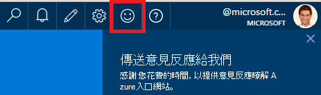

<properties 
    pageTitle="如何從應用程式的深入見解開發小組取得技術支援 |Microsoft Azure" 
    description="當您需要從應用程式的深入見解開發小組特殊支援的情況下，這是如何送出以取得支援的詳細資料。" 
    services="application-insights" 
    documentationCenter=""
    authors="alexbulankou" 
    manager="douge"/>
 
<tags 
    ms.service="application-insights" 
    ms.workload="tbd" 
    ms.tgt_pltfrm="ibiza" 
    ms.devlang="na" 
    ms.topic="article" 
    ms.date="06/01/2016" 
    ms.author="albulank"/>
    
# <a name="how-to-get-technical-support-from-application-insights-development-team"></a>如何從應用程式的深入見解開發小組取得技術支援
    
如果您有使用[Visual Studio 應用程式獲得深入見解](app-insights-overview.md)的技術問題，以下是取得說明的選項︰

## <a name="1-check-the-documents"></a>1.檢查文件

* 找不到資料？ 核取︰[範例](app-insights-sampling.md)，[配額和節流設定](app-insights-pricing.md)。
* 疑難排解︰ [ASP.NET](app-insights-troubleshoot-faq.md) | [Java](app-insights-java-troubleshoot.md)

## <a name="2-search-the-forums"></a>2.搜尋論壇

* [MSDN 論壇](https://social.msdn.microsoft.com/Forums/vstudio/home?forum=ApplicationInsights)
* [StackOverflow](http://stackoverflow.com/questions/tagged/ms-application-insights)

## <a name="3-azure-support-plan"></a>3.azure 支援的方案嗎？

有您要放置開發人員調查特定的大小寫的情況。 

如果您有[支援計劃，Microsoft Azure 有](https://azure.microsoft.com/support/plans/)可以[開啟支援票證](https://portal.azure.com/?#blade/Microsoft_Azure_Support/HelpAndSupportBlade)。

## <a name="4-contact-the-application-insights-team"></a>4.連絡人應用程式的深入見解小組

如果您沒有支援計劃，我們的開發團隊是快樂為應用程式的深入見解客戶提供最佳的投入比支援，如我們準備開放里程碑。 我們會介紹**新的支援選項**︰ 您可以描述告訴我們您的個案送出意見反應表單 Azure 入口網站上的，並開發人員應用程式的深入見解小組連絡人您返回以協助解決您的問題。


1. 在[應用程式的深入見解入口網站](https://portal.azure.com)中，按一下 [在右上角的笑臉︰  

       

2. 在註解方塊請務必先指定**AppInsights**為第一個線條，則會包含下列資訊︰   

    ```

    AppInsights   
    ikey: <instrumentation key>   
    sdk: <SDK that you are using, including name and version>  
    issue: <please describe the problem you are having>

    ```   

    ![意見反應] 對話方塊](./media/app-insights-get-dev-support/02.png)   

3. 核取 」 是確定您電子郵件]。 

    ![送出] 區段](./media/app-insights-get-dev-support/03.png)  

在應用程式的深入見解小組工程師會推出收到連絡您。 我們會提供這項服務最佳投入基礎，可以在此時指定沒有正式 SLA。


