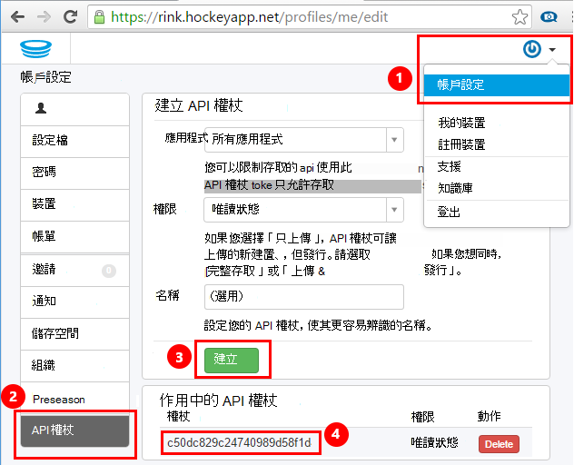
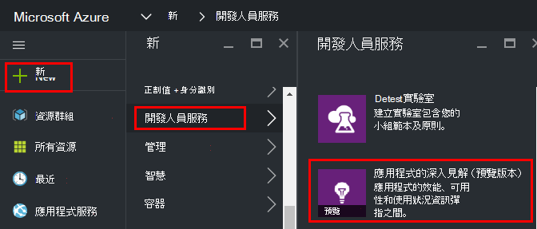
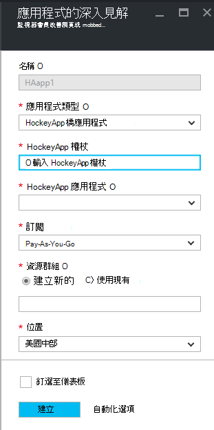
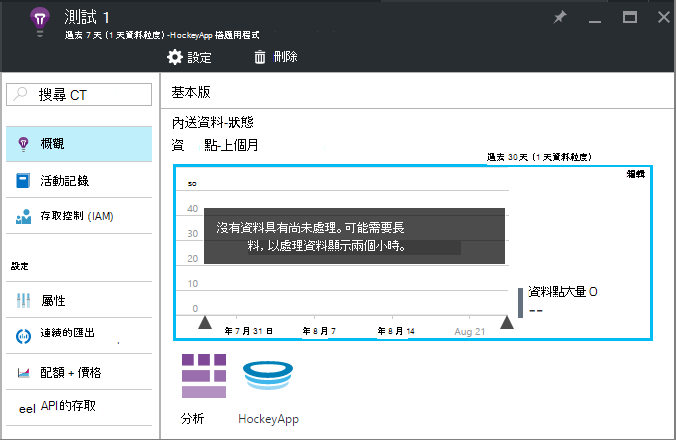
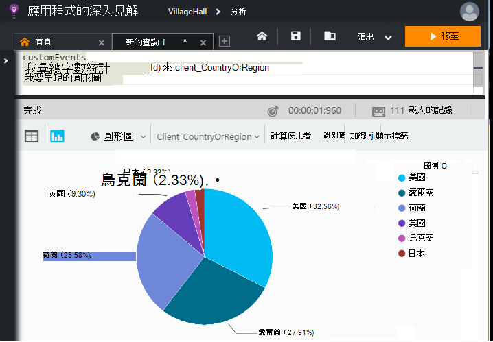

<properties 
    pageTitle="瀏覽應用程式的深入見解 HockeyApp 資料 |Microsoft Azure" 
    description="使用情況和 Azure 應用程式的應用程式的深入見解的效能分析。" 
    services="application-insights" 
    documentationCenter="windows"
    authors="alancameronwills" 
    manager="douge"/>

<tags 
    ms.service="application-insights" 
    ms.workload="tbd" 
    ms.tgt_pltfrm="ibiza" 
    ms.devlang="na" 
    ms.topic="article" 
    ms.date="08/25/2016" 
    ms.author="awills"/>

#  在 [應用程式的深入見解探索 HockeyApp 資料

[HockeyApp](https://azure.microsoft.com/services/hockeyapp/)是建議的平台的監控即時桌面與行動應用程式。 從 HockeyApp，您可以傳送自訂，及追蹤遙測來監控使用並協助診斷 （除了取得當機資料）。 使用[Visual Studio 應用程式獲得深入見解](app-insights-overview.md)的強大的[分析](app-insights-analytics.md)功能可查詢的遙測資料流。 此外，您可以[匯出自訂和追蹤遙測](app-insights-export-telemetry.md)。 若要啟用這些功能，您設定轉接 HockeyApp 資料應用程式獲得深入見解橋。

## HockeyApp 橋應用程式

核心功能可讓您透過來存取應用程式的深入見解 HockeyApp 資料分析和連續匯出功能，就會有 HockeyApp 橋應用程式。 會從這些功能可存取的 HockeyApp 橋應用程式建立後，藉由使用 HockeyApp 收集的任何資料。 我們來看看如何設定這些橋應用程式的其中一個。

在 HockeyApp，開啟 [帳戶設定]，[ [API 權杖](https://rink.hockeyapp.net/manage/auth_tokens)。 建立新的權杖或重複使用現有的項目。 最低權限，必須具備 「 讀取 」。 需要 API 的複本的 token。

開啟 [Microsoft Azure 入口網站[建立的應用程式的深入見解資源](app-insights-create-new-resource.md)。 將應用程式類型設為 「 HockeyApp 橋應用程式] 中︰

您不需要設定名稱-這將會自動設定從 HockeyApp 名稱。

HockeyApp 橋欄位會顯示。 

輸入您先前所述的 HockeyApp token。 這個動作會填入 」 HockeyApp 應用程式] 下拉式功能表中的所有 HockeyApp 應用程式。 選取您要使用的項目，然後完成的剩餘部分的欄位。 

開啟新的資源。 

請注意，資料會開始串流時。

這樣就可以 ！ 從插入點 HockeyApp 檢測應用程式中收集的任何資料現在也提供給您的應用程式的深入見解的分析及連續匯出功能。

現在就讓我們簡要檢閱現在您可以使用這些功能。

## 分析

分析是臨機操作查詢您的資料，可讓您診斷並分析您遙測並快速找出根本原因和模式的功能強大的工具。

* [深入瞭解狀況分析](app-insights-analytics-tour.md)
* [視訊簡介](https://channel9.msdn.com/events/Build/2016/T666)
* [進階視訊的概念](https://channel9.msdn.com/Events/Build/2016/P591)

## 連續的匯出

連續匯出可讓您將資料匯出成 Azure Blob 儲存體容器。 這是非常實用，如果您要保留您的資料超過目前所提供的應用程式的深入見解的保留期限。 您可以保留 blob 儲存體中的資料，將 SQL 資料庫或您慣用的資料倉儲方案進行處理。

[深入瞭解連續的匯出](app-insights-export-telemetry.md)

## 後續步驟

* [套用分析資料](app-insights-analytics-tour.md)

