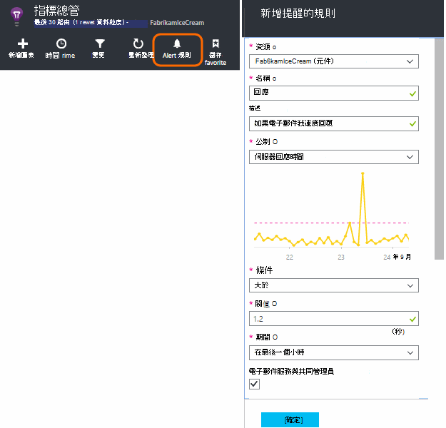
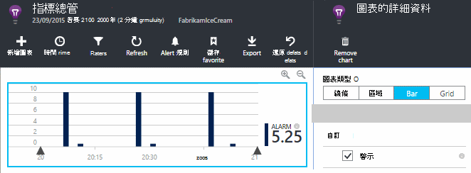
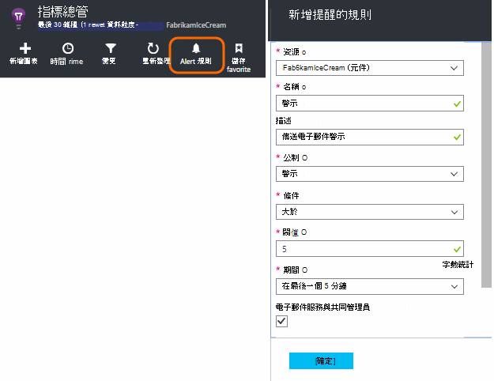
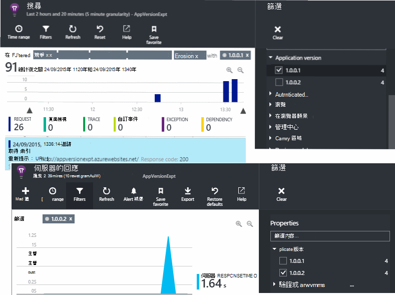
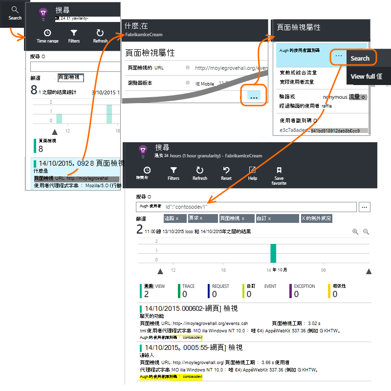
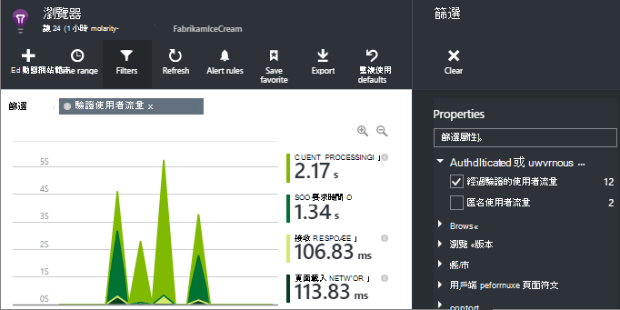
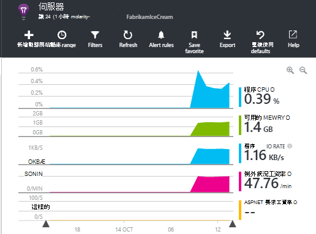

<properties 
    pageTitle="我要如何...在應用程式的深入見解 |Microsoft Azure" 
    description="在 [應用程式的深入見解的常見問題集。" 
    services="application-insights" 
    documentationCenter=""
    authors="alancameronwills" 
    manager="douge"/>

<tags 
    ms.service="application-insights" 
    ms.workload="tbd" 
    ms.tgt_pltfrm="ibiza" 
    ms.devlang="na" 
    ms.topic="article" 
    ms.date="02/05/2016" 
    ms.author="awills"/>

# <a name="how-do-i--in-application-insights"></a>我要如何...應用程式的深入見解中？

## <a name="get-an-email-when-"></a>取得電子郵件時...

### <a name="email-if-my-site-goes-down"></a>如果我的網站當機的電子郵件

設定[測試可用性網頁](app-insights-monitor-web-app-availability.md)。

### <a name="email-if-my-site-is-overloaded"></a>如果我的網站超載電子郵件

設定[提醒](app-insights-alerts.md)**伺服器回應**時間。 介於 1 和 2 秒臨界值應該會運作。



您的應用程式也可能會傳回錯誤代碼顯示疲勞符號。 設定提醒**失敗**的要求。

如果您想要在**伺服器的例外狀況**設定提醒，您可能必須執行[一些額外設定](app-insights-asp-net-exceptions.md)才能查看資料。

### <a name="email-on-exceptions"></a>電子郵件的例外狀況

1. [設定例外狀況監視](app-insights-asp-net-exceptions.md)
2. [例外狀況計數公制中的 [[設定通知](app-insights-alerts.md)


### <a name="email-on-an-event-in-my-app"></a>在 [我的應用程式中的事件電子郵件

例如，假設您想要在特定的事件發生時收到的電子郵件。 應用程式的深入見解直接，不提供此功能，但它可以[傳送通知公制交叉臨界值](app-insights-alerts.md)。 

通知可以設定[自訂指標](app-insights-api-custom-events-metrics.md#track-metric)，但不自訂的事件。 撰寫程式碼來增加度量單位，在事件發生時︰

    telemetry.TrackMetric("Alarm", 10);

或︰

    var measurements = new Dictionary<string,double>();
    measurements ["Alarm"] = 10;
    telemetry.TrackEvent("status", null, measurements);

通知有兩個狀態，因為您必須考慮警示已結束時，傳送較低的值︰

    telemetry.TrackMetric("Alarm", 0.5);

若要查看您警示[公制的檔案總管](app-insights-metrics-explorer.md)中建立圖表︰



現在設定啟動時公制短時間超過 mid 的值︰




將平均的期間設定為 [最小值。 

當公制上方和下方閥值，您會收到電子郵件。

要考慮的一些事項︰

* 通知有兩種狀態 （「 提醒 」 和 「 良好 」）。 狀態評估只收到度量單位。
* 狀態變更時才傳送電子郵件。 這是為什麼您必須同時傳送高和最低值指標。 
* 若要評估警示，會收到值的上述期間採取平均值。 這是每次收到度量單位，因此比您設定的期間經常傳送電子郵件。
* 在 「 提醒 」 和 「 良好 」，則會傳送電子郵件，因為您可能要考慮重新想做為兩個狀態條件一事件。 例如，而不是 「 工作完成 」 的事件，有 」 進行中的工作 」 條件，您從何處取得電子郵件在 [開始] 和 [結束工作。

### <a name="set-up-alerts-automatically"></a>自動設定提醒

[使用 PowerShell 來建立新的提醒](app-insights-alerts.md#set-alerts-by-using-powershell)

## <a name="use-powershell-to-manage-application-insights"></a>使用 PowerShell 來管理應用程式的深入見解

* [建立新的資源](app-insights-powershell-script-create-resource.md)
* [建立新的提醒](app-insights-alerts.md#set-alerts-by-using-powershell)

## <a name="application-versions-and-stamps"></a>應用程式版本和戳記

### <a name="separate-the-results-from-dev-test-and-prod"></a>從開發、 測試和產品分隔結果

* 不同 environmnents，設定不同的 ikeys
* 針對不同的戳記開發，測試 (產品） 標記使用不同的屬性值遙測

[深入瞭解](app-insights-separate-resources.md)
 

### <a name="filter-on-build-number"></a>建立數字篩選

當您發佈您的應用程式的新版本時，您需要能夠遙測分開不同組建。

您可以設定 [應用程式版本] 屬性，好讓您可以篩選[公制總管] 中](app-insights-metrics-explorer.md)[搜尋](app-insights-diagnostic-search.md)結果。 




有數種不同的方法的應用程式版本] 屬性設定。

* 直接設定︰

    `telemetryClient.Context.Component.Version = typeof(MyProject.MyClass).Assembly.GetName().Version;`

* 包裝在[遙測初始設定](app-insights-api-custom-events-metrics.md#telemetry-initializers)，以確保所有 TelemetryClient 執行個體一致的方式都設定中的線條。

* [ASP.NET]設定中的版本`BuildInfo.config`。 Web 模組挑選 BuildLabel 節點的版本。 在專案中包含此檔案，請記得在方案總管] 中設定 [永遠複製屬性。

    ```XML

    <?xml version="1.0" encoding="utf-8"?>
    <DeploymentEvent xmlns:xsi="http://www.w3.org/2001/XMLSchema-instance" xmlns:xsd="http://www.w3.org/2001/XMLSchema" xmlns="http://schemas.microsoft.com/VisualStudio/DeploymentEvent/2013/06">
      <ProjectName>AppVersionExpt</ProjectName>
      <Build type="MSBuild">
        <MSBuild>
          <BuildLabel kind="label">1.0.0.2</BuildLabel>
        </MSBuild>
      </Build>
    </DeploymentEvent>

    ```
* [ASP.NET]自動產生 BuildInfo.config MSBuild 中。 若要這麼做，請在.csproj 檔案中加入幾行︰

    ```XML

    <PropertyGroup>
      <GenerateBuildInfoConfigFile>true</GenerateBuildInfoConfigFile>    <IncludeServerNameInBuildInfo>true</IncludeServerNameInBuildInfo>
    </PropertyGroup> 
    ```

    這會產生一個稱為*yourProjectName*檔案。BuildInfo.config。 發佈程序重新命名它 BuildInfo.config。

    當您建立的 Visual Studio 時，建立標籤包含版面配置區 (AutoGen_...)。 但建置時使用 MSBuild，它會填入正確的版本編號。

    若要允許 MSBuild 產生版本號碼，例如版本設`1.0.*`AssemblyReference.cs 中

## <a name="monitor-backend-servers-and-desktop-apps"></a>監視後端伺服器和桌面應用程式

[使用 Windows Server SDK 模組](app-insights-windows-desktop.md)。


## <a name="visualize-data"></a>以視覺化方式呈現資料

#### <a name="dashboard-with-metrics-from-multiple-apps"></a>儀表板顯示多個應用程式的指標

* 在[公制檔案總管](app-insights-metrics-explorer.md)中，自訂您的圖表，並將其儲存為最愛項目。 將其釘選至 Azure 儀表板。


#### <a name="dashboard-with-data-from-other-sources-and-application-insights"></a>儀表板從其他來源和應用程式的深入見解的資料

* [匯出至 Power BI 遙測](app-insights-export-power-bi.md)。 

或

* 使用 SharePoint 儀表板，以在 SharePoint 網頁組件中顯示資料。 [使用連續匯出並匯出至 SQL 資料流分析](app-insights-code-sample-export-sql-stream-analytics.md)。  使用 PowerView 檢查資料庫，並建立 SharePoint 網頁組件的 PowerView。


<a name="search-specific-users"></a>
### <a name="filter-out-anonymous-or-authenticated-users"></a>篩選出匿名或已驗證的使用者

如果您的使用者登入，您可以設定的[已驗證的使用者識別碼](app-insights-api-custom-events-metrics.md#authenticated-users)。 （不會自動。） 

您可以︰

* 搜尋特定的使用者識別碼



* 匿名或已驗證的使用者篩選指標



## <a name="modify-property-names-or-values"></a>修改屬性名稱或值

建立的[篩選](app-insights-api-filtering-sampling.md#filtering)。 這個選項可讓您修改或篩選遙測，再從您的應用程式傳送到應用程式的深入見解。

## <a name="list-specific-users-and-their-usage"></a>列出特定使用者和用法

如果您只是要[搜尋特定的使用者](#search-specific-users)，您可以設定的[已驗證的使用者識別碼](app-insights-api-custom-events-metrics.md#authenticated-users)。

如果您想要的資料，例如頁面的使用者清單，看看或頻率他們登入，您有兩個選項︰

* [設定驗證的使用者識別碼](app-insights-api-custom-events-metrics.md#authenticated-users)、[匯出到資料庫](app-insights-code-sample-export-sql-stream-analytics.md)及使用適合工具來分析您的使用者資料。
* 如果您有小型數字的使用者，請傳送自訂事件或單位，使用感興趣的資料作為公制值或事件名稱，並為屬性設定的使用者識別碼。 若要分析網頁檢視取代標準 JavaScript trackPageView 通話。 若要分析伺服器端遙測使用遙測初始設定的使用者識別碼新增到所有的伺服器遙測。 然後您可以篩選] 及 [線段的指標及搜尋上的使用者識別碼。


## <a name="reduce-traffic-from-my-app-to-application-insights"></a>從 [我的應用程式的流量減少應用程式獲得深入見解

* [ApplicationInsights.config](app-insights-configuration-with-applicationinsights-config.md)，停用您不需要例如效能計數器收集任何模組。
* 使用[範例和篩選](app-insights-api-filtering-sampling.md)，SDK。
* 在您的網頁，限制 Ajax 呼叫數目的報告的每個頁面檢視。 在後的指令碼片段`instrumentationKey:...`，插入︰ `,maxAjaxCallsPerView:3` （或適當的數字）。
* 如果您使用的[TrackMetric](app-insights-api-custom-events-metrics.md#track-metric)，計算彙總的批次的度量值之前傳送結果。 有的 TrackMetric() 提供的超量的狀況。


進一步瞭解[價格和配額](app-insights-pricing.md)。

## <a name="disable-telemetry"></a>停用遙測

若要**以動態方式停止和開始**的集合，從伺服器遙測傳輸︰

```

    using  Microsoft.ApplicationInsights.Extensibility;

    TelemetryConfiguration.Active.DisableTelemetry = true;
```


若要**停用所選的標準收集**-，例如效能計數器、 HTTP 要求或相依性-刪除或註解的相關[ApplicationInsights.config](app-insights-api-custom-events-metrics.md)行。 例如，如果您想要傳送 TrackRequest 資料，您可以這麼做。


## <a name="view-system-performance-counters"></a>檢視系統效能計數器

您可以指標檔案總管] 中顯示的指標包括一組系統效能計數器。 沒有預先定義的刀標題會顯示其中幾個的**伺服器**。



### <a name="if-you-see-no-performance-counter-data"></a>如果您看到沒有效能計數器資料

* **IIS 伺服器**VM 或您自己的電腦上。 [安裝狀態監視器](app-insights-monitor-performance-live-website-now.md)。 
* **Azure 網站**-我們不支援的效能計數器尚未。 有數種指標，就可以做為控制台] 中的 [Azure 網站標準的一部分。
* **Unix 伺服器** - [安裝 collectd](app-insights-java-collectd.md)

### <a name="to-display-more-performance-counters"></a>若要顯示更多的效能計數器

* 首先，[將新的圖表](app-insights-metrics-explorer.md)和如果計數器 basic 中設定，請參閱我們提供。
* 如果沒有的話，[加入至收集效能計數器模組組計數器](app-insights-performance-counters.md)。


