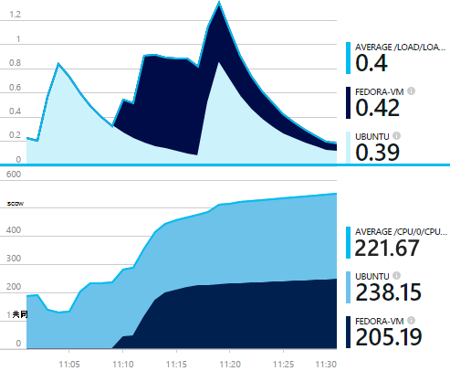
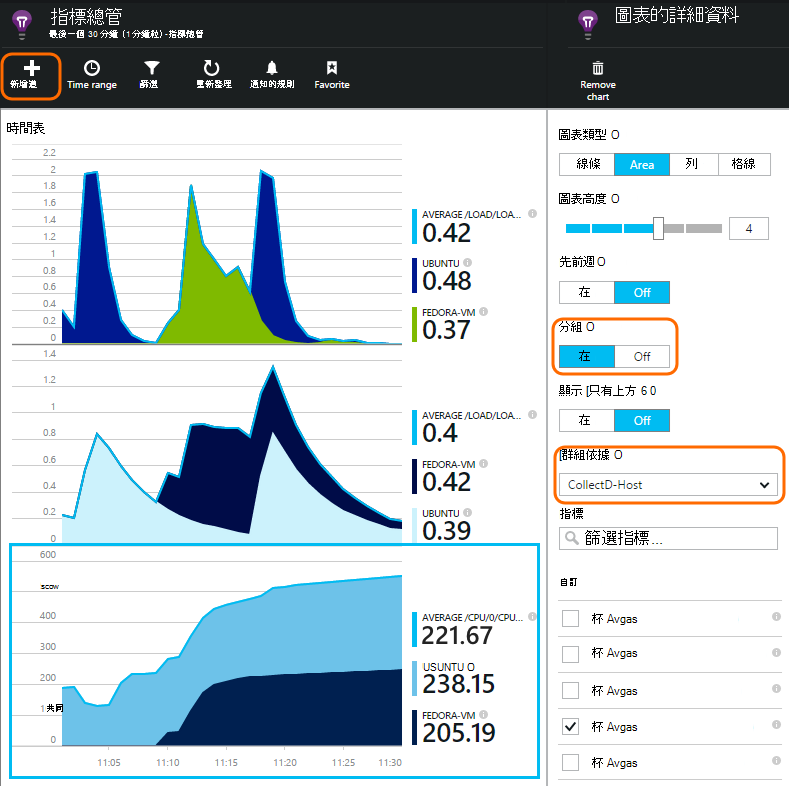

<properties 
    pageTitle="collectd︰ 在應用程式的深入見解中 Unix Java 的效能統計資料" 
    description="擴充的外掛程式 CollectD Java 網站的監視的應用程式的深入見解" 
    services="application-insights" 
    documentationCenter="java"
    authors="alancameronwills" 
    manager="douge"/>

<tags 
    ms.service="application-insights" 
    ms.workload="tbd" 
    ms.tgt_pltfrm="ibiza" 
    ms.devlang="na" 
    ms.topic="article" 
    ms.date="08/24/2016" 
    ms.author="awills"/>
 
# <a name="collectd-unix-performance-metrics-in-application-insights"></a>collectd︰ 在應用程式的深入見解 Unix 效能指標

*應用程式的深入見解位於預覽。*

若要瀏覽[應用程式的深入見解](app-insights-overview.md)Unix 系統效能計量安裝[collectd](http://collectd.org/)，搭配使用其應用程式的深入見解外掛程式。 此開啟來源解決方案收集各種系統和網路統計資料。

通常您會使用 collectd 如果您已經[檢測 Java web 服務使用的應用程式的深入見解][java]。 它會讓您更多資料來協助您可以增強您的應用程式的效能或診斷問題。 



## <a name="get-your-instrumentation-key"></a>取得儀器金鑰

在[Microsoft Azure 入口網站](https://portal.azure.com)中，開啟您要顯示資料的[應用程式的深入見解](app-insights-overview.md)資源。 （或[建立新的資源](app-insights-create-new-resource.md)）。

需要儀器鍵，用來識別資源的複本。

![全部瀏覽]，開啟您的資源，然後在基礎] 下拉式清單，選取，並複製儀器索引鍵](./media/app-insights-java-collectd/02-props.png)


## <a name="install-collectd-and-the-plug-in"></a>安裝 collectd 和外掛程式

在您的 Unix 伺服器電腦︰

1. 安裝[collectd](http://collectd.org/) 5.4.0 版本或更新版本。
2. 下載[應用程式的深入見解 collectd 作者外掛程式](https://aka.ms/aijavasdk)。 請注意，版本號碼。
3. 複製外掛程式 JAR 到`/usr/share/collectd/java`。
3. 編輯`/etc/collectd/collectd.conf`:
 * 確定該[Java 外掛程式](https://collectd.org/wiki/index.php/Plugin:Java)已啟用。
 * 更新 java.class.path 的 JVMArg，包含下列 JAR。 更新的版本號碼以符合您所下載的項目︰
  * `/usr/share/collectd/java/applicationinsights-collectd-1.0.5.jar`
 * 新增此程式碼片段，使用您的資源儀器金鑰︰

```

     LoadPlugin "com.microsoft.applicationinsights.collectd.ApplicationInsightsWriter"
     <Plugin ApplicationInsightsWriter>
        InstrumentationKey "Your key"
     </Plugin>
```

以下是範例設定檔的組件︰

    ...
    # collectd plugins
    LoadPlugin cpu
    LoadPlugin disk
    LoadPlugin load
    ...

    # Enable Java Plugin
    LoadPlugin "java"

    # Configure Java Plugin
    <Plugin "java">
      JVMArg "-verbose:jni"
      JVMArg "-Djava.class.path=/usr/share/collectd/java/applicationinsights-collectd-1.0.5.jar:/usr/share/collectd/java/collectd-api.jar"

      # Enabling Application Insights plugin
      LoadPlugin "com.microsoft.applicationinsights.collectd.ApplicationInsightsWriter"
                
      # Configuring Application Insights plugin
      <Plugin ApplicationInsightsWriter>
        InstrumentationKey "12345678-1234-1234-1234-123456781234"
      </Plugin>

      # Other plugin configurations ...
      ...
    </Plugin>
.   ...

設定其他[collectd 外掛程式](https://collectd.org/wiki/index.php/Table_of_Plugins)，這可以來自不同來源收集各種不同的資料。

重新啟動根據其[手動](https://collectd.org/wiki/index.php/First_steps)collectd。

## <a name="view-the-data-in-application-insights"></a>檢視應用程式的深入見解中的資料

在您的應用程式的深入見解的資源，開啟[指標總管並新增圖表][metrics]，選取您想要查看自訂類別的指標。



根據預設，指標會彙總從已收集指標的所有主機機器上。 若要檢視圖表的詳細資料刀每個主機，指標，開啟 [群組]，然後選擇群組依據 CollectD 主機。


## <a name="to-exclude-upload-of-specific-statistics"></a>若要排除上傳的特定的統計資料

根據預設，應用程式的深入見解外掛程式傳送給所有閱讀外掛程式已啟用 collectd 收集的資料。 

若要排除特定的外掛程式或資料來源的資料︰

* 編輯設定檔。 
* 在 [ `<Plugin ApplicationInsightsWriter>`，加入指示詞的線條，像這樣︰

指示詞 | 效果
---|---
`Exclude disk` | 排除收集的所有資料`disk`外掛程式
`Exclude disk:read,write` | 排除名為來源`read`和`write`從`disk`外掛程式。

個別的指示詞與新行。


## <a name="problems"></a>時遇到問題？

*我看不到入口網站中的資料*

* 開啟 [[搜尋]][diagnostic]若要查看是否抵達原始的事件。 有時候會更長的時間指標檔案總管] 中顯示。
* 您可能需要[設定外寄資料的防火牆例外狀況](app-insights-ip-addresses.md)
* 啟用追蹤應用程式的深入見解外掛程式。 新增此行內`<Plugin ApplicationInsightsWriter>`:
 *  `SDKLogger true`
* 開啟 terminal，然後查看其報告的任何問題的詳細資訊模式中啟動 collectd:
 * `sudo collectd -f`


<!--Link references-->

[api]: app-insights-api-custom-events-metrics.md
[apiexceptions]: app-insights-api-custom-events-metrics.md#track-exception
[availability]: app-insights-monitor-web-app-availability.md
[diagnostic]: app-insights-diagnostic-search.md
[eclipse]: app-insights-java-eclipse.md
[java]: app-insights-java-get-started.md
[javalogs]: app-insights-java-trace-logs.md
[metrics]: app-insights-metrics-explorer.md
[usage]: app-insights-web-track-usage.md

 
