<properties 
    pageTitle="開始使用應用程式中蝕 java 的深入見解" 
    description="使用外掛程式蝕新增效能及使用方式監控您的應用程式的深入見解的 Java 網站" 
    services="application-insights" 
    documentationCenter="java"
    authors="alancameronwills" 
    manager="douge"/>

<tags 
    ms.service="application-insights" 
    ms.workload="tbd" 
    ms.tgt_pltfrm="ibiza" 
    ms.devlang="na" 
    ms.topic="article" 
    ms.date="03/02/2016" 
    ms.author="awills"/>
 
# 開始使用應用程式中蝕 java 的深入見解

應用程式的深入見解 SDK 傳送遙測 Java web 應用程式，讓您可以在使用情況和效能分析。 外掛程式]，應用程式的深入見解蝕自動安裝 SDK 您專案中，讓您擺脫方塊遙測，以及您可以使用撰寫自訂遙測 API。   

## 必要條件

目前外掛程式適用於 Maven 專案及蝕的動態 Web 專案。 ([新增至其他類型的 Java 專案的應用程式深入見解][java]。)

您必須︰

* Oracle JRE 1.6 或更新版本
* [Microsoft Azure](https://azure.microsoft.com/)訂閱。 （您可以使用[免費的試用版](https://azure.microsoft.com/pricing/free-trial/)開始）。
* [Java 卻開發人員蝕 IDE](http://www.eclipse.org/downloads/)Indigo 或更新版本。
* Windows 7 或更新版本或 Windows Server 2008 或更新版本

## 安裝 SDK 上蝕 （一次）

您只需要執行一次每部電腦。 此步驟會安裝工具組可以加入 SDK 至每個動態 Web 專案。

1. 蝕，按一下 [說明]，安裝新的軟體。

    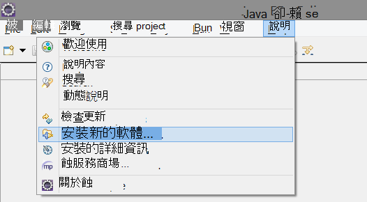

2. SDK 位於 http://dl.windowsazure.com/eclipse 下 Azure 工具組。 
3. 取消核取 [**連絡所有更新網站...**

    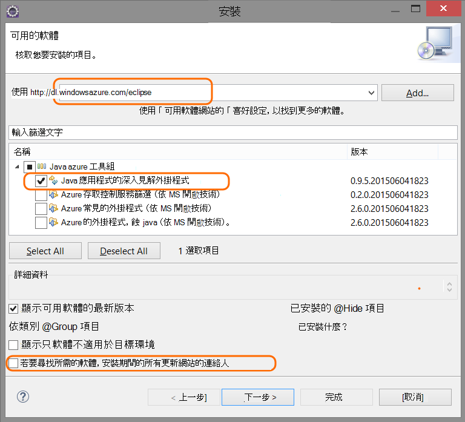

按照其餘步驟每個 Java 專案。

## Azure 中建立的應用程式的深入見解資源

1. [Azure 入口網站](https://portal.azure.com)登入。
2. 建立新的應用程式的深入見解資源。  

    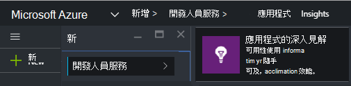  
3. 將應用程式類型設為 Java web 應用程式。  

    ![填滿的名稱，選擇 [Java web 應用程式，然後按一下 [建立]](./media/app-insights-java-eclipse/02-create.png)  
4. 尋找新的資源的儀器索引鍵。 您會需要此引進了貼到您的程式碼專案。  

    ![在新資源概觀] 中，按一下 [內容並複製儀器索引鍵](./media/app-insights-java-eclipse/03-key.png)  

## 新增應用程式的深入見解至專案

1. 新增應用程式的深入見解從 Java web 專案的操作功能表。

    ![在新資源概觀] 中，按一下 [內容並複製儀器索引鍵](./media/app-insights-java-eclipse/02-context-menu.png)

2. 貼上您從 Azure 入口網站取得儀器鍵。

    ![在新資源概觀] 中，按一下 [內容並複製儀器索引鍵](./media/app-insights-java-eclipse/03-ikey.png)

索引鍵會傳送以及遙測的每個項目，並告知應用程式深入資訊，以將其顯示在您的資源。

## 執行應用程式，請參閱指標

執行您的應用程式。

返回您在 Microsoft Azure 中的應用程式的深入見解資源。

HTTP 要求資料會出現在概觀刀。 （如果沒有出現，請稍候，然後按一下 [重新整理）。

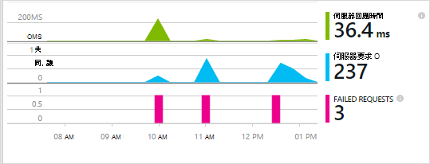
 

按一下任何圖表，請參閱更詳細的指標。 

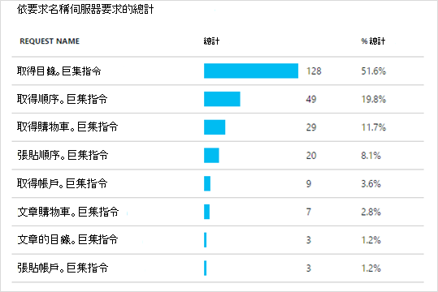

[進一步瞭解指標。][metrics]

 

當您檢視要求的內容，您可以看到與其相關聯，例如要求和例外狀況的遙測事件。
 
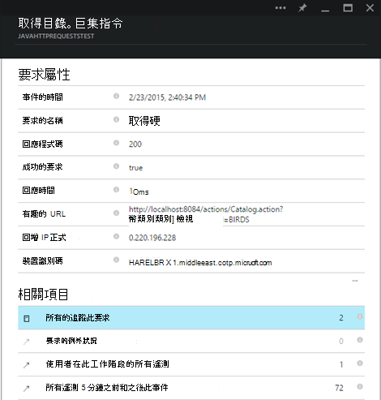

## 用戶端遙測

快速入門刀中，按一下 [取得監控我網頁的程式碼︰ 

![在您的應用程式概觀刀，選擇 [快速啟動]，取得監控我網頁程式碼。 複製指令碼。](./media/app-insights-java-eclipse/02-monitor-web-page.png)

標頭的 HTML 檔案中插入程式碼片段。

#### 檢視用戶端的資料

開啟您更新的網頁，然後使用這些。 等候幾分鐘或兩個，然後返回應用程式的深入見解並開啟使用刀。 （從概觀刀中，向下捲動並按一下 [使用情況）。

頁面檢視、 使用者，以及工作階段指標會出現在 [使用情況刀上︰

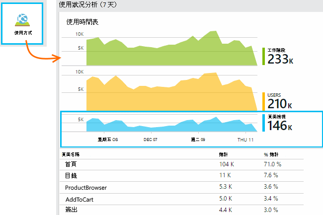

[深入瞭解設定用戶端遙測。][usage]

## 發佈您的應用程式

現在發佈至伺服器，讓的人使用，且監看式遙測顯示入口網站的應用程式。

* 請確定您的防火牆可讓您的應用程式傳送遙測這些連接埠︰

 * dc.services.visualstudio.com:443
 * dc.services.visualstudio.com:80
 * f5.services.visualstudio.com:443
 * f5.services.visualstudio.com:80

* 在 Windows 伺服器上安裝︰

 * [Microsoft Visual c + + 可轉散發套件](http://www.microsoft.com/download/details.aspx?id=40784)

    （這可讓效能計數器。）

## 例外狀況和邀請失敗

自動收集處理的例外狀況︰

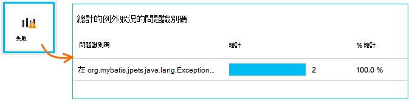

若要在其他的例外狀況收集資料，您有兩個選項︰

* [插入程式碼中 TrackException 來電](app-insights-api-custom-events-metrics.md#track-exception)。 
* [安裝在伺服器上 Java 代理程式](app-insights-java-agent.md)。 您指定要監看的方法。

## 監視方法呼叫和外部相依性

登入的 [[安裝 Java 代理程式](app-insights-java-agent.md)可指定內部方法和通電話 JDBC，透過使用預存時間資料。

## 效能計數器

在您的概觀刀，向下捲動，然後按一下 [**伺服器**] 方塊。 您會看到效能計數器的範圍。

![按一下 [伺服器] 磚往下捲動](./media/app-insights-java-eclipse/11-perf-counters.png)

### 自訂效能計數器集合

若要停用一組標準的效能計數器的集合，新增下列 ApplicationInsights.xml 檔案的根節點下︰

    <PerformanceCounters>
       <UseBuiltIn>False</UseBuiltIn>
    </PerformanceCounters>

### 收集的額外的效能計數器

您可以指定收集的額外的效能計數器。

#### JMX 計數器 （公開 Java 虛擬機器）

    <PerformanceCounters>
      <Jmx>
        <Add objectName="java.lang:type=ClassLoading" attribute="TotalLoadedClassCount" displayName="Loaded Class Count"/>
        <Add objectName="java.lang:type=Memory" attribute="HeapMemoryUsage.used" displayName="Heap Memory Usage-used" type="composite"/>
      </Jmx>
    </PerformanceCounters>

*   `displayName`– 在應用程式的深入見解入口網站中顯示的名稱。
*   `objectName`– JMX 物件名稱。
*   `attribute`– 以擷取 JMX 物件名稱的屬性
*   `type`（選擇性）-JMX 物件的屬性的類型︰
 *  預設值︰ 簡單例如 int] 或 [長整數類型。
 *  `composite`︰ 效能計數器資料位於 「 Attribute.Data 」 的格式
 *  `tabular`︰ 效能計數器資料是在表格列的格式

#### Windows 效能計數器

每個[Windows 效能計數器](https://msdn.microsoft.com/library/windows/desktop/aa373083.aspx)是類別的成員 （以相同的方式，欄位是類別的類別的成員）。 類別可以是全域管理員，可以有編號或具名執行個體。

    <PerformanceCounters>
      <Windows>
        <Add displayName="Process User Time" categoryName="Process" counterName="%User Time" instanceName="__SELF__" />
        <Add displayName="Bytes Printed per Second" categoryName="Print Queue" counterName="Bytes Printed/sec" instanceName="Fax" />
      </Windows>
    </PerformanceCounters>

*   顯示名稱 – 應用程式的深入見解入口網站中所顯示的名稱。
*   類別名稱︰ 使用這個效能計數器相關聯的效能計數器分類 （效能物件）。
*   counterName – 效能計數器的名稱。
*   instanceName – 效能計數器類別執行個體或空字串的名稱 (「 」)，如果分類包含單一的執行個體。 如果類別名稱是程序，而您想要收集的效能計數器位於目前 JVM 程序正在執行您的應用程式中，指定`"__SELF__"`。

您的效能計數器會顯示為[標準檔案總管]中的自訂指標[metrics]。

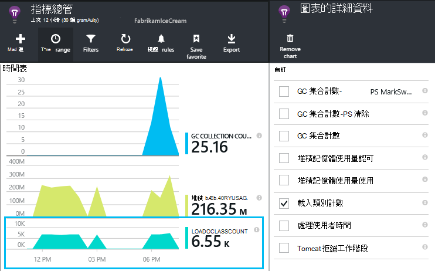

### Unix 效能計數器

* [安裝應用程式的深入見解外掛程式 collectd](app-insights-java-collectd.md)以取得各種不同的系統和網路資料。

## 可用性 web 測試

應用程式的深入見解可以測試您的網站是由的核取及回應也定期間隔。 [若要設定][availability]，按一下 [可用性] 向下捲動。

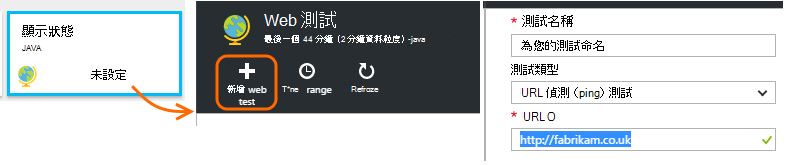

如果您的網站當機，您會收到回應的時間，以及電子郵件通知的圖表。

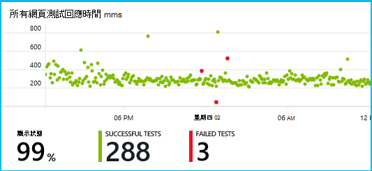

[進一步瞭解可用性 web 測試。][availability] 

## 診斷記錄

如果您使用的 Logback 或 Log4J （v1.2 或 v2.0） 追蹤，您可以讓您可以在此探索及搜尋他們的應用程式獲得深入見解自動傳送您追蹤記錄檔。

[深入瞭解診斷記錄][javalogs]

## 自訂遙測 

插入幾行程式碼 Java web 應用程式中，找出哪些使用者所執行的動作，或協助診斷問題。 

在網頁上 JavaScript 和伺服器端 Java 中，您可以插入程式碼。

[瞭解如何自訂遙測][track]

## 後續步驟

#### 偵測與診斷問題

* [新增 web 用戶端遙測][usage]可從網頁用戶端效能遙測。
* [設定 web 測試][availability]以確定您的應用程式保持即時和回應。
* [搜尋事件與記錄][diagnostic]協助診斷問題。
* [擷取 Log4J 或 Logback 追蹤][javalogs]

#### 追蹤的使用

* [新增 web 用戶端遙測][usage]監視器頁面檢視和基本使用者指標。
* [追蹤自訂事件和指標][track]若要瞭解如何使用的相關應用程式，同時在用戶端與伺服器。

<!--Link references-->

[availability]: app-insights-monitor-web-app-availability.md
[diagnostic]: app-insights-diagnostic-search.md
[java]: app-insights-java-get-started.md
[javalogs]: app-insights-java-trace-logs.md
[metrics]: app-insights-metrics-explorer.md
[track]: app-insights-api-custom-events-metrics.md
[usage]: app-insights-web-track-usage.md

 