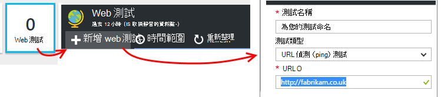

<properties
    pageTitle="使用應用程式的深入見解 Java web 應用程式的分析 |Microsoft Azure"
    description="監控效能與 Java 網站與應用程式的深入見解的使用方式。 "
    services="application-insights"
    documentationCenter="java"
    authors="alancameronwills"
    manager="douge"/>

<tags
    ms.service="application-insights"
    ms.workload="tbd"
    ms.tgt_pltfrm="ibiza"
    ms.devlang="na"
    ms.topic="get-started-article"
    ms.date="08/17/2016"
    ms.author="awills"/>

# 開始使用應用程式的深入見解 Java web 專案中

*應用程式的深入見解位於預覽。*

[AZURE.INCLUDE [app-insights-selector-get-started](../../includes/app-insights-selector-get-started.md)]

[應用程式的深入見解](https://azure.microsoft.com/services/application-insights/)是可延伸分析服務，可協助您理解的效能和即時應用程式的使用方式。 用來[偵測與診斷效能問題和例外狀況](app-insights-detect-triage-diagnose.md)，和[撰寫程式碼][api]來追蹤使用者如何處理您的應用程式。

應用程式的深入見解支援 Linux、 Unix 或 Windows 上執行的 Java 應用程式。

您需要︰

* Oracle JRE 1.6 或更新版本或祖魯文 JRE 1.6 或更新版本
* [Microsoft Azure](https://azure.microsoft.com/)訂閱。 （您可以使用[免費的試用版](https://azure.microsoft.com/pricing/free-trial/)開始）。

*如果您已即時的 web 應用程式，您無法遵循的替代的程序，若要[新增的網頁伺服器執行階段 SDK](app-insights-java-live.md)。這個方法可避免重建程式碼，但沒有收到撰寫程式碼來追蹤使用者活動的選項。*

## 1。 取得應用程式的深入見解儀器金鑰

1. 登入[Microsoft Azure 入口網站](https://portal.azure.com)。
2. 建立應用程式的深入見解資源。 將應用程式類型設為 Java web 應用程式。

    ![填滿的名稱，選擇 [Java web 應用程式，然後按一下 [建立]](./media/app-insights-java-get-started/02-create.png)
4. 尋找新的資源的儀器索引鍵。 您必須引進了貼到您的程式碼專案的此按鍵。

    ![在新資源概觀] 中，按一下 [內容並複製儀器索引鍵](./media/app-insights-java-get-started/03-key.png)

## 2.應用程式的深入見解 SDK java 新增至專案

*選取適當的方式，為您的專案。*

#### 如果您用來建立 Maven 或動態 Web 專案蝕...

使用[應用程式的深入見解 SDK java 外掛程式][eclipse]。

#### 如果您使用的 Maven...

如果您的專案已設定要用於建立 Maven，合併至 pom.xml 檔案下列程式碼。

然後，重新整理專案相依性，以取得下載的二進位。

    <repositories>
       <repository>
          <id>central</id>
          <name>Central</name>
          <url>http://repo1.maven.org/maven2</url>
       </repository>
    </repositories>

    <dependencies>
      <dependency>
        <groupId>com.microsoft.azure</groupId>
        <artifactId>applicationinsights-web</artifactId>
        <!-- or applicationinsights-core for bare API -->
        <version>[1.0,)</version>
      </dependency>
    </dependencies>

* *建立或檢查值驗證錯誤？* 請嘗試使用特定的版本，例如︰ `<version>1.0.n</version>`。 在[SDK 版本資訊](https://github.com/Microsoft/ApplicationInsights-Java#release-notes)或我們[Maven 成品](http://search.maven.org/#search%7Cga%7C1%7Capplicationinsights)，您可以找到最新版本。
* *需要更新為新的 SDK 嗎？* 重新整理您的專案相依性。

#### 如果您使用的 Gradle...

如果您的專案已設定要用於建立 Gradle，合併至 build.gradle 檔案下列程式碼。

更新專案相依性，以取得下載的二進位。

    repositories {
      mavenCentral()
    }

    dependencies {
      compile group: 'com.microsoft.azure', name: 'applicationinsights-web', version: '1.+'
      // or applicationinsights-core for bare API
    }

* *建置或檢查值驗證錯誤？請嘗試使用特定的版本，例如︰* `version:'1.0.n'`。 *您可以找到最新版本中的[SDK 版本資訊](https://github.com/Microsoft/ApplicationInsights-Java#release-notes)。*
* *若要更新為新的 SDK*
 * 重新整理您的專案相依性。

#### 否則...

手動新增 SDK:

1. 下載[應用程式的深入見解 java SDK](https://aka.ms/aijavasdk)。
2. Zip 檔案中擷取的二進位檔案，並將其新增至您的專案。

### 問題...

* *什麼是之間的關聯性`-core`和`-web`中 zip 元件？*

 * `applicationinsights-core`可讓您不包裝的 API。 您隨時都需要此元件。
 * `applicationinsights-web`可讓您進行追蹤 HTTP 要求計數和回應時間。 如果您不想自動收集此遙測，您可以略過這個元件。 例如，如果您想要撰寫您自己。

* *若要我們發佈時更新 SDK 的變更*
 * 下載最新的[應用程式的深入見解 SDK java](https://aka.ms/qqkaq6) ，並取代舊的。
 * 變更所述的[SDK 版本資訊](https://github.com/Microsoft/ApplicationInsights-Java#release-notes)。

## 3.新增應用程式的深入見解.xml 檔案

將 ApplicationInsights.xml 新增至您的專案中的 [資源] 資料夾，或確定它會新增至您的專案部署類別的路徑。 將下列 XML 複製到它。

替代的儀器機碼，從 Azure 入口網站取得。

    <?xml version="1.0" encoding="utf-8"?>
    <ApplicationInsights xmlns="http://schemas.microsoft.com/ApplicationInsights/2013/Settings" schemaVersion="2014-05-30">

      <!-- The key from the portal: -->

      <InstrumentationKey>** Your instrumentation key **</InstrumentationKey>

      <!-- HTTP request component (not required for bare API) -->

      <TelemetryModules>
        <Add type="com.microsoft.applicationinsights.web.extensibility.modules.WebRequestTrackingTelemetryModule"/>
        <Add type="com.microsoft.applicationinsights.web.extensibility.modules.WebSessionTrackingTelemetryModule"/>
        <Add type="com.microsoft.applicationinsights.web.extensibility.modules.WebUserTrackingTelemetryModule"/>
      </TelemetryModules>

      <!-- Events correlation (not required for bare API) -->
      <!-- These initializers add context data to each event -->

      <TelemetryInitializers>
        <Add   type="com.microsoft.applicationinsights.web.extensibility.initializers.WebOperationIdTelemetryInitializer"/>
        <Add type="com.microsoft.applicationinsights.web.extensibility.initializers.WebOperationNameTelemetryInitializer"/>
        <Add type="com.microsoft.applicationinsights.web.extensibility.initializers.WebSessionTelemetryInitializer"/>
        <Add type="com.microsoft.applicationinsights.web.extensibility.initializers.WebUserTelemetryInitializer"/>
        <Add type="com.microsoft.applicationinsights.web.extensibility.initializers.WebUserAgentTelemetryInitializer"/>

      </TelemetryInitializers>
    </ApplicationInsights>

* 儀器鍵會傳送以及遙測的每個項目，並告知應用程式深入資訊，以將其顯示在您的資源。
* 將 HTTP 要求的元件是選擇性的。 自動傳送要求與回應時間遙測入口網站。
* 事件的關聯性是 HTTP 要求元件新增。 它將識別碼指派給每個伺服器時，收到的要求並新增此識別碼為屬性遙測的每個項目為 「 Operation.Id 」 的屬性。 您可以建立關聯設定[診斷搜尋]篩選器相關聯的每個要求遙測[diagnostic]。
* 應用程式的深入見解鍵可動態傳遞從 Azure 入口網站，為系統屬性 (-DAPPLICATION_INSIGHTS_IKEY = your_ikey)。 如果沒有定義的屬性，它會檢查 Azure 應用程式設定] 中的環境變數 (APPLICATION_INSIGHTS_IKEY)。 如果未定義兩個屬性，請從 ApplicationInsights.xml 會使用預設 InstrumentationKey。 此順序可協助您管理不同環境中的不同 InstrumentationKeys 動態。

### 若要設定的儀器鍵的其他方式

應用程式的深入見解 SDK 看起來鍵順序如下︰

1. 系統屬性:-DAPPLICATION_INSIGHTS_IKEY = your_ikey
2. 環境變數︰ APPLICATION_INSIGHTS_IKEY
3. 設定檔︰ ApplicationInsights.xml

您也可以[將其程式碼](app-insights-api-custom-events-metrics.md#ikey)︰

    telemetryClient.InstrumentationKey = "...";

## 4.新增 HTTP 篩選

最後一個步驟中，設定可讓您登入的每個網頁要求 HTTP 要求元件。 （不需要如果您只想要不包裝 API）。

找出並開啟 web.xml 檔案，在您的專案，然後合併下列程式碼的 web 應用程式節點下，您的應用程式的篩選設定的位置。

若要取得最正確的結果，應對應篩選之前的所有其他篩選。

    <filter>
      <filter-name>ApplicationInsightsWebFilter</filter-name>
      <filter-class>
        com.microsoft.applicationinsights.web.internal.WebRequestTrackingFilter
      </filter-class>
    </filter>
    <filter-mapping>
       <filter-name>ApplicationInsightsWebFilter</filter-name>
       <url-pattern>/*</url-pattern>
    </filter-mapping>

#### 如果您使用的春天 Web MVC 3.1 或更新版本

編輯這些項目，包括應用程式的深入見解套件︰

    <context:component-scan base-package=" com.springapp.mvc, com.microsoft.applicationinsights.web.spring"/>

    <mvc:interceptors>
        <mvc:interceptor>
            <mvc:mapping path="/**"/>
            <bean class="com.microsoft.applicationinsights.web.spring.RequestNameHandlerInterceptorAdapter" />
        </mvc:interceptor>
    </mvc:interceptors>

#### 如果您使用的 Struts 2

新增此項目 （通常稱為 struts.xml 或 struts default.xml） Struts 設定檔︰

     <interceptors>
       <interceptor name="ApplicationInsightsRequestNameInterceptor" class="com.microsoft.applicationinsights.web.struts.RequestNameInterceptor" />
     </interceptors>
     <default-interceptor-ref name="ApplicationInsightsRequestNameInterceptor" />

（如果您有攔截預設堆疊中定義，攔截器可以只會新增至該堆疊。）

## 5。 執行您的應用程式

在您的部署電腦上執行偵錯模式或發佈至伺服器。

## 6。 您遙測檢視中的應用程式的深入見解

返回您在[Microsoft Azure 入口網站](https://portal.azure.com)的應用程式的深入見解資源。

HTTP 要求資料會出現在概觀刀。 （如果沒有出現，請稍候，然後按一下 [重新整理）。

[進一步瞭解指標。][metrics]

按一下以查看更詳細的彙總的指標的任何圖表。

> 應用程式的深入見解假設 HTTP 的 MVC 應用程式要求的格式︰ `VERB controller/action`。 例如， `GET Home/Product/f9anuh81`，`GET Home/Product/2dffwrf5`和`GET Home/Product/sdf96vws`會分組為`GET Home/Product`。 此群組可讓有意義的彙總的要求，例如要求和要求的平均的執行時間的數字。

### 執行個體資料 

按一下特定的要求類型] 以查看個別執行個體。 

兩種類型的資料會顯示在 [應用程式的深入見解︰ 彙總資料、 儲存並顯示為平均計數與加總。執行個體資料-HTTP 要求、 例外狀況、 頁面檢視]、 或自訂事件的個別報表和。

當您檢視要求的內容，您可以看到與其相關聯，例如要求和例外狀況的遙測事件。

### 分析︰ 強大的查詢語言

當您累積更多資料時，您可以執行彙總資料，並尋找個別執行個體的查詢。 [分析]()是這兩者以了解效能及使用方式，以及診斷功能強大的工具。

## 7。 在伺服器上安裝應用程式

現在發佈至伺服器，讓的人使用，且監看式遙測顯示入口網站的應用程式。

* 請確定您的防火牆可讓您的應用程式傳送遙測這些連接埠︰

 * dc.services.visualstudio.com:443
 * f5.services.visualstudio.com:443

* 在 Windows 伺服器上安裝︰

 * [Microsoft Visual c + + 可轉散發套件](http://www.microsoft.com/download/details.aspx?id=40784)

    （此元件能讓效能計數器）。

## 例外狀況和邀請失敗

自動收集處理的例外狀況︰

![開啟 [設定]，[失敗](./media/app-insights-java-get-started/21-exceptions.png)

若要在其他的例外狀況收集資料，您有兩個選項︰

* [插入程式碼中的來電至 trackException()][apiexceptions]。 
* [安裝在伺服器上 Java 代理程式](app-insights-java-agent.md)。 您指定要監看的方法。

## 監視方法呼叫和外部相依性

登入的 [[安裝 Java 代理程式](app-insights-java-agent.md)可指定內部方法和通電話 JDBC，透過使用預存時間資料。

## 效能計數器

開啟 [**設定**]**伺服器**，若要查看的效能計數器範圍。

### 自訂效能計數器集合

若要停用一組標準的效能計數器的集合，新增下列 ApplicationInsights.xml 檔案的根節點下︰

    <PerformanceCounters>
       <UseBuiltIn>False</UseBuiltIn>
    </PerformanceCounters>

### 收集的額外的效能計數器

您可以指定收集的額外的效能計數器。

#### JMX 計數器 （公開 Java 虛擬機器）

    <PerformanceCounters>
      <Jmx>
        <Add objectName="java.lang:type=ClassLoading" attribute="TotalLoadedClassCount" displayName="Loaded Class Count"/>
        <Add objectName="java.lang:type=Memory" attribute="HeapMemoryUsage.used" displayName="Heap Memory Usage-used" type="composite"/>
      </Jmx>
    </PerformanceCounters>

*   `displayName`– 在應用程式的深入見解入口網站中顯示的名稱。
*   `objectName`– JMX 物件名稱。
*   `attribute`– 以擷取 JMX 物件名稱的屬性
*   `type`（選擇性）-JMX 物件的屬性的類型︰
 *  預設︰ 簡單例如 int] 或 [長整數類型。
 *  `composite`︰ 效能計數器資料位於 「 Attribute.Data 」 的格式
 *  `tabular`︰ 效能計數器資料是在表格列的格式

#### Windows 效能計數器

每個[Windows 效能計數器](https://msdn.microsoft.com/library/windows/desktop/aa373083.aspx)是類別的成員 （以相同的方式，欄位是類別的類別的成員）。 類別可以是全域管理員，可以有編號或具名執行個體。

    <PerformanceCounters>
      <Windows>
        <Add displayName="Process User Time" categoryName="Process" counterName="%User Time" instanceName="__SELF__" />
        <Add displayName="Bytes Printed per Second" categoryName="Print Queue" counterName="Bytes Printed/sec" instanceName="Fax" />
      </Windows>
    </PerformanceCounters>

*   顯示名稱 – 應用程式的深入見解入口網站中所顯示的名稱。
*   類別名稱︰ 使用這個效能計數器相關聯的效能計數器分類 （效能物件）。
*   counterName – 效能計數器的名稱。
*   instanceName – 效能計數器類別執行個體或空字串的名稱 (「 」)，如果分類包含單一的執行個體。 如果類別名稱是程序，而您想要收集的效能計數器位於目前 JVM 程序正在執行您的應用程式中，指定`"__SELF__"`。

您的效能計數器會顯示為[標準檔案總管]中的自訂指標[metrics]。

### Unix 效能計數器

* [安裝應用程式的深入見解外掛程式 collectd](app-insights-java-collectd.md)以取得各種不同的系統和網路資料。

## 取得使用者與工作階段的資料

[確定] 之後您要傳送遙測從您的網頁伺服器。 現在若要取得應用程式的完整的 360 角度檢視，您可以新增更多監控︰

* [新增至網頁的遙測][usage]監視器頁面檢視和使用者指標。
* [設定 web 測試][availability]以確定您的應用程式保持即時和回應。

## 擷取記錄追蹤

您可以使用多種方法及角度的記錄檔的應用程式的深入見解 Log4J、 Logback，或其他記錄架構。 您可以與記錄其他遙測 HTTP 要求與相互關聯。 [瞭解如何][javalogs]。

## 傳送您自己的遙測

既然您已安裝 SDK，您可以使用 API 傳送自己遙測。

* [追蹤自訂事件和指標][api]若要瞭解使用者使用您的應用程式的執行。
* [搜尋事件與記錄][diagnostic]協助診斷問題。

## 可用性 web 測試

應用程式的深入見解可以測試您的網站是由的核取及回應也定期間隔。 [若要設定][availability]，按一下 [Web 測試。

如果您的網站當機，您會收到回應的時間，以及電子郵件通知的圖表。

[進一步瞭解可用性 web 測試。][availability] 

## 問題嗎？ 時遇到問題？

[疑難排解 Java](app-insights-java-troubleshoot.md)

## 後續步驟

如需詳細資訊，請參閱[Java 開發人員中心](/develop/java/)。

<!--Link references-->

[api]: app-insights-api-custom-events-metrics.md
[apiexceptions]: app-insights-api-custom-events-metrics.md#track-exception
[availability]: app-insights-monitor-web-app-availability.md
[diagnostic]: app-insights-diagnostic-search.md
[eclipse]: app-insights-java-eclipse.md
[javalogs]: app-insights-java-trace-logs.md
[metrics]: app-insights-metrics-explorer.md
[usage]: app-insights-web-track-usage.md
