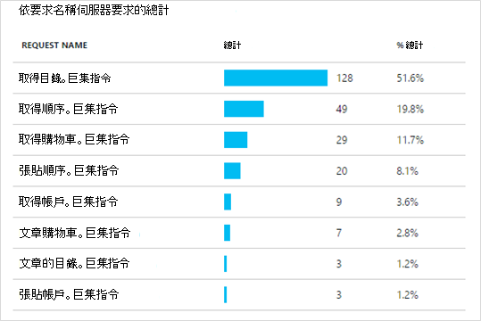

<properties 
    pageTitle="Java web 應用程式已使用的應用程式獲得深入見解 live" 
    description="開始監視已在伺服器執行的 web 應用程式" 
    services="application-insights" 
    documentationCenter="java"
    authors="alancameronwills" 
    manager="douge"/>

<tags 
    ms.service="application-insights" 
    ms.workload="tbd" 
    ms.tgt_pltfrm="ibiza" 
    ms.devlang="na" 
    ms.topic="article" 
    ms.date="08/24/2016" 
    ms.author="awills"/>
 
# Java web 應用程式已使用的應用程式獲得深入見解 live

*應用程式的深入見解位於預覽。*

如果您已在 J2EE 伺服器執行的 web 應用程式，您就可以開始使用[應用程式的深入見解](app-insights-overview.md)它監控，而不需要的程式碼變更或重新編譯專案。 使用此選項，您會收到傳送給您的伺服器，因為內含無法處理的例外狀況和效能計數器 HTTP 要求的相關資訊。

您需要[Microsoft Azure](https://azure.com)的訂閱。

> [AZURE.NOTE] 在此頁面上的程序會將您的 web 應用程式，在執行階段 SDK。 此執行階段儀器依然相當實用，如果您不想要更新或重新建立您的程式碼。 但如果可以的話，我們建議您[新增原始程式碼 SDK](app-insights-java-get-started.md)改為。 可讓您撰寫程式碼，例如追蹤使用者活動的更多選項。

## 1。 取得應用程式的深入見解儀器金鑰

1. 登入[Microsoft Azure 入口網站](https://portal.azure.com)
2. 建立新的應用程式的深入見解資源

    
3. 將應用程式類型設為 Java web 應用程式。

    ![填滿的名稱，選擇 [Java web 應用程式，然後按一下 [建立]](./media/app-insights-java-live/02-create.png)
4. 尋找新的資源的儀器索引鍵。 您必須引進了貼到您的程式碼專案的此按鍵。

    ![在新資源概觀] 中，按一下 [內容並複製儀器索引鍵](./media/app-insights-java-live/03-key.png)

## 2.下載 SDK

1. 下載[應用程式的深入見解 java SDK](https://aka.ms/aijavasdk)。 
2. 在伺服器上擷取的 SDK 內容載入您專案的二進位檔案的目錄。 如果您使用的 Tomcat，此目錄通常會下`webapps\<your_app_name>\WEB-INF\lib`

## 3.新增應用程式的深入見解 xml 檔案

您可以在其中新增 SDK 資料夾中建立 ApplicationInsights.xml。 將下列 XML 將它。

替代的儀器機碼，從 Azure 入口網站取得。

    <?xml version="1.0" encoding="utf-8"?>
    <ApplicationInsights xmlns="http://schemas.microsoft.com/ApplicationInsights/2013/Settings" schemaVersion="2014-05-30">

      <!-- The key from the portal: -->

      <InstrumentationKey>** Your instrumentation key **</InstrumentationKey>

      <!-- HTTP request component (not required for bare API) -->

      <TelemetryModules>
        <Add type="com.microsoft.applicationinsights.web.extensibility.modules.WebRequestTrackingTelemetryModule"/>
        <Add type="com.microsoft.applicationinsights.web.extensibility.modules.WebSessionTrackingTelemetryModule"/>
        <Add type="com.microsoft.applicationinsights.web.extensibility.modules.WebUserTrackingTelemetryModule"/>
      </TelemetryModules>

      <!-- Events correlation (not required for bare API) -->
      <!-- These initializers add context data to each event -->

      <TelemetryInitializers>
        <Add   type="com.microsoft.applicationinsights.web.extensibility.initializers.WebOperationIdTelemetryInitializer"/>
        <Add type="com.microsoft.applicationinsights.web.extensibility.initializers.WebOperationNameTelemetryInitializer"/>
        <Add type="com.microsoft.applicationinsights.web.extensibility.initializers.WebSessionTelemetryInitializer"/>
        <Add type="com.microsoft.applicationinsights.web.extensibility.initializers.WebUserTelemetryInitializer"/>
        <Add type="com.microsoft.applicationinsights.web.extensibility.initializers.WebUserAgentTelemetryInitializer"/>

      </TelemetryInitializers>
    </ApplicationInsights>

* 儀器鍵會傳送以及遙測的每個項目，並告知應用程式深入資訊，以將其顯示在您的資源。
* 將 HTTP 要求的元件是選擇性的。 自動傳送要求與回應時間遙測入口網站。
* 事件的關聯性是 HTTP 要求元件新增。 它將識別碼指派給每個伺服器時，收到的要求並新增此識別碼為屬性遙測的每個項目為 「 Operation.Id 」 的屬性。 其可讓您建立的關聯設定[診斷搜尋](app-insights-diagnostic-search.md)篩選器相關聯的每個要求遙測。

## 4.新增 HTTP 篩選

找出並開啟 web.xml 檔案，在您的專案，然後合併下列的程式碼片段的 web 應用程式節點下，您的應用程式的篩選設定的位置。

若要取得最正確的結果，應對應篩選之前的所有其他篩選。

    <filter>
      <filter-name>ApplicationInsightsWebFilter</filter-name>
      <filter-class>
        com.microsoft.applicationinsights.web.internal.WebRequestTrackingFilter
      </filter-class>
    </filter>
    <filter-mapping>
       <filter-name>ApplicationInsightsWebFilter</filter-name>
       <url-pattern>/*</url-pattern>
    </filter-mapping>

## 5。 檢查防火牆例外

您可能需要[設定外寄資料傳送的例外狀況](app-insights-ip-addresses.md)。

## 6.重新啟動您的 web 應用程式

## 7。 您遙測檢視中的應用程式的深入見解

返回您在[Microsoft Azure 入口網站](https://portal.azure.com)的應用程式的深入見解資源。

有關 HTTP 要求遙測會出現在概觀刀。 （如果沒有出現，請稍候，然後按一下 [重新整理）。

 

按一下任何圖表，請參閱更詳細的指標。 

 

當您檢視要求的內容，您可以看到與其相關聯，例如要求和例外狀況的遙測事件。
 

[進一步瞭解指標。](app-insights-metrics-explorer.md)

## 後續步驟

* [新增至網頁的遙測](app-insights-web-track-usage.md)監視器頁面檢視和使用者指標。
* [設定 web 測試](app-insights-monitor-web-app-availability.md)，以確保您的應用程式保持即時和回應。
* [擷取記錄追蹤](app-insights-java-trace-logs.md)
* [搜尋事件與記錄](app-insights-diagnostic-search.md)以協助診斷問題。

 
