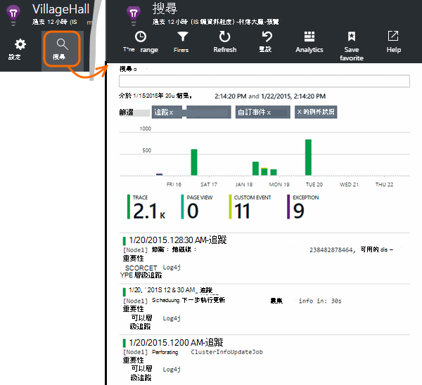

<properties 
    pageTitle="探索的 Java 追蹤登入應用程式的深入見解" 
    description="在 [應用程式的深入見解的搜尋 Log4J 或 Logback 追蹤" 
    services="application-insights" 
    documentationCenter="java"
    authors="alancameronwills" 
    manager="douge"/>

<tags 
    ms.service="application-insights" 
    ms.workload="tbd" 
    ms.tgt_pltfrm="ibiza" 
    ms.devlang="na" 
    ms.topic="article" 
    ms.date="07/12/2016" 
    ms.author="awills"/>

# 探索的 Java 追蹤登入應用程式的深入見解

如果您使用的 Logback 或 Log4J （v1.2 或 v2.0） 追蹤，您可以讓您可以在此探索及搜尋他們的應用程式獲得深入見解自動傳送您追蹤記錄檔。

安裝[應用程式的深入見解 SDK java][java]，如果您尚未這麼做的。

## 記錄文件庫新增至專案

*選取適當的方式，為您的專案。*

#### 如果您使用的 Maven...

如果您的專案已設定要用於建立 Maven，請將下列的程式碼片段的其中一個合併 pom.xml 檔案。

更新專案的相依性，以取得下載的二進位。

*Logback*

    <dependencies>
       <dependency>
          <groupId>com.microsoft.azure</groupId>
          <artifactId>applicationinsights-logging-logback</artifactId>
          <version>[1.0,)</version>
       </dependency>
    </dependencies>

*Log4J v2.0*

    <dependencies>
       <dependency>
          <groupId>com.microsoft.azure</groupId>
          <artifactId>applicationinsights-logging-log4j2</artifactId>
          <version>[1.0,)</version>
       </dependency>
    </dependencies>

*Log4J v1.2*

    <dependencies>
       <dependency>
          <groupId>com.microsoft.azure</groupId>
          <artifactId>applicationinsights-logging-log4j1_2</artifactId>
          <version>[1.0,)</version>
       </dependency>
    </dependencies>

#### 如果您使用的 Gradle...

如果您的專案已設定要用於建立 Gradle，新增下列幾行，其中`dependencies`build.gradle 檔案中的群組︰

更新專案的相依性，以取得下載的二進位。

**Logback**

    compile group: 'com.microsoft.azure', name: 'applicationinsights-logging-logback', version: '1.0.+'

**Log4J v2.0**

    compile group: 'com.microsoft.azure', name: 'applicationinsights-logging-log4j2', version: '1.0.+'

**Log4J v1.2**

    compile group: 'com.microsoft.azure', name: 'applicationinsights-logging-log4j1_2', version: '1.0.+'

#### 否則...

下載並解壓縮適用 appender，然後適當的文件庫新增至專案︰

記錄器 | 下載 | 文件庫
----|----|----
Logback|[使用 Logback appender SDK](https://aka.ms/xt62a4)|applicationinsights-記錄-logback
Log4J v2.0|[使用 Log4J v2 appender SDK](https://aka.ms/qypznq)|applicationinsights-記錄-log4j2 
Log4j v1.2|[使用 Log4J v1.2 appender SDK](https://aka.ms/ky9cbo)|applicationinsights-記錄-log4j1_2 

## 將 appender 新增至您的記錄架構

若要開始開始追蹤，合併相關的程式碼片段 Log4J 或 Logback 設定檔︰ 

*Logback*

    <appender name="aiAppender" 
      class="com.microsoft.applicationinsights.logback.ApplicationInsightsAppender">
    </appender>
    <root level="trace">
      <appender-ref ref="aiAppender" />
    </root>

*Log4J v2.0*

    <Configuration packages="com.microsoft.applicationinsights.Log4j">
      <Appenders>
        <ApplicationInsightsAppender name="aiAppender" />
      </Appenders>
      <Loggers>
        <Root level="trace">
          <AppenderRef ref="aiAppender"/>
        </Root>
      </Loggers>
    </Configuration>

*Log4J v1.2*

    <appender name="aiAppender" 
         class="com.microsoft.applicationinsights.log4j.v1_2.ApplicationInsightsAppender">
    </appender>
    <root>
      <priority value ="trace" />
      <appender-ref ref="aiAppender" />
    </root>

應用程式的深入見解 appenders 參考任何設定記錄器，並不一定是根記錄器 （如上述的程式碼範例所示）。

## 探索您在應用程式的深入見解入口網站中的追蹤

既然您已設定應用程式獲得深入見解傳送追蹤專案，您可以檢視，並在 [應用程式的深入見解入口網站中，在[搜尋]] 中搜尋這些追蹤[diagnostic]刀。

## 後續步驟

[診斷搜尋][diagnostic]

<!--Link references-->

[diagnostic]: app-insights-diagnostic-search.md
[java]: app-insights-java-get-started.md

 
