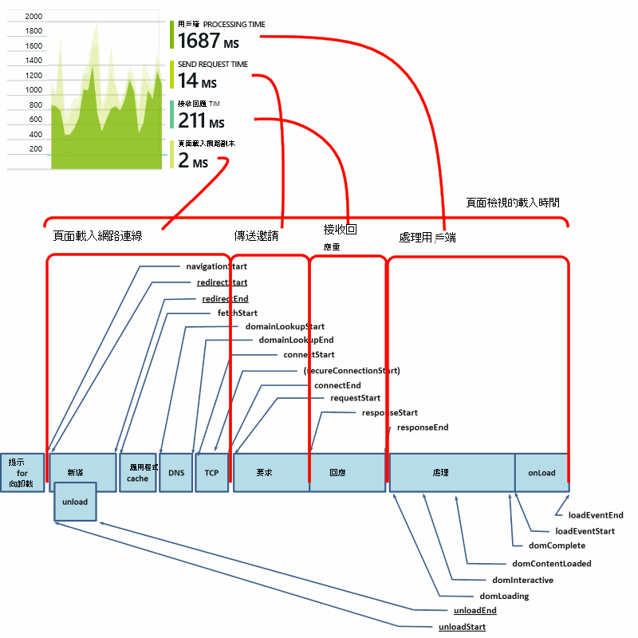
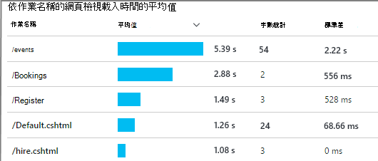
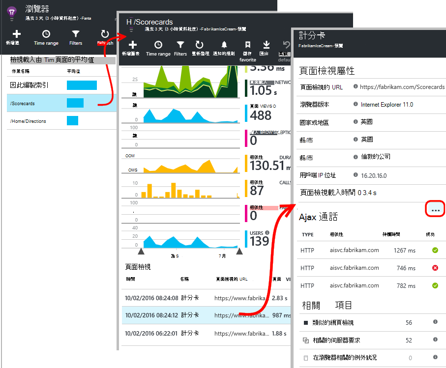
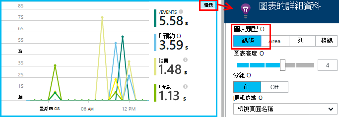
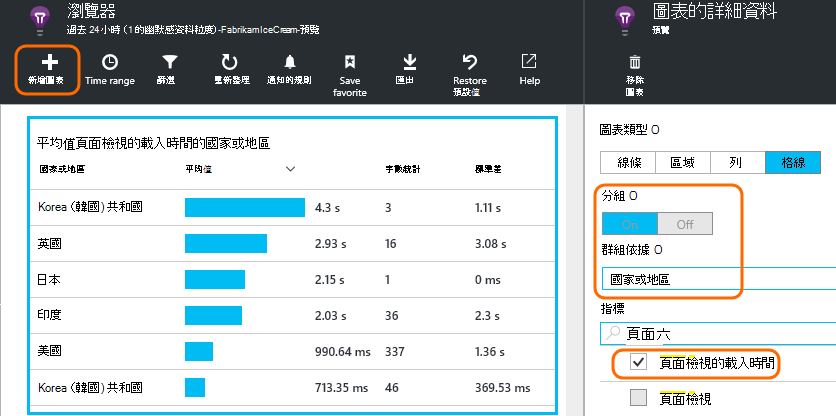
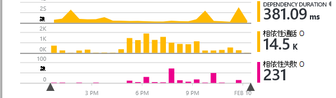
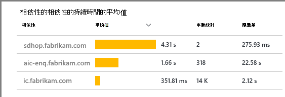
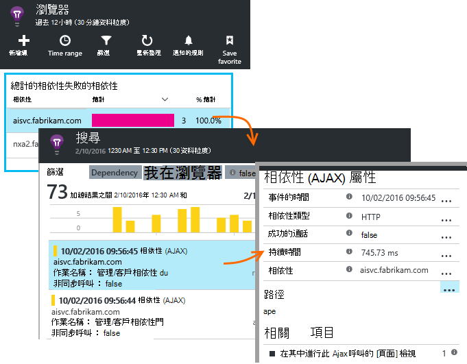
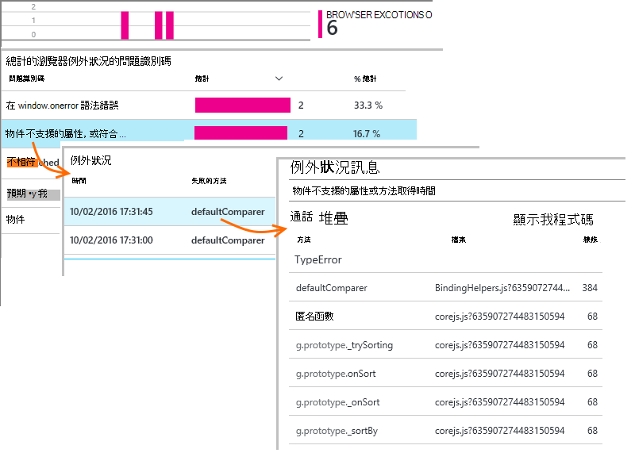
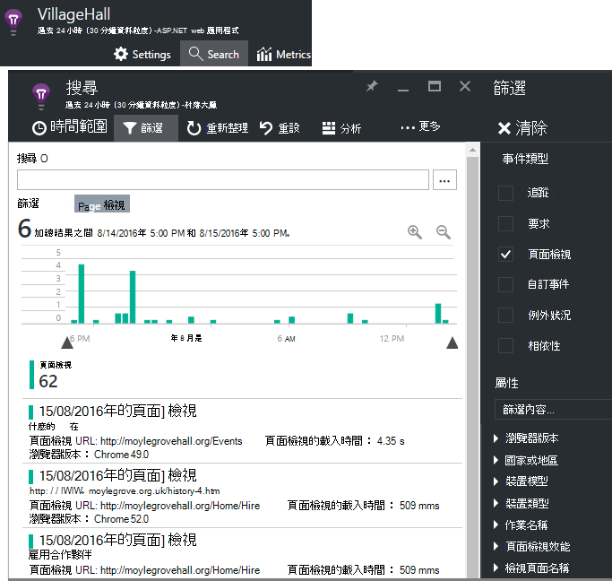

<properties
    pageTitle="應用程式獲得深入見解的 JavaScript web 應用程式 |Microsoft Azure"
    description="頁面檢視和工作階段計數、 網頁用戶端資料，及追蹤使用模式。 偵測 JavaScript 網頁中的例外狀況和效能問題。"
    services="application-insights"
    documentationCenter=""
    authors="alancameronwills"
    manager="douge"/>

<tags
    ms.service="application-insights"
    ms.workload="tbd"
    ms.tgt_pltfrm="ibiza"
    ms.devlang="na"
    ms.topic="get-started-article"
    ms.date="08/15/2016"
    ms.author="awills"/>

# 應用程式獲得深入見解的網頁

[AZURE.INCLUDE [app-insights-selector-get-started-dotnet](../../includes/app-insights-selector-get-started-dotnet.md)]

瞭解如何效能與您的網頁或應用程式的使用方式。 如果您新增 Visual Studio 應用程式深入資訊] 頁面的指令碼時，您會收到的頁面載入與 AJAX 通話、 計算和瀏覽器的例外狀況和 AJAX 失敗次數，以及使用者和工作階段計算的詳細資料的時間。 全部這些可以分割，頁面、 用戶端作業系統和瀏覽器版本、 地理位置，以及其他維度。 您也可以失敗計數上設定提醒或變慢頁面載入。

您可以使用任何網頁應用程式的深入見解-您剛才新增的 JavaScript 片段。 如果[Java](app-insights-java-get-started.md)或[ASP.NET](app-insights-asp-net.md)web 服務，您可以整合遙測從您的伺服器和用戶端。

您需要[Microsoft Azure](https://azure.com)的訂閱。 如果您的小組有組織的訂閱，請要求擁有者，若要為其新增您的 Microsoft 帳戶。 沒有可用的價格層，因此開發及小型無法成本任何項目。

## 設定您的網頁上的應用程式的深入見解

首先，您必須將應用程式深入資訊新增至網頁嗎？ 您可能會有這麼做。 如果您選擇要將應用程式深入資訊新增至您的 web 應用程式，在 Visual Studio 中的 [新增專案] 對話方塊中，然後加入指令碼。 在此情況下，您不需要執行任何多動作。

否則，您需要新增的程式碼片段網頁，，如下所示。

### 開啟應用程式的深入見解的資源

應用程式的深入見解資源是顯示您的頁面效能及使用方式的相關資料的位置。 

登入[Azure 入口網站](https://portal.azure.com)。

如果您已設定您的應用程式的伺服器端的監控，您已經擁有資源︰

![選擇 [瀏覽]，[開發人員服務應用程式深入資訊]。](./media/app-insights-javascript/01-find.png)

如果您沒有帳戶，請將它建立︰

![選擇 [新增]，開發人員服務應用程式的深入見解。](./media/app-insights-javascript/01-create.png)

*已問題嗎？* [深入瞭解建立資源](app-insights-create-new-resource.md)。

### 將 SDK 指令碼新增至您的應用程式或網頁

在 [快速入門中，取得網頁中的指令碼︰

![在您的應用程式概觀刀，選擇 [快速啟動]，取得監控我網頁程式碼。 複製指令碼。](./media/app-insights-javascript/02-monitor-web-page.png)

之前插入指令碼`</head>`您想要追蹤每頁的標籤。 如果您的網站] 主版頁面，您可以那里將指令碼。 例如︰

* 在 ASP.NET MVC 專案中，您可以將它放入`View\Shared\_Layout.cshtml`
* 在 SharePoint 網站中，在控制台] 中開啟[網站設定 / 主版頁面](app-insights-sharepoint.md)。

指令碼包含儀器索引鍵可將導向至您的應用程式的深入見解資源的資料。 

（[更深入的說明的指令碼](http://apmtips.com/blog/2015/03/18/javascript-snippet-explained/)）

*（如果您使用已知網頁架構，查看的應用程式的深入見解介面卡。For example，有[AngularJS 模組](http://ngmodules.org/modules/angular-appinsights)。)*

## 詳細的設定

有數個[參數](https://github.com/Microsoft/ApplicationInsights-JS/blob/master/API-reference.md#config)，您可以設定，但在大部分情況下，您應該不需要。 例如，您可以停用或限制的每個頁面檢視報告 （若要減少流量） Ajax 呼叫數目。 或者，您可以設定讓遙測移動快速管線沒有被批次的偵錯模式。

若要設定這些參數，這一行程式碼片段，尋找並新增更多逗點分隔的項目之後︰

    })({
      instrumentationKey: "..."
      // Insert here
    });

[可用的參數](https://github.com/Microsoft/ApplicationInsights-JS/blob/master/API-reference.md#config)包括︰

    // Send telemetry immediately without batching.
    // Remember to remove this when no longer required, as it
    // can affect browser performance.
    enableDebug: boolean,

    // Don't log browser exceptions.
    disableExceptionTracking: boolean,

    // Don't log ajax calls.
    disableAjaxTracking: boolean,

    // Limit number of Ajax calls logged, to reduce traffic.
    maxAjaxCallsPerView: 10, // default is 500

    // Time page load up to execution of first trackPageView().
    overridePageViewDuration: boolean,

    // Set these dynamically for an authenticated user.
    appUserId: string,
    accountId: string,

## 執行您的應用程式

執行您的 web 應用程式，使用時產生遙測，並等待數秒。 您可以執行您的部署電腦上使用**F5**鍵，或將它發佈並讓使用者使用。

如果您想要檢查的 web 應用程式傳送到應用程式的深入見解遙測，使用您的瀏覽器偵錯工具 (在許多瀏覽器中的**F12** )。 資料會傳送至 dc.services.visualstudio.com。

## 瀏覽您的瀏覽器效能資料

開啟瀏覽器刀，顯示使用者的瀏覽器中的彙總的效能資料。

![在 portal.azure.com，開啟您的應用程式資源，然後按一下 [設定]，在瀏覽器](./media/app-insights-javascript/03.png)

*還沒有資料？按一下 [ **重新整理**頂端的頁面。仍不嗎？請參閱[疑難排解](app-insights-troubleshoot-faq.md)。*

瀏覽器刀是[指標總管刀](app-insights-metrics-explorer.md)預設篩選器與圖表選取項目。 如果您想要並將結果儲存為最愛項目，您可以編輯的時間範圍、 篩選及圖表設定。 按一下 [**還原預設值**若要返回原始葉片。

## 頁面載入的效能

在頂端是區段的圖的頁面載入時間。 圖表的總高度代表載入，並在使用者的瀏覽器中顯示您的應用程式頁面的平均時間。 當瀏覽器傳送初始 HTTP 要求，直到所有同步載入事件處理完，包括版面配置，並執行指令碼會從時間開始計算。 不包括非同步的工作，例如從 AJAX 通話載入網頁組件。

圖表分成[W3C 所定義的標準時間](http://www.w3.org/TR/navigation-timing/#processing-model)的總頁面載入時間。 

請注意的*網路連線*時，通常會低於您所預期，因為它是在瀏覽器至伺服器的所有要求的平均。 許多個別的邀請有連線時間為 0，因為已經連線到伺服器。

### 緩慢正在載入？

變得很慢頁面載入是主要的來源，為您的使用者滿意度。 如果圖表指出變得很慢頁面載入時，很容易診斷研究。

圖表會顯示應用程式中的所有頁面載入平均值。 若要檢視問題僅限於特定頁面，查看 [往刀，其中有格線，區隔頁面的 URL:

請注意頁數檢視和標準差。 如果頁面計數是很低，然後問題不會影響使用者更。 高的標準差 （相當於本身的平均） 表示許多個別的度量單位之間的差異。

**拉近一個 URL 和一個頁面檢視。** 按一下任何頁面名稱，即可查看刀的瀏覽器圖表篩選，只以該 URL;然後在頁面檢視的執行個體。

按一下 [`...`該事件，內容的完整清單或檢查 Ajax 來電和相關的事件。 如果他們是同步，變得很慢 Ajax 通話會影響整體頁面載入時間。 相關的事件會包括伺服器要求的相同 url （如果您已設定您的網頁伺服器上的應用程式的深入見解）。

**一段時間的頁面效能。** 上一步是在瀏覽器防禦，以變更在特定時間沒有尖峰折線圖頁面檢視的載入時間格線︰

**區段由其他維度。** 或許您頁面會在特定的瀏覽器、 用戶端 OS 或使用者位置載入速度變慢嗎？ 新增新的圖表，然後嘗試使用 「**群組依據**」 維度。

## AJAX 效能

請確定您的網頁中的任何 AJAX 呼叫也正在執行。 通常用非同步填入您的網頁組件。 雖然可能應盡速載入 [整體] 頁面，使用者可能會搖頭以整個空白的網頁組件，等待中顯示的資料。

AJAX 通電話從您的網頁上顯示在瀏覽器刀為相依性。

有摘要圖表的刀的上半部︰

與詳細的格線向下降低︰

按一下任何特定的詳細資料列。

> [AZURE.NOTE] 如果您刪除刀瀏覽器篩選，伺服器與 AJAX 相依性會包含在這些圖表中。 按一下 [重新設定篩選還原預設值]。

**若要深入瞭解失敗 Ajax 通話**向下捲動相依性失敗方格中，然後再按一下 [若要查看特定的執行個體的資料列。

按一下 [`...`的完整的遙測 Ajax 呼叫。

### 沒有 Ajax 通話報告？

Ajax 通話包含任何 HTTP 通電話從您的網頁上的指令碼。 如果您沒有看到這些報告，檢查不會設定程式碼片段`disableAjaxTracking`或`maxAjaxCallsPerView`[參數](https://github.com/Microsoft/ApplicationInsights-JS/blob/master/API-reference.md#config)。

## 在瀏覽器的例外狀況

在瀏覽器刀中，有例外狀況摘要的圖表，並例外狀況類型進一步刀下的格線。

如果您沒有看到瀏覽器例外狀況的報告，檢查不會設定程式碼片段`disableExceptionTracking`[參數](https://github.com/Microsoft/ApplicationInsights-JS/blob/master/API-reference.md#config)。

## 檢查個別頁面檢視事件

通常頁面檢視遙測由應用程式的深入見解分析，而且您會看到只累計報表，在所有使用者的平均值。 但偵錯，您也可以查看個別頁面檢視事件。

在 [搜尋] 診斷刀，會設定篩選至整頁模式。

選取以查看更多詳細資料的任何事件。 在詳細資料頁面上，按一下 [...] 以查看更多詳細資料]。

> [AZURE.NOTE] 如果您使用[搜尋](app-insights-diagnostic-search.md)時，請注意，您必須符合全字拼寫須: 「 關於 」 和 「 記載 」 不符合 [關於]。

您也可以使用[狀況分析查詢語言](app-insights-analytics-tour.md)強大搜尋頁面檢視。

### 頁面檢視屬性

* **頁面檢視持續時間** 

 * 根據預設，載入] 頁面上，從用戶端所需的時間，要求完整載入 （包括輔助檔案，但不包括非同步工作，例如 Ajax 通話）。 
 * 如果您設定`overridePageViewDuration`在[設定頁面](#detailed-configuration)中，用戶端之間的間隔，要求的第一個執行`trackPageView`。 如果您可以從其主要位置移動 trackPageView 指令碼的初始化之後，會出現不同的值。
 * 如果`overridePageViewDuration`是設定和引數所提供的工期`trackPageView()`通話，然後改用引數的值。 

## 自訂頁面計數

根據預設，將用戶端瀏覽器的新頁面載入每次時發生的頁數。  但您可能會想要計算其他的網頁檢視。 例如，頁面可能會顯示其內容] 索引標籤中，而您想要計算頁面，當使用者切換] 索引標籤。 或 JavaScript 程式碼，在頁面可能會載入新內容，而不變更瀏覽器的 URL。

在您的用戶端程式碼中適當的點插入 JavaScript 打電話像這樣︰

    appInsights.trackPageView(myPageName);

頁面名稱可以包含相同的字元為 URL，但任何之後 「 # 」 或 「？ 」 會忽略。

## 追蹤的使用方式

要找出您的使用者如何處理您的應用程式？

* [瞭解如何追蹤的使用方式](app-insights-web-track-usage.md)
* [深入瞭解如何自訂事件及指標 API](app-insights-api-custom-events-metrics.md)。

#### 影片︰ 追蹤使用方式

> [AZURE.VIDEO tracking-usage-with-application-insights]

## 後續步驟

* [追蹤的使用](app-insights-web-track-usage.md)
* [自訂事件和指標](app-insights-api-custom-events-metrics.md)
* [建立量值瞭解](app-insights-overview-usage.md)

