<properties 
    pageTitle="瀏覽應用程式的深入見解計量 |Microsoft Azure" 
    description="如何解讀圖表上公制總管] 中，以及如何自訂公制總管刀。" 
    services="application-insights" 
    documentationCenter=""
    authors="alancameronwills" 
    manager="douge"/>

<tags 
    ms.service="application-insights" 
    ms.workload="tbd" 
    ms.tgt_pltfrm="ibiza" 
    ms.devlang="na" 
    ms.topic="article" 
    ms.date="10/15/2016" 
    ms.author="awills"/>
 
# 瀏覽在應用程式的深入見解的指標

在 [[應用程式的深入見解]的指標[start]是測量的值與計算的從您的應用程式中遙測傳送的事件。 他們可以協助您偵測效能問題，並觀看如何使用您的應用程式的趨勢。 大範圍的標準指標，而且您也可以建立自己的自訂的指標及事件。

彙總的值，例如加總、 平均或計數的圖表會顯示指標和事件的計數。

以下是範例圖表︰

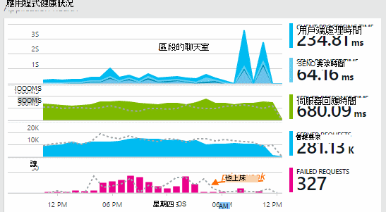

分割某些圖表︰ 圖表的任何點的總高度是顯示指標的總和。 依預設圖例顯示的最大的數量。

虛線顯示度量的值先前一週。

## 時間範圍

您可以變更圖表或方格上任何刀所涵蓋的時間範圍。

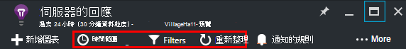

如果您預期還未顯示一些資料，請按一下 [重新整理]。 圖表間隔重新整理本身，但間隔很長的較大的時間範圍。 在發行模式中，可能需要時要經過分析管線到圖表的資料。

若要拉近顯示的圖表，拖曳該︰

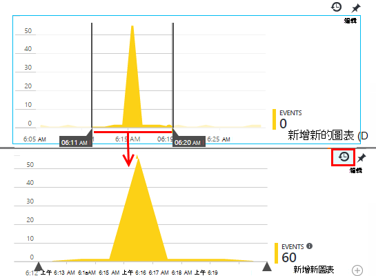

按一下 [復原縮放] 按鈕，將它還原。

## 資料粒度和點的值

將游標移圖表以顯示值的指標點。

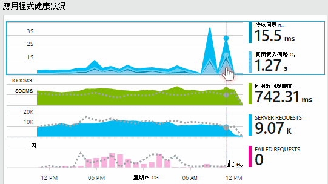

特定時間點公制的值會彙總落在上一個範例間隔。 

取樣間隔或 「 資料粒度 」 會顯示在頂端刀。 

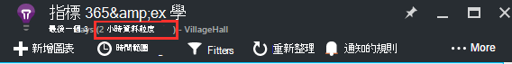

您可以調整時間範圍刀的資料粒度︰

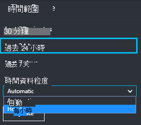

使用資料粒度取決於您所選取的時間範圍。 明確的資料粒度的時間範圍內的 「 自動 」 資料粒度的替代方案。 

## 指標總管

按一下以查看一組更詳細的相關的圖表和方格概觀刀任何圖表。 您可以編輯這些圖表和方格聚焦於您感興趣的詳細資料。

或您只可以按一下標頭的概觀刀指標檔案總管] 按鈕。

例如，按一下 [透過 web 應用程式無法要求圖表︰

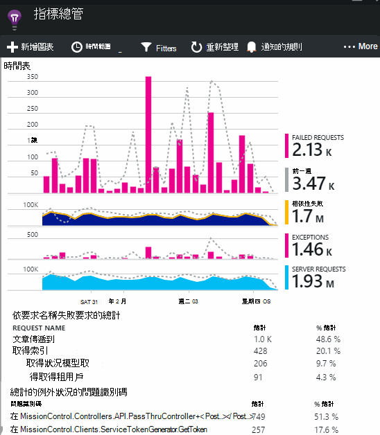

## 將數字有何意義？

預設旁的圖例通常會顯示的圖表內的彙總的值。 如果您將游標停留在圖表，其會顯示點。

在圖表上的每個資料點會收到先前取樣間隔或 「 資料粒度 」 中的資料值的彙總。 資料粒度刀，頂端會顯示，並會因整個圖表的時幅。

可以彙總指標，以不同方式︰ 

 * **加總**加總收到取樣間隔或的圖表上的所有資料點的值。
 * **平均**除以 Sum 接收的間隔內的資料點數目。
 * **唯一**計數適用於使用者與帳戶的數量。 取樣間隔或的圖表內，圖會顯示在該時間中看到不同的使用者數目。

您可以變更彙總方法︰

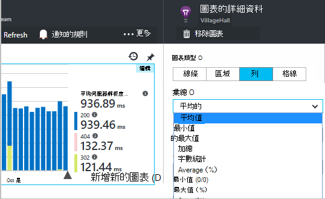

當您建立新的圖表或所有的指標會取消選取，則會顯示每個公制預設的方法︰

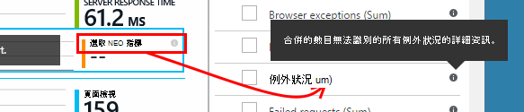

## 編輯圖表和方格

若要新增圖表至刀︰

![在 [度量總管] 中，選擇 [新增圖表](./media/app-insights-metrics-explorer/04-add.png)

選取 [**編輯**現有或新增圖上編輯其會顯示︰

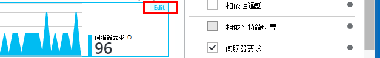

您可以在圖表上，顯示多個度量，雖然可以一起顯示的組合的限制。 一旦您選擇一個公制，已停用的其他部分。 

如果您編碼[自訂指標][track]到您的應用程式 （TrackMetric 和 TrackEvent 通話） 就會列在此處。

## 分割您的資料

您可以度量單位，以分割屬性-，例如比較在不同作業系統使用的用戶端上的網頁檢視。 

選取圖表或方格切換群組上，選擇 [群組依據的屬性︰

![選取群組上，然後設定] 選取屬性群組依據](./media/app-insights-metrics-explorer/15-segment.png)

> [AZURE.NOTE] 當您使用分組時，[區域] 及 [橫條圖類型會提供堆疊的顯示。 這是適當的彙總的方法是加總的位置。 但其中彙總類型是平均值，選擇線條或格線顯示類型。 

如果您編碼[自訂指標][track]到您的應用程式包含屬性值，您就可以在清單中選取的屬性。

為圖表太小區段的資料？ 調整高度︰

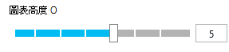

## 篩選資料

若要查看只將選取的屬性值的指標︰

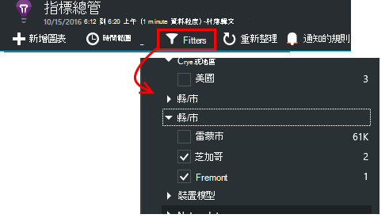

如果您沒有選取任何特定屬性的值，則選取所有的相同︰ 有沒有篩選器的屬性。

請注意的每個屬性值同時事件的計數。 當您選取一個屬性的值時，則會調整計算同時其他屬性值。

篩選會套用到刀上的所有圖表。 若要使用不同的篩選套用至不同的圖表，請建立並儲存不同的指標刀。 如果您想，您可以讓您可以看到他們彼此固定至儀表板，從不同的刀圖表。

### 移除傀儡和 web 測試流量

使用篩選**實數或綜合流量**，並核取 [**實數**。

您也可以篩選**綜合流量的來源**。

### 若要新增內容至篩選清單

您想要篩選遙測自己所選擇的類別？ 例如，劃分成不同類別，使用者的是不是，且您希望區段，這些類別的資料。

[建立您自己的屬性](app-insights-api-custom-events-metrics.md#properties)。 將它會出現在所有遙測-包括以不同的 SDK 模組傳送標準遙測[遙測初始設定](app-insights-api-custom-events-metrics.md#telemetry-initializers)在進行設定。

## 編輯圖表類型

請注意，您可以格線與圖形之間切換︰

![選取 [格線] 或 [的圖表，然後選擇 [圖表類型](./media/app-insights-metrics-explorer/16-chart-grid.png)

## 儲存您的指標刀

當您建立圖表時，請將其儲存為最愛項目。 如果您使用的組織帳戶，您可以選擇是否要與其他小組成員共用。

![選擇 [我的最愛]](./media/app-insights-metrics-explorer/21-favorite-save.png)

若要查看，**請移至概觀刀**刀並開啟 [我的最愛]:

![在概觀刀中，選擇 [我的最愛]](./media/app-insights-metrics-explorer/22-favorite-get.png)

如果您儲存時，您可以選擇相對的時間範圍，就會更新刀，使用最新的度量。 如果您選擇絕對的時間範圍，隨即會在每次時顯示相同的資料。

## 重設刀

如果您編輯刀，但接著您想要返回原始儲存設定，只要按一下 [重設。

![在 [頂端的 [公制檔案總管] 按鈕](./media/app-insights-metrics-explorer/17-reset.png)

## 關閉監視的即時指標串流︰ 立即指標

即時指標串流顯示您的應用程式指標向右在此一刻近期的即時延遲，1 的第二個。 您發佈新組建，而且想要確認一切運作正常，或調查即時事件時，這是非常有用。

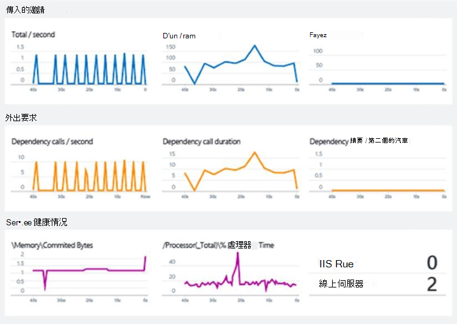

不同指標總管] 中，於即時指標資料流顯示固定的指標。 只要在圖表上，並就會被捨棄僅適用於仍然存在的資料。 

即時指標資料流中皆可取得應用程式的深入見解 SDK ASP.NET 版本 2.1.0 或更新版本。

## 設定通知

若要以異常的值的任何公制的電子郵件通知，新增提醒。 您可以選擇 [傳送電子郵件帳戶管理員或特定的電子郵件地址。

![在 [指標總管] 中，選擇 [提醒的規則，新增提醒](./media/app-insights-metrics-explorer/appinsights-413setMetricAlert.png)

[深入瞭解通知][alerts]。

## 匯出至 Excel

您可以匯出至 Excel 檔案公制檔案總管中顯示的公制資料。 匯出的資料包含所有的圖表和表格中的入口網站中的資料。 

![在 [指標總管] 中，選擇 [提醒的規則，新增提醒](./media/app-insights-metrics-explorer/31-export.png)

每個圖表或表格的資料匯出至 Excel 檔案中的個別工作表。

您看到的內容會匯出。 如果您想要變更的匯出的資料範圍，請變更的時間範圍或篩選。 如果是表格，如果有顯示 [**載入更多**] 命令，您可以按一下它，再按一下 [匯出]，匯出的詳細資料。

*在簡報中匯出僅適用於 Internet Explorer 和 Chrome 運作。我們正在新增的其他瀏覽器支援。*

## 連續的匯出

如果您想要持續匯出，使您可以從外部處理的資料，請考慮使用 [[接續本頁匯出](app-insights-export-telemetry.md)。

### Power BI

如果您想要更豐富的資料檢視，您可以[匯出至 Power BI](http://blogs.msdn.com/b/powerbi/archive/2015/11/04/explore-your-application-insights-data-with-power-bi.aspx)。

## 分析

[分析](app-insights-analytics.md)來分析中使用強大的查詢語言您遙測更多功能方法。 如果您想要合併或計算結果來自指標，或執行 deph 中探索您的應用程式最近效能，請使用它。 相反地，如果您想要自動重新整理]，在儀表板和通知的圖表時，才能使用指標檔案總管。

## 疑難排解

*看不到任何資料圖形。*

* 篩選會套用到刀上的所有圖表。 請確定，而您將焦點放在一個圖表上，您未設定排除在另一個上的所有資料的篩選。 

    如果您想要在不同的圖表上設定不同的篩選、 在不同的刀中建立，請將其儲存為不同的 [我的最愛]。 如果您想，您可以至儀表板固定這些內容，讓您可以看到他們彼此。

* 如果您不定義在公制屬性群組圖表，就會直接在圖表上。 請嘗試清除 「 群組依據]，或選擇不同的群組屬性。
* 效能資料 (CPU、 IO rate，依此類推) 可用於 Java web 服務、 Windows 桌面應用程式、 [IIS web 應用程式與服務，如果您安裝狀態監視器](app-insights-monitor-performance-live-website-now.md)，和[Azure Cloud Services](app-insights-azure.md)。 並未提供 Azure 網站。

## 後續步驟

* [監視應用程式的深入見解的使用的方式](app-insights-overview-usage.md)
* [使用搜尋診斷](app-insights-diagnostic-search.md)

<!--Link references-->

[alerts]: app-insights-alerts.md
[start]: app-insights-overview.md
[track]: app-insights-api-custom-events-metrics.md

 