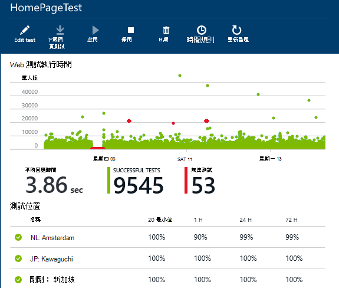
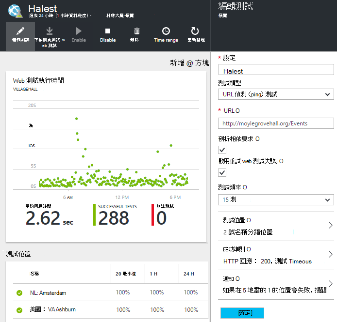

<properties 
    pageTitle="應用程式的深入見解可用性測試移轉 Azure 端點" 
    description="將應用程式的深入見解移轉傳統 Azure 端點監控測試 2016 年 10 月 31 日可用性測試。"
    services="application-insights" 
    documentationCenter=""
    authors="soubhagyadash" 
    manager="douge"/>

<tags 
    ms.service="application-insights" 
    ms.workload="tbd" 
    ms.tgt_pltfrm="ibiza" 
    ms.devlang="na" 
    ms.topic="article" 
    ms.date="07/25/2016" 
    ms.author="awills"/>
 
# 從 Azure 端點監控應用程式的深入見解可用性測試以移動

您是否使用[端點監控](https://blogs.msdn.microsoft.com/mast/2013/03/03/windows-azure-portal-update-configure-web-endpoint-status-monitoring-preview/)您 Azure 應用程式？ *2016 年 10 月 31 日*，我們會以新和功能更強大的[可用性測試](app-insights-monitor-web-app-availability.md)取代它們。 我們已建立新測試，部分雖然它們直到 2016 年 10 月 31 日停用。 

您可以編輯的新測試，並執行切換自己如果您想要。 您可以找到這些[Azure 入口網站](https://portal.azure.com)中的預設-ApplicationInsights-CentralUS 資源群組。

## 可用性測試是什麼？

可用性測試藉由傳送 HTTP 要求其 （單一偵測 （ping） 測試或 Visual Studio web 測試） 到 16 位置從全球是持續會檢查有任何網站或服務所設定的 Azure 及執行的功能。 

在[傳統 Azure 入口網站](https://manage.windowsazure.com)，這些測試端點監控呼叫。 更多有限範圍。 新的可用性測試是獲得超乎改進計畫︰

* 最多 10 個的 Visual Studio web 測試或每個應用程式的深入見解資源的偵測 （ping） 測試。 
* 全球測試要求傳送給您的 web 應用程式到 16 位置。 測試成功準則的較大的控制。 
* 測試任何網站或服務-不只是 Azure web 應用程式。
* 測試重試︰ 減少由於暫時網路問題，因此誤判通知。 
* Webhooks 會收到通知的 HTTP 文章通知。

進一步瞭解[以下可用性測試](app-insights-monitor-web-app-availability.md)。

可用性測試屬於[Visual Studio 應用程式的觀點](app-insights-overview.md)，這是可延伸分析服務的任何 web 應用程式。

## 因此，有什麼新鮮事我端點測試嗎？

* 我們已複製監控測試，以新的應用程式的深入見解可用性測試您結束點。
* 新的可用性測試目前已停用，並舊的端點測試正在執行。
* 警告規則*尚未移轉*]。 新的測試最初已設定預設的規則︰
 * 1 個以上的位置 5 分鐘數報告失敗時，觸發程序。
 * 訂閱管理員傳送電子郵件。

在[Azure 入口網站](https://portal.azure.com)，您可以尋找 「 預設-ApplicationInsights-CentralUS 」 資源群組的移轉的測試。 前置字元的測試名稱 「 Migrated-」。 

## 我需要做什麼？

* 如果我們因故未接移轉您的測試，皆可[輕鬆地設定](app-insights-monitor-web-app-availability.md)新的可用性測試。

### 選項答︰ 執行任何動作。 讓我們。

**在 2016 年 10 月 31 日，**我們將會︰

* 停用的舊的端點測試。
* 啟用移轉的可用性測試。

### 選項 b︰ 您管理及/或讓新的測試。

* 檢閱及編輯新[Azure 入口網站](https://portal.azure.com)中的新可用性測試。 
 * 檢閱引動程序準則
 * 檢閱的電子郵件收件者
* 啟用新測試
* 我們將會停用舊版端點監控測試 2016 年 10 月 31 日 

### 取出的選項 c︰ 選擇加入

如果您不想要使用可用性測試，您可以[Azure 入口網站](https://portal.azure.com)中將其刪除。 此外，還有通知電子郵件底部的 [取消訂閱] 連結。

我們仍會刪除舊的端點測試上 2016 年 10 月 31 日。 

## 如何編輯新測試？

[Azure 入口網站](https://portal.azure.com)登入並尋找 「 Migrated-' web 測試︰ 

![選擇 [資源群組]、 [預設 ApplicationInsights CentralUS，以及 [開啟 「 移轉 」 的測試。](./media/app-insights-migrate-azure-endpoint-tests/20.png)

編輯及/或讓測試︰

## 這是為什麼呢？

更好的服務。 舊的端點服務已更窄。 您可以從 Azure VM 或 web 應用程式上的 3 個地理位置的簡單偵測 （ping） 測試提供兩個 Url。 16 的位置，最，執行多個步驟 web 測試新測試，而且您可以指定一個應用程式的最多 10 個測試。 您可以測試任何 URL-它不一定非得是 Azure 的網站。

從 web app 或您要測試的 VM 分別設定新的測試。 

我們要移轉的測試，以確保您繼續可控制時使用新的入口網站。 

## 什麼是應用程式的深入見解？

新的可用性測試是[Visual Studio 應用程式獲得深入見解](app-insights-overview.md)的一部分。 以下是[2 分鐘視訊](http://go.microsoft.com/fwlink/?LinkID=733921)。

## 我正在支付的新測試嗎？

移轉的測試已設定應用程式的深入見解資源中的預設免費的方案中。 這個選項可讓最多 5 百萬個資料點的集合。 輕鬆地說明您測試將目前使用的資料量。 

當然，如果您喜歡應用程式的深入見解和建立多個可用性測試，或採用多個其效能監視和診斷功能，您會產生更多資料點。  不過，結果只會可能叫用的免費的計劃的配額。 除非您選擇在 [標準] 或 [進階版方案，就不會收到帳單。 

[深入瞭解應用程式的深入見解價格和監視配額](app-insights-pricing.md)。 

## 什麼是並不會移轉嗎？

保留從舊端點測試︰

* 若要測試的端點 URL。
* 送出要求的地理位置。
* 測試 frequency 會保持 5 分鐘。
* 測試逾時仍會保留 30 秒。 

不會移轉︰

* 通知的觸發程序規則。 我們已設定引動程序 1 位置 5 分鐘數報告失敗時該規則。
* 通知收件者。 訂閱的擁有者及共同擁有者，便會傳送通知電子郵件。 

## 如何尋找新的測試？

您可以編輯任何新測試現在要。 登入[Azure 入口網站](https://portal.azure.com)，開啟**資源群組**並選取**預設-ApplicationInsights-CentralUS**。 在該群組，您可以找到新的 web 測試。 [瞭解新的可用性測試](app-insights-monitor-web-app-availability.md)。

請注意，會從這個地址傳送新的通知電子郵件︰ 應用程式的深入見解通知(ai-noreply@microsoft.com)

## 如果我不做任何動作，會發生什麼情況？

將會套用的選項。 我們會啟用移轉的測試，並設定預設提醒規則，上面所述。 您必須新增任何自訂通知規則，如上所述的收件者。 我們會停用舊版端點監控測試。 

## 位置在此提供意見反應？ 

感謝您的意見反應。 請[以電子郵件傳送給我們](mailto:vsai@microsoft.com)。 

