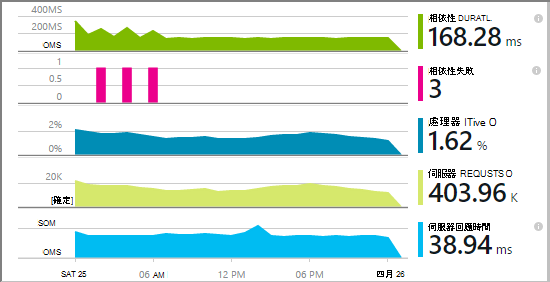
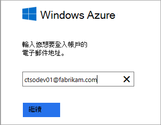
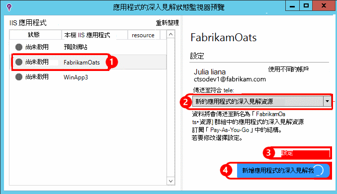
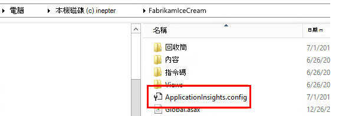
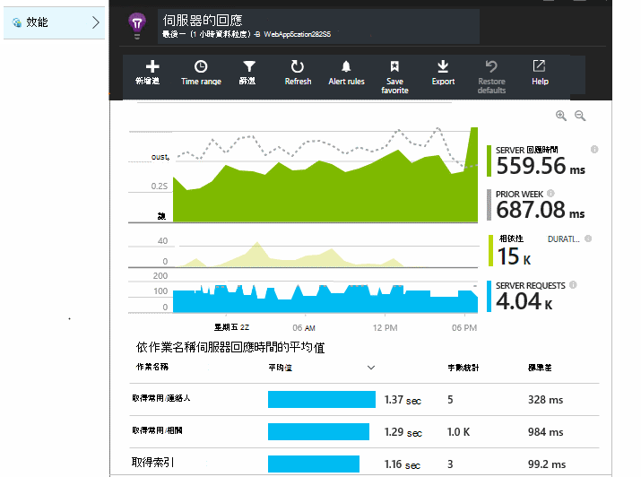
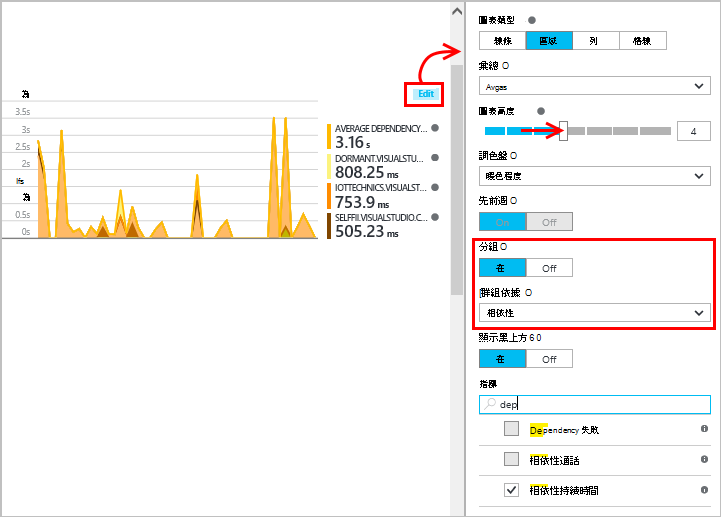
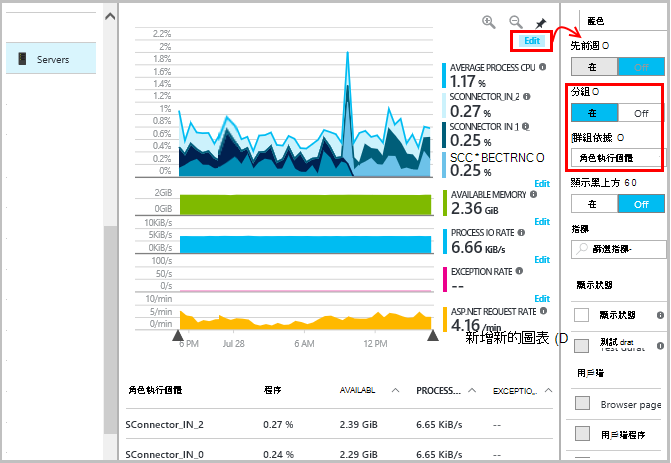
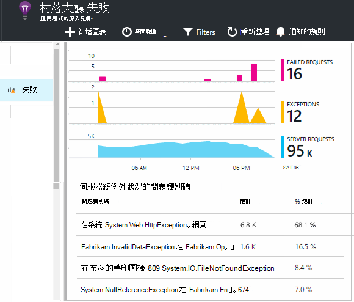
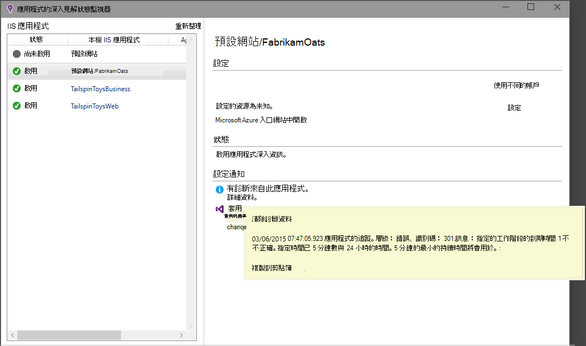

<properties
    pageTitle="診斷執行 IIS 網站上的效能問題 |Microsoft Azure"
    description="監控網站的效能，而不重新部署。 使用獨立或應用程式的深入見解 SDK，以取得相依性遙測。"
    services="application-insights"
    documentationCenter=".net"
    authors="alancameronwills"
    manager="douge"/>

<tags
    ms.service="application-insights"
    ms.workload="tbd"
    ms.tgt_pltfrm="ibiza"
    ms.devlang="na"
    ms.topic="get-started-article"
    ms.date="10/24/2016"
    ms.author="awills"/>

# 在執行階段與應用程式的深入見解樂器 web 應用程式

*應用程式的深入見解位於預覽。*

您可以追蹤記錄 Visual Studio 應用程式深入見解即時 web 應用程式，而不需要修改，或重新部署您的程式碼。 在您的應用程式中會裝載於內部部署 IIS 伺服器，您可以安裝狀態監視器;或者，如果他們是 Azure web 應用程式，或在 Azure VM 中執行，您可以安裝應用程式的深入見解副檔名。 （也有相關操作[live J2EE web 應用程式](app-insights-java-live.md)和[Azure 雲端服務](app-insights-cloudservices.md)的個別文件。）

您可以套用.NET web 應用程式的應用程式的深入見解的三個路由選擇︰

* **建立時間︰**[新增應用程式的深入見解 SDK][greenbrown]至 web 應用程式碼。 
* **執行階段︰**追蹤記錄在伺服器上，web 應用程式，如下所述，而不重新建立及部署程式碼。
* **兩者︰**建立 SDK 到 web 應用程式碼，並也可以套用執行階段副檔名。 取得最佳的兩個選項。 

以下是您收到的每個傳送摘要︰

||建立時間|執行的階段|
|---|---|---|
|要求及例外狀況|[是]|[是]|
|[更詳細的例外狀況](app-insights-asp-net-exceptions.md)||[是]|
|[相依性診斷程式](app-insights-asp-net-dependencies.md)|.Net 4.6 +|[是]|
|[系統效能計數器](app-insights-performance-counters.md)||IIS 或 Azure 雲端服務，不 Azure web 應用程式|
|[自訂遙測 API][api]|[是]||
|[追蹤記錄整合](app-insights-asp-net-trace-logs.md)|[是]||
|[頁面檢視與使用者資料](app-insights-javascript.md)|[是]||
|不需要重建程式碼|無||

## 追蹤您的 web app 記錄在執行階段

您需要[Microsoft Azure](http://azure.com)訂閱。

### 如果您的應用程式是 Azure web 應用程式或雲端服務

* 選取 [應用程式的 [控制台] 中 Azure 上的 [應用程式深入資訊]。 

    [進一步瞭解](app-insights-azure.md)。

### 如果您 IIS 伺服器上裝載您的應用程式

1. 在您的 IIS 網頁伺服器上登入系統管理員認證。
2. 下載並執行[狀態監視器安裝程式](http://go.microsoft.com/fwlink/?LinkId=506648)。
4. 在安裝精靈中，登入 Microsoft Azure。

    

    *連接錯誤？請參閱[疑難排解](#troubleshooting)。*

5. 選擇已安裝的 web 應用程式或您想要監視的網站，然後設定您要的應用程式的深入見解入口網站中查看結果的資源。

    

    一般而言，在您選擇設定新的資源與[資源群組][roles]。

    如果您已設定好[web 測試]，否則使用現有的資源[availability]為您的網站或[網頁用戶端監視][client]。

6. 重新啟動 IIS。

    ![選擇 [重新啟動頂端的對話方塊]。](./media/app-insights-monitor-performance-live-website-now/appinsights-036-restart.png)

    您的 web 服務會短期受到打擾。

6. 請注意 ApplicationInsights.config 具有已插入您想要監視的 web 應用程式。

    

   還有 web.config 的一些變更。

#### 想要稍後 （重新） 設定？

完成精靈後，您可以在每當您想要重新設定代理程式。 您也可以使用此如果您有安裝代理程式，但沒有初始設定的一些問題。

![按一下工作列上的 [應用程式深入資訊] 圖示](./media/app-insights-monitor-performance-live-website-now/appinsights-033-aicRunning.png)

## 檢視效能遙測

登入[Azure 入口網站](https://portal.azure.com)，瀏覽應用程式的深入見解並開啟您建立的資源。

![選擇 [瀏覽]，應用程式的深入見解，然後選取您的應用程式](./media/app-insights-monitor-performance-live-website-now/appinsights-08openApp.png)

開啟效能刀，即可邀請、 回應時間、 相依性及其他資料。

按一下任何圖表，以開啟詳細的檢視。

您可以[編輯、 重新排列儲存](app-insights-metrics-explorer.md)，並將其釘選圖表或整個刀至[儀表板](app-insights-dashboards.md)。

## 相依性

相依性工期圖表會顯示您應用程式的來電至外部元件，例如資料庫、 REST Api 或 Azure blob 儲存體所花的時間。

若要不同的相依性的電話區段圖表︰ 編輯圖表與開啟 [群組]，然後群組相依性、 相依性類型或相依性的效能。

## 效能計數器 

（不是用於 Azure web 應用程式。）按一下 [若要查看的伺服器效能計數器，例如 CPU 進駐和記憶體使用量的圖表概觀刀上的 [伺服器]。

如果您有幾個伺服器執行個體，您可能會想要編輯群組依據角色執行個體的圖表。

您也可以[變更的效能計數器 SDK 的報告](app-insights-configuration-with-applicationinsights-config.md#nuget-package-3)。 

## 例外狀況

您可以向下 （在過去七天） 的特定例外狀況切入，並取得堆疊追蹤與內容的資料。

## 範例

如果您的應用程式傳送大量資料，您使用的應用程式的深入見解 SDK ASP.NET 版本 2.0.0-beta3 或更新版本，調整取樣功能可能運作，然後傳送您遙測的百分比。 [進一步瞭解範例。](app-insights-sampling.md)

## 疑難排解

### 連接錯誤

您需要[一些外的連接埠](app-insights-ip-addresses.md#outgoing-ports)在開啟您的伺服器防火牆，以允許狀態監視器的工作。

### 沒有遙測嗎？

  * 您可以使用您的網站，來產生一些資料。
  * 請稍候幾分鐘，讓資料送達，然後按一下 [**重新整理**。
  * 開啟 [診斷搜尋 （[搜尋] 方塊），以查看個別的事件。 出現在圖表中的彙總資料之前，通常是在診斷搜尋中顯示事件。
  * 開啟狀態監視器，然後選取左窗格上的應用程式。 檢查是否有任何此應用程式，在 [設定通知] 區段中的診斷郵件︰

  

  * 請確定您的伺服器防火牆允許在上面所列的連接埠的外寄流量。
  * 在伺服器上，如果您看到有關 「 沒有足夠的權限 」 的訊息，請嘗試下列動作︰
    * 在 IIS 管理員中，選取應用程式集區，開啟 [**進階設定**]，在**處理程序模型**記下身分識別。
    * 在電腦管理 [控制台] 中，新增此身分識別效能監視使用者群組。
  * 如果您有 MMA/是 SCOM 安裝在您的伺服器時，會發生衝突某些版本。 解除安裝都是 SCOM 和狀態監視器，然後重新安裝最新版本。
  * 請參閱[疑難排解][qna]。

## 系統需求

在伺服器上的應用程式的深入見解狀態監視器 OS 支援︰

- Windows Server 2008
- Windows Server 2008 R2
- Windows Server 2012
- Windows server 2012 R2

使用最新的預存程序、.NET Framework 4.0 及 4.5

在用戶端 Windows 7，8 和 8.1 中，再次使用.NET Framework 4.0 及 4.5

IIS 支援︰ IIS 7 7.5、 8、 8.5 （IIS 是必要）

## 使用 PowerShell 自動化

您可以啟動和停止 [監視使用 PowerShell IIS 伺服器上。

第一次匯入應用程式的深入見解模組︰

`Import-Module 'C:\Program Files\Microsoft Application Insights\Status Monitor\PowerShell\Microsoft.Diagnostics.Agent.StatusMonitor.PowerShell.dll'`

了解正在監視哪些應用程式︰

`Get-ApplicationInsightsMonitoringStatus [-Name appName]`

* `-Name`（選用）Web 應用程式的名稱。
* 顯示此 IIS 伺服器應用程式的深入見解監控狀態的每一個 web 應用程式 （或具名的應用程式）。

* 傳回`ApplicationInsightsApplication`每一個應用程式︰
 * `SdkState==EnabledAfterDeployment`︰ 應用程式監視，，和已調整執行階段中，[狀態監視器] 工具中，或藉由`Start-ApplicationInsightsMonitoring`。
 * `SdkState==Disabled`︰ 應用程式不被控制的應用程式的深入見解。 已不檢測，或是執行階段已停用監視狀態監視器工具或`Stop-ApplicationInsightsMonitoring`。
 * `SdkState==EnabledByCodeInstrumentation`︰ 藉由新增 SDK 原始程式碼，已控制應用程式。 無法更新或停止其 SDK。
 * `SdkVersion`用於監控此應用程式中顯示的版本。
 * `LatestAvailableSdkVersion`NuGet 圖庫上的 [顯示目前可用的版本。 若要對此版本升級應用程式，請使用`Update-ApplicationInsightsMonitoring`。

`Start-ApplicationInsightsMonitoring -Name appName -InstrumentationKey 00000000-000-000-000-0000000`

* `-Name`IIS 中的應用程式的名稱
* `-InstrumentationKey`您要顯示結果的應用程式的深入見解資源 ikey。

* 這個指令程式只會影響應用程式不已控制-，也就是 SdkState = = NotInstrumented。

    Cmdlet 並不會影響應用程式的已檢測，藉由新增 SDK 的程式碼，建立時間或上一個使用這個指令程式的執行時間。

    用來追蹤記錄應用程式的 SDK 版本是最近下載到伺服器的版本。

    若要下載最新版本，請使用更新 ApplicationInsightsVersion。

* 傳回`ApplicationInsightsApplication`成功。 如果失敗，就會以 stderr 記錄追蹤。

    
          Name                      : Default Web Site/WebApp1
          InstrumentationKey        : 00000000-0000-0000-0000-000000000000
          ProfilerState             : ApplicationInsights
          SdkState                  : EnabledAfterDeployment
          SdkVersion                : 1.2.1
          LatestAvailableSdkVersion : 1.2.3

`Stop-ApplicationInsightsMonitoring [-Name appName | -All]`

* `-Name`IIS 中的應用程式的名稱
* `-All`停駐點的監控此 IIS 伺服器中的所有應用程式`SdkState==EnabledAfterDeployment`

* 停止監視指定的應用程式，並移除儀器。 它只適用於已檢測的應用程式在執行階段使用狀態監控工具或開始 ApplicationInsightsApplication。 (`SdkState==EnabledAfterDeployment`)

* 傳回 ApplicationInsightsApplication。

`Update-ApplicationInsightsMonitoring -Name appName [-InstrumentationKey "0000000-0000-000-000-0000"`]

* `-Name`︰ IIS 中的 web 應用程式名稱。
* `-InstrumentationKey`（選擇性）。使用此選項變更應用程式的遙測會傳送到的資源。
* 這個指令程式︰
 * 升級至新版的 SDK 命名應用程式最近下載到這台電腦。 (僅適用於`SdkState==EnabledAfterDeployment`)
 * 如果您提供儀器鍵，命名的應用程式會重新傳送給資源的遙測，使用該金鑰的設定。 (如果有效`SdkState != Disabled`)

`Update-ApplicationInsightsVersion`

* 下載最新的應用程式的深入見解 SDK 至伺服器。

## 後續步驟

* [建立 web 測試][ availability] ，請確定您的網站保持即時。
* [搜尋事件與記錄][diagnostic]協助診斷問題。
* [新增 web 用戶端遙測][usage]請參閱從網頁程式碼的例外狀況，並可讓您插入追蹤呼叫。
* [將應用程式的深入見解 SDK 新增至您的 web 服務代碼][ greenbrown] ，好讓您可以插入追蹤和記錄通話伺服器程式碼。

<!--Link references-->

[api]: app-insights-api-custom-events-metrics.md
[availability]: app-insights-monitor-web-app-availability.md
[client]: app-insights-javascript.md
[diagnostic]: app-insights-diagnostic-search.md
[greenbrown]: app-insights-asp-net.md
[qna]: app-insights-troubleshoot-faq.md
[roles]: app-insights-resources-roles-access-control.md
[usage]: app-insights-web-track-usage.md
