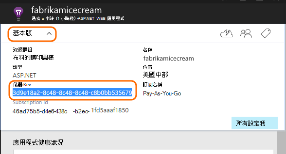

<properties
    pageTitle="新增應用程式的深入見解 SDK 監控 Node.js 應用程式 |Microsoft Azure"
    description="分析使用狀況、 可用性和內部部署或 Microsoft Azure web 應用程式的應用程式的深入見解的效能。"
    services="application-insights"
    documentationCenter=""
    authors="alancameronwills"
    manager="douge"/>

<tags
    ms.service="application-insights"
    ms.workload="tbd"
    ms.tgt_pltfrm="ibiza"
    ms.devlang="na"
    ms.topic="get-started-article"
    ms.date="08/30/2016"
    ms.author="awills"/>


# <a name="add-application-insights-sdk-to-monitor-your-nodejs-app"></a>新增應用程式的深入見解 SDK 監控 Node.js 應用程式

*應用程式的深入見解位於預覽。*

[Visual Studio 應用程式獲得深入見解](app-insights-overview.md)監視即時應用程式，以協助您[偵測並診斷效能問題和例外狀況](app-insights-detect-triage-diagnose.md)，請與[探索您的應用程式的使用方式](app-insights-overview-usage.md)。 這也適用於 Azure Vm，或您自己的內部部署 IIS 伺服器上裝載的應用程式，以及 Azure web 應用程式。


SDK 提供自動集合內送 HTTP 要求工資率和回覆、 效能計數器 （CPU、 記憶體，每秒要求數量） 和處理的例外狀況。 此外，您可以新增自訂的來電至追蹤相依性、 指標或其他事件。


#### <a name="before-you-start"></a>在您開始之前

您需要︰

* Visual Studio 2013 或更新版本。 稍後會更好。
* [Microsoft Azure](http://azure.com)訂閱。 如果您的小組或組織的 Azure 訂閱，可以新增您，使用您的[Microsoft 帳戶](http://live.com)。

## <a name="add"></a>建立應用程式的深入見解資源

[Azure 入口網站]登入[portal]，並建立新的應用程式的深入見解資源。 [資源][roles]是 Azure 中的 [服務的執行個體。 這項資源是分析及呈現您遙測從您的應用程式。


您可以選擇其他應用程式類型。 選擇應用程式類型設定資源與內容的預設內容[指標總管]]中看到[metrics]。

#### <a name="copy-the-instrumentation-key"></a>複製儀器索引鍵

索引鍵識別資源，並便會將其安裝推出 sdk，將資源的資料。




## <a name="sdk"></a>在您的應用程式安裝 SDK

```
npm install applicationinsights --save
```

## <a name="usage"></a>使用方式

這樣會啟用要求的監控、 追蹤，處理的例外狀況和系統效能監視 （CPU/記憶體/每秒要求數量）。

```javascript

var appInsights = require("applicationinsights");
appInsights.setup("<instrumentation_key>").start();
```

儀器鍵也可以設定環境變數 APPINSIGHTS_INSTRUMENTATIONKEY 中。 如果這麼做，沒有引數時，需要呼叫`appInsights.setup()`或`appInsights.getClient()`。

您可以嘗試 SDK，而不傳送遙測︰ 設定儀器鍵空字串。


## <a name="run"></a>執行您的專案

執行您的應用程式，並試試看︰ 開啟產生一些遙測不同的頁面。


## <a name="monitor"></a>檢視您遙測

返回 [ [Azure 入口網站](https://portal.azure.com)，並瀏覽至您的應用程式的深入見解的資源。


尋找 [概觀] 頁面中的資料。 首先，您會看到一或兩個點。 例如︰


按一下任何圖表，請參閱更詳細的指標。 [進一步瞭解指標。][perf]

#### <a name="no-data"></a>沒有資料？

* 使用應用程式，使其產生一些遙測開啟不同的頁面。
* 開啟 [[搜尋](app-insights-diagnostic-search.md)] 方塊中，以查看個別的事件。 有時需要事件稍微時取得指標管線較長的時間。
* 請稍候，然後按一下 [**重新整理**]。 圖表會定期更新本身，但是您可以手動重新整理如果您正在等待顯示一些資料。
* 請參閱[疑難排解][qna]。

## <a name="publish-your-app"></a>發佈您的應用程式

現在 IIS 或 Azure 部署應用程式，並觀看累積的資料。


#### <a name="no-data-after-you-publish-to-your-server"></a>沒有資料後的發佈至伺服器？

在您的伺服器防火牆開啟下列連接埠外寄流量的︰

+ `dc.services.visualstudio.com:443`
+ `f5.services.visualstudio.com:443`


#### <a name="trouble-on-your-build-server"></a>在您建立的伺服器上的時發生問題嗎？

請參閱[此疑難排解項目](app-insights-asp-net-troubleshoot-no-data.md#NuGetBuild)。


## <a name="customized-usage"></a>自訂的使用方式 

### <a name="disabling-auto-collection"></a>停用自動集合

```javascript
import appInsights = require("applicationinsights");
appInsights.setup("<instrumentation_key>")
    .setAutoCollectRequests(false)
    .setAutoCollectPerformance(false)
    .setAutoCollectExceptions(false)
    // no telemetry will be sent until .start() is called
    .start();
```

### <a name="custom-monitoring"></a>自訂監控

```javascript
import appInsights = require("applicationinsights");
var client = appInsights.getClient();

client.trackEvent("custom event", {customProperty: "custom property value"});
client.trackException(new Error("handled exceptions can be logged with this method"));
client.trackMetric("custom metric", 3);
client.trackTrace("trace message");
```

[深入瞭解遙測 API](app-insights-api-custom-events-metrics.md)。

### <a name="using-multiple-instrumentation-keys"></a>使用多個儀器索引鍵

```javascript
import appInsights = require("applicationinsights");

// configure auto-collection with one instrumentation key
appInsights.setup("<instrumentation_key>").start();

// get a client for another instrumentation key
var otherClient = appInsights.getClient("<other_instrumentation_key>");
otherClient.trackEvent("custom event");
```

## <a name="examples"></a>範例

### <a name="tracking-dependency"></a>追蹤相依性

```javascript
import appInsights = require("applicationinsights");
var client = appInsights.getClient();

var startTime = Date.now();
// execute dependency call
var endTime = Date.now();

var elapsedTime = endTime - startTime;
var success = true;
client.trackDependency("dependency name", "command name", elapsedTime, success);
```


### <a name="manual-request-tracking-of-all-get-requests"></a>手動要求追蹤所有的 「 取得 」 要求

```javascript
var http = require("http");
var appInsights = require("applicationinsights");
appInsights.setup("<instrumentation_key>")
    .setAutoCollectRequests(false) // disable auto-collection of requests for this example
    .start();

// assign common properties to all telemetry sent from the default client
appInsights.client.commonProperties = {
    environment: process.env.SOME_ENV_VARIABLE
};

// track a system startup event
appInsights.client.trackEvent("server start");

// create server
var port = process.env.port || 1337
var server = http.createServer(function (req, res) {
    // track all "GET" requests
    if(req.method === "GET") {
        appInsights.client.trackRequest(req, res);
    }

    res.writeHead(200, { "Content-Type": "text/plain" });
    res.end("Hello World\n");
}).listen(port);

// track startup time of the server as a custom metric
var start = +new Date;
server.on("listening", () => {
    var end = +new Date;
    var duration = end - start;
    appInsights.client.trackMetric("StartupTime", duration);
});
```

## <a name="next-steps"></a>後續步驟

* [監控您遙測在入口網站](app-insights-dashboards.md)
* [您遙測覆寫查詢分析](app-insights-analytics-tour.md)


<!--Link references-->

[knowUsers]: app-insights-overview-usage.md
[metrics]: app-insights-metrics-explorer.md
[perf]: app-insights-web-monitor-performance.md
[portal]: http://portal.azure.com/
[qna]: app-insights-troubleshoot-faq.md
[roles]: app-insights-resources-roles-access-control.md
