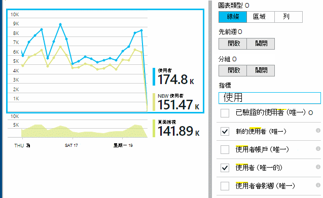

<properties
    pageTitle="使用應用程式的深入見解的使用狀況分析"
    description="使用應用程式的深入見解的使用狀況分析的概觀"
    services="application-insights"
    documentationCenter=""
    authors="alancameronwills"
    manager="douge"/>

<tags
    ms.service="application-insights"
    ms.workload="tbd"
    ms.tgt_pltfrm="ibiza"
    ms.devlang="multiple"
    ms.topic="article" 
    ms.date="04/08/2016"
    ms.author="awills"/>

# 使用應用程式的深入見解的使用狀況分析

瞭解使用者如何使用您的應用程式，可讓您著重，最重要的案例中開發工作，並取得其尋找更容易或更多難達成目標的細節。

應用程式的深入見解可提供清楚的應用程式的使用狀況] 檢視，協助您改善您的使用者體驗，並符合您的業務目標。

應用程式的深入見解可搭配使用兩個獨立版本上的應用程式 （iOS，Android 和 Windows) 和 （裝載於.NET 或 J2EE） 的 web 應用程式。 

## 新增應用程式的深入見解至專案

若要開始，取得免費的[Microsoft Azure](https://azure.com)帳戶。 （之後的試用期，您可以繼續與服務的免費層）。

在[Azure 入口網站](https://portal.azure.com)中，建立應用程式的深入見解資源。 這是位置您會看到您的應用程式的相關的使用情況和效能的資料。

![在 [Azure，按一下 [新增]，[開發人員服務應用程式的深入見解](./media/app-insights-overview-usage/01-create.png)

**如果您的應用程式的裝置應用程式中，**新增應用程式的深入見解 SDK 至專案。 根據您的[IDE 與平台](app-insights-platforms.md)，而異的確切的程序。 For Windows 應用程式，只要以滑鼠右鍵按一下 [在 Visual Studio 專案，然後選擇 [新增應用程式的深入見解。 」

**如果是在 web 應用程式中，**開啟快速入門刀並取得程式碼片段之新增到您的網頁。 使用此程式碼片段將其重新發佈。

![開啟快速入門，然後按一下 [取得監控我網頁的程式碼]。 複製您主版頁面的指令碼。](./media/app-insights-overview-usage/02-monitor-web-page.png)

您也可以新增應用程式的深入見解您[ASP.NET](app-insights-asp-net.md)或[J2EE](app-insights-java-get-started.md)伺服器的程式碼以合併遙測從用戶端和伺服器。

### 執行您的專案，並查看第一個結果

您的專案偵錯模式中執行幾分鐘，然後移至[Azure 入口網站](https://portal.azure.com)，並瀏覽至您的專案中資源應用程式的深入見解。

![在 Azure，按一下 [瀏覽]，應用程式的深入見解，並選取您的專案](./media/app-insights-overview-usage/00-start.png)

發佈您的應用程式，以取得更多遙測並找出您的使用者使用您的應用程式的執行。

## 預設工作的狀況分析

按一下 [頁面檢視] 方塊，以查看使用方式的詳細資訊。

將游標暫留在上方，查看特定時間點計數圖形的空白部分。 否則，數字會顯示一段時間，例如 average、 總計或個別使用者的計數彙總的值。

在 web 應用程式中，使用者會使用 cookie 計算。 使用數種瀏覽器、 清除 cookie，或使用 [隱私權] 功能的人員列入計算數次。

30 閒置數分鐘後就會計算的 web 工作階段。 計算多個幾秒鐘暫停應用程式，在電話或其他裝置上的工作階段。

按一下任何圖表，請參閱更多詳細資料。 例如︰

（此範例會從網站，但是圖表看起來類似的裝置執行的應用程式）。

若要查看是否要變更項目上週與比較︰

比較兩個度量資訊，例如使用者和新的使用者︰

將資料分組 （區段），例如瀏覽器、 作業系統或縣/市的屬性︰

## 頁面的使用方式

按一下 [頁面] 檢視的並排顯示以取得您最常用的頁面的分析︰

上述範例是從遊戲網站。 從該我們立即看到︰

* 週尚未改良的使用方式。 也許我們應該考量搜尋引擎最佳化？
* 許多較少的人會看到遊戲頁面，於 [首頁] 頁面。 為什麼我們首頁不吸引他人播放遊戲？
* 「 Crossword 」 是最常用的遊戲。 我們應該優先順序及權授與新的想法那里改良項目。

## 自訂追蹤

例如，假設，而不是個別的網頁中實作每個遊戲，決定重構其所有到相同的單一頁面應用程式，與大部分的 Javascript 為編碼，在網頁上的功能。 這個選項可讓使用者遊戲與另一個，之間快速切換，或甚至在一頁上有數種遊戲。

但您仍希望每個遊戲開啟時，完全相同的方法為時它們是在另一個網頁上的應用程式觀點登入的次數。 簡單︰ 只要將遙測模組呼叫插入您要開啟新的 [頁面] 的記錄的 JavaScript:

    telemetryClient.trackPageView(game.Name);

## 自訂事件

您可以使用遙測多種方式來瞭解如何使用您的應用程式。 但不一定要混合郵件] 頁面檢視。 不過，使用自訂的事件。 您可以從裝置應用程式、 網頁或網頁伺服器傳送給他們程式︰

(JavaScript)

    telemetryClient.trackEvent("GameEnd");

(C#)

    var tc = new Microsoft.ApplicationInsights.TelemetryClient();
    tc.TrackEvent("GameEnd");

(VB)

    Dim tc = New Microsoft.ApplicationInsights.TelemetryClient()
    tc.TrackEvent("GameEnd")

最常見的自訂事件會列在概觀刀。

![在概觀刀中，往下捲動，按一下 [自訂事件]。](./media/app-insights-overview-usage/04-events.png)

按一下 [標頭的表格，若要查看總的數字的事件。 您可以在各種屬性，例如事件名稱來區段圖表︰

![選取顯示只要公制的圖表。 切換上的群組。 選擇 [屬性]。 並非所有內容都可供使用。](./media/app-insights-overview-usage/06-eventsSegment.png)

時刻表的特別有用的功能是您可以與其他的指標事件關聯的變更。 例如，有時當遊戲，您應該會看到已放棄的遊戲提升。 但已放棄的遊戲提升不成比例，您想要瞭解是否高負載導致使用者尋找無法接受報價的問題。

## 深入瞭解特定的事件

若要了解如何一般工作階段進入，您可能要聚焦於特定使用者工作階段包含特定類型的事件。

在此範例中，我們撰寫程式碼自訂事件 」 NoGame 」 稱為如果使用者沒有實際開始遊戲登出。 為什麼使用者執行的動作一樣？ 也許我們切入一些特定的項目時，我們會出現線索。

由上概觀刀的名稱，會列出收到從應用程式的自訂事件︰

按一下感興趣的事件，然後選取 [最近的特定項目︰

![在清單中摘要圖] 底下，按一下 [事件](./media/app-insights-overview-usage/08-searchEvents.png)

讓我們來看看所有遙測特定 NoGame 事件發生的工作階段。

沒有任何例外狀況，讓使用者不無法播放某些失敗。

我們可以篩選出所有類型的網頁檢視以外的遙測這個工作階段︰

然後，現在我們可以看到此使用者登入只是要檢查最新的分數。 也許我們應該考慮開發使用者本文，可讓您更容易執行這項作業。 （與特定本文發生時，我們應該實作自訂事件，報表）。

## 篩選、 搜尋及區段屬性的資料
您可以附加任意標記與數值的事件。

在用戶端 JavaScript

    appInsights.trackEvent("WinGame",
        // String properties:
        {Game: currentGame.name, Difficulty: currentGame.difficulty},
        // Numeric measurements:
        {Score: currentGame.score, Opponents: currentGame.opponentCount}
    );

C# 伺服器

    // Set up some properties:
    var properties = new Dictionary <string, string>
        {{"game", currentGame.Name}, {"difficulty", currentGame.Difficulty}};
    var measurements = new Dictionary <string, double>
        {{"Score", currentGame.Score}, {"Opponents", currentGame.OpponentCount}};

    // Send the event:
    telemetry.TrackEvent("WinGame", properties, measurements);

VB 伺服器

    ' Set up some properties:
    Dim properties = New Dictionary (Of String, String)
    properties.Add("game", currentGame.Name)
    properties.Add("difficulty", currentGame.Difficulty)

    Dim measurements = New Dictionary (Of String, Double)
    measurements.Add("Score", currentGame.Score)
    measurements.Add("Opponents", currentGame.OpponentCount)

    ' Send the event:
    telemetry.TrackEvent("WinGame", properties, measurements)

附加至網頁檢視的內容，以相同的方式︰

在用戶端 JavaScript

    appInsights.trackPageView("Win",
        {Game: currentGame.Name},
        {Score: currentGame.Score});

在診斷搜尋，請透過事件的個別項目，即可檢視的內容。

![事件清單中，開啟事件，然後按一下 [...] 若要查看更多的屬性](./media/app-insights-overview-usage/11-details.png)

您可以使用 [搜尋] 欄位來查看發生次數與特定屬性值。

![[搜尋] 欄位中輸入值](./media/app-insights-overview-usage/12-searchEvents.png)

## A |B 測試

如果您不知道哪些 variant 的功能會更成功，請在放開其中，讓每個存取不同的使用者。 測量的各個，成功，然後再移至整合的版本。

用這項技巧，您將不同的標籤附加所有遙測傳送的每個應用程式版本。 您可以在 [作用中的 TelemetryContext 中定義屬性來執行這項作業。 這些預設屬性會新增至每個遙測的郵件應用程式傳送-不只是您自訂的郵件，但也標準遙測。

在應用程式的深入見解入口網站，您會就能夠篩選條件與群組 （區段） 您在 [標籤]，以比較不同版本的資料。

C# 伺服器

    using Microsoft.ApplicationInsights.DataContracts;

    var context = new TelemetryContext();
    context.Properties["Game"] = currentGame.Name;
    var telemetry = new TelemetryClient(context);
    // Now all telemetry will automatically be sent with the context property:
    telemetry.TrackEvent("WinGame");

VB 伺服器

    Dim context = New TelemetryContext
    context.Properties("Game") = currentGame.Name
    Dim telemetry = New TelemetryClient(context)
    ' Now all telemetry will automatically be sent with the context property:
    telemetry.TrackEvent("WinGame")

個別遙測可覆寫預設值。

您可以設定通用初始設定，讓所有的新 TelemetryClients 自動使用您的內容。

    // Telemetry initializer class
    public class MyTelemetryInitializer : ITelemetryInitializer
    {
        public void Initialize (ITelemetry telemetry)
        {
            telemetry.Properties["AppVersion"] = "v2.1";
        }
    }

應用程式初始設定式 Global.asax.cs 例如︰

    protected void Application_Start()
    {
        // ...
        TelemetryConfiguration.Active.TelemetryInitializers
        .Add(new MyTelemetryInitializer());
    }

## 建立量值-瞭解

當您使用狀況分析時，其會變成整合式組件的開發週期-不只是您認為即將，以協助解決問題。 以下是一些秘訣︰

* 決定鍵公制的應用程式。 您的每位使用者越好，或是想要非常快樂使用者一小群嗎？ 您要最大化造訪 」 或 「 銷售嗎？
* 計劃以計算每個本文。 當草圖新使用者本文或功能或計劃以更新現有的圖示，永遠思考您將會如何測量成功的變更。 之前開始撰寫程式碼，提出 」 何種效果會這對我們指標，是否其運作方式嗎？ 應該我們追蹤任何新的事件？ 」
然後當然，即時功能時，請確定您查看分析，可在結果]。
* 索引鍵公制與其他指標。 例如，如果您將 「 我的最愛 」 功能，您想要知道頻率使用者新增 [我的最愛]。 但是，或許會提供更多感知道頻率回到其 [我的最愛]。 最重要的是執行客戶使用我的最愛最後購買更多的產品？
* 加納利測試。 設定讓您建立的新功能只有部分使用者能看到的功能切換參數。 若要查看新功能是否正在使用的您想像的方式，使用應用程式的深入見解。 進行調整，然後發行至更多的對象]。
* 與您的使用者 ！ 分析不夠，但互補維護良好的客戶的關聯。

## 深入瞭解

* [偵測、 分類和診斷當機和應用程式中的效能問題](app-insights-detect-triage-diagnose.md)
* [快速入門許多平台上的應用程式的深入見解](app-insights-detect-triage-diagnose.md)

## 視訊

> [AZURE.VIDEO usage-monitoring-application-insights]

 
