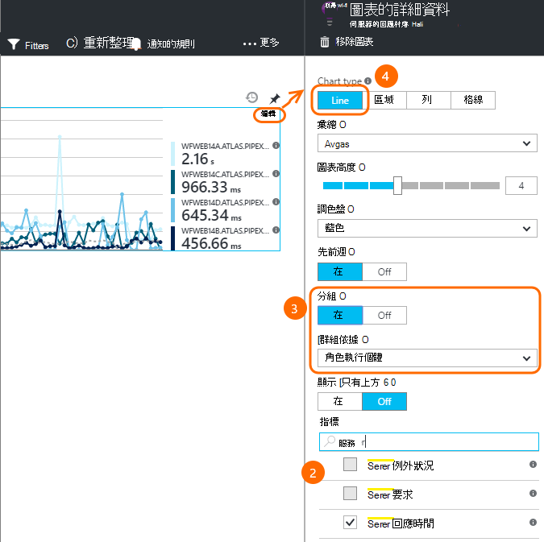

<properties 
    pageTitle="應用程式的深入見解教學課程 |Microsoft Azure" 
    description="追蹤使用狀況] 和 [即時 web 應用程式的效能。  偵測、 分類和診斷問題。 持續監視並改善成功，您的使用者。" 
    services="application-insights" 
    documentationCenter=""
    authors="alancameronwills" 
    manager="douge"/>

<tags 
    ms.service="application-insights" 
    ms.workload="tbd" 
    ms.tgt_pltfrm="ibiza" 
    ms.devlang="na" 
    ms.topic="article" 
    ms.date="10/15/2016" 
    ms.author="awills"/>
 
# 應用程式的深入見解的簡介

Visual Studio 應用程式獲得深入見解是監視即時 web 應用程式的可延伸分析服務。 您可以偵測診斷效能問題，並瞭解使用者是如何處理您的應用程式。 設計的開發人員，以協助您不斷地改善效能與合用性。 這也適用於應用程式在各種不同的平台包括.NET、 Node.js 和 J2EE，裝載於內部部署或雲端中。 

[看看簡介動畫](https://www.youtube.com/watch?v=fX2NtGrh-Y0)。

## 如何運作？

您安裝應用程式中的小型儀器套件，並設定 [在 Microsoft Azure 入口網站應用程式的深入見解資源。 儀器監視應用程式，並將遙測資料傳送至入口網站。 入口網站顯示統計圖表，並提供的功能強大的搜尋工具，可協助您診斷任何問題。

應用程式的深入見解有多個[標準儀器模組](app-insights-configuration-with-applicationinsights-config.md)收集不同類型的遙測例如要求回應時間、 例外狀況和相依性來電。 您也可以[撰寫程式碼來傳送自訂遙測](app-insights-api-custom-events-metrics.md)入口網站。

### 什麼是開銷？

對您的應用程式的效能影響是很小。 追蹤通話的非封鎖，是批次，並在個別的執行緒中傳送。 

## 它會做什麼？

應用程式的深入見解的目標是開發小組，可協助您瞭解如何執行您的應用程式的使用方式。 它提供︰

遙測類型如下︰

* HTTP 要求率回應時間、 成功率。
* 相依性 （HTTP 與 SQL） 呼叫率、 回應時間、 成功率。
* 從伺服器與用戶端的例外狀況追蹤。
* 診斷記錄追蹤。
* 頁面檢視計算，使用者與工作階段的計算、 瀏覽器載入時間、 例外狀況。
* AJAX 通話率、 回應時間和成功率。
* 伺服器效能計數器。
* 自訂的用戶端和伺服器遙測。
* 用戶端位置、 瀏覽器版本、 作業系統版本、 伺服器執行個體、 自訂尺寸，以及更多的區段。
* 可用性測試

診斷和分析工具︰

* 智慧與手動提醒失敗工資率和其他標準，以及顯示狀態。
* 一段時間的指標彙總的圖表。
* 要求的例外狀況、 記錄追蹤、 檢視頁面、 相依性及 AJAX 的自訂事件的執行個體上診斷搜尋通話。 
* 分析-透過您遙測強大的查詢語言
* 儀表板-撰寫您需要監視所有應用程式元件圖表。

## 如何使用？

### 監視器

安裝應用程式的深入見解 web 應用程式，設定可用性 web 測試，然後︰

* 設定小組聊天室留意載入、 回應能力，以及您相依性、 頁面載入及 AJAX 通話的效能儀表板。 
* 探索哪些是最慢與大部分失敗要求。
* 當您部署新的版本，請立即知道任何降低時，請觀看即時資料流。

### 診斷

當您收到通知，或探索問題︰

* 建立失敗的例外狀況、 相依性通話與追蹤之間的關係。
* 檢查堆疊傾印和追蹤記錄檔。

### 評估

測量的部署每個新功能。

* 計劃以測量客戶如何使用新的 UX 或企業版功能。
* 撰寫自訂遙測記錄使用程式碼。
* 每個開發週期根據從遙測難以辨識。

## 快速入門

應用程式的深入見解裝載於 Microsoft Azure 中的多個服務並遙測會那里傳送以分析及簡報。 因此您執行的其他項目之前，您需要[Microsoft Azure](http://azure.com)的訂閱。 免費註冊，且您可以選擇免費[價格層](https://azure.microsoft.com/pricing/details/application-insights/)的應用程式的深入見解。 如果貴組織已有訂閱，他們可以新增您的 Microsoft 帳戶，以便。 

有數種方式可開始使用。 [開頭以最適合您。 您可以稍後新增其他人。

* **在執行階段︰ 追蹤您在伺服器上的 web 應用程式的記錄。** 避免任何更新程式碼。 您需要您的伺服器管理員存取權。
 * [**IIS 內部部署或 VM**](app-insights-monitor-performance-live-website-now.md)
 * [**Azure web 應用程式或 VM**](app-insights-monitor-performance-live-website-now.md#if-your-app-runs-as-an-azure-web-app)
 * [**J2EE**](app-insights-java-live.md)
* **開發時間︰ 將應用程式深入資訊新增至您的程式碼。** 可讓您撰寫自訂遙測和樂器後端及桌面應用程式。
 * [Visual Studio](app-insights-asp-net.md) 2013 更新 2 或更新版本。
 * Java[蝕](app-insights-java-eclipse.md)或[其他工具](app-insights-java-get-started.md)
 * [Node.js](app-insights-nodejs.md)
 * [其他平台](app-insights-platforms.md)
* 頁面檢視、 AJAX 及其他用戶端遙測，**[追蹤記錄您的網頁](app-insights-javascript.md)**。
* **[可用性測試](app-insights-monitor-web-app-availability.md)**-偵測 （ping) 您定期從我們的伺服器的網站。

> [AZURE.NOTE]  此時，也許您只是要取得並嘗試。 不過，如果您想要查看應用程式的深入見解能做什麼，繼續閱讀...

## 探索指標

執行您的應用程式-上開發電腦，或將其部署至伺服器的偵錯模式中 [-]，並用於時。 然後登入[Azure 入口網站](https://portal.azure.com)。

瀏覽至您的應用程式的應用程式的深入見解概觀刀︰

概觀可讓您立即看到您的應用程式的執行方式。 您可以比較載入 （龐大的要求的工資率） 的時間太來回應要求應用程式。 不成比例上升回應時間時載入移到上時，您可能會想要更多資源配置給您的應用程式。 如果之後您部署新的建立更多失敗的回應權限，您可能會想要復原。

#### 取得更多詳細資料

按一下任何圖表，好讓一組更詳細的圖表。 例如，伺服器回應時間圖表會導致顯示要求工資率、 回應時間和回應時間的相依性 （也就是服務應用程式呼叫） 的圖表。  

相依性圖表是實用，因為其可協助您瞭解是否資料庫及 REST Api 使用您的應用程式的回應，或造成延遲。

#### 自訂圖表

請嘗試編輯這些圖表的其中一個。 比方說，如果您的 web 應用程式執行伺服器執行個體的集合，您可以比較不同的伺服器執行個體上的回應時間︰

1. 將游標停留在圖表，然後按一下 [編輯]。
2. 選擇 [度量單位]。 一個在圖表上，但只在特定的組合，就可以顯示多個度量︰ 您可能要取消選取一個公制，然後選取您要的項目。
3. 您可以使用群組依據區段度量單位，依內容。 在此範例中，我們會顯示各行的不同回應時間。 

    請注意，您必須選取 [公制的有效屬性或圖表不會顯示任何資料。
4. 選取圖表類型。 區域圖和橫條圖堆疊的顯示適合時顯示彙總類型 'Sum'。

[深入瞭解探索指標](app-insights-metrics-explorer.md)。

## 搜尋執行個體資料

若要調查問題，很有用檢查特定事件執行個體。

按一下 [透過計量圖表相關的篩選器與時間範圍搜尋執行個體資料。 例如，按一下以查看個別要求報表伺服器要求計數。 

或者，您可以直接執行個體資料從前往搜尋在 [概觀] 頁面上︰

使用篩選專注於特定類型的事件以及所選的屬性值︰

按一下 [...] 以查看完整的內容] 清單，或開啟其他相同的邀請相關聯的事件。 在此範例中，失敗的要求具有相關聯的例外狀況報告︰

在此範例中，相關的例外狀況-中開啟事件中-和 （如果您用來追蹤工作的 Visual Studio 小組服務），您可以建立的工作項目。 
 

## 分析

[分析](app-insights-analytics.md)是更強大的搜尋及分析功能，在其中您可以類似 SQL 查詢覆寫遙測資料，請來尋找特定問題，或統計資訊。

開啟教學課程視窗，請參閱及執行查詢的範例，您的資料，或閱讀較長的[逐步解說教學課程](app-insights-analytics-tour.md)。 Intellisense 會提示您的查詢，您可以使用，並有[完整的語言參考](app-insights-analytics-reference.md)。 

查詢通常開始的名稱，例如要求]、 [例外] 或 [相依性遙測資料流。 Pop 開啟以查看可用的遙測資料流清單左邊的結構描述列。 查詢是[查詢作業](app-insights-analytics-reference.md#queries-and-operators)的管線例如`where`布林值篩選-或`project`-的計算新的屬性。 `summarize`[彙總執行個體](app-insights-analytics-tour.md#aggregate-groups-of-rows)，函數定義，以分組方式，然後套用 [移到群組的資料上的 [彙總函式。

可以[在表格或各種類型的圖表中呈現](app-insights-analytics-tour.md#charting-the-results)的結果。

## 自訂遙測

您只要安裝應用程式的深入見解取得內建遙測可讓您分析計數成功率，和回應兩者 web 要求的至應用程式，以及相依性-亦即通話從 SQL，REST Api 您的應用程式。 您也可以取得例外狀況追蹤與 （在伺服器上的狀態監視器） 系統效能計數器。 如果您新增至網頁的用戶端程式碼片段，取得頁面檢視數量，然後載入時間、 用戶端例外]，然後 AJAX 呼叫成功和回應。 

分析所有此遙測可以告訴您常用的相關應用程式的效能及使用方式。 但有時候無法夠。 您可能想要監視佇列中的長度，好讓您可以調整的效能。計算銷售或區段其位置。或者，您也可以用戶端，瞭解如何通常使用者按一下特定按鈕，以便您可以調整的使用者體驗。

[應用程式的深入見解 API](app-insights-api-custom-events-metrics.md)提供來電`TrackEvent(name)`和`TrackMetric(name, value)`，好讓您可以傳送您自己的自訂事件和指標。 有對等通話的用戶端。

例如，如果您的網頁上的單一頁面的遊戲應用程式，您可能會插入線條登入使用者贏得，或將會遺失遊戲適當的位置︰

    
    appInsights.trackEvent("WinGame");
    ...
    appInsights.trackEvent("LoseGame");

然後我們可以圖表自訂事件計數切割這些事件名稱︰

### 記錄追蹤

為了診斷時，有自訂事件`TrackTrace(message)`您可以用來執行追蹤。 在搜尋和分析功能，您可以搜尋郵件，可以超過事件] 名稱的內容。 

如果您已使用的記錄架構，例如 Log4Net、 NLog、 Log4J 或 System.Diagnostic.Trace，這些追蹤呼叫就可以透過應用程式的深入見解擷取檔案，並會顯示其他遙測同時中。 Visual Studio 工具會自動新增適當的 SDK 模組。

## 儀表板

許多應用程式包含多個元件，例如 web 服務及一或多回結束處理器。 每個元件都要監視的另一個應用程式的深入見解資源。 如果您的系統執行於 Azure，您可能會使用-並監控-事件集線器及電腦學習以及等服務。 

若要監控整個系統，您可以選取最感興趣的圖表，從不同的應用程式，並固定這些內容至 Azure[儀表板](app-insights-dashboards.md)，可讓您留意整個系統持續。 

事實上，您可以建立多個儀表板-例如，小組聊天室儀表板監視一般系統運作情況。設計儀表板，著重於不同的功能; 使用方式測試; 元件個別儀表板等等。  

小組成員間共用資源，例如儀表板。

## 在 Visual Studio 開發

如果您使用 Visual Studio 開發應用程式，您會發現內建的多個應用程式的深入見解工具。 

### 診斷搜尋

[搜尋] 視窗會顯示已登入的事件。 （如果您登入 Azure 設定應用程式的深入見解時，您可以在入口網站搜尋相同的事件。）

在 [事件中的任何欄位上的運作搜尋免費的文字。 例如，搜尋頁面; 的 URL 部份或用戶端縣/市; 例如屬性的值或在追蹤記錄中有特定的文字。

按一下以查看其詳細的內容的任何事件。

您也可以開啟 [相關項目] 索引標籤，以協助診斷失敗的要求或例外狀況。

### 診斷中心

[診斷] 中心 （在 Visual Studio 2015 或更新版本） 會顯示應用程式的深入見解伺服器遙測產生。 就算您選擇只安裝 sdk，您可以不將其連線至 Azure 入口網站中的資源。

![開啟 [診斷工具] 視窗，並查看應用程式的深入見解事件。](./media/app-insights-overview/31.png)

### 例外狀況

如果您有[設定例外狀況監視](app-insights-asp-net-exceptions.md)，例外狀況報告會顯示在 [搜尋] 視窗中。 

按一下 [堆疊追蹤例外狀況]。 如果在 Visual Studio 中開啟應用程式的程式碼，您可以按一下透過從堆疊追蹤程式碼的相關一行。

此外，在每一種方法上方的程式碼 Lens 列上，您會看到由應用程式的深入見解記錄過去 24 h 中的例外狀況的計數。

### 本機監控

（從 Visual Studio 2015 更新 2）如果您還沒有設定 （以便 ApplicationInsights.config 沒有儀器索引鍵），傳送遙測應用程式的深入見解入口網站 SDK [診斷] 視窗會顯示您最新偵錯的工作階段從遙測。 

這是需要，如果您已發佈您的應用程式的舊版本。 您不想遙測從使用已發佈的應用程式的應用程式的深入見解入口網站上的遙測混合您偵錯工作階段。

如果您想要傳送遙測入口網站前偵錯某些[自訂遙測](app-insights-api-custom-events-metrics.md)，還有有幫助。

* *首先，我完整設定傳送遙測入口網站應用程式深入資訊。但現在我想要查看只在 Visual Studio 遙測。*

 * 在 [搜尋] 視窗的設定沒有搜尋本機診斷，即使您的應用程式傳送遙測入口網站的選項。
 * 若要停止遙測傳送入口網站，為註解`<instrumentationkey>...`從 ApplicationInsights.config。 當您準備好要重新傳送遙測入口網站時，它取消註解。

## 趨勢

趨勢的視覺化應用程式一段時間的行為方式是在 Visual Studio 的工具。 

從應用程式的深入見解工具列按鈕或應用程式的深入見解搜尋] 視窗中選擇 [**瀏覽遙測趨勢**]。 選擇其中一個五個常見的查詢，即可開始使用。 您可以分析根據遙測類型、 時間範圍，以及其他屬性的不同資料集。 

若要尋找的異常資料中，選擇其中一個異常選項底下的 [檢視類型] 下拉式清單。 在視窗底部的篩選選項讓您更輕鬆地在特定子集您遙測暸解中。

## 放開新組建

### 即時指標串流

即時指標串流顯示您的應用程式指標向右在此一刻近期的即時延遲，1 的第二個。 您發佈新組建，而且想要確認一切運作正常，或調查即時事件時，這是非常有用。

不同指標總管] 中，於即時指標串流顯示固定的指標。 只要在圖表上，並就會被捨棄僅適用於仍然存在的資料。 

### 註解

[發行版本註解](app-insights-annotations.md)指標圖表上顯示部署新建立的位置。 方便若要查看您的變更是否有任何效果的應用程式的效能。 他們可以自動建立的[Visual Studio 小組服務建立系統](https://www.visualstudio.com/en-us/get-started/build/build-your-app-vs)、，您也可以[建立從 PowerShell](#create-annotations-from-powershell)。

發行註釋是以雲端為基礎建立的功能，然後放開 Visual Studio 小組服務的服務]。 

## 通知

如果發生錯誤與您的應用程式，您需要立即知道它。 

應用程式的深入見解提供三種類型的提醒中，這由電子郵件傳送。

### 主動式診斷程式 

[主動式診斷](app-insights-proactive-failure-diagnostics.md)自動設定-您沒有設定讓它。 提供您的網站有足夠的流量，您會收到電子郵件，如果有提升失敗要求的是不常見的一天或邀請率一次。 提醒包含診斷資訊。 

以下是範例警示。 

第二個類型的前置偵測探索失敗和因素，例如位置、 用戶端 OS 或在瀏覽器類型之間的關聯性。

### 公制的通知

您可以設定[公制的通知](app-insights-alerts.md)，告訴您任何公制時交叉閾值段-例如失敗計數、 記憶體或網頁檢視。

![在 [指標總管] 中，選擇 [提醒的規則，新增提醒](./media/app-insights-overview/appinsights-413setMetricAlert.png)

### 顯示狀態

從不同的位置，世界各地的我們伺服器，[可用性 web 測試](app-insights-monitor-web-app-availability.md)會傳送要求至您的網站。 會告訴您當您的網站是在網際網路上無法使用或回應速度緩慢。 

## 匯出

有數種方式可讓您遙測資料不在應用程式的深入見解入口網站︰

* [連續匯出](app-insights-export-telemetry.md)適合如果您想要保留的超過標準保留期間您遙測大型部分。
* [指標](app-insights-metrics-explorer.md#export-to-excel)資料表、 搜尋結果和[分析](app-insights-analytics.md)結果可以全部匯出至 Excel 試算表。 
* 資料存取 REST API 可用來搜尋並擷取資料，包括執行查詢分析。 API 目前正在私人的預覽。 [深入了解加入預覽](https://visualstudio.uservoice.com/forums/357324-application-insights/suggestions/4999529-make-data-accessible-via-apis-for-custom-processin)。
* 您可以匯出[至 Power BI 查詢的分析](app-insights-export-power-bi.md)儀表板，並在 Power BI 視覺效果，可以自動重新整理檢視結果。

 
## 資料管理

在您使用的應用程式獲得深入見解，進行某種程度而定，您選擇的價格配置有限制。 主要的限制是︰

* 每分鐘遙測工資率
* 每個月的資料點計數
* 資料保留期限

[取樣](app-insights-sampling.md)是降低成本，避免節流機制。 它會捨棄您遙測，保留代表樣本的比例。 [保留或捨棄一起相關聯的項目 （例如例外狀況和其所造成的要求）。 ASP.NET 應用程式，取樣會自動並套用在應用程式。否則，您可以設定將會套用在 ingestion 入口網站。

## 後續步驟

開始使用執行階段︰

* [IIS 伺服器](app-insights-monitor-performance-live-website-now.md)
* [J2EE 伺服器](app-insights-java-live.md)

開始使用開發次︰

* [ASP.NET](app-insights-asp-net.md)
* [Java](app-insights-java-get-started.md)
* [Node.js](app-insights-nodejs.md)

## 支援和意見反應

* 問題及問題︰
 * [疑難排解][qna]
 * [MSDN 論壇](https://social.msdn.microsoft.com/Forums/vstudio/home?forum=ApplicationInsights)
 * [StackOverflow](http://stackoverflow.com/questions/tagged/ms-application-insights)
 * [取得開發人員的支援](app-insights-get-dev-support.md)
* 您的建議︰
 * [UserVoice](https://visualstudio.uservoice.com/forums/357324)
* 部落格︰
 * [應用程式的深入見解部落格](https://azure.microsoft.com/blog/tag/application-insights)

## 視訊

> [AZURE.VIDEO 218]

> [AZURE.VIDEO usage-monitoring-application-insights]

> [AZURE.VIDEO performance-monitoring-application-insights]

> [簡介動畫](https://www.youtube.com/watch?v=fX2NtGrh-Y0)

<!--Link references-->

[android]: https://github.com/Microsoft/ApplicationInsights-Android
[azure]: ../insights-perf-analytics.md
[client]: app-insights-javascript.md
[desktop]: app-insights-windows-desktop.md
[detect]: app-insights-detect-triage-diagnose.md
[greenbrown]: app-insights-asp-net.md
[ios]: https://github.com/Microsoft/ApplicationInsights-iOS
[java]: app-insights-java-get-started.md
[knowUsers]: app-insights-overview-usage.md
[platforms]: app-insights-platforms.md
[portal]: http://portal.azure.com/
[qna]: app-insights-troubleshoot-faq.md
[redfield]: app-insights-monitor-performance-live-website-now.md

 