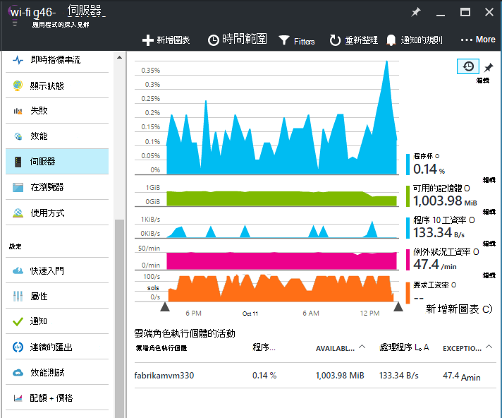
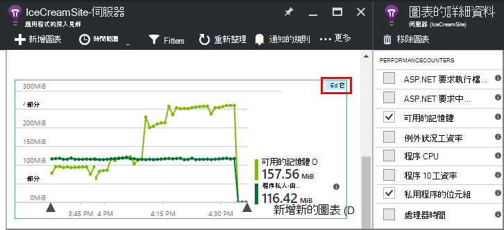
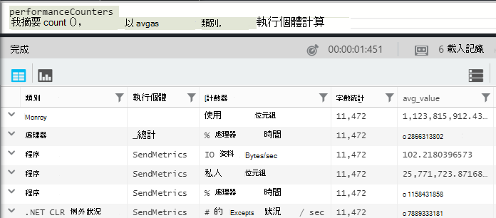
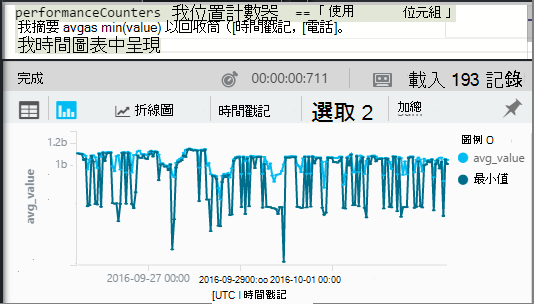
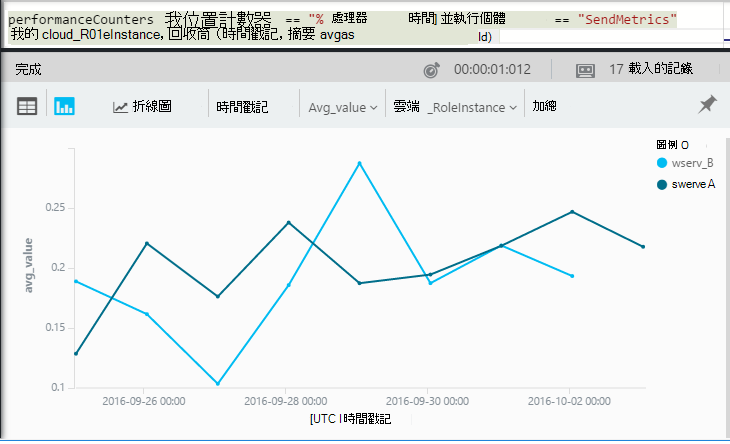

<properties 
    pageTitle="在 [應用程式的深入見解的效能計數器 |Microsoft Azure" 
    description="監控系統和自訂.NET 效能計數器在應用程式的深入見解。" 
    services="application-insights" 
    documentationCenter=""
    authors="alancameronwills" 
    manager="douge"/>

<tags 
    ms.service="application-insights" 
    ms.workload="tbd" 
    ms.tgt_pltfrm="ibiza" 
    ms.devlang="na" 
    ms.topic="article" 
    ms.date="10/11/2016" 
    ms.author="awills"/>
 
# <a name="system-performance-counters-in-application-insights"></a>在 [應用程式的深入見解的系統效能計數器


Windows 提供各種不同的[效能計數器](http://www.codeproject.com/Articles/8590/An-Introduction-To-Performance-Counters)CPU 進駐、 記憶體、 磁碟和網路使用方式。 您也可以定義自己。 [應用程式的深入見解](app-insights-overview.md)可以顯示這些效能計數器，是否您執行應用程式 IIS 內部部署主機或您所要的管理權限的虛擬機器上。 圖表會指出資源即時應用程式，以及協助識別伺服器執行個體之間的不對稱的載入。

效能計數器會出現在伺服器刀，包括表格的區段由伺服器執行個體。



（效能計數器無法用於 Azure Web 應用程式。 但您可以[傳送 Azure 診斷應用程式獲得深入見解](app-insights-azure-diagnostics.md)。）

## <a name="configure"></a>設定

如果應用程式的深入見解狀態監視器還沒有安裝在您的伺服器電腦上，您必須安裝，請參閱效能計數器。

下載並執行每個伺服器執行個體上的[狀態監視器安裝程式](http://go.microsoft.com/fwlink/?LinkId=506648)。 如果已安裝，您不需要重新安裝。

* *我在開發時，[將我的應用程式中的應用程式的深入見解 SDK 安裝](app-insights-asp-net.md)。我仍需要狀態監視器嗎？*

    是的狀態監視器，才能收集效能計數器 ASP.NET web 應用程式。 您可能已經知道，狀態監視器也可用來[監控 web 應用程式的已是 live](app-insights-monitor-performance-live-website-now.md)，不需要安裝 SDK 開發期間。


## <a name="view-counters"></a>檢視計數器

伺服器刀會顯示一組預設的效能計數器。 

若要查看其他計數器，[編輯伺服器刀中，在圖表，或開啟新的[度量總管](app-insights-metrics-explorer.md)刀，並新增新的圖表。 

當您編輯圖表時，可用的計數器會列為指標。



若要查看所有您最有用處圖表在同一個地方，建立[儀表板](app-insights-dashboards.md)並為其固定這些內容。

## <a name="add-counters"></a>新增計數器

如果您想要的效能計數器未顯示清單中，這是指標的因為應用程式的深入見解 SDK 不收集在您的網頁伺服器。 您可以設定它執行此作業。

1. 了解哪些計數器可在您的伺服器，伺服器使用這個 PowerShell 命令︰

    `Get-Counter -ListSet *`

    (See [`Get-Counter`](https://technet.microsoft.com/library/hh849685.aspx).)

1. 開啟 ApplicationInsights.config。

 * 如果您新增至您的應用程式的應用程式的深入見解，在開發期間，在專案中，編輯 ApplicationInsights.config，然後重新部署至伺服器。
 * 如果您是使用狀態監視器追蹤記錄在執行階段的 web 應用程式，尋找 ApplicationInsights.config IIS 中的應用程式的根目錄中。 更新並在每個伺服器執行個體中。

2. 編輯效能行程指示詞︰

 ```XML

    <Add Type="Microsoft.ApplicationInsights.Extensibility.PerfCounterCollector.PerformanceCollectorModule, Microsoft.AI.PerfCounterCollector">
      <Counters>
        <Add PerformanceCounter="\Objects\Processes"/>
        <Add PerformanceCounter="\Sales(photo)\# Items Sold" ReportAs="Photo sales"/>
      </Counters>
    </Add>

```

您可以擷取標準計數器與您有實作自己。 `\Objects\Processes`是的標準計數器範例上所有的 Windows 系統。 `\Sales(photo)\# Items Sold`是自訂計數器可能會在 web 服務中實作的範例。 

格式是`\Category(instance)\Counter"`，或沒有執行個體的類別，只`\Category\Counter`。

`ReportAs`需要計數器名稱不符合`[a-zA-Z()/-_ \.]+`-也就是包含未在下列字元︰ 字母、 方括號、 斜線、 連字號、 底線、 空格，圓點。

如果您指定執行個體，它將會收集作為 「 CounterInstanceName 」 的報告度量的維度。

### <a name="collecting-performance-counters-in-code"></a>收集效能計數器程式碼

若要收集系統效能計數器並傳送給應用程式的深入見解，您可以採用下列程式碼片段︰

    var perfCollectorModule = new PerformanceCollectorModule();
    perfCollectorModule.Counters.Add(new PerformanceCounterCollectionRequest(
      @"\.NET CLR Memory([replace-with-application-process-name])\# GC Handles", "GC Handles")));
    perfCollectorModule.Initialize(TelemetryConfiguration.Active);

或者，您可以執行您建立的自訂指標相同的作業︰

    var perfCollectorModule = new PerformanceCollectorModule();
    perfCollectorModule.Counters.Add(new PerformanceCounterCollectionRequest(
      @"\Sales(photo)\# Items Sold", "Photo sales"));
    perfCollectorModule.Initialize(TelemetryConfiguration.Active);

## <a name="performance-counters-in-analytics"></a>在分析效能計數器

您可以搜尋，並在[分析](app-insights-analytics.md)中顯示效能計數器報告。


**PerformanceCounters**結構描述公開`category`，`counter`名稱，然後`instance`各個效能計數器的名稱。  在每個應用程式遙測，您會看到該應用程式的計數器。 例如，若要查看哪些計數器有︰ 



(「 執行個體 」 以下指的是效能計數器執行個體，不角色或伺服器電腦執行個體。 效能計數器執行個體名稱通常區段計數器處理器時間的程序或應用程式的名稱。）

若要取得可用的記憶體圖表最近的期間︰ 




其他遙測，例如**performanceCounters**也有一個資料行`cloud_RoleInstance`，表示您的應用程式執行所在的主機 server 執行個體的身分識別。 例如，若要比較不同的電腦上的應用程式的效能︰ 




## <a name="aspnet-and-application-insights-counts"></a>ASP.NET 與應用程式的深入見解項目個數

*例外狀況工資率] 和 [例外狀況指標之間的差異為何？*

* *例外狀況工資率*為系統效能計數器。 CLR 計算所有已處理和因為內含無法處理的例外會擲回，且取樣間隔內的總數除以間隔的長度。 應用程式的深入見解 SDK 收集此結果，並將其傳送至入口網站。
* *例外狀況*會收到取樣間隔的圖表的入口網站的 TrackException 報表的計數。 其包含只處理的例外狀況您所撰寫 TrackException 通話程式碼，並不包含所有的[例外狀況](app-insights-asp-net-exceptions.md)的位置。 

## <a name="alerts"></a>通知

其他指標，例如，您可以[設定提醒](app-insights-alerts.md)，以便您提出警告如果效能計數器進入外您指定的限制。 開啟通知刀，然後按一下 [新增提醒]。


## <a name="next"></a>後續步驟

* [追蹤的相依性](app-insights-asp-net-dependencies.md)
* [追蹤的例外狀況](app-insights-asp-net-exceptions.md)