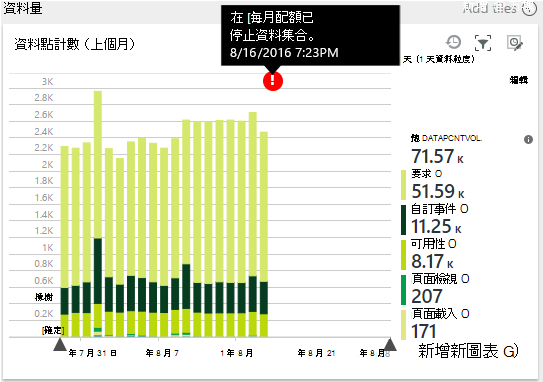

<properties 
    pageTitle="管理應用程式的深入見解價格和配額 |Microsoft Azure" 
    description="選擇需要管理遙測區價格計劃" 
    services="application-insights" 
    documentationCenter=""
    authors="alancameronwills" 
    manager="douge"/>

<tags 
    ms.service="application-insights" 
    ms.workload="tbd" 
    ms.tgt_pltfrm="ibiza" 
    ms.devlang="na" 
    ms.topic="article" 
    ms.date="10/13/2016" 
    ms.author="awills"/>

# 管理應用程式的深入見解價格和配額

*應用程式的深入見解位於預覽。*

[價格][ pricing] for [Visual Studio 應用程式獲得深入見解][start]為基礎的每個應用程式的資料量。 有大量的免費層，就要大部分的功能，但有一些限制。

每個應用程式的深入見解資源負責為不同的服務，並提供給 Azure 您訂閱的帳單。

[請參閱價格配置][pricing]。

## 檢閱您的應用程式的深入見解資源配額和價格計劃

您可以開啟配額 + 價格刀從您的應用程式資源設定。

![選擇 [設定]、 [配額 + [價格]。](./media/app-insights-pricing/01-pricing.png)

您所選擇的價格配置會影響︰

* [每月配額](#monthly-quota)-您可以分析每個月的遙測的量。
* [資料工資率](#data-rate)-從您的應用程式的資料可以處理的最大速度。
* [[接續本頁匯出](#continuous-export)-是否您可以將資料匯出至其他工具和服務。

每個應用程式的深入見解資源的個別設定這些限制。

### 免費的進階版試用版

當您第一次建立新的應用程式的深入見解資源時，同時也會在免費層。

在任何時候，您可以切換到 30 天免費進階版試用版。 這可讓您的進階版層的優點。 30 天後，它會自動還原到項目層您與其中所含前除非您明確選擇另一層。 選取您想試用期間，隨時層，但您仍然會收到直到期的結束日期 30 天免費試用版。

## 每月的配額

* 每個行事曆月，您的應用程式可以傳送應用程式獲得深入見解遙測指定數量。 免費的價格層的配額目前是每個月和更多其他配置; 5 百萬個資料點如果您到達配額時，您可以購買更多。  請參閱[價格配置][pricing]實際的數字。 
* 配額取決於您所選擇的價格層。
* 配額計算的每個月的第一天的午夜 UTC。
* 資料點圖表會顯示您的配額中有多少已使用這個月設定。
* 配額以*資料點。* 單一資料點是一種追蹤方法，在通話，不論稱為明確的程式碼，或以其中一項標準遙測模組。 它可以有多個附加的屬性和指標。
* 所產生的資料點︰
 * [SDK 模組](app-insights-configuration-with-applicationinsights-config.md)自動收集資料，例如報告要求或損毀，或測量的效能。
 * [API](app-insights-api-custom-events-metrics.md)`Track...`的電話，您所撰寫，例如`TrackEvent`或`trackPageView`。
 * [可用性 web 測試](app-insights-monitor-web-app-availability.md)您已設定。
* 您偵錯時，您可以看到正在傳送您的應用程式，在 Visual Studio 輸出視窗中的資料點。 用戶端事件可以看到開啟瀏覽器中的 [網路] 索引標籤的偵錯窗格 (通常 F12)。
* 在 [配額就不會計算*工作階段的資料*。 這包含計算的使用者、 工作階段，環境和裝置資料。
* 如果您想要檢查計算資料點，您可以在各種不同的位置找到這些︰
 * 每個項目，您會在[診斷搜尋](app-insights-diagnostic-search.md)，包括 HTTP 要求、 例外狀況、 記錄追蹤、 網頁檢視、 相依性事件，以及自訂的事件。
 * 例如效能計數器[公制](app-insights-metrics-explorer.md)每個原始度量單位。 （您在圖表看到的點通常是彙總的多個原始資料點）。
 * 在 web 可用性圖表上的每個點也是幾個資料點的彙總。
* 您也可以檢查在來源的個別資料點偵錯時︰
 * 如果您在 Visual Studio 偵錯模式中執行您的應用程式，在 [輸出視窗中記錄的資料點。 
 * 若要查看用戶端資料點，開啟您的瀏覽器偵錯窗格 (通常 F12)，開啟 [網路] 索引標籤。
* 資料速度可能會 （預設） 減少[調整的範例](app-insights-sampling.md)。 這表示，為您的應用程式增加的使用狀況、 遙測工資率不會增加儘可能預期。

### Overage

如果您的應用程式傳送的每月配額超過，您可以︰

* 支付其他資料。 請參閱[價格配置][pricing]如需詳細資訊。 您可以選擇預先這個選項。 這個選項不價格層免費提供。
* 升級您的價格層。
* 執行任何動作。 工作階段的資料會繼續錄製，但在診斷搜尋或指標檔案總管中，不會顯示其他資料。

## 我傳送的資料量？

圖表底部的價格刀顯示應用程式的資料點音量]，依資料點類型分組。 （您也可以建立圖表在公制總管] 中。）

按一下圖表，如需詳細資訊，或將它拖曳並按一下 （+） 的時間範圍內的詳細資訊。

圖表會顯示在應用程式的深入見解服務、 送達後[範例](app-insights-sampling.md)的資料量。

如果資料量達到您每月的配額] 中，在圖表上顯示的註釋。

## 資料工資率

除了每月的配額] 中，有節流限制資料工資率。 [價格層]免費[pricing]限制 200 資料點/第二個平均超過 5 分鐘，如付費層它 500/s 平均超過 1 分鐘。 

有哪些分開計算三種情況︰

* [TrackTrace 通話](app-insights-api-custom-events-metrics.md#track-trace)與[擷取記錄](app-insights-asp-net-trace-logs.md)
* [例外狀況](app-insights-api-custom-events-metrics.md#track-exception)，限制為 50 點/s。
* 所有其他遙測 （[頁面檢視、 工作階段、 要求、 相依性、 指標、 自訂事件、 web 測試結果）。

*如果我的應用程式超過秒工資率，會發生什麼情況？*

* 傳送給您的應用程式的資料量會評估每分鐘。 它超過段分鐘平均值秒工資率，伺服器拒絕某些要求。 SDK 的資料，然後嘗試重新傳送，分配超載，在幾分鐘的時間。 如果您的應用程式一致的方式傳送資料上方節流工資率，就會刪除一些資料。 （ASP.NET、 Java 和 JavaScript Sdk 嘗試重新傳送以這種方式，其他 Sdk 可能會直接拖放經流速控制資料）。

如果節流發生，您會看到通知警告的已發生這個問題。

*如何知道我的應用程式傳送的資料點數量？*

* 開啟 [設定/配額和價格，若要查看的資料量圖表。
* 或指標總管] 中新增圖表，然後選取 [為其公制的 [**資料點音量**。 切換群組] 及 [群組依據**資料類型**。

## 若要降低資料速度

如果您遇到節流限制，以下是一些您可以執行的動作︰

* 使用[範例](app-insights-sampling.md)。 這項技術減少資料工資率，而不扭曲您指標，也不中斷讓您在搜尋中的相關項目之間瀏覽。
* 在每個頁面] 檢視或切換關閉 Ajax 報告[限制的 Ajax 呼叫的報告](app-insights-javascript.md#detailed-configuration)。
* 關閉您不需要編輯[ApplicationInsights.config](app-insights-configuration-with-applicationinsights-config.md)集合模組。 例如，您可能決定效能計數器或相依性資料會犧牲。
* 預先彙總的指標。 如果您已將的來電至 TrackMetric 應用程式中，您可以使用接受平均值的計算和度量單位批次的標準差超載減少流量。 或者，您可以使用[預先彙總套件](https://www.myget.org/gallery/applicationinsights-sdk-labs)。 

## 範例

[取樣](app-insights-sampling.md)是減少用以遙測會傳送至您的應用程式，同時仍保留期間診斷搜尋，尋找相關的事件的功能與保有正確事件會計算工資率的方法。 

取樣是有效的方式，以減少費用，並保持在您每月的配額。 取樣演算法會保留遙測，相關項的目，以便，例如，當您使用搜尋時，您可以尋找特定的例外狀況相關的要求。 演算法也會保留正確計算，讓您看到公制檔案總管中的要求工資率、 例外狀況率和其他計數正確的值。

有多個表單的範例。

* [調整取樣](app-insights-sampling.md)是遙測的 ASP.NET sdk，您可以自動調整以傳送給您的應用程式大量的預設值。 其運作自動 SDK 在 web 應用程式，以便在網路上的遙測流量會減少。 
* *Ingestion 取樣*是從您的應用程式的遙測輸入應用程式的深入見解服務的位置的點的運作方式的替代方案。 不會影響的遙測傳送您的應用程式，但它降低音量服務將保留。 您可以使用，以減少使用遙測從瀏覽器和其他 Sdk 的配額。

若要設定 ingestion 取樣，設定控制項的配額 + 價格刀︰

![從配額與價格，按一下 [範例] 方塊，然後選取取樣分數。](./media/app-insights-pricing/04.png)

> [AZURE.WARNING] 範例保留圖磚上所顯示的值會指出 ingestion 範例為您設定的值。 它不會顯示在您的應用程式中 SDK 作業取樣率。 
> 
> 如果傳入遙測已對取樣在 SDK，ingestion 取樣不會套用。
 
若要探索無論套用位置的實際取樣率、 使用[狀況分析查詢](app-insights-analytics.md)這類︰

    requests | where timestamp > ago(1d)
  	| summarize 100/avg(itemCount) by bin(timestamp, 1h) 
  	| render areachart 

在每個保留記錄中，`itemCount`指出其所代表的原始記錄數目等於 1 + 先前捨棄的記錄數目。 

## 檢閱 Azure 您訂閱的帳單

應用程式的深入見解費用會新增至 Azure 帳單。 您可以查看詳細資料的您 Azure 結算上 Azure 入口網站，或在[Azure 計費入口網站](https://account.windowsazure.com/Subscriptions)中的 [帳單] 區段。 

![在側邊] 功能表中，選擇 [計費]。](./media/app-insights-pricing/02-billing.png)

## 名稱限制

1.  最多 200 唯一的單位名稱及 200 的唯一的屬性名稱，您的應用程式。 指標包含傳送 TrackMetric，以及其他資料類型，例如事件的度量單位的資料。  [指標和屬性名稱][api]是全域每個儀器索引鍵。
2.  [屬性][apiproperties]可用於篩選及群組-有 100 個值中的唯一值為每個屬性時，才。 唯一值的數目超過 100 之後，您可以仍搜尋屬性，但不會再用於篩選或群組依據。
3.  標準的屬性，例如要求的名稱和頁面的 URL 限於 1000年每週的唯一值。 之後 1000年的唯一值，其他的值會標示為 [其他值]。 原始值仍可全文檢索搜尋及篩選的。

如果您找到您的應用程式會出現與超出這些限制，請考慮分割不同儀器索引鍵-也就是 [[建立新的應用程式的深入見解資源](app-insights-create-new-resource.md)之間資料，並將部分資料傳送給新儀器鍵。 您可能會發現結果的更佳的結構。 您可以將到同一個畫面中，不同的度量，此方法並不會限制您可比較不同的度量，讓使用[儀表板](app-insights-dashboards.md#dashboards)。 

## 限制摘要

[AZURE.INCLUDE [application-insights-limits](../../includes/application-insights-limits.md)]

<!--Link references-->

[api]: app-insights-api-custom-events-metrics.md
[apiproperties]: app-insights-api-custom-events-metrics.md#properties
[start]: app-insights-overview.md
[pricing]: http://azure.microsoft.com/pricing/details/application-insights/

 