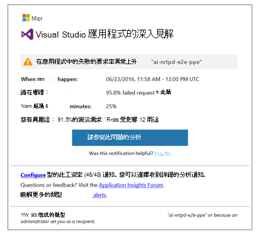
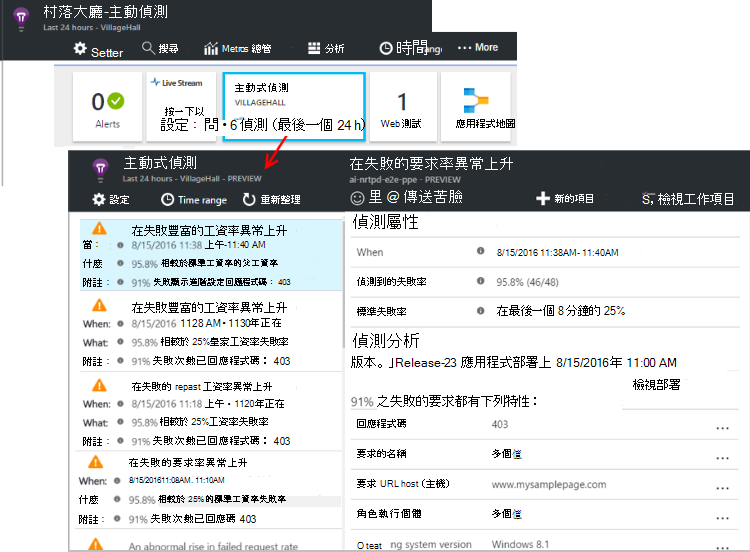

<properties 
    pageTitle="在應用程式的深入見解的積極診斷 |Microsoft Azure" 
    description="應用程式的深入見解執行自動深入分析您的應用程式遙測，警告您可能發生的問題。" 
    services="application-insights" 
    documentationCenter="windows"
    authors="rakefetj" 
    manager="douge"/>

<tags 
    ms.service="application-insights" 
    ms.workload="tbd" 
    ms.tgt_pltfrm="ibiza" 
    ms.devlang="na" 
    ms.topic="article" 
    ms.date="08/15/2016" 
    ms.author="awills"/>

#  在 [應用程式的深入見解的積極診斷

 積極診斷自動對您提出警告 web 應用程式中的潛在效能問題。 執行您的應用程式傳送[Visual Studio 應用程式](app-insights-overview.md)獲得深入見解遙測智慧分析。 如果沒有在失敗率突然上升或異常的圖樣，用戶端或伺服器效能，您會收到通知。 此功能需要沒有設定。 如果您的應用程式傳送足夠遙測的作用。

您收到的電子郵件和從主動偵測刀，您可以存取主動偵測通知。

## 檢閱您主動偵測

您可以探索偵測兩種方法︰

* **您收到的電子郵件**應用程式的深入見解。 以下是常見的範例︰

    

    按一下 [大] 按鈕，以開啟 [入口網站中的 [更多詳細資料]。

* 在您的應用程式概觀刀上的 [**主動偵測並排**顯示最近的通知的計數。 按一下磚來查看最近的提醒的清單。

選取 [查看詳細資料的提醒]。

## 若未偵測到什麼問題？

有三種偵測︰

* [主動式失敗工資率診斷](app-insights-proactive-failure-diagnostics.md)。 我們使用電腦學習若要設定的預期失敗的要求，您的應用程式的率載入與其他因素相互關聯。 如果失敗率外預期的信封，我們會傳送通知。
* [主動式效能診斷](app-insights-proactive-performance-diagnostics.md)。 我們異常模式中搜尋回應時間和失敗率每一天。 我們相互關聯這些問題的屬性，例如位置、 瀏覽器、 用戶端 OS 伺服器執行個體，與一天的時間。
* [Azure 雲端服務](https://azure.microsoft.com/blog/proactive-notifications-on-cloud-service-issues-with-azure-diagnostics-and-application-insights/)。 如果您的應用程式會裝載於 Azure 雲端服務，而且角色執行個體已啟動失敗、 經常回收，或執行階段損毀，您會收到通知。

（每個通知中的說明連結，您可以利用的相關文章。）

## 後續步驟

這些診斷工具可協助您檢查您的應用程式從遙測︰

* [公制總管](app-insights-metrics-explorer.md)
* [搜尋檔案總管](app-insights-diagnostic-search.md)
* [分析-強大的查詢語言](app-insights-analytics-tour.md)

主動式診斷會自動完成。 但也許您想要設定某些多個提醒？

* [手動設定公制的通知](app-insights-alerts.md)
* [可用性 web 測試](app-insights-monitor-web-app-availability.md) 

