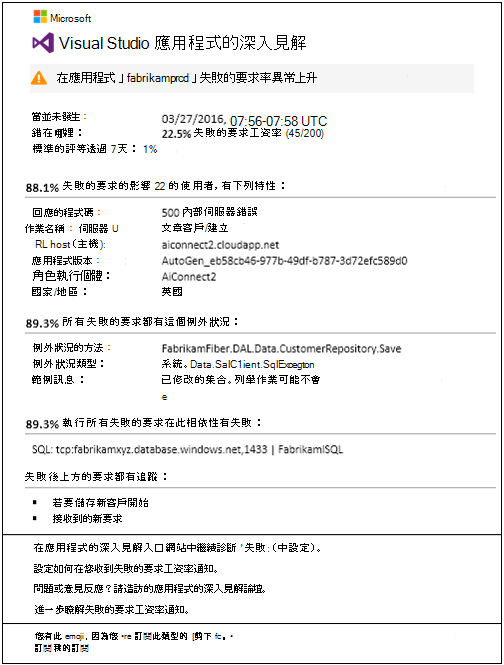
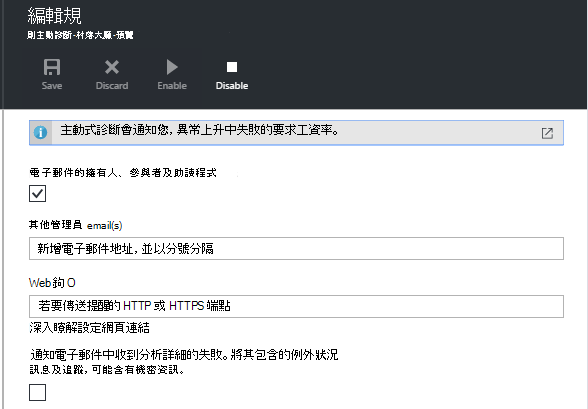
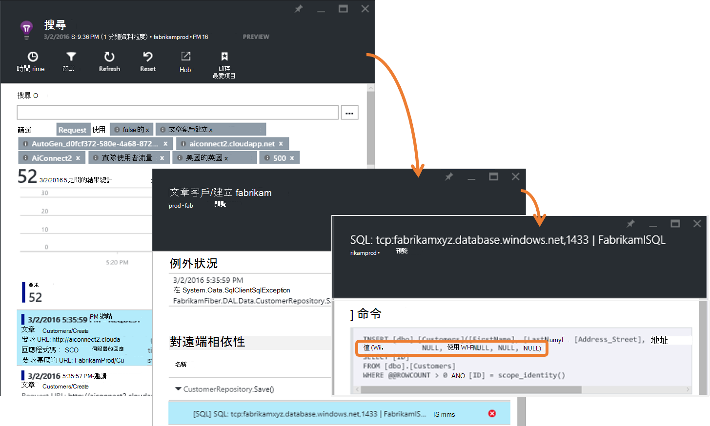
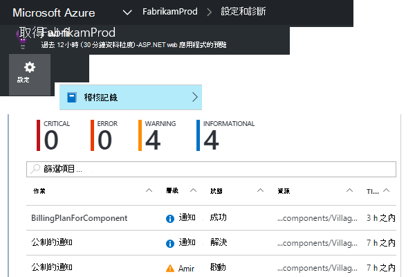
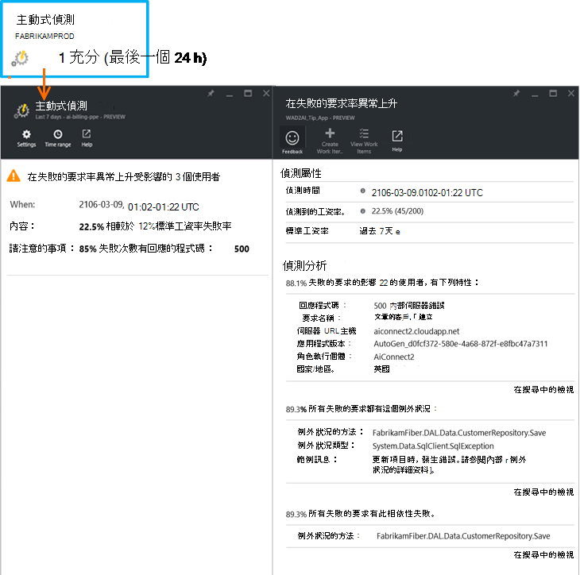

<properties 
    pageTitle="在 [應用程式的深入見解的積極失敗工資率診斷 |Microsoft Azure" 
    description="提醒您異常的率失敗要求您的 web 應用程式，變更，並提供診斷分析。 不需要設定。" 
    services="application-insights" 
    documentationCenter=""
    authors="yorac" 
    manager="douge"/>

<tags 
    ms.service="application-insights" 
    ms.workload="tbd" 
    ms.tgt_pltfrm="ibiza" 
    ms.devlang="na" 
    ms.topic="article" 
    ms.date="10/12/2016" 
    ms.author="awills"/>
 
# 主動式失敗工資率診斷程式

[Visual Studio 應用程式獲得深入見解](app-insights-overview.md)自動通知您近期即時如果 web 應用程式出現異常上升失敗的速度。 偵測到報告為失敗的 HTTP 要求率異常提升。 這些通常是具有回應代碼中 400-與 500-範圍。 若要可協助您分類及診斷問題，失敗的要求和相關的遙測的特性分析中提供的通知。 還有更進一步診斷的應用程式的深入見解入口網站的連結。 功能需要沒有設定或設定]，因為它會使用電腦學習演算法預測失敗標準工資率。

此功能的運作 Java 和 ASP.NET web 應用程式，存放在雲端，或在您的伺服器上。 它也適用於產生要求遙測任何應用程式-例如，如果您有工作者角色的通話[TrackRequest()](app-insights-api-custom-events-metrics.md#track-request)。 

設定[專案的應用程式深入資訊](app-insights-overview.md)和提供您的應用程式產生特定最小的遙測，主動失敗診斷時間量 24 小時，瞭解您的應用程式的標準行為，將其開啟，並可以傳送通知之前後。

以下是範例警示。 

> [AZURE.NOTE] 根據預設，您會收到超過此範例中為較短格式郵件。 但您可以[切換到此詳細的格式](#configure-alerts)。

請注意，它會告訴您︰

* 相較於標準的應用程式行為失敗率。
* 受影響多少使用者 – 讓您知道多少擔心。
* 特性的圖樣，失敗相關聯。 在此範例中，有特定的回應碼要求的名稱 （操作） 與應用程式版本。 立即會告訴您開始尋找您的程式碼中的位置。 其他可能的方式可能是特定的瀏覽器或用戶端作業系統。
* 顯示特色為失敗的要求與相關聯的例外狀況、 記錄追蹤和相依性失敗 （資料庫或其他外部元件）。
* 直接連結到相關的應用程式的深入見解遙測搜尋。

## 主動式通知的優點

一般[公制通知](app-insights-alerts.md)會告訴您可能會發生問題。 但是積極失敗診斷開始診斷您執行分析，否則您必須自行執行許多工作。 您得到結果整齊封裝，有助您快速前往問題的根目錄。

## 運作方式

即時主動診斷監視器附近遙測收到從您的應用程式，並在特定失敗的要求工資率。 此公制的個數要求其`Successful request`屬性為 false。 根據預設， `Successful request== (resultCode < 400)` （除非您撰寫自訂程式碼[篩選](app-insights-api-filtering-sampling.md#filtering)或產生[TrackRequest](app-insights-api-custom-events-metrics.md#track-request)來電時）。 

您的應用程式效能具有一般的行為模式。 某些要求會更容易發生失敗與其他人。與整體失敗率載入增加時，可能會。 主動式失敗診斷使用電腦學習找到這些異常。 

因為遙測到應用程式的深入見解來自您的 web 應用程式，主動失敗診斷看到過去幾天的圖樣與目前的行為。 如果在失敗率異常上升觀察 by comparison with 效能，就會觸發分析。

觸發分析時，服務會失敗要求時，要識別的值描述失敗模式執行叢集分析。 在上述範例中，分析已發現大部分失敗的特定結果碼、 要求的名稱、 伺服器 URL 主機與角色執行個體。 相反地，分析具有發現的用戶端作業系統屬性分佈多個值，因此沒有列出。

當您的服務與這些遙測檢測時，analyser 尋找例外狀況] 和 [叢集識別出，與任何這些要求相關聯的追蹤記錄檔的範例中要求與相關聯的相依性失敗。

結果分析傳送給您為提醒中，除非您已設定不到。

按讚[提醒您手動設定](app-insights-alerts.md)，您可以檢查狀態的警示，並將它設定應用程式的深入見解資源的通知刀中。 但不同於其他通知，您不需要設定或設定積極失敗診斷。 如果您想，您可以將它停用或變更其目標電子郵件地址。

## 設定通知 

您可以停用主動式診斷、 變更的電子郵件收件者、 建立 webhook，或是採用更詳細的提醒訊息。

開啟 [通知] 頁面。 主動式診斷包含以及任何您手動設定的通知，而您可以看到是否正在通知狀態。

![在 [概觀] 頁面上，按一下 [通知] 方塊。 或任何指標頁面上，按一下 [通知] 按鈕。](./media/app-insights-proactive-failure-diagnostics/021.png)

按一下 [設定通知]。

請注意，您可以停用主動式診斷，但您無法將其刪除 （或建立另一個）。

#### 詳細的通知

如果您選取 「 接收詳細的分析 」 電子郵件將包含更多的診斷資訊。 有時候您就可以診斷問題，只要從電子郵件中的資料。 

有稍微風險更詳細的通知可能含有機密資訊，因為它包含例外狀況和追蹤的郵件。 不過，這只會發生如果您的程式碼可能允許將這些郵件的機密資訊。 

## 分類和診斷通知

通知表示偵測異常上升中失敗的要求工資率。 很可能是您的應用程式或其環境的一些問題。

從要求和受影響的使用者數目的百分比，您可以決定如何緊急問題是。 在上述範例中，22.5%的失敗率與 1%的標準工資率，指出不正確的項目即將。 另一方面，只 11 使用者已受影響。 如果您的應用程式，您都可以評估這是如何嚴重。

在許多情況下，您可以診斷快速地從要求的名稱、 例外狀況、 提供的相依性失敗，以及追蹤資料問題。 

有一些其他線索。 例如，在此範例中的相依性失敗率是相同的例外狀況率 （89.3%)。 這會建議例外狀況發生直接從相依性失敗-可讓您清楚瞭解開始尋找您的程式碼中的位置。

若要進一步調查，每一節中的連結，帶您直接以[搜尋頁面](app-insights-diagnostic-search.md)篩選至相關的要求、 例外狀況、 相依性或追蹤。 或者，您可以開啟[Azure 入口網站](https://portal.azure.com)，瀏覽至應用程式的深入見解資源，為您的應用程式，並開啟失敗刀。

在此範例中，按一下 「 檢視相依性失敗詳細資料 」 的連結開啟並在 SQL 陳述式的應用程式的深入見解搜尋刀根本原因︰ 設為 Null 提供必要欄位，且未通過驗證，在儲存作業。

## 檢閱最近的通知

若要檢閱在入口網站的通知，開啟 [**設定]，[稽核記錄**。

按一下任何通知，以查看其完整的詳細資訊。

或按一下 [**主動偵測**直接將最新的通知︰

## 有何差別...

主動式失敗工資率診斷補充其他類似的應用程式的深入見解但不同的功能。 

* [公制](app-insights-alerts.md)由您來設定和監視大範圍的度量，例如 CPU 進駐，要求率、 頁面載入時間，以及等等。 您可以使用這些警告，例如，如果您要新增更多資源。 相反地，主動失敗診斷涵蓋小型範圍的要徑計量 （目前僅失敗的要求工資率），通知您在靠近即時方式一旦您的 web 應用程式無法要求工資率增加大幅比較 web app 的標準行為設計。

    主動式失敗工資率診斷自動調整主流的條件來回應其臨界值。

    主動式失敗工資率診斷啟動您的診斷工作。 
* [主動式效能診斷](app-insights-proactive-performance-diagnostics.md)也會使用電腦的智慧中您的指標的異常模式，您就不需要設定。 但不同於積極失敗工資率診斷，主動效能診斷程式的用途是特定類型的瀏覽器上尋找區段，您可能不提供服務的使用狀況集合管-依特定頁面，例如。 每日、 執行分析，如果找不到任何結果，則可能是較緊急比通知。 相反地上連入遙測，, 持續執行主動式失敗診斷分析，您將會收到通知幾分鐘內伺服器失敗率會比預期更大。

## 如果您收到積極失敗工資率診斷通知

*為什麼有收到此通知？*

*   我們偵測到失敗的要求工資率，比上述期間的標準的比較基準異常提升。 之後的分析失敗和相關聯的遙測，我們認為有問題，您應該查詢。 

*是否通知，表示成長有問題？*

*   我們試著在應用程式中斷或降低，提醒，雖然只有您可以完全瞭解語意和應用程式或使用者的影響。

*因此，都看看我的資料？*

*   [否]。 服務會完全自動執行。 僅限，您會收到通知。 您的資料是[私人](app-insights-data-retention-privacy.md)群組。

*我是否必須訂閱此通知？* 

*   [否]。 每個應用程式傳送邀請遙測具有此通知的規則。

*我可以取消或取得改為傳送給我的同事通知嗎？*

*   是的在通知規則]，按一下要設定讓它的積極診斷規則]。 您可以停用通知，或變更通知的收件者。 

*我遺失電子郵件。哪裡可以找到通知] 入口網站中？*

*   在 [稽核記錄。 任何提醒以查看其項目]，然後按一下 [設定稽核記錄，但有限的詳細檢視。

*通知] 部分的已知問題而我不想接收其。*

*   我們積存上有通知隱藏項目。

## 後續步驟

這些診斷工具可協助您檢查您的應用程式從遙測︰

* [公制總管](app-insights-metrics-explorer.md)
* [搜尋檔案總管](app-insights-diagnostic-search.md)
* [分析-強大的查詢語言](app-insights-analytics-tour.md)

主動式偵測會自動完成。 但也許您想要設定某些多個提醒？

* [手動設定公制的通知](app-insights-alerts.md)
* [可用性 web 測試](app-insights-monitor-web-app-availability.md) 

