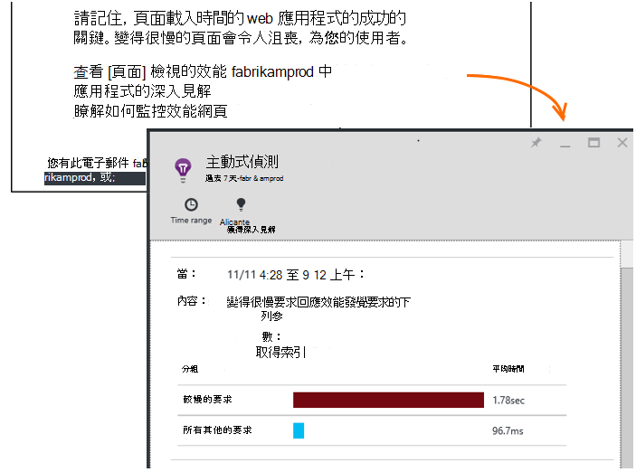

<properties 
    pageTitle="應用程式的深入見解︰ 積極效能診斷 |Microsoft Azure" 
    description="應用程式的深入見解執行深入分析您的應用程式遙測，警告您可能發生的問題。" 
    services="application-insights" 
    documentationCenter="windows"
    authors="antonfrMSFT" 
    manager="douge"/>

<tags 
    ms.service="application-insights" 
    ms.workload="tbd" 
    ms.tgt_pltfrm="ibiza" 
    ms.devlang="na" 
    ms.topic="article" 
    ms.date="08/31/2016" 
    ms.author="awills"/>

#  主動式效能診斷

*應用程式的深入見解位於預覽。*

[Visual Studio 應用程式獲得深入見解](app-insights-overview.md)執行深入分析您的應用程式遙測，，並可以告訴您潛在的效能問題。 您可能會讀取此因為您收到其中一個我們積極通知電子郵件。 

此功能需要沒有設定]，且您的應用程式會產生足夠遙測自動作用中。

## 什麼是積極效能診斷？

主動式效能診斷分析您的應用程式會傳送給應用程式的深入見解遙測探索異常模式中您的應用程式的效能。 

特別是，它會找到效能問題，只會影響您的使用者，部分，或只會影響使用者在某些情況下。

例如，可以通知如果應用程式頁面載入較慢的其中一種瀏覽器，或者要求速度變慢來自特定伺服器。 例如變得很慢的頁面載入一個地理區域中，在特定的一天的時間，它也可以找出相關聯的屬性，組合的問題。

這些異常很難偵測只要檢查資料，但比想像一般。 通常，當您的客戶抱怨僅運用。 根據的時間，是太遲︰ 受影響的使用者都已切換對手 ！

目前我們演算法看看頁面載入時間，在伺服器上，要求回應時間和相依性回應時間。  

您沒有設定任何臨界值或設定規則。 電腦學習及資料採礦演算法用於偵測異常模式。 

我們非常迫擁有您的意見反應。 請讓我們知道如何協助您與我們應如何改善主動偵測哪些其他功能您希望我們為新增。 您可以提供意見反應，透過傳送笑臉/苦臉在入口網站，或以電子郵件傳送給我們以AppInsightsML@microsoft.com。 

## 關於積極警示

* *為什麼有收到此電子郵件？*
 * 主動式偵測分析的遙測應用程式傳送到應用程式深入資訊]，在您的應用程式中偵測到的效能問題。 
* *是否通知，表示成長有問題？*
 * [否]。 只要建議復原您可能會想要進一步了解更多一則。 
* *我該怎麼辦？*
 * [看看中顯示的資料](#responding-to-an-alert)。 使用指標檔案總管來檢閱一段時間的效能及其他計量切入。 使用搜尋篩選出特定的事件，協助您識別根本原因。 
* *因此，都看看我的資料？*
 * [否]。 服務會完全自動執行。 僅限，您會收到通知。 您的資料是[私人](app-insights-data-retention-privacy.md)群組。

## 偵測程序

* *若未偵測到哪些類型的效能異常？*
 * 您會發現耗時核取您自己的圖樣。 例如，效能不佳的特定位置的組合的時間和平台。
* *分析收集應用程式的深入見解的所有資料時嗎？*
 * 不是在簡報。 目前我們分析回應時間、 相依性回應時間和頁面載入時間的要求。 即將推出的其他指標分析。 
* *可以建立自己的異常偵測規則？*
 * 還沒有。 但您可以︰
 * [設定提醒](app-insights-alerts.md)，以告知您度量單位，當直線臨界值）。
 * [匯出遙測](app-insights-export-telemetry.md)至[資料庫](app-insights-code-sample-export-sql-stream-analytics.md)或[以中](app-insights-export-power-bi.md)或[其他](app-insights-code-sample-export-telemetry-sql-database.md)工具，您可以進行分析自己。
* *執行分析的頻率*
 * 我們每天在前一天遙測上執行分析。
* *，這會取代[公制通知](app-insights-alerts.md)嗎？
 * [否]。  我們不認可偵測您可以考慮異常每個行為。

## 如何調查提出的問題

從電子郵件或異常清單，請開啟 [診斷報告。

* **時**顯示的時間偵測到問題。
* **哪些**說明
 * 偵測到; 問題
 * 我們發現的事件一組特性顯示問題行為。
* 表將比較所有其他事件的平均行為與佳的設定。

按一下連結以開啟 [篩選的時間和變得很慢執行設定屬性的相關報告上的 [公制檔案總管]，然後搜尋。

修改時間範圍及探索遙測篩選。

## 我要如何改善效能？

您知道從您自己的體驗，變得很慢和失敗回應會是其中一個網站使用者的最大的麻煩。 因此，請務必解決的問題。

### 分級

首先，會影響？ 如果頁面永遠載入很慢，但只有您的網站使用者的 1%也能看它，可能必須考量下列事項更重要的項目。 相反地，如果僅 1%的使用者開啟它，但它會擲回例外狀況每次，可能會值得調查。

使用電子郵件中的影響陳述式的一般指南，作為，但請注意，不是整個本文。 收集其他證明，以確認。

請考慮問題的參數。 如果這是地理位置而異，設定[可用性測試](app-insights-monitor-web-app-availability.md)包括該區域︰ 在該區塊只要可能有網路問題。 

### 診斷變得很慢頁面載入 

在哪裡問題？ 伺服器回應變得很慢，是很長，該頁面，或瀏覽器必須執行許多工作要顯示嗎？

開啟瀏覽器公制刀。 即將時間[區段的顯示在瀏覽器頁面載入時間](app-insights-javascript.md#explore-your-data)會顯示。 

* 如果**傳送要求時間**高，伺服器回應速度變慢，或要求的含有大量資料的文章。 查看[效能指標](app-insights-web-monitor-performance.md#metrics)調查回應時間。 
* 設定[相依性追蹤](app-insights-dependencies.md)，緩慢是否為外部服務或您的資料庫。
* 如果**收到回應**，尤其是，您的頁面和相依部份-JavaScript] CSS 等 （但不是非同步載入資料） 的圖像很長。 設定[測試顯示狀態](app-insights-monitor-web-app-availability.md)，並請務必將 [載入相依組件] 選項。 當您收到某些結果時，請開啟結果的詳細資料，並將其展開以查看不同的檔案的載入時間。
* 高**處理用戶端時間**建議指令碼會執行速度緩慢。 如果不明顯的原因，請考慮加入預存時間的部分程式碼，然後 trackMetric 通話中傳送時間。

### 改善變得很慢的頁面

有 web 完整的改善您的伺服器的回應和頁面載入時間，讓我們嘗試以下所有重複的建議。 以下是一些您可能已經知道，只要以取得您想的秘訣︰

* 變得很慢由於顯示較大的檔案載入︰ 非同步載入指令碼和其他部分。 使用指令碼搭售。 分成個別載入其資料的小工具中的主頁面。 不要傳送的長表格，純舊的 HTML︰ 使用指令碼要求資料為 JSON 或其他精簡的格式，然後填滿的資料表中的位置。 有協助項絕佳架構。 （也必須承擔顯示較大的指令碼，當然。）
* 緩慢伺服器相依性︰ 請考慮您元件的地理位置。 例如，如果您使用的 Azure，請確定網頁伺服器及資料庫有相同的區域。 查詢擷取比所需的詳細資訊？ 快取或批次處理說明嗎？
* 容量問題︰ 查看 [server 計量的回應時間，並要求計算。 如果回應時間比例尖峰要求計算的使用，可能是您的伺服器會自動縮放。 

## 通知電子郵件

* *有這項服務訂閱才會收到通知嗎？*
 * [否]。 我們傀儡定期 surveys 所有應用程式的深入見解的使用者] 中的資料，並傳送通知給偵測到問題。
* *我可以取消或取得改為傳送給我的同事通知嗎？*
 * 按一下通知或電子郵件中的 [取消訂閱] 連結。 
 
    目前傳送給這些[應用程式的深入見解資源寫入權](app-insights-resources-roles-access-control.md)限。

    您也可以編輯 [收件者] 清單設定中主動偵測刀。
* *我不想要大量湧入這些訊息。*
 * 他們的年齡限於每日我們尚未還報告的相關最相關問題。 您不會收到任何訊息的按鍵。
* *如果我不做任何動作，將會取得提醒？*
 * 否，您會將每個問題的相關訊息取得一次。 
* *我遺失電子郵件。哪裡可以找到通知] 入口網站中？*
 * 在應用程式的深入見解概觀應用程式]、 按一下 [**主動偵測**磚。 有您就可以找到所有通知到 7 天最下層。

## 後續步驟

這些診斷工具可協助您檢查您的應用程式從遙測︰

* [公制總管](app-insights-metrics-explorer.md)
* [搜尋檔案總管](app-insights-diagnostic-search.md)
* [分析-強大的查詢語言](app-insights-analytics-tour.md)

主動式偵測會自動完成。 但也許您想要設定某些多個提醒？

* [手動設定公制的通知](app-insights-alerts.md)
* [可用性 web 測試](app-insights-monitor-web-app-availability.md) 

