<properties
    pageTitle="開發人員分析的 Visual Studio 副檔名的版本資訊"
    description="Visual Studio 開發人員分析工具最新的更新。"
    services="application-insights"
    documentationCenter=""
    authors="acearun"
    manager="douge"/>
<tags
    ms.service="application-insights"
    ms.workload="tbd"
    ms.tgt_pltfrm="ibiza"
    ms.devlang="na"
    ms.topic="article"
    ms.date="06/09/2016"
    ms.author="acearun"/>

# 開發人員分析工具的版本資訊
新增功能︰ 應用程式的深入見解和 HockeyApp Visual Studio 中的分析。
## 7.0 版
### Visual Studio 應用程式的深入見解趨勢
Visual Studio 應用程式獲得深入見解是新的工具，您可以使用可協助您分析您的應用程式一段時間的運作方式的 Visual Studio 中。 若要開始，在**應用程式的深入見解**工具列按鈕，或在 [應用程式的深入見解搜尋] 視窗中，選擇 [**瀏覽遙測趨勢**]。 或者，在 [**檢視**] 功能表上按一下 [**其他視窗**，然後按一下 [**應用程式的深入見解趨勢**。 選擇其中一個五個常見的查詢，即可開始使用。 您可以分析根據遙測類型、 時間範圍，以及其他屬性的不同資料集。 若要尋找的異常資料中，選擇 [**檢視類型**] 下拉式清單中的 [異常選項的其中一個]。 在視窗底部的篩選選項讓您更輕鬆地在特定子集您遙測暸解中。

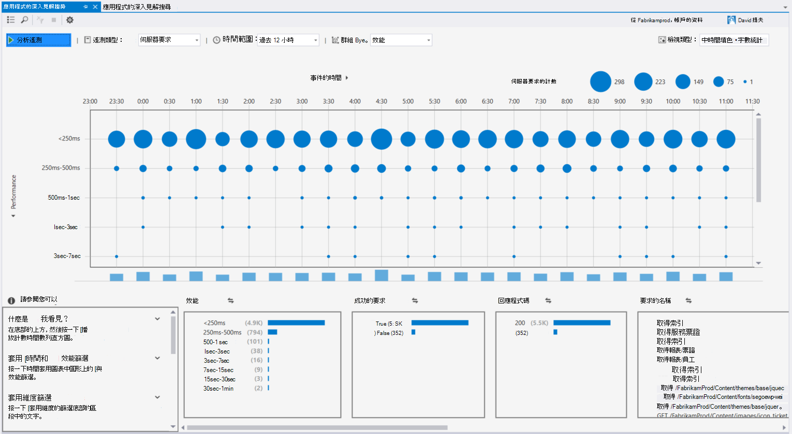

### CodeLens 中的例外狀況
例外狀況遙測現在會顯示在 CodeLens 中。 如果您已連線專案應用程式的深入見解服務，您會看到過去 24 小時的生產環境中的每一種方法中所發生的例外狀況的數目。 從 CodeLens，您可以跳到搜尋或趨勢調查中更多詳細資料的例外。

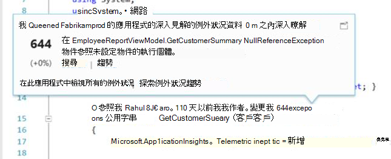

### ASP.NET 核心支援
應用程式的深入見解現在支援 ASP.NET 核心 RC2 專案，在 Visual Studio 中。 您可以新增至新的 ASP.NET 核心 RC2 專案的應用程式的深入見解**新專案**] 對話方塊中，如以下的螢幕擷取畫面所示。 或者，您可以將其新增至現有的專案，以滑鼠右鍵按一下方案總管] 中的專案，然後按一下 [**新增應用程式的深入見解遙測**。

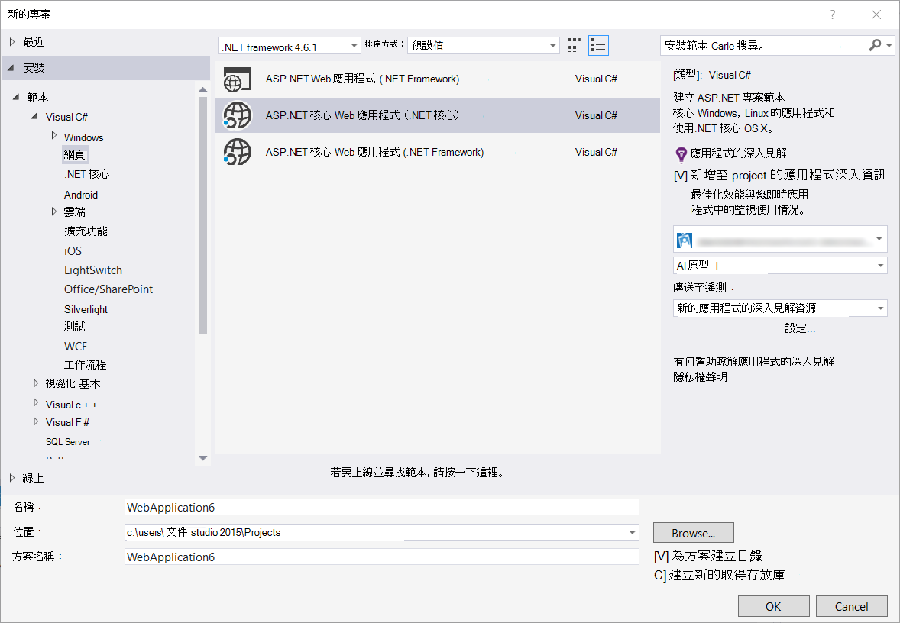

ASP.NET 5 RC1 及 ASP.NET 核心 RC2 專案也有新的支援，在 [診斷工具] 視窗中。 您偵錯本機電腦上時，您會看到您 ASP.NET 應用程式要求等例外狀況的應用程式的深入見解事件。 從每項事件，按一下 [**搜尋**]，如需詳細資訊，向下切入]。

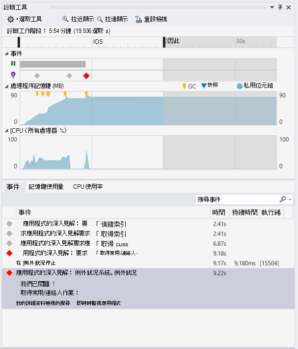

### HockeyApp 通用的 Windows 應用程式
除了 beta 分配和使用者意見反應，HockeyApp 提供通用的 Windows 應用程式的報告 symbolicated 當機。 我們已經新增 HockeyApp SDK 您更容易︰ 通用 Windows 專案，右鍵，然後按一下 [**曲棍球應用程式-啟用損毀的分析**。 此安裝 SDK 設定當機集合，然後佈建新的 HockeyApp 資源在雲端，不需將您的應用程式上傳至 HockeyApp 服務。

其他新功能︰

* 我們已進行更快且更直覺化的應用程式的深入見解搜尋體驗。 現在，時間範圍和詳細資料的篩選時自動套用您選取他們。
* 在應用程式的深入見解搜尋，現在有也直接從要求遙測跳至程式碼的選項。
* 我們做了 HockeyApp 登入體驗的改良功能。
* 在 [診斷工具] 的例外狀況的生產遙測資訊會顯示。

## 版本 5.2
我們會快樂宣佈 Visual Studio 中 HockeyApp 案例的簡介。 第一個整合位於 beta 分配的通用的 Windows 應用程式與 Visual Studio 中的 Windows 表單應用程式。

Beta 分配，使用您上傳您的應用程式的最早版本至 HockeyApp 發佈至選取的子集的客戶或人員。 Beta 分配，加上 HockeyApp 當機收集與使用者的意見反應功能，可以讓您提供與您的應用程式的相關資訊，先廣泛的版本。 以便讓您避免或最小化未來的問題，例如低的應用程式評等、 負意見反應，等等，您可以使用您的應用程式使用此資訊來解決問題。

請參閱如何輕鬆上傳建置 beta 分配從 Visual Studio 中。
### 通用的 Windows 應用程式
通用的 Windows 應用程式專案節點的操作功能表現在包含 [上傳至 HockeyApp 的您建立的選項。

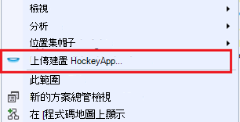

選擇 [項目] 和 [上傳] 對話方塊隨即開啟 HockeyApp]。 您需要上傳您建立的 HockeyApp 帳戶。 如果您是新使用者，請不要擔心。 簡單的程序，建立帳戶。

當您連線時，您會看到 [] 對話方塊中的上傳表單。

![上傳通用的 Windows 應用程式] 對話方塊](./media/app-insights-release-notes-vsix/UniversalUploadDialog.png)

選取要上傳 （.appxbundle 或.appx 檔案） 的內容，然後選擇發行選項精靈中。 或者，您可以在下一個頁面上新增版本資訊。 選擇 [**完成**] 以開始上傳]。

上傳完成時，HockeyApp 確認與應用程式的 HockeyApp 入口網站的連結會顯示通知。

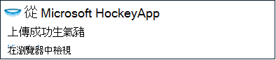

這樣就可以 ！ 只要您已上傳建立 beta 分配，按幾下滑鼠。

您可以管理您的應用程式，以 HockeyApp 入口網站中的多種方式。 包括邀請使用者，檢視當機報表和意見反應，變更詳細資料，依此類推。

如需詳細資訊應用程式管理[HockeyApp 知識庫](http://support.hockeyapp.net/kb/app-management-2)，請參閱。

### Windows 表單應用程式
Windows 表單專案節點的操作功能表現在包含 [上傳至 HockeyApp 的您建立的選項。

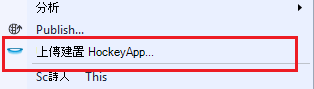

這會開啟 [HockeyApp 上傳] 對話方塊，類似通用的 Windows 應用程式中。

![上傳 Windows 表單應用程式] 的對話方塊](./media/app-insights-release-notes-vsix/WinFormsUploadDialog.png)

請注意此精靈] 中的新欄位指定的應用程式版本。 通用的 Windows 應用程式，資訊會填入資訊清單。 很抱歉，Windows 表單應用程式，沒有等同於此功能。 您必須以手動方式加以指定。

流程的其餘部分很類似通用的 Windows 應用程式︰ 選擇 [建立和發行選項，請新增發行備忘稿上, 傳和管理 HockeyApp 入口網站中。

是的簡單。 嘗試一下，讓我們知道您的想法。
## 版本 4.3
### 搜尋遙測從本機偵錯工作階段
在這個版本中，您可以立即搜尋在 Visual Studio 偵錯工作階段中產生的應用程式的深入見解遙測。 之前，您可以使用搜尋，只有當您使用的應用程式的深入見解註冊您的應用程式。 現在，您的應用程式只需要安裝至本機遙測搜尋應用程式的深入見解 SDK。

如果您使用的應用程式的深入見解 SDK ASP.NET 應用程式，請執行下列步驟，以使用 [搜尋]。

1. 偵錯應用程式。
2. 開啟 [應用程式的深入見解搜尋其中一種方式︰
    - 在 [**檢視**] 功能表上按一下**其他視窗**]，再按一下 [**應用程式的深入見解搜尋**。
    - 按一下**應用程式的深入見解**工具列按鈕。
    - 在方案總管中，展開**ApplicationInsights.config**，，然後按一下 [**搜尋偵錯工作階段遙測**。
3. 如果您尚未註冊使用應用程式深入資訊，請將會以偵錯工作階段遙測模式開啟 [搜尋] 視窗。
4. 按一下 [**搜尋**] 圖示，查看您的本機遙測。

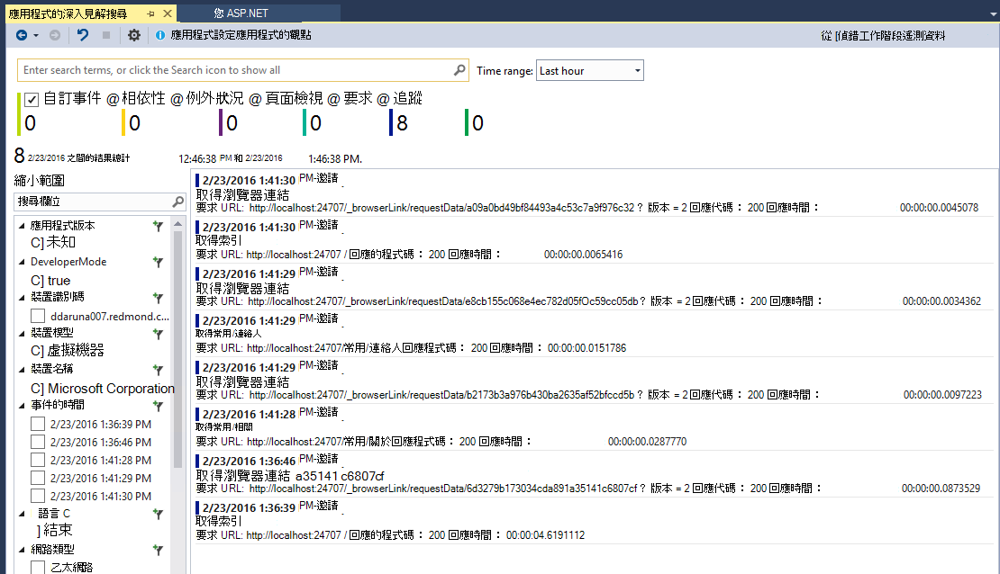

## 4.2 版
在這個版本中，我們可以新增功能，讓資料更容易地在內容的事件，搜尋的詳細資料的事件，與應用程式獲得深入見解傳送您的記錄資料即可輕鬆體驗跳至程式碼。 每月更新至此分機]。 如果您有意見反應或功能的要求，請將其傳送至aidevtools@microsoft.com。
### 按一下 [無記錄體驗
如果您已使用 NLog、 log4net 或 System.Diagnostics.Tracing，您不必擔心移動您追蹤的所有應用程式獲得深入見解。 在這個版本中，我們已整合應用程式的深入見解記錄介面卡的標準設定體驗。
如果您已經有設定這些記錄架構的其中一個下, 一節說明如何取得。
**如果您已新增應用程式的深入見解︰**
1. 專案節點，以滑鼠右鍵按一下，然後按一下 [**應用程式的深入見解**，然後按一下**設定應用程式深入資訊**。 請確定您看到 [設定] 視窗中新增正確的介面卡的選項。
2. 或者，當您建置解決方案時，請注意，會出現在上方的快顯視窗螢幕的右上方，按一下 [**設定**]。

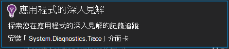

如果您有安裝的記錄介面卡，執行您的應用程式，請確定您看到 [診斷工具] 索引標籤，像這樣中的資料︰

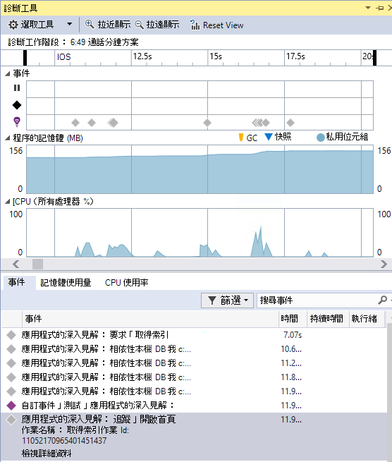

### 跳至] 或 [尋找位置發出遙測事件屬性的程式碼
與新版本使用者可以按一下任何值在事件詳細資料，這會搜尋目前開啟的方案中相符的字串。 結果會顯示在 Visual Studio 」 找到的結果 」 清單，如下所示︰

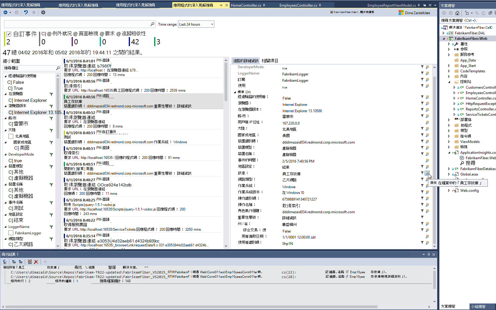

### 當您無法登入新的搜尋視窗
我們已改良可協助您在實際執行您的應用程式時，搜尋您資料的 [應用程式的深入見解搜尋] 視窗的外觀。

![[搜尋] 視窗](./media/app-insights-release-notes-vsix/SearchWindow.png)

### 請參閱與事件相關聯的所有遙測事件
我們已新增新的索引標籤，使用者會檢視事件詳細資料] 索引標籤旁的遙測與事件相關的所有資料預先定義的查詢。 例如，要求有稱為**作業識別碼**欄位。 每個此邀請相關聯的事件**作業**id 具有相同的值。 如果作業處理此要求時發生例外狀況，例外狀況指定相同作業識別碼，使其更容易找到邀請。 如果您正在尋找的要求，請按一下 [**所有遙測這項作業**，開啟新的索引標籤會顯示新的搜尋結果]。

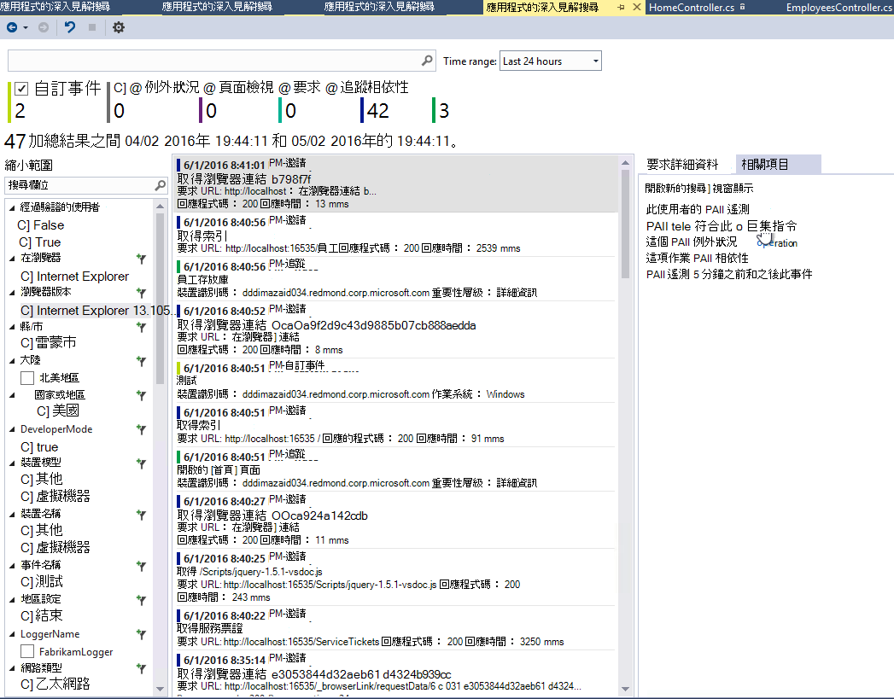

### 轉寄並返回中搜尋的歷程記錄
現在您可以前往前或往後的搜尋結果之間。

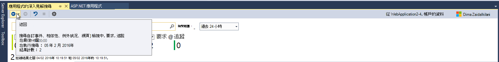

## 4.1 版
此版本隨附的新功能和更新的數字。 您需要安裝在這個版本安裝的更新 1。

### 從 [例外狀況跳至程式碼中的方法
現在，如果您是您實際執行應用程式，在 [應用程式的深入見解搜尋] 視窗中檢視的例外狀況，您可以跳到方法程式碼中發生的例外狀況的位置。 您只需要有正確的專案載入並應用程式的深入見解的其餘部分 ！ （若要深入瞭解應用程式的深入見解搜尋] 視窗，請參閱下列各節中的版本 4.0 的版本資訊）。

如何運作？ 您可以使用應用程式的深入見解搜尋，即使不開啟的解決方案。 堆疊追蹤區域會顯示資訊訊息，而且許多堆疊追蹤中的項目無法使用。

如果使用檔案的資訊，某些項目可能是連結，但方案資訊項目仍可看到。

如果您按一下超連結，您會在您的程式碼中跳至選取的方法的位置。 可能會有不同版本號碼，但後續發行版本可能會派功能，請跳至程式碼，正確的版本。

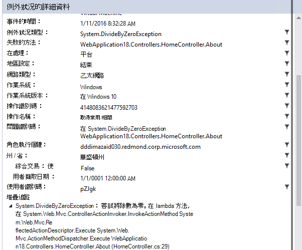

### 在方案總管中的新的項目點，以搜尋體驗
現在，您可以透過方案總管中存取搜尋。

![在方案總管] 中的搜尋](./media/app-insights-release-notes-vsix/searchentry.png)

### 顯示通知時發佈已完成
快顯對話方塊會出現線上，發佈專案時，您可以在生產環境中檢視您的應用程式的深入見解的資料。

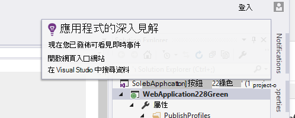

## 4.0 版

### 從 Visual Studio 中的搜尋應用程式的深入見解資料
等應用程式的深入見解入口網站，現在您可以在 Visual Studio 中篩選和事件類型、 屬性值和文字，在搜尋中搜尋功能，然後檢查 [個別的事件。

![[搜尋] 視窗](./media/app-insights-release-notes-vsix/search.png)

### 請參閱從您的本機電腦診斷工具中的資料

您可以檢視您遙測，其他偵錯的資料，除了在 Visual Studio 診斷工具] 頁面上。 僅限 ASP.NET 4.5 功能受支援。

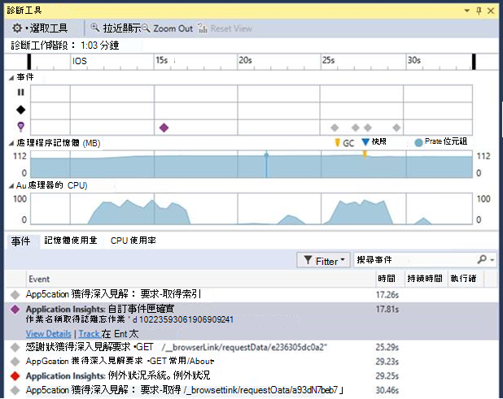

### 新增至專案的 SDK 未登入 Azure

您不再需要登入 Azure 來新增應用程式的深入見解套件至您的專案，請透過**新增專案**] 對話方塊，或從專案操作功能表。 如果您登入，SDK 功能都會安裝並設定為傳送遙測之前入口網站。 如果您沒有登入，SDK 將會新增至您的專案，則會產生遙測診斷集線器。 您可以設定它稍後若要。

![新增專案] 對話方塊](./media/app-insights-release-notes-vsix/newproject.png)

### 裝置支援

在*Connect();* 2015，我們[本項](https://azure.microsoft.com/blog/deep-diagnostics-for-web-apps-with-application-insights/)我們行動開發人員的體驗裝置是 HockeyApp。 HockeyApp 可協助您發佈至您的人員 beta 組建、 收集並分析您的應用程式中，所有當機和直接從您的客戶收集意見反應。
HockeyApp 支援您的應用程式，無論您選擇建立，不論是 iOS、 Android 或 Windows 或跨平台解決方案，例如 Xamarin、 Cordova 或凝聚力的平台上。

在未來的副檔名為應用程式的深入見解的版本類似，我們會介紹 HockeyApp 和 Visual Studio 之間的更多整合式的體驗。 現在，您可以與 HockeyApp 只要加入 NuGet 參考開始。 請參閱詳細資訊的[文件](http://support.hockeyapp.net/kb/client-integration-windows-and-windows-phone)。
