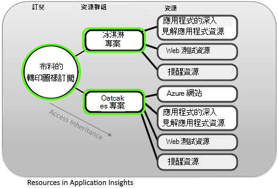
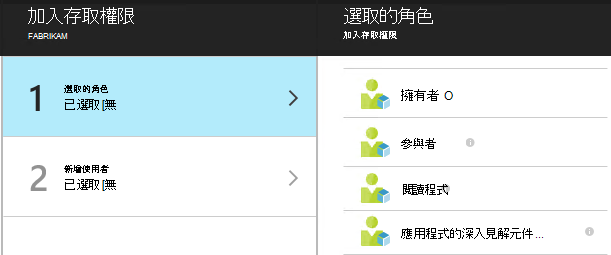
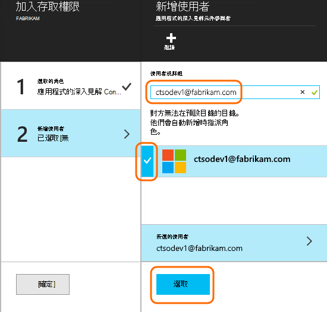

<properties
    pageTitle="資源與角色存取控制中應用程式的深入見解"
    description="擁有人、 參與者及讀者貴組織的觀點。"
    services="application-insights"
    documentationCenter=""
    authors="alancameronwills"
    manager="douge"/>

<tags
    ms.service="application-insights"
    ms.workload="tbd"
    ms.tgt_pltfrm="ibiza"
    ms.devlang="na"
    ms.topic="article"
    ms.date="05/07/2016"
    ms.author="awills"/>

# 資源、 角色及應用程式的深入見解中存取控制

您可以控制誰具有讀取及更新資料的 Visual Studio[應用程式的深入見解]存取[start]，使用[Microsoft Azure 中的角色型存取控制](../active-directory/role-based-access-control-configure.md)。

> [AZURE.IMPORTANT] 在**資源群組或訂閱**您的應用程式資源所屬-不是在本身的資源的使用者指派存取。 **應用程式的深入見解元件參與者**角色指派。 這可確保統一控制 web 測試和提醒，以及您的應用程式資源的存取權。 [進一步瞭解](#access)。

## 資源、 群組及訂閱

首先，某些定義︰

* **資源**-Microsoft Azure 服務的執行個體。 您的應用程式的深入見解資源會收集、 分析及顯示從您的應用程式傳送的遙測資料。  其他類型的 Azure 資源包括 web 應用程式、 資料庫及 Vm。

    若要查看您所有的資源，請移至[Azure 入口網站][portal]、 登入，然後按一下 [瀏覽。

    ![選擇 [瀏覽]，然後 [所有項目，或依應用程式的深入見解篩選](./media/app-insights-resources-roles-access-control/10-browse.png)

* [**資源群組**][ group] -每個資源所屬的群組。 群組是方便的方式來管理相關的資源，特別是 access 控制項。 例如，某個資源群組，您無法將 Web 應用程式、 監視應用程式時，應用程式的深入見解資源，並儲存資源保留匯出的資料。

    ![選擇 [瀏覽]，[資源群組]，然後選擇群組](./media/app-insights-resources-roles-access-control/11-group.png)

* [**訂閱**](https://manage.windowsazure.com)-使用應用程式的深入見解或其他 Azure 的資源，請登入 Azure 的訂閱。 每個資源群組屬於一 Azure 的訂閱，您選擇價格套件及位置，如果是組織的訂閱，請選擇的成員，以及其存取權限。
* [**Microsoft 帳戶**][ account] -使用者名稱和密碼登入 Microsoft Azure 訂閱、 XBox Live、 Outlook.com 及其他 Microsoft 服務使用。

## 在 [資源] 群組中的控制存取權限

請務必瞭解，除了您建立的應用程式的資源，也有另一個隱藏的資源，針對提醒和 web 測試。 附加到相同的[資源群組](#resource-group)應用程式。 您可能也有其他 Azure 服務中放置該位置，例如網站或儲存空間。

若要控制存取這些資源，因此建議︰

* **資源群組或訂閱**層級控制存取權限。
* 將**應用程式的深入見解元件參與者**角色指派給使用者。 這個選項可讓他們編輯 web 測試、 提醒和應用程式的深入見解的資源，但不供存取] 群組中的任何其他服務。

## 若要提供給其他使用者存取

您必須訂閱或 [資源] 群組的擁有者權限。

使用者必須以[Microsoft 帳戶][account]，或其[組織的 Microsoft 帳戶](..\active-directory\sign-up-organization.md)的存取權。 您可以存取的人，也可以定義 Azure Active Directory 中的使用者群組。

#### 瀏覽至 [資源] 群組

新增使用者。

![在您的應用程式資源刀，開啟 [基本資訊、 開啟 [資源] 群組中，和那里選取 [設定/使用者。 按一下 [新增]。](./media/app-insights-resources-roles-access-control/01-add-user.png)

或者，您可以向上另一個層級，將使用者新增至訂閱。

#### 選取的角色

角色 | 在 [資源] 群組
---|---
擁有者 | 可以變更任何項目，包括使用者存取權
參與者 | 可編輯任何項目，包括所有資源
應用程式的深入見解元件參與者 | 可以編輯應用程式的深入見解資源、 web 測試及提醒
閱讀程式 | 可以檢視但無法進行任何變更

「 編輯 」 包含建立、 刪除及更新︰

* 資源
* Web 測試
* 通知
* 連續的匯出

#### 選取使用者

如果您要的使用者不在目錄中，您可以邀請任何人只要有 Microsoft 帳戶。
（如果他們使用 Outlook.com、 OneDrive、 Windows Phone 中，或 XBox Live 等服務時，有 Microsoft 帳戶。）

## 使用者與角色

* [角色存取控制 Azure 中](../active-directory/role-based-access-control-configure.md)

<!--Link references-->

[account]: https://account.microsoft.com
[group]: ../resource-group-overview.md
[portal]: https://portal.azure.com/
[start]: app-insights-overview.md
