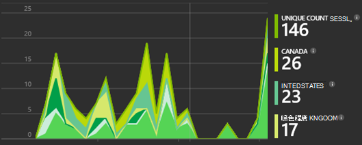

<properties 
    pageTitle="逐步解說︰ 監控 Microsoft Dynamics CRM 與應用程式的深入見解" 
    description="從 Microsoft Dynamics CRM Online 使用應用程式的深入見解取得遙測。 逐步解說過程中，取得資料]、 [視覺效果和 [匯出]。" 
    services="application-insights" 
    documentationCenter=""
    authors="mazharmicrosoft" 
    manager="douge"/>

<tags 
    ms.service="application-insights" 
    ms.workload="tbd" 
    ms.tgt_pltfrm="ibiza" 
    ms.devlang="na" 
    ms.topic="article" 
    ms.date="11/17/2015" 
    ms.author="awills"/>
 
# Microsoft Dynamics CRM Online 使用應用程式的深入見解的逐步解說︰ 啟用遙測

本文將示範如何從[Microsoft Dynamics CRM Online](https://www.dynamics.com/)取得遙測資料使用[Visual Studio 應用程式深入資訊](https://azure.microsoft.com/services/application-insights/)。 我們會逐步完成程序，將應用程式的深入見解指令碼新增至您的應用程式的擷取資料，以及資料視覺效果。

>[AZURE.NOTE] [瀏覽範例方案](https://dynamicsandappinsights.codeplex.com/)。

## 將應用程式深入資訊新增至新的或現有 CRM Online 執行個體 

若要監控您的應用程式，您可以新增的應用程式的深入見解 SDK 應用程式。 SDK 傳送遙測至[應用程式的深入見解入口網站](https://portal.azure.com)，您可以在其中使用我們的功能強大的分析和診斷工具，或將資料匯出至儲存空間。

### Azure 中建立的應用程式的深入見解資源

1. 取得[Microsoft Azure 中的帳戶](http://azure.com/pricing)。 
2. 登入[Azure 入口網站](https://portal.azure.com)，並新增新的應用程式的深入見解資源。 這是處理及顯示您的資料。

    

    您可以選擇 [ASP.NET 為應用程式類型。

3. 開啟 [快速入門] 索引標籤，然後開啟 [程式碼指令碼。

    

**請在 [程式碼] 頁面保持開啟**時執行下一個步驟另一個瀏覽器視窗中。 您需要的程式碼推出。 

### 在 Microsoft Dynamics CRM 建立 JavaScript web 資源

1. 開啟您 CRM Online 執行個體並登入具有管理員權限。
2. 開啟 Microsoft Dynamics CRM 設定]，[自訂項目，自訂系統

    
    
    

    

3. 建立 JavaScript 資源。

    

    名稱**(JScript) 的指令碼**，然後選取開啟文字編輯器。

    
    
4. 複製程式碼，從 [應用程式的深入見解。 複製時請務必略過的指令碼標記。 請參閱下方的螢幕擷取畫面︰

    

    程式碼包含識別您的應用程式的深入見解資源的儀器索引鍵。

5. 儲存並發佈]。

    

### 樂器表單

1. 在 Microsoft CRM Online 中，開啟客戶表單

    

2. 開啟表單屬性

    

3. 新增您所建立的 JavaScript 網頁資源

    

    

4. 儲存並發佈您的自訂表單]。

## 擷取的指標

您現在已設定遙測擷取表單。 只要使用時，資料便會傳送給您的應用程式的深入見解資源。

以下是您會看到之資料的範例。

#### 應用程式健康狀況

在瀏覽器例外狀況︰

按一下圖表，好讓更多詳細資料︰

#### 使用方式

#### 瀏覽器

#### 地理位置

#### 內的網頁檢視要求

## 程式碼範例

[瀏覽程式碼範例](https://dynamicsandappinsights.codeplex.com/)。

## Power BI

您可以執行更深入分析，如果您[將資料匯出至 Microsoft Power BI](app-insights-export-power-bi.md)。

## 範例 Microsoft Dynamics CRM 方案

[以下是範例方案實作於 Microsoft Dynamics CRM](https://dynamicsandappinsights.codeplex.com/)。

## 深入瞭解

* [什麼是應用程式的深入見解？](app-insights-overview.md)
* [應用程式獲得深入見解的網頁](app-insights-javascript.md)
* [更多範例與逐步解說](app-insights-code-samples.md)

 
