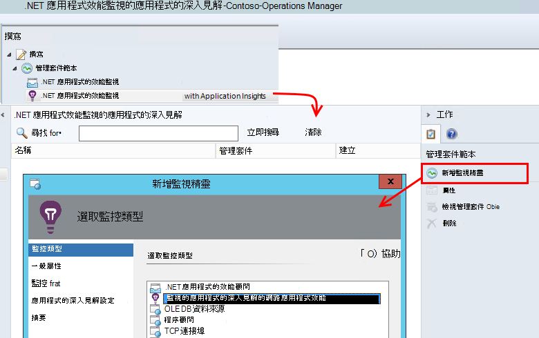
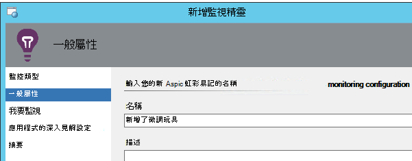
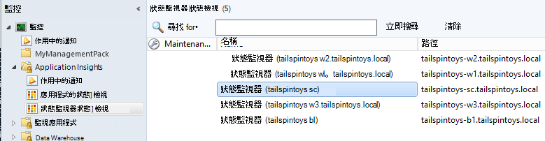

<properties 
    pageTitle="與應用程式的深入見解的是 SCOM 整合 |Microsoft Azure" 
    description="如果您是 SCOM 使用者，監控效能和診斷應用程式的深入見解的問題。 完整的儀表板、 智慧提醒、 強大的診斷工具及分析查詢。" 
    services="application-insights" 
    documentationCenter=""
    authors="alancameronwills" 
    manager="douge"/>

<tags 
    ms.service="application-insights" 
    ms.workload="tbd" 
    ms.tgt_pltfrm="ibiza" 
    ms.devlang="na" 
    ms.topic="article" 
    ms.date="08/12/2016" 
    ms.author="awills"/>
 
# 應用程式使用的是 SCOM 的應用程式的深入見解監控效能

如果您是系統管理中心的作業管理員 (SCOM) 使用來管理您的伺服器時，您可以監視效能，並診斷效能問題的[Visual Studio 應用程式獲得深入見解](app-insights-asp-net.md)協助。 應用程式的深入見解監視 web 應用程式的傳入要求輸出其餘和 SQL 通話、 例外]，與記錄追蹤。 在此遙測公制的圖表和智慧通知，以及強大的診斷搜尋分析查詢與提供儀表板。 

您可以切換使用的是 SCOM 管理封包監視的應用程式的深入見解。

## 在您開始之前

我們假設︰

* 您熟悉是 SCOM，而且您使用是 SCOM 2012 R2 或 2016年來管理您的 IIS 網頁伺服器。
* 您已安裝在伺服器上您要監視的應用程式的深入見解的 web 應用程式。
* 應用程式架構版本是.NET 4.5 或更新版本。
* 您的訂閱存取[Microsoft Azure](https://azure.com)中，而且可以登入[Azure 入口網站](https://portal.azure.com)。 您的組織可能有訂閱，並可以新增您的 Microsoft 帳戶。

（開發團隊可能會建立[應用程式的深入見解 SDK](app-insights-asp-net.md)到 web 應用程式。 此建立時間儀器可讓他們在撰寫自訂遙測更大的彈性。 不過，不論︰ 您可以遵循使用或不 SDK 內建於此處所述的步驟。)

## （一次）安裝應用程式的深入見解管理套件

您用來執行 Operations Manager 電腦︰

2. 解除安裝 management pack 中，任何舊版本︰
 1. 在 Operations Manager，開啟 [管理] 管理組件]。 
 2. 刪除舊的版本。
1. 下載並安裝管理封包從目錄。
2. 重新啟動 Operations Manager。

## 建立管理組件

1. Operations Manager 開啟**撰寫**、 **.NET...與應用程式的深入見解**、**新增監視精靈**]，然後再次選擇 [ **.NET...與應用程式的深入見解**。

    

2. 名稱之後您的應用程式的設定。 （需要追蹤記錄一次的其中一個應用程式。）
    
    

3. 在同一個精靈頁面上，建立新的管理套件，或選取您先前建立的應用程式的深入見解套件]。

     （應用程式的深入見解[管理組件](https://technet.microsoft.com/library/cc974491.aspx)為的範本，建立執行個體。 您可以重複使用相同的執行個體稍後。）

    ![在 [一般] 索引標籤中，輸入應用程式的名稱。 按一下 [新增]，然後輸入管理套件的名稱。 按一下 [確定]，然後按一下 [下一步]。](./media/app-insights-scom/040.png)

4. 選擇您想要監視的其中一個應用程式。 搜尋功能會搜尋您的伺服器上安裝應用程式之間。

    ![在監視器] 索引標籤，按一下 [新增]、 輸入應用程式名稱的一部分，按一下 [搜尋]，應用程式中，選擇，然後選擇 [新增]，[確定]。](./media/app-insights-scom/050.png)

    [選擇性的監控領域] 欄位可以用於指定子集合的伺服器，如果您不想要監視的應用程式中所有的伺服器。

5. 在下一個精靈頁面上，您必須先提供您的認證登入 Microsoft Azure。

    在此頁面上，您可以選擇您要遙測資料分析，顯示應用程式的深入見解資源。 

 * 如果應用程式的深入見解設定應用程式開發期間，請選取 [現有的資源。
 * 否則，建立新的資源應用程式的名稱。 如果有相同的系統元件的其他應用程式，請將它們放在同一個資源群組中，方便存取遙測來管理。

    您可以在稍後變更這些設定。

    ![在應用程式的深入見解設定] 索引標籤上按一下 [登入]，並提供您的 Microsoft 帳戶認證的 Azure。 請選擇訂閱資源] 群組中，與資源。](./media/app-insights-scom/060.png)

6. 完成精靈。

    ![按一下 [建立]](./media/app-insights-scom/070.png)
    
重複此程序的每一個您要監視的應用程式。

如果您需要變更設定之後，請重新開啟的視窗中撰寫監視器的內容。

![在 [製作] 選取.NET 應用程式效能監視的應用程式的深入見解、 選取監視器，然後按一下屬性。](./media/app-insights-scom/080.png)

## 驗證監控

您在每個伺服器上安裝應用程式的搜尋監視器。 其位置找到應用程式時，會設定監視應用程式的應用程式的深入見解狀態監視器。 必要時，它第一次安裝狀態監視器在伺服器上。

您可以驗證找到的應用程式的執行個體︰

## 在 [應用程式的深入見解的檢視遙測

在[Azure 入口網站](https://portal.azure.com)中，瀏覽至您的應用程式的資源。 [請參閱圖表顯示遙測](app-insights-dashboards.md)的應用程式。 （如果其尚未頁面上顯示主要尚未，按一下即時指標串流）。

## 後續步驟

* 為運用最重要的圖表監控這及其他應用程式的 [[設定儀表板](app-insights-dashboards.md)]。
* [深入了解指標](app-insights-metrics-explorer.md)
* [設定提醒](app-insights-alerts.md)
* [診斷效能問題](app-insights-detect-triage-diagnose.md)
* [查詢功能強大的分析](app-insights-analytics.md)
* [可用性 web 測試](app-insights-monitor-web-app-availability.md)
