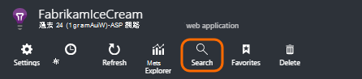
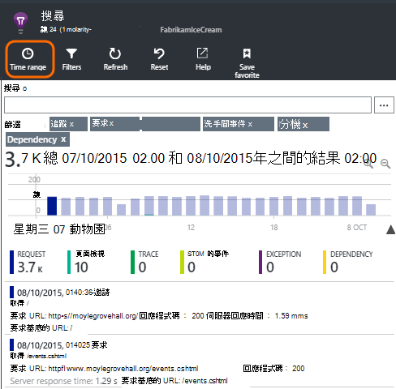
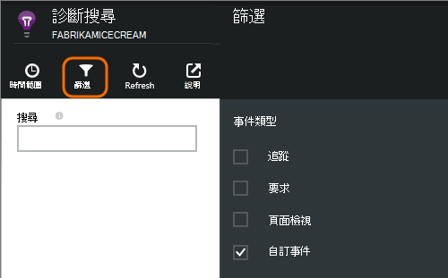
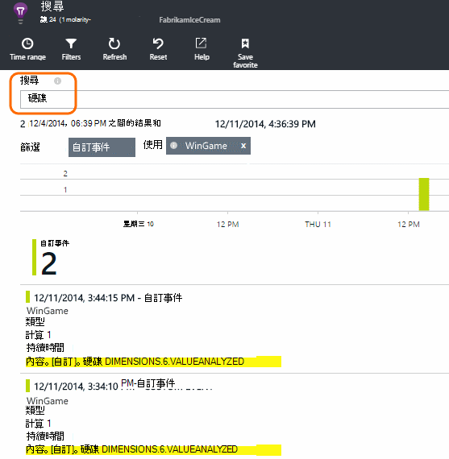
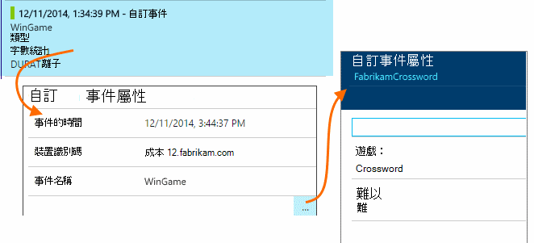
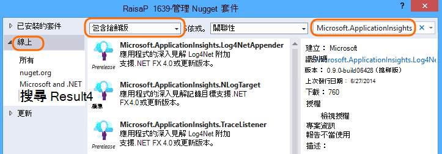
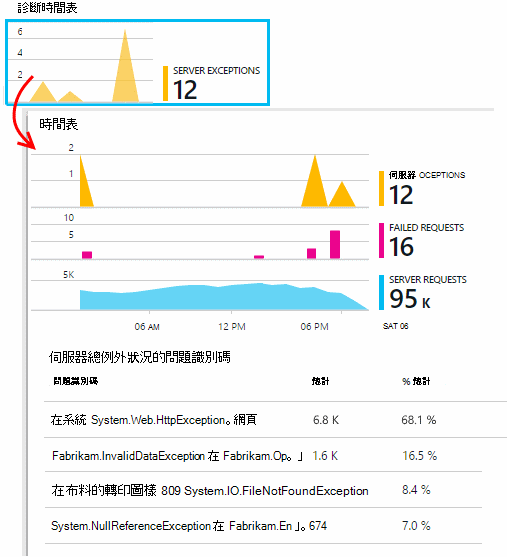
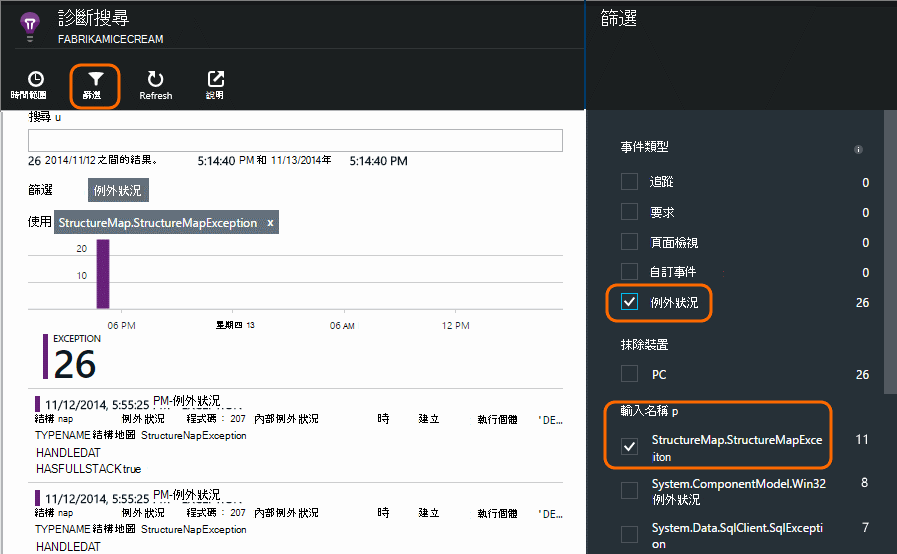

<properties 
    pageTitle="記錄檔、 例外狀況和自訂診斷 ASP.NET 在應用程式的深入見解" 
    description="藉由搜尋邀請、 例外狀況及追蹤、 NLog，或 Log4Net 產生的記錄診斷 ASP.NET web 應用程式的問題。" 
    services="application-insights" 
    documentationCenter=""
    authors="alancameronwills" 
    manager="douge"/>

<tags 
    ms.service="application-insights" 
    ms.workload="tbd" 
    ms.tgt_pltfrm="ibiza" 
    ms.devlang="na" 
    ms.topic="article" 
    ms.date="04/08/2016" 
    ms.author="awills"/>
 
# 記錄檔、 例外狀況和自訂診斷 ASP.NET 在應用程式的深入見解

[應用程式的深入見解][start]包含強大的[診斷搜尋][diagnostic]工具可讓您瀏覽並切入遙測寄件者的應用程式的深入見解 SDK，您的應用程式。 許多的事件，例如使用者] 頁面檢視會自動傳送 SDK。

您也可以撰寫程式碼，以傳送自訂事件、 例外狀況報告及追蹤。 然後，如果您已使用的記錄架構，例如 log4J、 log4net、 NLog 或 System.Diagnostics.Trace，您可以擷取這些記錄，並將其包含在搜尋]。 如此可讓您輕鬆地建立記錄追蹤使用者動作、 例外狀況及其他事件的關聯。

## 撰寫自訂遙測之前

如果您還未[設定專案的應用程式獲得深入見解][start]，現在執行這項作業。

當您執行應用程式，它將會傳送會顯示在診斷搜尋，包括收到的伺服器時，要求一些遙測頁面檢視在用戶端，登入並無法攔截例外狀況。

開啟 [診斷的搜尋，請參閱自動傳送給 SDK 遙測。

詳細資料到另一個值可能會與一個應用程式類型。 您可以按一下任何個別的事件，以取得更多詳細資料。

## 範例 

如果您的應用程式傳送大量資料，您使用的應用程式的深入見解 SDK ASP.NET 版本 2.0.0-beta3 或更新版本，調整取樣功能可能運作，然後傳送您遙測的百分比。 [進一步瞭解範例。](app-insights-sampling.md)

##自訂事件

自訂事件會顯示在[診斷搜尋][ diagnostic] ，以及 [[公制總管][metrics]。 您可以將其傳送從裝置、 網頁和伺服器應用程式。 他們可以用診斷和了解[使用模式][track]。

自訂事件有一個名稱，然後也可以執行屬性，您可以篩選，與數字的度量單位。

在用戶端 JavaScript

    appInsights.trackEvent("WinGame",
         // String properties:
         {Game: currentGame.name, Difficulty: currentGame.difficulty},
         // Numeric measurements:
         {Score: currentGame.score, Opponents: currentGame.opponentCount}
         );

C# 伺服器

    // Set up some properties:
    var properties = new Dictionary <string, string> 
       {{"game", currentGame.Name}, {"difficulty", currentGame.Difficulty}};
    var measurements = new Dictionary <string, double>
       {{"Score", currentGame.Score}, {"Opponents", currentGame.OpponentCount}};

    // Send the event:
    telemetry.TrackEvent("WinGame", properties, measurements);

VB 伺服器

    ' Set up some properties:
    Dim properties = New Dictionary (Of String, String)
    properties.Add("game", currentGame.Name)
    properties.Add("difficulty", currentGame.Difficulty)

    Dim measurements = New Dictionary (Of String, Double)
    measurements.Add("Score", currentGame.Score)
    measurements.Add("Opponents", currentGame.OpponentCount)

    ' Send the event:
    telemetry.TrackEvent("WinGame", properties, measurements)

### 執行您的應用程式，並檢視結果。

開啟 [診斷搜尋。

選取自訂事件，然後選取特定的事件名稱。

篩選多個藉由輸入搜尋字詞屬性值上的資料。  

深入瞭解個別的事件，查看其詳細的內容。

##頁面檢視

頁面檢視遙測由[您在網頁中插入 JavaScript]片段 trackPageView() 通話傳送[usage]。 主要目的是參與的網頁檢視您在 [概觀] 頁面上看到的計數。

通常稱為一次在每個 HTML 頁面上，但您可以插入更多來電-例如，如果您有單一頁面應用程式，且您想要記錄新頁面時，使用者會取得更多資料。

    appInsights.trackPageView(pageSegmentName, "http://fabrikam.com/page.htm"); 

有時很有用附加為搜尋診斷] 中的篩選，您可以使用的內容︰

    appInsights.trackPageView(pageSegmentName, "http://fabrikam.com/page.htm",
     {Game: currentGame.name, Difficulty: currentGame.difficulty});

##追蹤遙測

追蹤遙測是建立診斷記錄，以便於您插入的程式碼。 

例如，您可以插入通話，像這樣︰

    var telemetry = new Microsoft.ApplicationInsights.TelemetryClient();
    telemetry.TrackTrace("Slow response - database01");

####  安裝您記錄架構介面卡

您也可以搜尋記錄產生的記錄架構-log4Net NLog 或 System.Diagnostics.Trace。 

1. 如果您打算使用 log4Net 或 NLog，則會安裝在您的專案。 
2. 在方案總管中，以滑鼠右鍵按一下您的專案，然後選擇 [**管理 NuGet 套件**。
3. 選取 [線上 > 全部]，選取 [**包含搶鮮版**及搜尋 「 Microsoft.ApplicationInsights 」

    

4. 選取適當的套件-下列其中一項︰
  + Microsoft.ApplicationInsights.TraceListener （若要擷取 System.Diagnostics.Trace 來電）
  + Microsoft.ApplicationInsights.NLogTarget
  + Microsoft.ApplicationInsights.Log4NetAppender

NuGet 套件安裝必要的組件，也會修改 web.config 或 app.config。

#### 插入診斷記錄通話

如果您使用 System.Diagnostics.Trace 時，會使用一般電話︰

    System.Diagnostics.Trace.TraceWarning("Slow response - database01");

如果您想 log4net 或 NLog:

    logger.Warn("Slow response - database01");

在 [偵錯模式中執行您的應用程式，或將其部署。

當您選取 [追蹤] 篩選時，您會看到診斷搜尋中的郵件。

### 例外狀況

取得應用程式的深入見解中的例外狀況報告提供強大的體驗，，尤其是您可以瀏覽失敗的要求與例外]，並閱讀例外狀況堆疊。

在某些情況下，您需要[插入幾行程式碼][ exceptions] ，請確定您的例外狀況會自動被攔截。

您也可以撰寫傳送例外狀況遙測明確的程式碼︰

JavaScript

    try 
    { ...
    }
    catch (ex)
    {
      appInsights.TrackException(ex, "handler loc",
        {Game: currentGame.Name, 
         State: currentGame.State.ToString()});
    }

C#

    var telemetry = new TelemetryClient();
    ...
    try 
    { ...
    }
    catch (Exception ex)
    {
       // Set up some properties:
       var properties = new Dictionary <string, string> 
         {{"Game", currentGame.Name}};

       var measurements = new Dictionary <string, double>
         {{"Users", currentGame.Users.Count}};

       // Send the exception telemetry:
       telemetry.TrackException(ex, properties, measurements);
    }

VB

    Dim telemetry = New TelemetryClient
    ...
    Try
      ...
    Catch ex as Exception
      ' Set up some properties:
      Dim properties = New Dictionary (Of String, String)
      properties.Add("Game", currentGame.Name)

      Dim measurements = New Dictionary (Of String, Double)
      measurements.Add("Users", currentGame.Users.Count)
  
      ' Send the exception telemetry:
      telemetry.TrackException(ex, properties, measurements)
    End Try

屬性和度量單位的參數是選擇性的但適用於篩選及新增額外資訊。 比方說，如果您有一個應用程式，可以執行數個遊戲，您無法找到特定遊戲相關的所有例外狀況報表。 您可以新增您要每個字典數目的項目。

#### 檢視例外狀況

您會看到的例外狀況報告概觀刀，摘要，然後您可以按一下以查看更多詳細資料。 例如︰

[]

按一下任何例外狀況類型] 以查看特定項目︰

[]

您也可以直接開啟診斷搜尋、 篩選例外]，並選擇您想要查看的例外狀況類型。

### 報表的例外狀況

應用程式的深入見解報表無法處理的例外狀況讓它可以從[網頁瀏覽器]的裝置[usage]，或網頁伺服器是否檢測[狀態]監視器[redfield]或[應用程式的深入見解 SDK][greenbrown]。 

不過，並不能執行此動作在某些情況下，因為.NET framework 攔截例外狀況。  若要確保您會看到所有的例外狀況，因此您必須撰寫小型例外狀況處理常式。 最佳的程序會隨著技術。 請參閱[asp.net 的例外狀況遙測][exceptions]如需詳細資訊。 

### 建立與相互關聯

當您讀取診斷記錄時，可能是即時的程式碼部署後，會變更您的程式碼。

因此，是版本的將建立的資訊，例如目前的 URL 放入的屬性，以及每個例外狀況或追蹤很有用。 

而不是個別新增屬性，每個例外狀況通話，您可以設定預設內容中的資訊。 

    // Telemetry initializer class
    public class MyTelemetryInitializer : ITelemetryInitializer
    {
        public void Initialize (ITelemetry telemetry)
        {
            telemetry.Properties["AppVersion"] = "v2.1";
        }
    }

應用程式初始設定式 Global.asax.cs 例如︰

    protected void Application_Start()
    {
        // ...
        TelemetryConfiguration.Active.TelemetryInitializers
        .Add(new MyTelemetryInitializer());
    }

###伺服器網頁要求

要求遙測會自動傳送當您[安裝在您的網頁伺服器上的狀態監視器][redfield]，或當您[新增應用程式至網頁專案的深入見解][greenbrown]。 它也摘要到邀請及回應時間圖表公制檔案總管中，然後在 [概觀] 頁面。

如果您想要傳送其他事件，您可以使用 TrackRequest() API。

## 問與答

### 我收到 「 儀器鍵不是空白 」 錯誤

您沒有安裝應用程式的深入見解安裝記錄介面卡 Nuget 套件看起來。

在方案總管中，以滑鼠右鍵按一下`ApplicationInsights.config`，然後選擇 [**更新應用程式深入資訊**。 您會收到邀請您登入 Azure] 對話方塊，然後建立應用程式的深入見解資源，或重複使用現有的項目。 這樣應該修正問題。

### 要保留的資料量？

最多 500 個秒每個應用程式的事件。 仍會保留七天的事件。

### 我的事件或追蹤的部分不會出現

如果您的應用程式傳送大量資料，您使用的應用程式的深入見解 SDK ASP.NET 版本 2.0.0-beta3 或更新版本，調整取樣功能可能運作，然後傳送您遙測的百分比。 [進一步瞭解範例。](app-insights-sampling.md)

## 後續步驟

* [設定可用性和回應速度測試][availability]
* [疑難排解][qna]

<!--Link references-->

[availability]: app-insights-monitor-web-app-availability.md
[diagnostic]: app-insights-diagnostic-search.md
[exceptions]: app-insights-asp-net-exceptions.md
[greenbrown]: app-insights-asp-net.md
[metrics]: app-insights-metrics-explorer.md
[qna]: app-insights-troubleshoot-faq.md
[redfield]: app-insights-monitor-performance-live-website-now.md
[start]: app-insights-overview.md
[track]: app-insights-api-custom-events-metrics.md
[usage]: app-insights-web-track-usage.md

 
