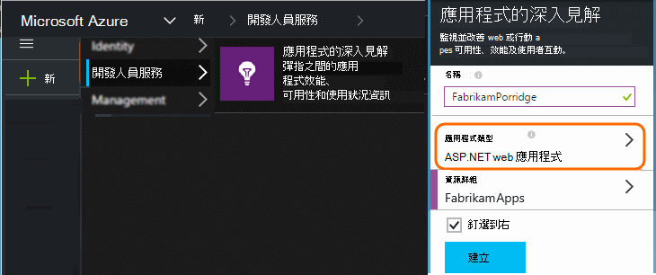
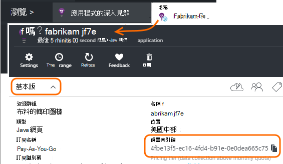

<properties 
    pageTitle="開發、 測試和實際的另一個應用程式的深入見解資源" 
    description="監視效能與應用程式在不同的階段開發的使用方式" 
    services="application-insights" 
    documentationCenter=""
    authors="alancameronwills" 
    manager="douge"/>

<tags 
    ms.service="application-insights" 
    ms.workload="tbd" 
    ms.tgt_pltfrm="ibiza" 
    ms.devlang="na" 
    ms.topic="article" 
    ms.date="05/04/2016" 
    ms.author="awills"/>

# 分隔應用程式的深入見解資源

應從不同的元件和應用程式版本遙測傳送到不同的應用程式的深入見解資源，或合併成一個？ 這篇文章的外觀最佳作法和必要的技巧。

首先，現在就讓我們瞭解問題。 從您的應用程式收到的資料會儲存並處理 Microsoft Azure*資源*中的應用程式的深入見解。 每個資源識別*儀器鍵*(iKey)。 在您的應用程式鍵提供應用程式的深入見解 sdk 的變更，讓它可以傳送正確的資源收集的資料。 在 [程式碼或 ApplicationInsights.config 時，可提供索引鍵。 藉由變更 SDK 的按鍵，您可以直接前往其他資源的資料。 

在簡單的情況下，當您建立新的應用程式，程式碼時還建立應用程式的深入見解中新的資源。 在 Visual Studio 中，*新增專案*] 對話方塊會為您。

如果這是大量的網站，它可能會部署上一個以上的伺服器執行個體。

在更複雜的情況下，您有系統上所建立的多個元件-，例如網站] 和 [後端處理器。 

## 使用不同的 iKeys

以下是一些的一般指導方針︰

* 您有一組伺服器執行個體，可縮放向上鍵/向下其他元件，亦執行，然後您通常會對應的到單一資源-可獨立部署應用程式單位即會有單一儀器鍵 (iKey)。
* 相反地，使用另一個 iKeys 的原因包括︰
 - 從不同的元件，輕鬆地讀取個別的指標。
 - 保持較低大量遙測大量的不同，以便節流、 配額，與上一個資料流取樣不影響其他。
 - 另一個通知、 匯出和工作項目設定。
 - 散佈[限制](app-insights-pricing.md#limits-summary)，例如遙測配額、 節流，和 web 測試計數。
 - 開發的程式碼並測試應該傳送至另一個 iKey 比生產戳記。  

應用程式的深入見解入口網站體驗許多會記住這些指導方針設計。 例如，伺服器檢視伺服器執行個體，瞭解其中一個邏輯元件可能來自幾個伺服器執行個體的遙測進行假設區段。

## 單一 iKey

在您傳送遙測從多個元件以單一 iKey:

* 新增可讓您將區段及篩選的元件身分識別的所有遙測屬性。 角色識別碼會自動新增至遙測從伺服器角色執行個體，但有時候您可以使用[遙測初始設定](app-insights-api-filtering-sampling.md#add-properties)，若要新增的屬性。
* 同時更新應用程式的深入見解 Sdk 中不同的元件。 遙測的一個 iKey 應該產生的同一版本的 SDK。

## 個別 iKeys

您有多個 iKeys 不同的應用程式元件︰

* 建立檢視的重要遙測[儀表板](app-insights-dashboards.md)從邏輯應用程式，結合從不同的應用程式元件。 可以共用儀表板，因此單一邏輯系統檢視可讓不同小組。
* 組織小組層級的[資源群組](app-insights-resources-roles-access-control.md)。 存取權限由指派資源] 群組中，，包括設定提醒的權限。 
* 使用[Azure 資源管理員範本與 Powershell](app-insights-powershell.md)協助管理成品，例如通知的規則，以及網頁測試。

## 開發/測試和生產的個別 iKeys

要輕鬆放開您的應用程式時，就會自動變更索引鍵，在程式碼，iKey 而不是 ApplicationInsights.config。

### 動態儀器索引鍵

初始設定方法，例如 global.aspx.cs ASP.NET 服務中設定機碼︰

*C#*

    protected void Application_Start()
    {
      Microsoft.ApplicationInsights.Extensibility.
        TelemetryConfiguration.Active.InstrumentationKey = 
          // - for example -
          WebConfigurationManager.AppSettings["ikey"];
      ...

在此範例中，針對不同的資源 ikeys 會放在不同版本的 web 設定檔。 交換 web 設定檔-您可以為發行指令碼的部分-將會交換目標資源。

### 網頁

IKey 也會在您的應用程式中的網頁，[從 [快速入門刀取得的指令碼](app-insights-javascript.md)中使用。 而非如實到指令碼編碼，請從伺服器狀態產生。 例如，在 ASP.NET 應用程式︰

*在 [Razor JavaScript*

    <script type="text/javascript">
    // Standard Application Insights web page script:
    var appInsights = window.appInsights || function(config){ ...
    // Modify this part:
    }({instrumentationKey:  
      // Generate from server property:
      "@Microsoft.ApplicationInsights.Extensibility.
         TelemetryConfiguration.Active.InstrumentationKey"
    }) // ...

## 建立其他應用程式的深入見解資源
  
如果您決定要分隔遙測不同的應用程式元件，或相同元件的不同戳記 （開發/測試/生產），然後您必須建立新的應用程式的深入見解資源。

在[portal.azure.com](https://portal.azure.com)中，新增應用程式的深入見解資源︰

* **應用程式類型**會影響您看到概觀刀和[公制的檔案總管](app-insights-metrics-explorer.md)中可用的屬性。 如果您沒有看到您的應用程式類型，選擇一種網頁類型的網頁。
* **資源群組**是方便使用管理內容，例如[access 控制項](app-insights-resources-roles-access-control.md)。 您可以使用不同的資源群組開發、 測試和生產。
* **訂閱**的付款 Azure 帳戶。
* **位置**是我們保留您的資料的位置。 目前就無法變更。 
* **新增至 [儀表板**會將您的資源的快速存取磚 Azure 首頁。 

建立資源需要幾秒鐘。 完成之後，您會看到通知。

（您可以撰寫的[PowerShell 指令碼](app-insights-powershell-script-create-resource.md)自動建立資源）。

## 快速儀器索引鍵

儀器鍵識別您建立的資源。 

您需要的所有資源的應用程式會傳送資料儀器鍵。

 
