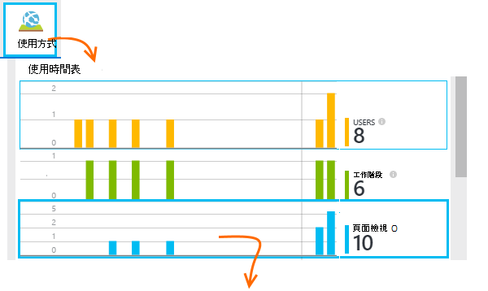

<properties 
    pageTitle="監視使用應用程式的深入見解的 SharePoint 網站" 
    description="開始使用新的儀器金鑰監視新的應用程式" 
    services="application-insights" 
    documentationCenter=""
    authors="alancameronwills" 
    manager="douge"/>

<tags 
    ms.service="application-insights" 
    ms.workload="tbd" 
    ms.tgt_pltfrm="ibiza" 
    ms.devlang="na" 
    ms.topic="article" 
    ms.date="03/24/2016" 
    ms.author="awills"/>

# <a name="monitor-a-sharepoint-site-with-application-insights"></a>監視使用應用程式的深入見解的 SharePoint 網站


Visual Studio 應用程式獲得深入見解監視可用性、 效能及相關應用程式的使用方式。 這裡，您將學習如何將其設定為在 SharePoint 網站。


## <a name="create-an-application-insights-resource"></a>建立應用程式的深入見解資源


在[Azure 入口網站](https://portal.azure.com)中，建立新的應用程式的深入見解資源。 您可以選擇 [ASP.NET 為應用程式類型。


隨後便會開啟刀是，您會看到效能與使用情況資料的相關應用程式的位置。 若要返回至下一次您登入 Azure，您應該在 [開始] 畫面上，找到磚。 或者按一下 [瀏覽] 尋找它。
    


## <a name="add-our-script-to-your-web-pages"></a>將指令碼新增至網頁

在 [快速入門中，取得網頁中的指令碼︰


之前插入指令碼&lt;/向&gt;您想要追蹤每頁的標籤。 如果您的網站] 主版頁面，您可以那里將指令碼。 例如 ASP.NET MVC 專案中您想要將其放在 View\Shared\_Layout.cshtml

指令碼包含指示給您的應用程式的深入見解資源遙測儀器鍵。

### <a name="add-the-code-to-your-site-pages"></a>將程式碼新增至您的網站頁面

#### <a name="on-the-master-page"></a>在主版頁面

如果您可以編輯網站的主版頁面，將提供監控網站中的每一頁。

請查看主版頁面，並使用 SharePoint Designer 或任何其他的編輯器來編輯。


新增代碼之前</head>標籤。 


#### <a name="or-on-individual-pages"></a>或在個別頁面

若要監視有限的頁面，請將指令碼分別每個頁面。 

插入網頁組件，並將其內嵌程式碼片段。


## <a name="view-data-about-your-app"></a>檢視您的應用程式的相關的資料

重新部署您的應用程式。

返回您的應用程式刀[Azure 入口網站](https://portal.azure.com)中。

第一個事件會出現在搜尋中。 


如果您預期更多資料，請按一下 [重新整理，數秒後的]。

從概觀刀中，按一下 [若要查看的使用者、 工作階段和網頁檢視圖表的**使用狀況分析**︰



按一下任何圖表，請參閱更多詳細資料集，例如 [頁面檢視︰


或使用者︰


## <a name="capturing-user-id"></a>擷取的使用者識別碼


標準網頁程式碼片段不擷取的使用者識別碼，從 SharePoint，但您可以執行的小型修改。


1. 您的應用程式儀器鍵複製基礎下拉式清單中的應用程式的深入見解。 


    

2. 在下列程式碼片段 'XXXX' 取代儀器鍵。 
3. 內嵌您的 SharePoint 應用程式，而不是您從入口網站取得的程式碼片段指令碼。


```


<SharePoint:ScriptLink ID="ScriptLink1" name="SP.js" runat="server" localizable="false" loadafterui="true" /> 
<SharePoint:ScriptLink ID="ScriptLink2" name="SP.UserProfiles.js" runat="server" localizable="false" loadafterui="true" /> 
  
<script type="text/javascript"> 
var personProperties; 
  
// Ensure that the SP.UserProfiles.js file is loaded before the custom code runs. 
SP.SOD.executeOrDelayUntilScriptLoaded(getUserProperties, 'SP.UserProfiles.js'); 
  
function getUserProperties() { 
    // Get the current client context and PeopleManager instance. 
    var clientContext = new SP.ClientContext.get_current(); 
    var peopleManager = new SP.UserProfiles.PeopleManager(clientContext); 
     
    // Get user properties for the target user. 
    // To get the PersonProperties object for the current user, use the 
    // getMyProperties method. 
    
    personProperties = peopleManager.getMyProperties(); 
  
    // Load the PersonProperties object and send the request. 
    clientContext.load(personProperties); 
    clientContext.executeQueryAsync(onRequestSuccess, onRequestFail); 
} 
     
// This function runs if the executeQueryAsync call succeeds. 
function onRequestSuccess() { 
var appInsights=window.appInsights||function(config){
function s(config){t[config]=function(){var i=arguments;t.queue.push(function(){t[config].apply(t,i)})}}var t={config:config},r=document,f=window,e="script",o=r.createElement(e),i,u;for(o.src=config.url||"//az416426.vo.msecnd.net/scripts/a/ai.0.js",r.getElementsByTagName(e)[0].parentNode.appendChild(o),t.cookie=r.cookie,t.queue=[],i=["Event","Exception","Metric","PageView","Trace"];i.length;)s("track"+i.pop());return config.disableExceptionTracking||(i="onerror",s("_"+i),u=f[i],f[i]=function(config,r,f,e,o){var s=u&&u(config,r,f,e,o);return s!==!0&&t["_"+i](config,r,f,e,o),s}),t
    }({
        instrumentationKey:"XXXX"
    });
    window.appInsights=appInsights;
    appInsights.trackPageView(document.title,window.location.href, {User: personProperties.get_displayName()});
} 
  
// This function runs if the executeQueryAsync call fails. 
function onRequestFail(sender, args) { 
} 
</script> 


```


## <a name="next-steps"></a>後續步驟

* 監控網站的可用性[web 測試](app-insights-monitor-web-app-availability.md)。

* 針對其他類型的應用程式的[應用程式的深入見解](app-insights-overview.md)。


<!--Link references-->


 