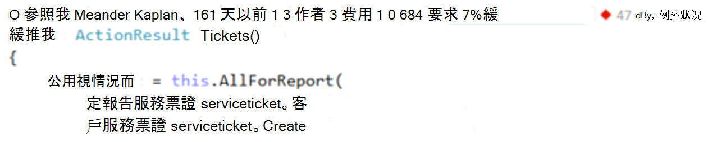
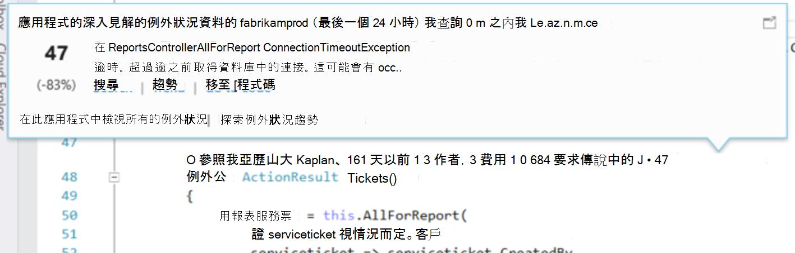
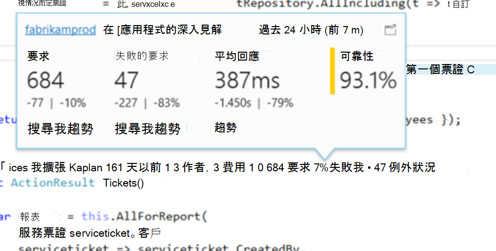
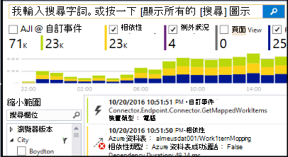

<properties 
    pageTitle="在 Visual Studio CodeLens 應用程式的深入見解遙測 |Microsoft Azure" 
    description="快速存取 CodeLens Visual Studio 中使用您的應用程式的深入見解要求與例外狀況遙測。" 
    services="application-insights" 
    documentationCenter=".net"
    authors="numberbycolors" 
    manager="douge"/>

<tags 
    ms.service="application-insights" 
    ms.workload="tbd" 
    ms.tgt_pltfrm="ibiza" 
    ms.devlang="na" 
    ms.topic="get-started-article" 
    ms.date="08/30/2016" 
    ms.author="daviste"/>
    
# 在 Visual Studio CodeLens 應用程式的深入見解遙測

在 web 應用程式碼中的方法可以遙測執行階段例外狀況的相關附註，並要求回應時間。 如果您在應用程式中安裝[Visual Studio 應用程式獲得深入見解](app-insights-overview.md)，遙測會出現在 Visual Studio [CodeLens](https://msdn.microsoft.com/library/dn269218.aspx) -頂端的每個您要用於看到參照有用的資訊例如的數位數的函數的函數或編輯它的最後一個人員的筆記。

> [AZURE.NOTE] 應用程式中 CodeLens 的深入資訊是用於 Visual Studio 2015 更新 3 及更新版本，或[開發人員分析工具延伸模組](https://visualstudiogallery.msdn.microsoft.com/82367b81-3f97-4de1-bbf1-eaf52ddc635a)的最新版本。 在 Visual Studio 企業及專業人員版本中使用 CodeLens。

## 若要尋找應用程式的深入見解資料的位置

尋找應用程式的深入見解遙測在 web 應用程式的公用要求方法 CodeLens 標記。 CodeLens 標記會顯示上述方法和其他宣告 C# 和 Visual Basic 程式碼。 如果應用程式的深入見解的資料是可用的方法，您會看到標記要求和例外狀況，例如 「 100 要求，1%失敗 」 或 「 10 個例外狀況 」。 按一下 [更多詳細資料的 CodeLens 指標]。 

> [AZURE.TIP] 要求應用程式的深入見解和例外狀況指標可能需要幾個額外的秒數載入後其他 CodeLens 標記會顯示。

## CodeLens 中的例外狀況

例外狀況 CodeLens 標記會顯示最常出現在該期間，在處理 served 方法所要求的應用程式中的例外狀況 15 過去 24 小時所發生的例外狀況的數目。

若要查看更多詳細資料，按一下例外狀況 CodeLens 指標︰

* 從最新的 24 小時相對於先前 24 小時的例外狀況的百分比變更
* 選擇 [瀏覽至回例外狀況的函數的程式碼的 [**移至 [程式碼**
* 選擇 [**搜尋**查詢中過去 24 小時的時間發生此例外狀況的所有執行個體
* 選擇 [檢視趨勢視覺效果的項目在過去 24 小時此例外狀況的**趨勢**
* 選擇 [**檢視所有的例外狀況，在此應用程式中**查詢所有過去 24 小時的時間中所發生的例外狀況
* 若要檢視所有過去 24 小時的時間中所發生的例外狀況趨勢視覺效果中選擇 [**探索例外狀況趨勢**]。 

> [AZURE.TIP] 如果您在 CodeLens 中看到 「 0 的例外狀況 」，但您知道應該例外狀況，請確定已在 CodeLens 中選取適當的應用程式的深入見解資源。 若要選取其他的資源，以滑鼠右鍵按一下 [專案總管] 中，然後選擇 [**應用程式的深入見解 > 選擇遙測來源**。 CodeLens 僅會顯示為 15 最常出現的例外狀況過去 24 小時，因此，如果例外狀況最常是 16 或更少的應用程式中，您會看到 「 0 例外狀況 」。 ASP.NET 檢視的例外狀況可能不會顯示產生這些檢視控制器方法。

> [AZURE.TIP] 如果您看到 「 嗎？ 您需要 Azure 帳戶關聯 Visual Studio 中的例外狀況 」 CodeLens，或您 Azure 帳戶認證可能已過期。 在任一情況下，按一下 [」？ 例外狀況 」，然後選擇 [**新增帳戶...** ]，以輸入您的認證。

## 在 [CodeLens 要求

要求 CodeLens 指標顯示 HTTP 要求數目已由方法服務過去 24 小時，加上無法要求的百分比。

若要查看更多詳細資料，請按一下 [要求 CodeLens 指標︰

* 絕對與百分比變更在邀請、 失敗的要求及平均回應先前 24 小時的時間比過去 24 小時的時間
* 可靠性的方法，計算百分比的方式是不會失敗過去 24 小時的要求
* 選擇 [要求或失敗的要求，若要查詢的所有 （失敗） 要求過去 24 小時的**搜尋**
* 選擇 [檢視過去 24 小時的要求、 失敗的要求或平均回應時間趨勢視覺效果的**趨勢**。
* 在 CodeLens 詳細資料檢視若要變更的資源是 CodeLens 資料來源的右上角選擇應用程式的深入見解資源的名稱。

## 後續步驟

||
|---|---
|**[使用 Visual Studio 中的應用程式深入資訊](app-insights-visual-studio.md)** 搜尋遙測，請參閱 CodeLens 中的資料並設定應用程式的深入見解。 全都在 Visual Studio 中。 |
|**[新增更多資料](app-insights-asp-net-more.md)** 監視使用情況、 可用性、 相依性的例外狀況。 整合記錄架構的追蹤。 撰寫自訂遙測。 | 
|**[使用應用程式的深入見解入口網站](app-insights-dashboards.md)** 儀表板功能強大的診斷和分析工具、 通知，您的應用程式與遙測匯出的即時相依性地圖。 |
