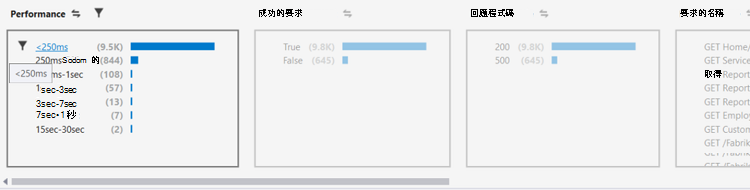

<properties 
    pageTitle="分析趨勢 Visual Studio |Microsoft Azure" 
    description="分析、 視覺化，以及探索您的應用程式的深入見解遙測 Visual Studio 中的趨勢。" 
    services="application-insights" 
    documentationCenter=".net"
    authors="numberbycolors" 
    manager="douge"/>

<tags 
    ms.service="application-insights" 
    ms.workload="tbd" 
    ms.tgt_pltfrm="ibiza" 
    ms.devlang="na" 
    ms.topic="get-started-article" 
    ms.date="10/25/2016" 
    ms.author="daviste"/>
    
# 在 Visual Studio 中分析趨勢

應用程式的深入見解趨勢工具文章如何應用程式的重要遙測事件變更一段時間，協助您快速找出問題和異常。 透過您連結至診斷的詳細資訊，趨勢可協助您改善您的應用程式效能與追蹤的例外，原因發掘想法的您自訂的事件。

> [AZURE.NOTE] 應用程式的深入見解趨勢是用於 Visual Studio 2015 更新 3 和更新版本，或與[開發人員分析工具擴充](https://visualstudiogallery.msdn.microsoft.com/82367b81-3f97-4de1-bbf1-eaf52ddc635a)版本 5.209 及更新版本。

## 開啟應用程式的深入見解趨勢

若要開啟 [應用程式的深入見解趨勢] 視窗︰

* 從 [應用程式的深入見解工具列按鈕]，選擇 [**瀏覽遙測趨勢**，或
* 從 [專案] 內容功能表中，選擇 [**應用程式的深入見解 > 探索遙測趨勢**，或
* 從 Visual Studio 功能表列中，選擇 [**檢視 > 其他 Windows > 應用程式的深入見解趨勢**。

您可能會看到提示選取資源。 按一下 [**選取資源**，登入 Azure 的訂閱，然後從您要分析遙測趨勢清單中選擇 [應用程式的深入見解資源。

## 選擇 [趨勢分析

![常見的趨勢分析類型] 功能表](./media/app-insights-visual-studio-trends/app-insights-trends-1-750.png)

開始時，選擇 [從五個常見趨勢分析，每個過去 24 小時的分析資料的其中一個︰

* **調查效能問題，您的伺服器要求與**您的服務要求分組回應時間
* **分析錯誤，在您的伺服器要求**您的服務要求分組 HTTP 回應碼
* **檢查您的應用程式中的例外**-從您的服務的例外狀況分組的例外狀況類型
* **檢查您的應用程式相依性的效能**-依您的服務，一部分的服務來回應時間分組
* **檢查您的自訂事件**-您已設定為您的服務，自訂事件的事件類型分組。

這些預先建立的分析，可稍後從趨勢視窗左上角的 [**檢視常見的遙測分析**] 按鈕。

## 以視覺化方式呈現您的應用程式的趨勢

應用程式的深入見解趨勢會從您的應用程式遙測建立時間數列視覺效果。 每個時間數列視覺效果會顯示一種類型的遙測，一些時間範圍內的遙測，一個內容所組成群組。 例如，您可能要檢視依國家/地區的其來源，最後一個 24 小時的伺服器要求。 在此範例中，每個泡泡視覺效果上的代表的數個部分的國家/地區的伺服器要求期間一小時。

若要調整何種類型的遙測檢視中使用視窗頂端的控制項。 首先，請選擇您感興趣的遙測類型︰

* **遙測類型**-伺服器要求、 例外狀況、 depdendencies 或自訂事件
* **時間範圍**-從過去 3 天最後一個 30 分鐘
* **群組依據**的例外狀況類型、 問題識別碼、 國家/地區，及其他功能。

然後按一下 [**分析遙測**執行查詢。

若要瀏覽視覺效果中的泡泡圖︰

* 按一下以選取泡泡，更新篩選] 底部的視窗中，好方便您摘要只在特定時間期間發生的事件
* 按兩下 [瀏覽至 [搜尋工具，並查看所有該期間發生的個別遙測事件的泡泡圖
* Ctrl-按一下以取消選取該視覺效果中的泡泡圖。

> [AZURE.TIP] 趨勢和搜尋工具] 的工作放在一起以協助您找出您的服務之間數以千計的遙測事件中的問題的原因。 例如，如果您的客戶，請注意您的應用程式的一個下午被較少的回應，開始趨勢。 分析您服務要求過去的幾個小時，依回應時間分組。 請參閱是否過大叢集的變得很慢的要求。 然後連按兩下該泡泡圖，以移至 [搜尋工具]，篩選這些要求的事件。 從搜尋中，您可以瀏覽這些要求的內容，並瀏覽至要解決這個問題的相關的程式碼。

## 篩選

探索更具體的趨勢篩選控制項視窗的底部。 若要套用篩選，請按一下其名稱。 您可以快速切換不同的篩選，以探索可能會隱藏您遙測特定維度中的趨勢。 如果您將一個維度，例如例外狀況類型中的篩選套用其他維度中的篩選會保留可點選，即使其出現的灰色。 若要取消-套用篩選]，再按一下它。 Ctrl 按一下以選取多個篩選器中的相同的維度。

如果您想要套用多個篩選？ 

1. 套用第一個篩選。 
2. 按一下 [**套用所選的篩選] 和 [重新查詢**] 按鈕以您的第一個篩選的維度的名稱。 這會重新查詢您遙測符合第一個篩選的事件。 
3. 套用第二個篩選。 
4. 重複此程序中您遙測的特定子集尋找趨勢。 例如，伺服器要求名為 「 取得常用/索引 」_和_來自德國_和_所接收的 500 回應碼的。 

若要取消-套用其中一個這些篩選器，按一下 [**移除所選的篩選和查詢一次**按鈕維度。

## 尋找異常

趨勢工具可以醒目提示泡泡事件的異常相較於其他中相同的時間序列的泡泡。 在 [檢視類型] 下拉式清單中，選擇 [**計數中的時間填色 （醒目提示異常）**或**百分比中的一次連結 （醒目提示異常）**。 紅色的泡泡圖是異常。 異常定義為泡泡圖與計數/百分比超過 2.1 的時間標準差的計算/百分比的過去的兩個時間週期 （48 小時，如果您正在檢視上次 24 小時的時間等等。）。

> [AZURE.TIP] 醒目提示異常特別有用，否則看起來可能的小型泡泡的時間序列中尋找範數同樣的大小。  

## 後續步驟

||
|---|---
|**[使用 Visual Studio 中的應用程式深入資訊](app-insights-visual-studio.md)** 搜尋遙測，請參閱 CodeLens 中的資料並設定應用程式的深入見解。 全都在 Visual Studio 中。 |
|**[新增更多資料](app-insights-asp-net-more.md)** 監視使用情況、 可用性、 相依性的例外狀況。 整合記錄架構的追蹤。 撰寫自訂遙測。 | 
|**[使用應用程式的深入見解入口網站](app-insights-dashboards.md)** 儀表板功能強大的診斷和分析工具、 通知，您的應用程式與遙測匯出的即時相依性地圖。 |
