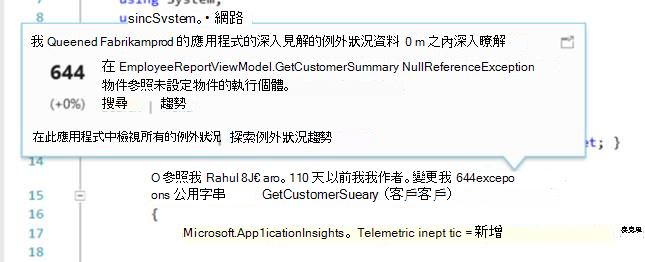

<properties 
    pageTitle="使用 Visual Studio 上的應用程式的深入見解" 
    description="效能分析和診斷在偵錯和生產環境中。" 
    services="application-insights" 
    documentationCenter=".net"
    authors="alancameronwills" 
    manager="douge"/>

<tags 
    ms.service="application-insights" 
    ms.workload="tbd" 
    ms.tgt_pltfrm="ibiza" 
    ms.devlang="na" 
    ms.topic="get-started-article" 
    ms.date="06/21/2016" 
    ms.author="awills"/>

# 使用 Visual Studio 中的應用程式深入資訊

在 Visual Studio （2015年及更新版本），您可以分析執行效能，並診斷問題偵錯和實際使用[Visual Studio 應用程式獲得深入見解](app-insights-overview.md)從遙測。

如果您還未[安裝的應用程式獲得深入見解應用程式中](app-insights-asp-net.md)，就會立即執行。

## 偵錯專案

F5 執行應用程式和試試看︰ 開啟產生一些遙測不同的頁面。

在 Visual Studio 中，您會看到事件記錄的計數。

![Visual Studio 中，在 [應用程式深入資訊] 按鈕會顯示在偵錯時。](./media/app-insights-visual-studio/appinsights-09eventcount.png)

按一下這個按鈕以開啟 [診斷搜尋。 

## 診斷搜尋

[搜尋] 視窗會顯示已登入的事件。 （如果您登入 Azure 設定應用程式的深入見解時，您可以在入口網站搜尋相同的事件。）

在 [事件中的任何欄位上的運作搜尋免費的文字。 例如，搜尋頁面; 的 URL 部份或用戶端縣/市; 例如屬性的值或在追蹤記錄中有特定的文字。

按一下以查看其詳細的內容的任何事件。

您也可以開啟 [相關項目] 索引標籤，以協助診斷失敗的要求或例外狀況。

## 診斷中心

[診斷] 中心 （在 Visual Studio 2015 或更新版本） 會顯示應用程式的深入見解伺服器遙測產生。 就算您選擇只安裝 sdk，您可以不將其連線至 Azure 入口網站中的資源。

![開啟 [診斷工具] 視窗，並查看應用程式的深入見解事件。](./media/app-insights-visual-studio/31.png)

## 例外狀況

如果您有[設定例外狀況監視](app-insights-asp-net-exceptions.md)，例外狀況報告會顯示在 [搜尋] 視窗中。 

按一下 [堆疊追蹤例外狀況]。 如果在 Visual Studio 中開啟應用程式的程式碼，您可以按一下透過從堆疊追蹤程式碼的相關一行。

此外，在每一種方法上方的程式碼 Lens 列上，您會看到由應用程式的深入見解記錄過去 24 h 中的例外狀況的計數。

## 本機監控

（從 Visual Studio 2015 更新 2）如果您還沒有設定 （以便 ApplicationInsights.config 沒有儀器索引鍵），傳送遙測應用程式的深入見解入口網站 SDK [診斷] 視窗會顯示您最新偵錯的工作階段從遙測。 

這是需要，如果您已發佈您的應用程式的舊版本。 您不想遙測從使用已發佈的應用程式的應用程式的深入見解入口網站上的遙測混合您偵錯工作階段。

如果您想要傳送遙測入口網站前偵錯某些[自訂遙測](app-insights-api-custom-events-metrics.md)，還有有幫助。

* *首先，我完整設定傳送遙測入口網站應用程式深入資訊。但現在我想要查看只在 Visual Studio 遙測。*

 * 在 [搜尋] 視窗設定]，沒有搜尋本機診斷，即使您的應用程式傳送遙測入口網站的選項。
 * 若要停止遙測傳送入口網站，為註解`<instrumentationkey>...`從 ApplicationInsights.config。 當您準備好要重新傳送遙測入口網站時，它取消註解。

## 趨勢

趨勢是視覺化應用程式一段時間的行為方式的工具。 

從應用程式的深入見解工具列按鈕或應用程式的深入見解搜尋] 視窗中選擇 [**瀏覽遙測趨勢**]。 選擇其中一個五個常見的查詢，即可開始使用。 您可以分析根據遙測類型、 時間範圍，以及其他屬性的不同資料集。 

若要尋找的異常資料中，選擇其中一個異常選項底下的 [檢視類型] 下拉式清單。 在視窗底部的篩選選項讓您更輕鬆地在特定子集您遙測暸解中。

[深入瞭解趨勢](app-insights-visual-studio-trends.md)。

## 下一步是什麼？

||
|---|---
|**[新增更多資料](app-insights-asp-net-more.md)** 監視使用情況、 可用性、 相依性的例外狀況。 整合記錄架構的追蹤。 撰寫自訂遙測。 | 
|**[使用應用程式的深入見解入口網站](app-insights-dashboards.md)** 儀表板功能強大的診斷和分析工具、 通知，您的應用程式與遙測匯出的即時相依性地圖。 |

 
