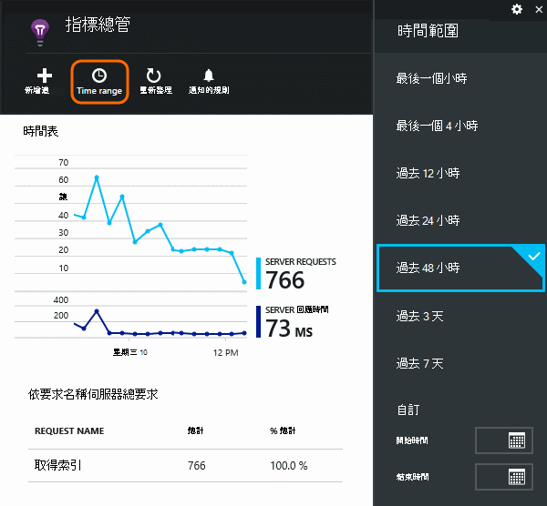
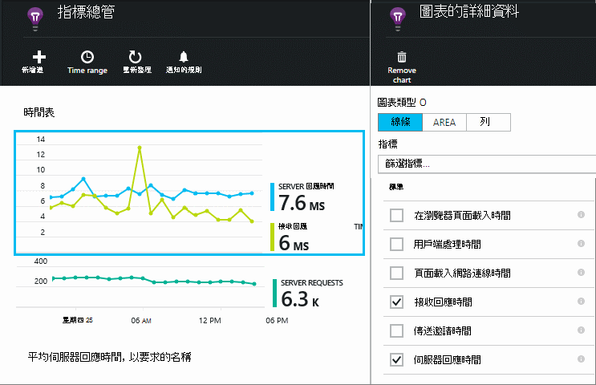
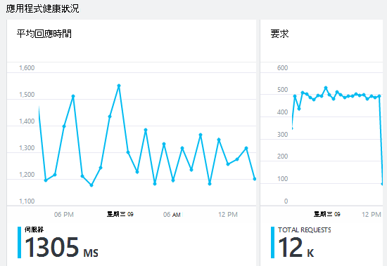
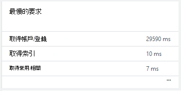
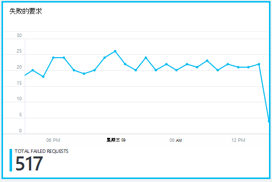
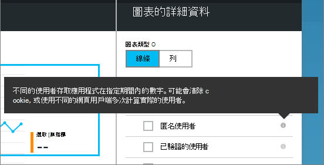
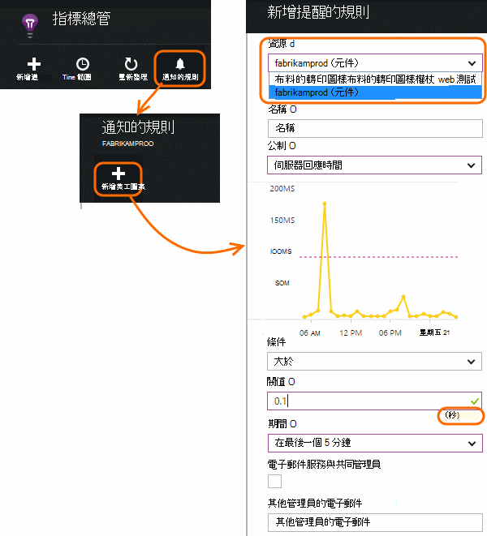

<properties 
    pageTitle="監控您的應用程式健康狀況和使用應用程式的深入見解的使用方式" 
    description="開始使用應用程式的深入見解。 分析使用狀況、 可用性和內部部署或 Microsoft Azure 應用程式的效能。" 
    services="application-insights" 
    documentationCenter=""
    authors="alancameronwills" 
    manager="douge"/>

<tags 
    ms.service="application-insights" 
    ms.workload="tbd" 
    ms.tgt_pltfrm="ibiza" 
    ms.devlang="na" 
    ms.topic="article" 
    ms.date="11/25/2015" 
    ms.author="awills"/>
 
# 在 web 應用程式的監控效能

*應用程式的深入見解位於預覽。*

請確定您的應用程式正在執行，並快速找出任何失敗。 [應用程式的深入見解][start]會告訴您有關的任何效能問題和例外]，並協助您尋找並診斷根本原因。

Java 和 ASP.NET web 應用程式與服務、 WCF 服務，就可以監視應用程式的深入見解。 也可以裝載於內部部署，虛擬機器上或 Microsoft Azure 網站。 

在用戶端應用程式的深入見解可能需要遙測從網頁和各種不同的裝置包括 iOS Android 和 Windows 市集應用程式。

## 設定效能監視

如果您尚未新增應用程式的深入見解至您的專案 （亦即，如果沒有 ApplicationInsights.config），選擇 [開始使用下列方法之一︰

* [ASP.NET web 應用程式](app-insights-asp-net.md)
 * [新增例外狀況監視](app-insights-asp-net-exceptions.md)
 * [新增監控相依性](app-insights-monitor-performance-live-website-now.md)
* [J2EE web 應用程式](app-insights-java-get-started.md)
 * [新增監控相依性](app-insights-java-agent.md)

## 探索效能指標

在[[Azure 入口網站](https://portal.azure.com)，瀏覽至您設定應用程式的應用程式的深入見解資源。 概觀刀顯示基本效能資料︰

按一下任何圖表，若要查看更多詳細資料，並以查看結果的較長期間。 例如，按一下 [邀請] 方塊，然後選取 [時間範圍︰

按一下圖表以選擇其會顯示，或將新的圖表，然後選取其指標的指標︰

> [AZURE.NOTE] 若要查看完整的選取項目所提供，**取消核取所有指標**。 指標分成群組。當已選取群組的任何成員，只有其他群組的成員，就會出現。

## 有什麼？ 其所有的平均值 效能磚和報表

有各種不同的效能指標，您可以取得。 現在就讓我們開始使用所出現的預設應用程式刀。

### 要求

在 [在指定期間內所收到的 HTTP 要求數目。 比較此結果，若要查看您的應用程式為載入的行為方式的其他報告上不盡相同。

HTTP 要求包含所有的取得或文章要求的頁面、 資料和圖像。

按一下 [計數取得特定的 Url] 方塊。

### 平均回應時間

測量 web 要求輸入您的應用程式，傳回與回應之間的時間。

點會顯示移動平均。 如果有很多要求，可能有明顯的最大使用量不平均值與不符合或大大在圖形中的部分。

尋找異常尖峰。 一般而言，預期地上升要求與回應時間。 如果不成比例上升，您的應用程式可能會正中資源的限制，例如 CPU 或使用的服務的容量。

按一下 [時間取得特定的 Url] 方塊。

### 最慢的要求

會顯示哪些要求可能需要效能調整。

### 失敗的要求

發生無法攔截例外狀況的要求的計數。

按一下 [若要查看的特定的失敗次數，詳細資料] 方塊，然後選取個別的邀請，以查看其詳細資料。 

個別檢查保留代表範例的失敗次數。

### 其他指標

若要查看其他指標，您可以顯示、 按一下圖形，並取消選取 [若要查看完整的可用的所有指標的設定。 按一下 [(i)，以查看每個公制定義。

選取任何公制會停用其他無法顯示在相同的圖表。

## 設定通知

若要以異常的值的任何公制的電子郵件通知，新增提醒。 您可以選擇 [傳送電子郵件帳戶管理員或特定的電子郵件地址。

設定其他屬性之前的資源。 如果您想要效能或使用指標上設定提醒，不要選擇 webtest 資源。

請小心請注意，系統會要求您輸入的臨界值的單位。

*我無法看到 [新增提醒]。* -這是群組有唯讀存取權限的帳戶？ 請與帳戶管理員。

## 診斷問題

以下是一些秘訣可以尋找並診斷效能問題︰

* 設定[web 測試][availability]通知您的網站當機或不正確或速度緩慢的回應。 
* 比較要求計數與其他計量，看看是否載入相關失敗或變得很慢的回應。
* [插入及搜尋追蹤陳述式][diagnostic]在您的程式碼，以協助找出問題。

## 後續步驟

[Web 測試][ availability] -web 要求傳送定期從世界各地的應用程式。

[擷取和搜尋診斷追蹤][ diagnostic] -插入追蹤通話，並篩選的結果，找出問題。

[使用追蹤][ usage] -找出您的應用程式的使用方式。

[疑難排解][ qna] -和問與答

## 視訊

[AZURE.VIDEO performance-monitoring-application-insights]

<!--Link references-->

[availability]: app-insights-monitor-web-app-availability.md
[diagnostic]: app-insights-diagnostic-search.md
[greenbrown]: app-insights-asp-net.md
[qna]: app-insights-troubleshoot-faq.md
[redfield]: app-insights-monitor-performance-live-website-now.md
[start]: app-insights-overview.md
[usage]: app-insights-web-track-usage.md

 
