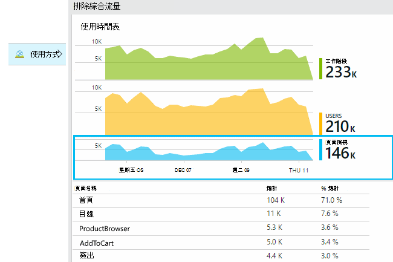
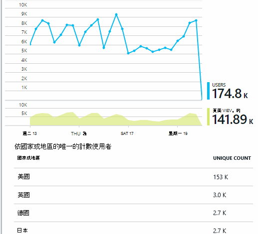
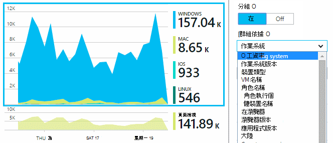
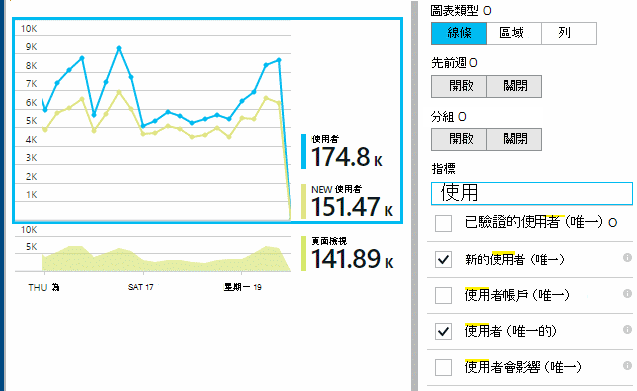
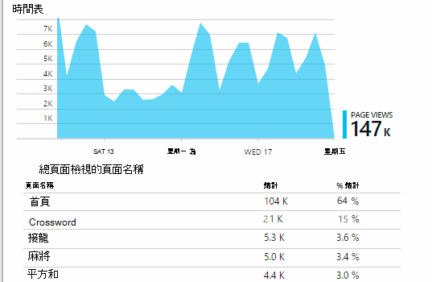
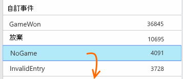
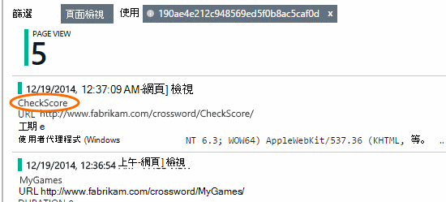

<properties 
    pageTitle="Web 應用程式的應用程式的深入見解的使用狀況分析" 
    description="使用應用程式的深入見解的 web 應用程式的使用狀況分析的概觀" 
    services="application-insights" 
    documentationCenter=""
    authors="alancameronwills" 
    manager="douge"/>

<tags 
    ms.service="application-insights" 
    ms.workload="tbd" 
    ms.tgt_pltfrm="ibiza" 
    ms.devlang="na" 
    ms.topic="article" 
    ms.date="06/12/2016" 
    ms.author="awills"/>
 
# <a name="usage-analysis-for-web-applications-with-application-insights"></a>Web 應用程式的應用程式的深入見解的使用狀況分析

瞭解使用者如何使用您的應用程式，可讓您著重，最重要的案例中開發工作，並取得其尋找更容易或更多難達成目標的細節。 

Visual Studio 應用程式獲得深入見解提供兩種層級追蹤的使用狀況︰

* **使用者、 工作階段和頁面上檢視資料**-提供預設工作。  
* **自訂遙測**-您[撰寫程式碼][api]來追蹤您的使用者可透過應用程式的使用者體驗。 

## <a name="setting-up"></a>設定

[Azure 入口網站](https://portal.azure.com)中開啟應用程式的深入見解的資源、 按一下空白的瀏覽器頁面載入圖表，然後依照的安裝指示操作。

[深入瞭解](app-insights-javascript.md) 


## <a name="how-popular-is-my-web-application"></a>如何熱門是我的 web 應用程式？

[Azure 入口網站]登入[portal]、 瀏覽至您的應用程式的資源，然後按一下 [使用情況︰



* **使用者︰**圖表的時間範圍內的不同作用中的使用者數目。 
* **工作階段︰**計數為使用中工作階段
* **頁面檢視**會計算 trackPageView()，通常稱為一次在每個網頁中的呼叫數目。

按一下任何圖表，以查看更多詳細資料。 請注意，您可以變更圖表的時間範圍。

### <a name="where-do-my-users-live"></a>我的使用者在哪裡？

在使用刀中，按一下 [使用者圖表，請參閱更多詳細資料︰


 
### <a name="what-browsers-or-operating-systems-do-they-use"></a>哪些瀏覽器或作業系統他們使用？

將資料分組 （區段），例如瀏覽器、 作業系統或縣/市的屬性︰




## <a name="sessions"></a>工作階段

工作階段是應用程式獲得深入見解，致力於每個遙測事件-例如要求、 檢視頁面、 例外] 或與建立關聯的自訂事件該程式碼您自己的特定使用者工作階段的基本概念。 

Rtf 內容資訊會收集每個工作階段，例如裝置特性、 地理位置、 作業系統，等等。

如果您追蹤記錄用戶端和伺服器 ([ASP.NET] [greenbrown]或[J2EE][java])、 Sdk 會傳播用戶端和伺服器，之間的工作階段識別碼，以便能相互關聯雙面的事件。

當[診斷問題][diagnostic]，您可以找到有關中發生問題，包括所有的要求及任何事件，例外狀況的工作階段或追蹤的記錄的所有遙測。

工作階段提供好的內容，例如裝置、 作業系統或位置的常用性度量。 顯示分組裝置的工作階段的計數，例如，您取得提供更精確統計頻率該裝置使用您的應用程式中，於，來計算頁面檢視。 這是很有用的輸入分類的任何裝置的特定問題。


#### <a name="whats-a-session"></a>何謂工作階段？

工作階段代表使用者和應用程式之間的單一遭遇。 簡單來說，工作階段會啟動以啟動應用程式的使用者，並完成當使用者離開應用程式。 Web 應用程式，根據預設，工作階段結束之後 30 分鐘一段時間，或在 24 小時制的活動。 

您可以透過編輯程式碼片段變更這些預設值︰

    <script type="text/javascript">
        var appInsights= ... { ... }({
            instrumentationKey: "...",
            sessionRenewalMs: 3600000,
            sessionExpirationMs: 172800000
        });

* `sessionRenewalMs`︰ 以毫秒為單位，到期的工作階段，因為使用者的活動時間。 預設︰ 30 分鐘。
* `sessionExpirationMs`︰ 以毫秒為單位最大工作階段長度。 如果這次之後，使用者仍然作用中的被計算另一個工作階段。 預設︰ 24 小時的時間。

**工作階段期間**是[公制][metrics]的記錄工作階段的第一個和最後一個遙測項目之間的時間範圍。 （不包括逾時期間。）

在特定時間間隔的**工作階段的計算**被定義為唯一的工作階段的一些活動在這段期間數。 當週的查看很長的時間範圍，例如每日工作階段計算時，這通常等於工作階段的總數。 

不過，當您瀏覽短時間範圍，例如每小時的成果，則橫跨多個小時的長工作階段列入計算的工作階段為作用中的每個小時。 

## <a name="users-and-user-counts"></a>使用者和使用者計數


每個使用者的專屬使用者識別碼與相關聯。 

根據預設，使用者被識別放在 cookie。 使用多個瀏覽器或裝置的使用者會出現一次以上計算。 （但查看[已驗證的使用者](#authenticated-users)）


在特定時間間隔的**使用者計數**公制定義為唯一的使用者數目錄製活動在這段期間。 如此一來，長工作階段的使用者可能會考慮多次，當您設定的時間範圍，使粒小於小時，或讓。

**新的使用者**會使用應用程式的第一個工作階段，在這段期間發生的使用者。 如果使用的使用者計數 cookie 的預設方法，這會也包含的使用者誰已清除其 cookie 不便或使用新的裝置或瀏覽器來存取您的應用程式第一次。


### <a name="authenticated-users"></a>已驗證的使用者

如果您的 web 應用程式可讓使用者登入，您可以取得更精確的計數提供應用程式的深入見解的專屬使用者識別碼。 它不一定非得是其名稱或在您的應用程式中使用相同的識別碼。 一旦您的應用程式已察覺使用者，請使用這個代碼︰


*在用戶端 JavaScript*

      appInsights.setAuthenticatedUserContext(userId);

如果您的應用程式會將使用者群組組成帳戶，您也可以傳遞帳戶的識別碼。 

      appInsights.setAuthenticatedUserContext(userId, accountId);

使用者與帳戶識別碼不能包含空格或字元`,;=|`


在[計量檔案總管]](app-insights-metrics-explorer.md)中，您可以建立**已驗證的使用者**和**帳戶**的圖表。 

## <a name="synthetic-traffic"></a>綜合流量

綜合流量包括顯示狀態和載入測試、 搜尋引擎尋與其他代理程式的要求。 

應用程式的深入見解次致力於自動判斷分類綜合流量和適當地將其標記。 在大部分情況下，綜合流量不叫用 JavaScript sdk，您可以讓使用者與工作階段計算排除此活動。 

不過，為了應用程式的深入見解[web 測試][availability]的使用者識別碼會自動設定以 POP 位置，與工作階段 id 根據設定測試執行識別碼。 預設報表，綜合流量過濾掉的根據預設，將會排除這些使用者與工作階段。 不過，包含綜合流量時，它可能會造成小型增加的整體使用者與工作階段項目個數。
 
## <a name="page-usage"></a>頁面的使用方式

按一下頁面檢視圖表，好讓更多放大增益集版本與您最常用的頁面的分析︰



 
上述範例是從遊戲網站。 從該我們立即看到︰

* 週尚未改良的使用方式。 也許我們應該考量搜尋引擎最佳化？
* 許多較少的人會看到遊戲頁面，於 [首頁] 頁面。 為什麼我們首頁不吸引他人播放遊戲？
* 「 Crossword 」 是最常用的遊戲。 我們應該優先順序及權授與新的想法那里改良項目。

## <a name="custom-tracking"></a>自訂追蹤

例如，假設，而不是個別的網頁中實作每個遊戲，決定重構其所有到相同的單一頁面應用程式，與大部分的 Javascript 為編碼，在網頁上的功能。 這個選項可讓使用者遊戲與另一個，之間快速切換，或甚至在一頁上有數種遊戲。 

但您仍希望每個遊戲開啟時，完全相同的方法為時它們是在另一個網頁上的應用程式觀點登入的次數。 簡單︰ 只要將遙測模組呼叫插入您要開啟新的 [頁面] 的記錄的 JavaScript:

    appInsights.trackPageView(game.Name);

## <a name="custom-events"></a>自訂事件

撰寫自訂遙測記錄特定的事件。 特別是在單一頁面應用程式中，您會想要知道使用者執行特定動作或達成特定目標的頻率︰ 

    appInsights.trackEvent("GameEnd");

例如，按一下 [連結登入︰

    <a href="target.htm" onclick="appInsights.trackEvent('linkClick');return true;">my link</a>


## <a name="view-counts-of-custom-events"></a>自訂事件的數量和檢視

開啟指標檔案總管]，並新增圖表以顯示事件。 依名稱區段︰

![選取顯示只要公制的圖表。 切換上的群組。 選擇 [屬性]。 並非所有內容都可供使用。](./media/app-insights-web-track-usage/06-eventsSegment.png)


## <a name="drill-into-specific-events"></a>深入瞭解特定的事件

若要了解如何一般工作階段進入，您可能要聚焦於特定使用者工作階段包含特定類型的事件。 

在此範例中，我們撰寫程式碼自訂事件 」 NoGame 」 稱為如果使用者沒有實際開始遊戲登出。 為什麼使用者執行的動作一樣？ 也許我們切入一些特定的項目時，我們會出現線索。 

從應用程式收到的自訂事件列出由概觀刀上的名稱︰



 
按一下感興趣的事件，然後選取 [最近的特定項目︰


![在清單中摘要圖] 底下，按一下 [事件](./media/app-insights-web-track-usage/08-searchEvents.png)
 
讓我們來看看所有遙測特定 NoGame 事件發生的工作階段。 


 
沒有任何例外狀況，讓使用者不無法播放某些失敗。
 
我們可以篩選出所有類型的網頁檢視以外的遙測這個工作階段︰



 
然後，現在我們可以看到此使用者登入只是要檢查最新的分數。 也許我們應該考慮開發使用者本文，可讓您更容易執行這項作業。 （與特定本文發生時，我們應該實作自訂事件，報表）。

## <a name="filter-search-and-segment-your-data-with-properties"></a>篩選、 搜尋及區段屬性的資料
您可以附加任意標記與數值的事件。
 

*在用戶端 JavaScript*

```JavaScript

    appInsights.trackEvent("WinGame",
        // String properties:
        {Game: currentGame.name, Difficulty: currentGame.difficulty},
        // Numeric measurements:
        {Score: currentGame.score, Opponents: currentGame.opponentCount}
    );
```

*C# 伺服器*

```C#

    // Set up some properties:
    var properties = new Dictionary <string, string> 
        {{"game", currentGame.Name}, {"difficulty", currentGame.Difficulty}};
    var measurements = new Dictionary <string, double>
        {{"Score", currentGame.Score}, {"Opponents", currentGame.OpponentCount}};

    // Send the event:
    telemetry.TrackEvent("WinGame", properties, measurements);
```

*VB 伺服器*

```VB

    ' Set up some properties:
    Dim properties = New Dictionary (Of String, String)
    properties.Add("game", currentGame.Name)
    properties.Add("difficulty", currentGame.Difficulty)

    Dim measurements = New Dictionary (Of String, Double)
    measurements.Add("Score", currentGame.Score)
    measurements.Add("Opponents", currentGame.OpponentCount)

    ' Send the event:
    telemetry.TrackEvent("WinGame", properties, measurements)
```

附加至網頁檢視的內容，以相同的方式︰

*在用戶端 JavaScript*

```JS

    appInsights.trackPageView("Win", 
        url,
        {Game: currentGame.Name}, 
        {Score: currentGame.Score});
```

在診斷搜尋，請透過事件的個別項目，即可檢視的內容。


![事件清單中，開啟事件，然後按一下 [...] 若要查看更多的屬性](./media/app-insights-web-track-usage/11-details.png)
 
您可以使用 [搜尋] 欄位來查看發生次數與特定屬性值。


![[搜尋] 欄位中輸入值](./media/app-insights-web-track-usage/12-searchEvents.png)


## <a name="a--b-testing"></a>A |B 測試

如果您不知道哪一個變數的功能會更成功，請在放開其中，讓每個存取不同的使用者。 測量的各個，成功，然後再移至整合的版本。

用這項技巧，您將不同的標籤附加所有遙測傳送的每個應用程式版本。 您可以在 [作用中的 TelemetryContext 中定義屬性來執行這項作業。 這些預設屬性會新增至每個遙測的郵件應用程式傳送-不只是您自訂的郵件，但也標準遙測。 

在應用程式的深入見解入口網站中，您會然後可以篩選條件與群組 （區段） 您在 [標籤]，以比較不同版本的資料。

*C# 伺服器*

```C#

    using Microsoft.ApplicationInsights.DataContracts;

    var context = new TelemetryContext();
    context.Properties["Game"] = currentGame.Name;
    var telemetry = new TelemetryClient(context);
    // Now all telemetry will automatically be sent with the context property:
    telemetry.TrackEvent("WinGame");
```

*VB 伺服器*

```VB

    Dim context = New TelemetryContext
    context.Properties("Game") = currentGame.Name
    Dim telemetry = New TelemetryClient(context)
    ' Now all telemetry will automatically be sent with the context property:
    telemetry.TrackEvent("WinGame")
```

個別遙測可覆寫預設值。

您可以設定通用初始設定，讓所有的新 TelemetryClients 自動使用您的內容。

```C#


    // Telemetry initializer class
    public class MyTelemetryInitializer : ITelemetryInitializer
    {
        public void Initialize (ITelemetry telemetry)
        {
            telemetry.Properties["AppVersion"] = "v2.1";
        }
    }
```

應用程式初始設定式 Global.asax.cs 例如︰

```C#

    protected void Application_Start()
    {
        // ...
        TelemetryConfiguration.Active.TelemetryInitializers
        .Add(new MyTelemetryInitializer());
    }
```


## <a name="build---measure---learn"></a>建立量值-瞭解

當您使用狀況分析時，其會變成整合式組件的開發週期-不只是您認為即將，以協助解決問題。 以下是一些秘訣︰

* 決定鍵公制的應用程式。 您的每位使用者越好，或是想要非常快樂使用者一小群嗎？ 您要最大化造訪 」 或 「 銷售嗎？
* 計劃以計算每個本文。 當草圖新使用者本文或功能或計劃以更新現有的圖示，永遠思考您將會如何測量成功的變更。 之前開始撰寫程式碼，提出 「 何種效果將這對我們指標，是否其運作方式嗎？ 應該我們追蹤任何新的事件？ 」
然後當然，即時功能時，請確定您查看分析，可在結果]。 
* 索引鍵公制與其他指標。 例如，如果您將 「 我的最愛 」 功能，您想要知道頻率使用者新增 [我的最愛]。 但是，或許會提供更多感知道頻率回到其 [我的最愛]。 最重要的是執行客戶使用我的最愛最後購買更多的產品？
* 加納利測試。 設定讓您建立的新功能只有部分使用者能看到的功能切換參數。 若要查看新功能是否正在使用的您想像的方式，使用應用程式的深入見解。 進行調整，然後發行至更多的對象]。
* 與您的使用者 ！ 分析不夠，但互補維護良好的客戶的關聯。


## <a name="references"></a>參照

* [使用 API-概觀][api]
* [JavaScript API 參考](https://github.com/Microsoft/ApplicationInsights-JS/blob/master/API-reference.md)

## <a name="video"></a>視訊

> [AZURE.VIDEO usage-monitoring-application-insights]


<!--Link references-->

[api]: app-insights-api-custom-events-metrics.md
[availability]: app-insights-monitor-web-app-availability.md
[client]: app-insights-javascript.md
[diagnostic]: app-insights-diagnostic-search.md
[greenbrown]: app-insights-asp-net.md
[java]: app-insights-java-get-started.md
[metrics]: app-insights-metrics-explorer.md
[portal]: http://portal.azure.com/
[windows]: app-insights-windows-get-started.md

 
