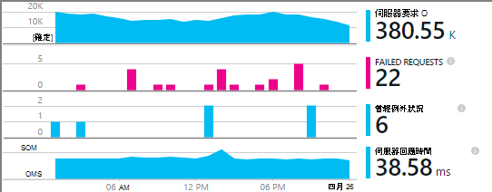

<properties
    pageTitle="應用程式的深入見解的 Windows 服務和工作者角色 |Microsoft Azure"
    description="手動新增應用程式的深入見解 SDK ASP.NET 應用程式來分析使用狀況、 可用性和效能。"
    services="application-insights"
    documentationCenter=".net"
    authors="alancameronwills"
    manager="douge"/>

<tags
    ms.service="application-insights"
    ms.workload="tbd"
    ms.tgt_pltfrm="ibiza"
    ms.devlang="na"
    ms.topic="get-started-article"
    ms.date="08/30/2016"
    ms.author="awills"/>

# 手動設定應用程式的深入見解 ASP.NET 4 應用程式

*應用程式的深入見解位於預覽。*

[AZURE.INCLUDE [app-insights-selector-get-started](../../includes/app-insights-selector-get-started.md)]

您可以手動設定[Visual Studio 應用程式獲得深入見解](app-insights-overview.md)監視 Windows 服務、 工作者角色，以及其他 ASP.NET 應用程式。 手動設定 web 應用程式]，是[自動設定](app-insights-asp-net.md)Visual Studio 所提供的替代方案。

應用程式深入資訊可協助您診斷問題和監視效能即時應用程式中的使用方式。

#### 在您開始之前

您需要︰

* [Microsoft Azure](http://azure.com)訂閱。 如果您的小組或組織的 Azure 訂閱，可以新增您，使用您的[Microsoft 帳戶](http://live.com)。
* Visual Studio 2013 或更新版本。

## 1.建立應用程式的深入見解資源

登入至[Azure 入口網站](https://portal.azure.com/)，然後建立新的應用程式的深入見解資源。 您可以選擇 [ASP.NET 為應用程式類型。

Azure 中的[資源](app-insights-resources-roles-access-control.md)是服務的執行個體。 這項資源是分析及呈現您遙測從您的應用程式。

選擇應用程式類型設定為預設內容資源與屬性[指標總管]](app-insights-metrics-explorer.md)中看到。

#### 複製儀器索引鍵

索引鍵識別資源，並便會將其安裝推出 sdk，將資源的資料。

您只要已完成] 以建立新的資源步驟會開始監視任何應用程式的好方法。 現在您可以傳送資料。

## 2.SDK 安裝應用程式中

安裝及設定應用程式的深入見解 SDK 根據您正在處理的平台而異。 ASP.NET 應用程式，您可以輕鬆。

1. 在 Visual Studio 中，編輯您的 web 應用程式專案的 NuGet 套件。

    

2. 安裝應用程式的深入見解 SDK 的 Web 應用程式。

    

    *可以使用其他封包嗎？*

    [是]。 如果您只想要傳送您自己的遙測使用 API，請選擇 [核心 API (Microsoft.ApplicationInsights)]。 Windows Server 套件會自動包含核心 API 加上效能計數器收集和相依性監控等其他封包的數字。 

#### 升級至未來 SDK 版本

我們不時放開 SDK 的新版本。

若要升級[SDK 的新版本](https://github.com/Microsoft/ApplicationInsights-dotnet-server/releases/)，請開啟再次 NuGet 封裝管理員及篩選已安裝套件。 選取**Microsoft.ApplicationInsights.Web** ，然後選擇 [**升級**]。

如果您對所做的任何自訂 ApplicationInsights.config，請在升級，並之後將您變更合併至新的版本之前儲存一份。

## 3.傳送遙測

**如果您有安裝核心 API 套件︰**

* 集程式碼的儀器按鍵，例如`main()`: 

    `TelemetryConfiguration.Active.InstrumentationKey = "`*您的金鑰*`";` 

* [撰寫您自己的遙測使用 API](app-insights-api-custom-events-metrics.md#ikey)。

**如果您已安裝其他應用程式的深入見解套件] 中，**您可以如果您想要的話，使用.config 檔案設定儀器機碼︰

* 編輯 ApplicationInsights.config (其中已加入由 NuGet 安裝)。 插入之前結尾標記︰

    `<InstrumentationKey>`*您複製的儀器金鑰*`</InstrumentationKey>`

* 請務必確保 ApplicationInsights.config 方案總管] 中的屬性設定為**建立巨集指令 = 內容，複製到輸出目錄 = 複製**。

## 執行您的專案

執行您的應用程式，以及可以嘗試使用**F5** ︰ 開啟產生一些遙測不同的頁面。

在 Visual Studio 中，您會看到所傳送的事件的計數。

## 檢視您遙測

返回 [ [Azure 入口網站](https://portal.azure.com/)，並瀏覽至您的應用程式的深入見解的資源。

尋找概觀圖表中的資料。 首先，您會看到一或兩個點。 例如︰

按一下任何圖表，請參閱更詳細的指標。 [進一步瞭解指標。](app-insights-web-monitor-performance.md)

#### 沒有資料？

* 使用應用程式，使其產生一些遙測開啟不同的頁面。
* 開啟 [[搜尋](app-insights-diagnostic-search.md)] 方塊中，以查看個別的事件。 有時需要事件稍微時取得指標管線較長的時間。
* 請稍候，然後按一下 [**重新整理**]。 圖表會定期更新本身，但是您可以手動重新整理如果您正在等待顯示一些資料。
* 請參閱[疑難排解](app-insights-troubleshoot-faq.md)。

## 發佈您的應用程式

現在您的伺服器或 Azure 部署應用程式，並觀看累積的資料。

當您執行偵錯模式中時，遙測加速管線，以便您應該會看到出現在數秒內的資料。 在部署您的應用程式的版本設定時，資料累積速度變慢。

#### 沒有資料後的發佈至伺服器？

在您的伺服器防火牆開啟下列連接埠外寄流量的︰

+ `dc.services.visualstudio.com:443`
+ `f5.services.visualstudio.com:443`

#### 在您建立的伺服器上的時發生問題嗎？

請參閱[此疑難排解項目](app-insights-asp-net-troubleshoot-no-data.md#NuGetBuild)。

> [AZURE.NOTE]如果您的應用程式會產生遙測許多 (並您正在使用 ASP.NET SDK 版本 2.0.0-beta3 或更新版本)，調整取樣模組會自動降低音量傳送入口網站的傳送代表分數的事件。 不過，相同的邀請相關的事件會選取或取消選取群組，讓您可以瀏覽相關事件之間。 
> [深入了解範例](app-insights-sampling.md)。

## 後續步驟

* [新增更多遙測](app-insights-asp-net-more.md)至應用程式的完整 360 度檢視。

