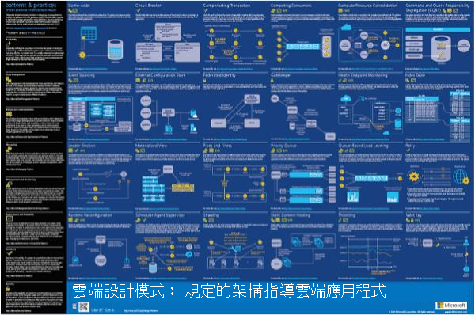
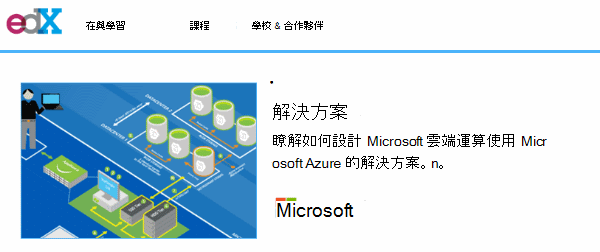
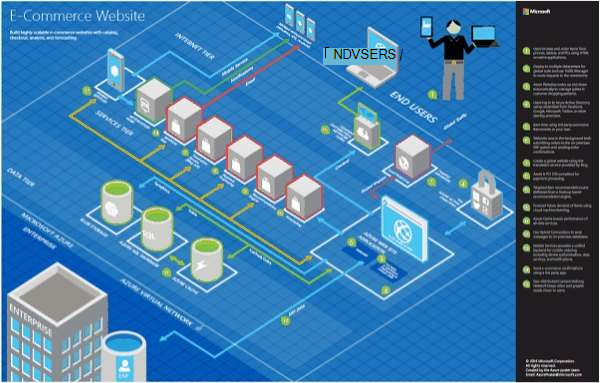
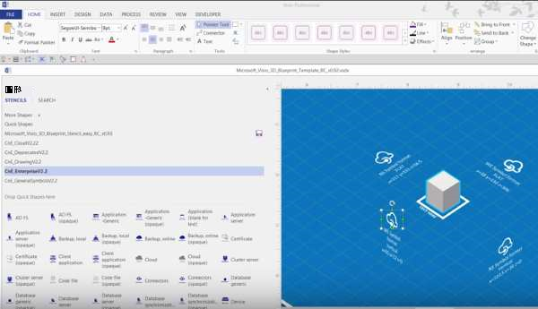
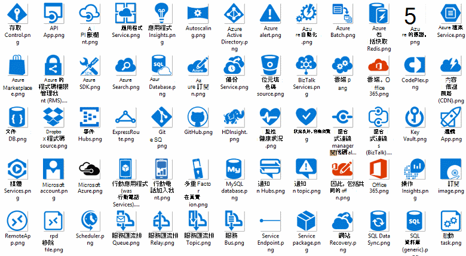
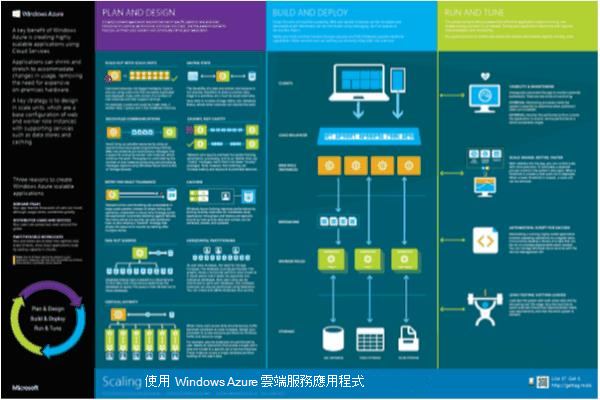

<properties 
    pageTitle="Microsoft Azure 上的應用程式架構 |Microsoft Azure" 
    description="架構的概觀，包括一般設計模式" 
    services="" 
    documentationCenter="" 
    authors="Rboucher" 
    manager="jwhit" 
    editor="mattshel"/>

<tags 
    ms.service="multiple" 
    ms.workload="na" 
    ms.tgt_pltfrm="na" 
    ms.devlang="na" 
    ms.topic="article" 
    ms.date="09/13/2016" 
    ms.author="robb"/>

#Microsoft Azure 上的應用程式結構
建置應用程式使用 Microsoft Azure 的資源。 這包含可協助您繪製圖表，以視覺化方式說明軟體系統的工具。 

##設計模式海報

Microsoft 模式與作法發佈活頁簿[雲端設計模式](http://msdn.microsoft.com/library/dn568099.aspx)MSDN 以及 PDF 下載中可使用。 此外，還有大格式海報可用會列出所有模式。 

##Microsoft 架構憑證課程

Microsoft 所建立支援 Microsoft 認證測驗 70 534 架構課程。 [使用免費的 EDX.ORG](https://www.edx.org/course/architecting-microsoft-azure-solutions-microsoft-dev205x)。  它會使用[3D 藍圖 Visio 範本](#3d-blueprint-visio-template)。 

##Microsoft 解決方案

Microsoft 發佈高等級[的解決方案架構](http://aka.ms/azblueprints)顯示如何建立使用 Microsoft 產品的系統的特定類型的一組。 

先前，Microsoft 發佈藍圖顯示範例架構提供一組。 那些已由先前所述的解決方案架構取代和已重新導向的藍圖連結指向它們。 如果您需要的存取權的上一個的藍圖材料基於某種原因，請以電子郵件[CnESymbols@microsoft.com](mailto:CnESymbols@microsoft.com)與您的要求。   

藍圖與解決方案架構圖表同時使用的某些部分[雲端與企業符號設定](#Drawing-symbol-and-icon-sets)。   

##3D 藍圖 Visio 範本

在非 Microsoft 工具中一開始建立 3D 現在已[Microsoft 架構藍圖](http://aka.ms/azblueprints)的版本。 Visio 2013 （及更新版本） 範本包含在 2015 年 8 月 5 日到做為[分佈 EDX.ORG 上的 Microsoft 架構憑證課程](#microsoft-architecture-certification-course)的一部分。

範本也有外課程。 

- [檢視視訊訓練](http://aka.ms/3dBlueprintTemplateVideo)第一個，讓您瞭解它能做什麼   
- 下載[Microsoft 3d 藍圖 Visio 範本](http://aka.ms/3DBlueprintTemplate)
- 下載的[雲端和企業版符號](#drawing-symbol-and-icon-sets)與 3D 範本搭配使用。 

電子郵件與我們連絡[CnESymbols@microsoft.com](mailto:CnESymbols@microsoft.com)的特定問題未回答的訓練課程教材，或提供意見反應。 範本不再是作用中的開發，但這是仍會有幫助及相關因為它可以使用任何 PNG 或[雲端和企業版符號](#drawing-symbol-and-icon-sets)，會更新。  

##繪圖符號和圖示集 

[檢視 Visio 和訓練影片的符號](http://aka.ms/CnESymbolsVideo)，然後[下載雲端，並設定企業符號](http://aka.ms/CnESymbols)協助建立技術的教材說明 Azure、 Windows Server、 SQL Server 等。 如果活頁簿訓練使用 Microsoft 產品的人員，您可以使用架構圖表、 訓練資料、 簡報、 資料工作表、 infographics、 白皮書和甚至第 3 派對活頁簿中的符號。 不過，並不適用於使用者介面。

CnE 符號為 Visio SVG，與 PNG 格式。 如何輕鬆使用的其他指示在 PowerPoint 中使用符號會包含在設定。 

符號設定每季隨附和發行新服務會更新。 

Microsoft Office 與相關的技術的其他符號，可在[Microsoft Office Visio] 樣板](http://www.microsoft.com/en-us/download/details.aspx?id=35772)中，雖然不適合等 CnE 設定為架構圖表。   

**意見反應︰**如果您已使用 CnE 符號，請填寫 [簡短的 5 個問題[問卷](http://aka.ms/azuresymbolssurveyv2)，或電子郵件與我們連絡[CnESymbols@microsoft.com](mailto:CnESymbols@microsoft.com)的特定問題。 我們想要知道您的想法，包括正數的意見反應，讓我們瞭解繼續花一些時間進行。 

##架構 Infographics

Microsoft 發佈數個架構相關海報/infographics。 包含[建置實際的雲端應用程式](https://azure.microsoft.com/documentation/infographics/building-real-world-cloud-apps/)和[縮放比例與雲端服務](https://azure.microsoft.com/documentation/infographics/cloud-services/)。 

