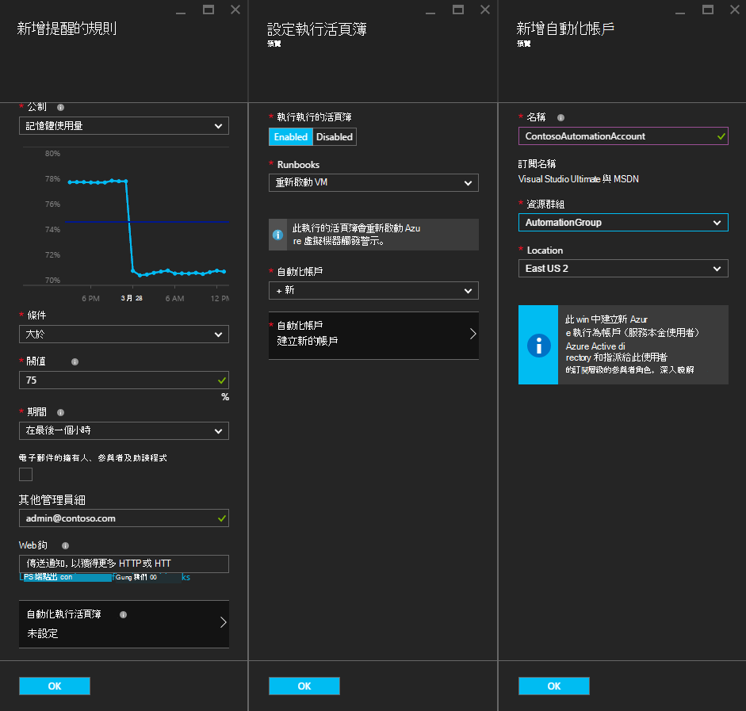
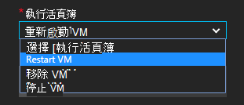
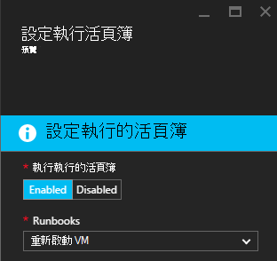
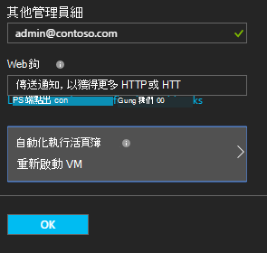

<properties
    pageTitle=" 修復使用自動化 Runbooks Azure VM 通知 |Microsoft Azure"
    description="本文將示範如何與 Azure 自動化 runbooks 整合 Azure 虛擬機器通知，並自動修復問題"
    services="automation"
    documentationCenter=""
    authors="mgoedtel"
    manager="jwhit"
    editor="tysonn" />    
<tags
    ms.service="automation"
    ms.devlang="na"
    ms.topic="article"
    ms.tgt_pltfrm="na"
    ms.workload="infrastructure-services"
    ms.date="06/14/2016"
    ms.author="csand;magoedte" />

# <a name="azure-automation-scenario---remediate-azure-vm-alerts"></a>Azure 自動化案例-修復 Azure VM 通知

Azure 自動化和 Azure 虛擬機器已發行新功能，讓您可以設定虛擬機器 (VM) 通知，以執行自動化 runbooks。 這項新功能可讓您自動執行回應 VM 通知]，重新啟動或停止 VM 等標準補救。

VM 通知規則建立期間您先前能夠 runbook[指定自動化 webhook](https://azure.microsoft.com/blog/using-azure-automation-to-take-actions-on-azure-alerts/)才能執行 runbook 時觸發警示。 不過，這必須具備您建立 runbook、 建立 webhook 的 runbook，然後複製並貼 webhook 上通知規則建立期間的工作。 使用這個新版本，程序會很容易，因為您可以直接 runbook 從清單中選擇提醒的規則建立時，您可以選擇自動化帳戶會執行 runbook 或輕鬆地建立帳戶。

在本文中，我們會告訴您如何輕鬆設定 Azure VM 通知，並設定提醒觸發程序時執行自動化 runbook。 範例案例包含記憶體使用量超過一些閥值，因為有記憶體流失，VM 上的應用程式時，請重新啟動 VM 或停止 VM CPU 使用者時間已低於 1%過去小時，並不是使用中。 我們也會說明如何自動的建立的本金自動化帳戶中的服務會簡化 runbooks Azure 通知補救中使用。

## <a name="create-an-alert-on-a-vm"></a>在 VM 建立提醒

執行下列步驟，以設定啟動時已符合其臨界值的 runbook 警示。

>[AZURE.NOTE] 在這個版本中，我們只支援 V2 虛擬機器和支援的傳統 Vm 便會新增一推出。  

1. Azure 入口網站登入，然後按一下 [**虛擬機器**。  
2. 選取其中一個虛擬機器。  虛擬機器儀表板刀會顯示與**設定**其右側。  
3. 從**設定**刀中，選取 [監控] 區段下的 [**通知規則**]。
4. 在**通知規則**刀中，按一下 [**新增提醒**]。

這會開啟**新增警示規則**刀，您可以在此設定提醒的條件，並選擇一個或所有這些選項︰ 將電子郵件傳送給某人，請使用 webhook 轉寄至其他系統，提醒及/或執行自動化 runbook 回應嘗試修復問題。

## <a name="configure-a-runbook"></a>設定 runbook

若要設定 runbook 執行符合 VM 警示臨界值時，選取 [**自動化 Runbook**]。 在**設定 runbook**刀中，您可以選取執行 runbook 和自動化帳戶中執行 runbook。



>[AZURE.NOTE] 這個版本中，您可以選擇從三個 runbooks 服務所提供-重新啟動 VM、 停止 VM 或移除 VM （刪除）。  若要選取其他 runbooks 或您自己的 runbooks 其中一項功能可在未來版本。



選取其中一個三個可用 runbooks 之後，出現**自動化帳戶**下拉式清單，然後您可以選取 runbook 執行為自動化帳戶。 Runbooks 必須執行的[自動化帳戶](automation-security-overview.md)Azure 訂閱的內容中。 您可以選取自動化帳戶，您已經建立，也可以使用為您建立新的自動化帳戶。

使用服務主要 Azure 提供 runbooks 進行驗證。 如果您選擇要在其中一個現有自動化帳戶執行 runbook，我們會自動服務本金為您建立。 如果您選擇，建立一個新的自動化帳戶，然後我們會自動建立帳戶和服務主要。 在這兩種情況下，兩個資產也會建立在 [自動化帳戶 – 名為**AzureRunAsCertificate**憑證資產 」 與 「 名為**AzureRunAsConnection**連線資產。 Runbooks 會使用**AzureRunAsConnection** ，才能執行 VM 管理行動 Azure 驗證方法。

>[AZURE.NOTE] 服務主要會建立在訂閱範圍，並指派的參與者角色。 此角色必須具備權限來執行自動化 runbooks 帳戶管理 Azure Vm 的順序。  建立自動化帳戶及/或服務主體是一次性事件。 他們會建立後，您可以使用該帳戶執行的其他 Azure VM 通知 runbooks。

當您按一下**[確定]**時已設定提醒，如果您選取 [建立新的自動化帳戶的選項，就會建立服務以及本金。  這可能需要幾秒才完成。  



設定完成之後，您會看到會出現在 [**新增提醒的規則**刀 runbook 的名稱。



按一下**[確定]**中**新增警示規則**刀和通知的規則將會建立並啟動如果虛擬機器中執行的狀態。

### <a name="enable-or-disable-a-runbook"></a>啟用或停用 runbook

如果您有 runbook，設定提醒，您可以將它停用而不移除 runbook 設定。 這個選項可讓您繼續執行提醒和也許測試某些通知的規則，然後稍後再重新啟用 runbook。

## <a name="create-a-runbook-that-works-with-an-azure-alert"></a>建立搭配 Azure 通知 runbook

當您選擇 runbook Azure 警示規則的一部分時，runbook 都必須有邏輯的管理提醒的傳入的資料。  當 runbook 設定提醒的規則中時，為 runbook; 建立 webhook該 webhook 然後用來啟動 runbook 每次觸發提醒。  實際通話] 開始 runbook 是 webhook URL HTTP 文章要求。 文章邀請內文包含 JSON 格式的物件，其中包含有用的內容相關的警示。  您可以看到] 下方，提醒的資料包含 subscriptionID、 resourceGroupName、 resourceName 及 resourceType 等的詳細資料。

### <a name="example-of-alert-data"></a>通知資料的範例
```
{
    "WebhookName": "AzureAlertTest",
    "RequestBody": "{
    \"status\":\"Activated\",
    \"context\": {
        \"id\":\"/subscriptions/<subscriptionId>/resourceGroups/MyResourceGroup/providers/microsoft.insights/alertrules/AlertTest\",
        \"name\":\"AlertTest\",
        \"description\":\"\",
        \"condition\": {
            \"metricName\":\"CPU percentage guest OS\",
            \"metricUnit\":\"Percent\",
            \"metricValue\":\"4.26337916666667\",
            \"threshold\":\"1\",
            \"windowSize\":\"60\",
            \"timeAggregation\":\"Average\",
            \"operator\":\"GreaterThan\"},
        \"subscriptionId\":\<subscriptionID> \",
        \"resourceGroupName\":\"TestResourceGroup\",
        \"timestamp\":\"2016-04-24T23:19:50.1440170Z\",
        \"resourceName\":\"TestVM\",
        \"resourceType\":\"microsoft.compute/virtualmachines\",
        \"resourceRegion\":\"westus\",
        \"resourceId\":\"/subscriptions/<subscriptionId>/resourceGroups/TestResourceGroup/providers/Microsoft.Compute/virtualMachines/TestVM\",
        \"portalLink\":\"https://portal.azure.com/#resource/subscriptions/<subscriptionId>/resourceGroups/TestResourceGroup/providers/Microsoft.Compute/virtualMachines/TestVM\"
        },
    \"properties\":{}
    }",
    "RequestHeader": {
        "Connection": "Keep-Alive",
        "Host": "<webhookURL>"
    }
}
```

當自動化 webhook 服務接收 HTTP 文章擷取警示資料並傳送到 WebhookData runbook 輸入參數中 runbook。  以下是範例 runbook 示範如何使用 WebhookData 參數並擷取通知的資料，用來管理 Azure 資源觸發警示。

### <a name="example-runbook"></a>範例 runbook

```
#  This runbook will restart an ARM (V2) VM in response to an Azure VM alert.

[OutputType("PSAzureOperationResponse")]

param ( [object] $WebhookData )

if ($WebhookData)
{
    # Get the data object from WebhookData
    $WebhookBody = (ConvertFrom-Json -InputObject $WebhookData.RequestBody)

    # Assure that the alert status is 'Activated' (alert condition went from false to true)
    # and not 'Resolved' (alert condition went from true to false)
    if ($WebhookBody.status -eq "Activated")
    {
        # Get the info needed to identify the VM
        $AlertContext = [object] $WebhookBody.context
        $ResourceName = $AlertContext.resourceName
        $ResourceType = $AlertContext.resourceType
        $ResourceGroupName = $AlertContext.resourceGroupName
        $SubId = $AlertContext.subscriptionId

        # Assure that this is the expected resource type
        Write-Verbose "ResourceType: $ResourceType"
        if ($ResourceType -eq "microsoft.compute/virtualmachines")
        {
            # This is an ARM (V2) VM

            # Authenticate to Azure with service principal and certificate
            $ConnectionAssetName = "AzureRunAsConnection"
            $Conn = Get-AutomationConnection -Name $ConnectionAssetName
            if ($Conn -eq $null) {
                throw "Could not retrieve connection asset: $ConnectionAssetName. Check that this asset exists in the Automation account."
            }
            Add-AzureRMAccount -ServicePrincipal -Tenant $Conn.TenantID -ApplicationId $Conn.ApplicationID -CertificateThumbprint $Conn.CertificateThumbprint | Write-Verbose
            Set-AzureRmContext -SubscriptionId $SubId -ErrorAction Stop | Write-Verbose

            # Restart the VM
            Restart-AzureRmVM -Name $ResourceName -ResourceGroupName $ResourceGroupName
        } else {
            Write-Error "$ResourceType is not a supported resource type for this runbook."
        }
    } else {
        # The alert status was not 'Activated' so no action taken
        Write-Verbose ("No action taken. Alert status: " + $WebhookBody.status)
    }
} else {
    Write-Error "This runbook is meant to be started from an Azure alert only."
}
```

## <a name="summary"></a>摘要

當您在 Azure VM 上設定提醒時，您現在可以輕鬆地設定提醒觸發時自動執行修復動作自動化 runbook。 這個版本中，您可以選擇從 runbooks 重新啟動、 停止或刪除 VM 根據您通知的狀況。 這是啟用您用來控制觸發通知時，自動採取的動作 （通知，進行疑難排解，請修復） 的案例的開頭。

## <a name="next-steps"></a>後續步驟

- 若要開始使用圖形 runbooks，請參閱[我的第一個圖形 runbook](automation-first-runbook-graphical.md)
- 若要開始使用 PowerShell 工作流程 runbooks，請參閱[我的第一個 PowerShell 工作流程 runbook](automation-first-runbook-textual.md)
- 若要瞭解 runbook 類型、 優點和限制的詳細資訊，請參閱[Azure 自動化 runbook 類型](automation-runbook-types.md)
