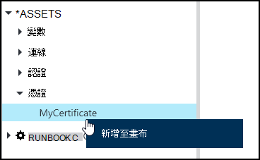
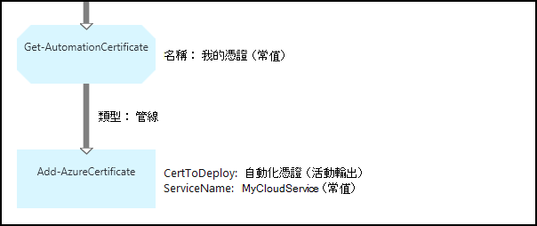

<properties 
   pageTitle="憑證資產 Azure 自動化 |Microsoft Azure"
   description="讓他們可以存取的 runbooks 或 DSC 設定 Azure 和協力廠商資源進行驗證，則可以在 Azure 自動化安全地儲存憑證。  本文說明憑證，以及如何使用這些文字和圖形撰寫的詳細資料。"
   services="automation"
   documentationCenter=""
   authors="mgoedtel"
   manager="stevenka"
   editor="tysonn" />
<tags 
   ms.service="automation"
   ms.devlang="na"
   ms.topic="article"
   ms.tgt_pltfrm="na"
   ms.workload="infrastructure-services"
   ms.date="02/23/2016"
   ms.author="magoedte;bwren" />

# Azure 自動化憑證資產

讓他們可以存取的 runbooks 或使用**取得 AutomationCertificate**活動 DSC 設定，則可以在 Azure 自動化安全地儲存憑證。 這可讓您建立 runbooks 和使用憑證驗證的 DSC 設定，或將它們新增至 Azure 或協力廠商的資源。

>[AZURE.NOTE] Azure 自動化安全資產包含認證、 憑證、 連線及加密的變數。 這些資產會加密及儲存的每個自動化帳戶使用會產生的唯一索引鍵 Azure 自動化。 此按鍵母片的憑證來加密並儲存於 Azure 自動化。 前，先將安全的資產，自動化帳戶金鑰解密使用母片的憑證，然後用來加密資產。

## Windows PowerShell Cmdlet

下表中的指令程式可用來建立並管理使用 Windows PowerShell 的自動化憑證資產。 他們提供可使用自動化 runbooks 和 DSC 設定[Azure PowerShell 模組](../powershell-install-configure.md)的一部分。

|Cmdlet|描述|
|:---|:---|
|[取得 AzureAutomationCertificate](http://msdn.microsoft.com/library/dn913765.aspx)|擷取憑證的相關資訊。 您只能從取得 AutomationCertificate 活動擷取本身的憑證。|
|[新 AzureAutomationCertificate](http://msdn.microsoft.com/library/dn913764.aspx)|Azure 自動化匯入新的憑證。|
|[移除-AzureAutomationCertificate](http://msdn.microsoft.com/library/dn913773.aspx)|移除 Azure 自動化的憑證。|
|[設定-AzureAutomationCertificate](http://msdn.microsoft.com/library/dn913763.aspx)|設定現有的憑證包括上傳的憑證檔案，以及設定.pfx 的密碼的屬性。|

## 若要存取憑證的活動

下表中的活動用來存取 runbook 或 DSC 設定文件中的憑證。

|活動|描述|
|:---|:---|
|取得 AutomationCertificate|取得要 runbook 或 DSC 設定文件中使用的憑證。|

>[AZURE.NOTE] 您應避免使用變數中取得-AutomationCertificate，因為這可以複雜探索 runbooks 或 DSC 設定之間的相依性，並在設計階段憑證資產的 – 名稱參數。

## 建立新的憑證

當您建立新的憑證時，您上傳至 Azure 自動化.cer 或.pfx 檔。 如果您將標示為可匯出憑證，然後您可以傳送 Azure 自動化憑證存放區。 如果您不能匯出，然後將其僅能在 runbook 或 DSC 設定簽章。

### 若要建立新的憑證 Azure 傳統入口網站

1. 從您自動化的帳戶，按一下 [**資產**頂端的視窗]。
1. 在視窗底部，按一下 [**新增設定**]。
1. 按一下 [**新增認證**]。
2. 在 [**認證類型**] 下拉式清單中，選取 [**憑證**]。
3. 在 [**名稱**] 方塊中輸入憑證的名稱，然後按一下右箭號。
4. 瀏覽.cer 或.pfx 檔。  如果您選取.pfx 檔，指定密碼，並是否允許匯出。
1. 按一下 [上傳的憑證檔案和儲存新的憑證資產的核取記號。

### 若要使用 Azure 入口網站中建立新的憑證

1. 從您自動化的帳戶，按一下 [開啟**資產**刀**資產**組件]。
1. 按一下以開啟**憑證**刀**憑證**部分。
1. 按一下 [**新增憑證**刀頂端。
2. 在 [**名稱**] 方塊中輸入憑證的名稱。
2. 在 [以瀏覽.cer 或.pfx 檔的 [**上傳憑證檔案**，按一下 [**選取檔案**。  如果您選取.pfx 檔，指定密碼，並是否允許匯出。
1. 按一下 [**建立**]，儲存新的憑證資產]。

### 若要使用 Windows PowerShell 中建立新的憑證

下列範例命令顯示如何建立新的自動化憑證，並將其標記匯出。 這會匯入現有的.pfx 檔。

    $certName = 'MyCertificate'
    $certPath = '.\MyCert.pfx'
    $certPwd = ConvertTo-SecureString -String 'P@$$w0rd' -AsPlainText -Force
    
    New-AzureAutomationCertificate -AutomationAccountName "MyAutomationAccount" -Name $certName -Path $certPath –Password $certPwd -Exportable

## 使用的憑證

若要使用的憑證，您必須使用**取得 AutomationCertificate**活動。 您無法使用[取得 AzureAutomationCertificate](http://msdn.microsoft.com/library/dn913765.aspx) cmdlet，因為它會傳回憑證資產，但不是本身的憑證的相關資訊。

### 文字 runbook 範例

下列範例會示範如何將憑證新增至雲端服務中 runbook。 在此範例中，從加密的自動化變數擷取密碼。

    $serviceName = 'MyCloudService'
    $cert = Get-AutomationCertificate -Name 'MyCertificate'
    $certPwd = Get-AutomationVariable –Name 'MyCertPassword'
    Add-AzureCertificate -ServiceName $serviceName -CertToDeploy $cert

### 圖形化 runbook 範例

以滑鼠右鍵按一下圖形編輯器] 的 [文件庫] 窗格中的憑證，然後選取 [**新增至畫布****取得 AutomationCertificate**加入圖形的 runbook 中。

下圖顯示圖形化 runbook 中使用的憑證的範例。  這是加入至雲端服務的憑證，從文字的 runbook 上述相同的範例。  

此範例使用**UseConnectionObject**參數設定為**傳送 TwilioSMS**活動驗證服務中使用連線物件。  由於順序連結將會傳回包含其連接參數並不會收到的單一物件集合必須使用[管線連結](automation-graphical-authoring-intro.md#links-and-workflow)。

## 另請參閱

- [圖形化撰寫中的連結](automation-graphical-authoring-intro.md#links-and-workflow) 
