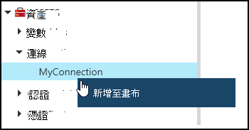
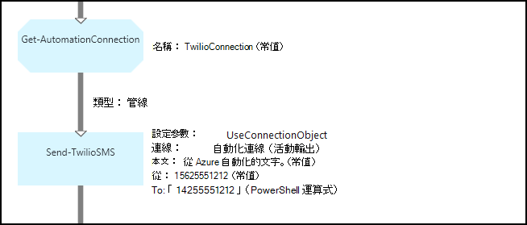
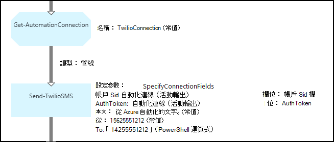

<properties 
   pageTitle="Azure 自動化連線資產 |Microsoft Azure"
   description="Azure 自動化連線資產包含從 runbook 或 DSC 設定連線至外部服務或應用程式所需的資訊。 本文說明連線，以及如何使用這些文字和圖形撰寫的詳細資料。"
   services="automation"
   documentationCenter=""
   authors="bwren"
   manager="stevenka"
   editor="tysonn" />
<tags 
   ms.service="automation"
   ms.devlang="na"
   ms.topic="article"
   ms.tgt_pltfrm="na"
   ms.workload="infrastructure-services"
   ms.date="01/27/2016"
   ms.author="bwren" />

# Azure 自動化連線資產

自動化連線資產包含從 runbook 或 DSC 設定連線至外部服務或應用程式所需的資訊。 這可能包含驗證，例如使用者名稱和密碼連線資訊，例如 URL 或連接埠除了所需的資訊。 連線的值會將所有連線到一個資產，而非建立多個變數中的特定應用程式的內容。 使用者可以編輯的單一位置，集中連線的值，您可以為 runbook 或 DSC 設定中的單一參數傳遞的連線名稱。 連線內容可以存取 runbook 或 DSC 設定，以**取得 AutomationConnection**活動。

當您建立的連線時，您必須指定*連線類型*。 連線類型是範本，以定義一組的屬性。 連線定義在其連線類型中定義的每個屬性值。 新增至 Azure 自動化的整合模組或使用[Azure 自動化 API](http://msdn.microsoft.com/library/azure/mt163818.aspx)建立連線類型。 就是安裝在您的自動化帳戶時建立的連線，可唯一的連線類型。

>[AZURE.NOTE] Azure 自動化安全資產包含認證、 憑證、 連線及加密的變數。 這些資產會加密及儲存的每個自動化帳戶使用會產生的唯一索引鍵 Azure 自動化。 此按鍵母片的憑證來加密並儲存於 Azure 自動化。 前，先將安全的資產，自動化帳戶金鑰解密使用母片的憑證，然後用來加密資產。

## Windows PowerShell Cmdlet

下表中的指令程式可用來建立並管理使用 Windows PowerShell 的自動化連線。 他們提供可使用自動化 runbooks 和 DSC 設定[Azure PowerShell 模組](../powershell-install-configure.md)的一部分。

|Cmdlet|描述|
|:---|:---|
|[取得 AzureAutomationConnection](http://msdn.microsoft.com/library/dn921828.aspx)|擷取連線。 包含雜湊資料表的連接欄位的值。|
|[新 AzureAutomationConnection](http://msdn.microsoft.com/library/dn921825.aspx)|建立新的連線。|
|[移除 AzureAutomationConnection](http://msdn.microsoft.com/library/dn921827.aspx)|移除現有的連線。|
|[設定 AzureAutomationConnectionFieldValue](http://msdn.microsoft.com/library/dn921826.aspx)|設定現有的連線的特定欄位的值。|

## 活動

下表中的活動會用來存取 runbook 或 DSC 設定文件中的連線。

|活動|描述|
|---|---|
|取得 AutomationConnection|取得要使用的連線。 傳回雜湊資料表與連線的內容。|

>[AZURE.NOTE] 您應避免使用變數中**取得-AutomationConnection**因為這可在設計階段複雜探索 runbooks 或 DSC 設定與連線資產之間的相依性的 – 名稱參數。

## 建立新的連線

### 若要建立新的連線 Azure 傳統入口網站

1. 從您自動化的帳戶，按一下 [**資產**頂端的視窗]。
1. 在視窗底部，按一下 [**新增設定**]。
1. 按一下 [**新增連線**]。
2. 在 [**連線類型**] 下拉式清單中，選取您想要建立的連線類型。  精靈會顯示特定類型的屬性。
1. 完成精靈，然後按一下 [儲存新連線] 核取方塊。

### 若要建立新的連線 Azure 入口網站

1. 從您自動化的帳戶，按一下 [開啟**資產**刀**資產**組件]。
1. 按一下以開啟**連線**刀**連線**部分。
1. 按一下 [**新增連線**刀頂端。
2. 在 [**類型**] 下拉式清單中，選取您想要建立的連線類型。 表單會展示特定類型的屬性。
1. 填寫表單，然後按一下 [**建立**]，儲存新連線]。

### 若要使用 Windows PowerShell 中建立新的連線

使用 Windows PowerShell 使用[新增 AzureAutomationConnection](http://msdn.microsoft.com/library/dn921825.aspx)指令程式中建立新的連線。 這個指令程式會有一個名為**ConnectionFieldValues**預期[雜湊資料表](http://technet.microsoft.com/library/hh847780.aspx)每個連接類型所定義的屬性的定義值參數。

下列範例命令的[Twilio](http://www.twilio.com)是電話語音服務可讓您傳送和接收文字訊息，建立新的連線。  使用[指令碼](http://gallery.technet.microsoft.com/scriptcenter/Twilio-PowerShell-Module-8a8bfef8)中心範例整合模組包含 Twilio 連線類型。  此連線類型定義帳戶 SID 和授權權杖，以驗證您的帳戶連線至 Twilio 時所需的屬性。  您必須[下載此模組](http://gallery.technet.microsoft.com/scriptcenter/Twilio-PowerShell-Module-8a8bfef8)，並將其安裝在您的自動化帳戶搭配使用此範例程式碼。

    $AccountSid = "DAf5fed830c6f8fac3235c5b9d58ed7ac5"
    $AuthToken  = "17d4dadfce74153d5853725143c52fd1"
    $FieldValues = @{"AccountSid" = $AccountSid;"AuthToken"=$AuthToken}

    New-AzureAutomationConnection -AutomationAccountName "MyAutomationAccount" -Name "TwilioConnection" -ConnectionTypeName "Twilio" -ConnectionFieldValues $FieldValues

## 使用 runbook 或 DSC 設定文件中的連線

您擷取 runbook 或**取得 AutomationConnection** cmdlet DSC 設定文件中的連線。  此活動擷取連線中的不同欄位的值，並傳回其為[雜湊資料表](http://go.microsoft.com/fwlink/?LinkID=324844)，然後使用適當的命令，runbook 或 DSC 組態會使用。

### 文字 runbook 範例
下列範例命令顯示如何在上一個範例中使用 Twilio 連線，從 runbook 傳送簡訊。  使用以下傳送 TwilioSMS 活動有兩個參數集每的驗證 Twilio 服務中使用不同的方法。  使用連線物件，其中一個，另一個帳戶 SID 和授權權杖使用個別的參數。  在這個範例中，會顯示兩個方法。

    $Con = Get-AutomationConnection -Name "TwilioConnection"
    $NumTo = "14255551212"
    $NumFrom = "15625551212"
    $Body = "Text from Azure Automation."

    #Send text with connection object.
    Send-TwilioSMS -Connection $Con -From $NumFrom -To $NumTo -Body $Body

    #Send text with connection properties.
    Send-TwilioSMS -AccountSid $Con.AccountSid -AuthToken $Con.AuthToken -From $NumFrom -To $NumTo -Body $Body

### 圖形化 runbook 範例

以滑鼠右鍵按一下 [文件庫] 窗格中的圖形化編輯器的連線，然後選取 [**新增至畫布****取得 AutomationConnection**活動加入圖形的 runbook 中。

下圖顯示圖形的 runbook 中使用連線的範例。  這是如上所示的傳送簡訊使用文字的 runbook Twilio 相同的範例。  此範例使用**UseConnectionObject**參數設定為**傳送 TwilioSMS**活動驗證服務中使用連線物件。  由於連接參數預期的單一物件，即會以下使用[管線連結](automation-graphical-authoring-intro.md#links-and-workflow)。

使用運算式，而不是對的常數值**至**參數中值的 PowerShell 發生此參數預期字串陣列值類型，以便您可以傳送給多個數字的理由。  PowerShell 運算式可讓您提供單一值或陣列。

下圖顯示相同的上方為範例，但使用**SpecifyConnectionFields**參數設定的預期的 AccountSid 和 AuthToken 參數個別指定，而不是使用連接物件進行驗證。  在此情況下，指定連線的欄位，而不是物件本身。  

## 相關的文章

- [圖形化撰寫中的連結](automation-graphical-authoring-intro.md#links-and-workflow)
 
