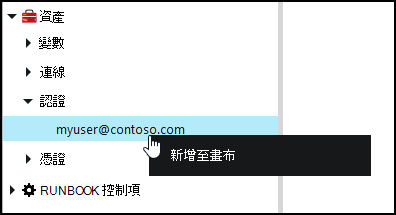
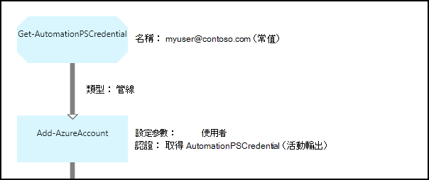

<properties 
   pageTitle="認證資產 Azure 自動化 |Microsoft Azure"
   description="Azure 自動化認證資產包含可用來存取 runbook 或 DSC 設定的資源進行驗證的安全性憑證。 本文將說明如何建立認證資產和 runbook 或 DSC 設定文件中使用它們。"
   services="automation"
   documentationCenter=""
   authors="mgoedtel"
   manager="jwhit"
   editor="tysonn" />
<tags 
   ms.service="automation"
   ms.devlang="na"
   ms.topic="article"
   ms.tgt_pltfrm="na"
   ms.workload="infrastructure-services"
   ms.date="06/09/2016"
   ms.author="bwren" />

# Azure 自動化認證資產

自動化認證資產保留[PSCredential](http://msdn.microsoft.com/library/system.management.automation.pscredential)物件其中包含安全性憑證，例如使用者名稱和密碼。 Runbooks 和 DSC 設定可能會使用接受驗證，在 PSCredential 物件的 cmdlet 或他們可能會擷取的使用者名稱和密碼 PSCredential 物件提供部分應用程式或服務需要進行驗證。 認證的摘要資訊安全地儲存於 Azure 自動化，且可以存取 runbook 或 DSC 設定，以[取得 AutomationPSCredential](http://msdn.microsoft.com/library/system.management.automation.pscredential.aspx)活動。

>[AZURE.NOTE] Azure 自動化安全資產包含認證、 憑證、 連線及加密的變數。 這些資產會加密及儲存的每個自動化帳戶使用會產生的唯一索引鍵 Azure 自動化。 此按鍵母片的憑證來加密並儲存於 Azure 自動化。 前，先將安全的資產，自動化帳戶金鑰解密使用母片的憑證，然後用來加密資產。 

## Windows PowerShell cmdlet

下表中的指令程式可用來建立並管理使用 Windows PowerShell 的自動化認證資產。  他們提供可使用自動化 runbooks 和 DSC 設定[Azure PowerShell 模組](../powershell-install-configure.md)的一部分。

|Cmdlet|描述|
|:---|:---|
|[取得 AzureAutomationCredential](http://msdn.microsoft.com/library/dn913781.aspx)|擷取認證資產的相關資訊。 您只能從**取得 AutomationPSCredential**活動擷取本身的認證。|
|[新 AzureAutomationCredential](http://msdn.microsoft.com/library/azure/jj554330.aspx)|建立新的自動化認證。|
|[移除-AzureAutomationCredential](http://msdn.microsoft.com/library/azure/jj554330.aspx)|移除自動化認證。|
|[設定-AzureAutomationCredential](http://msdn.microsoft.com/library/azure/jj554330.aspx)|設定現有的自動化認證的屬性。|

## Runbook 活動

下表中的活動用來存取 runbook 和 DSC 設定中的認證。

|活動|描述|
|:---|:---|
|取得 AutomationPSCredential|取得 runbook 或 DSC 設定文件中使用認證。 傳回[System.Management.Automation.PSCredential](http://msdn.microsoft.com/library/system.management.automation.pscredential)物件。|

>[AZURE.NOTE] 您應避免使用變數中取得-AutomationPSCredential，因為這可以複雜探索 runbooks 或 DSC 設定之間的相依性，並在設計階段認證資產的 – 名稱參數。

## 建立新的認證資產

### 若要建立新的認證資產 Azure 傳統入口網站

1. 從您自動化的帳戶，按一下 [**資產**頂端的視窗]。
1. 在視窗底部，按一下 [**新增設定**]。
1. 按一下 [**新增認證**]。
2. 在 [**認證類型**] 下拉式清單中，選取 [ **PowerShell 認證**]。
1. 完成精靈，然後按一下 [儲存新的認證] 核取方塊。

### 若要建立新的認證資產 Azure 入口網站

1. 從您自動化的帳戶，按一下 [開啟**資產**刀**資產**組件]。
1. 按一下以開啟**認證**刀**認證**部分。
1. 按一下 [**新增認證**刀頂端。
1. 填寫表單，然後按一下 [**建立**]，儲存新的認證。

### 若要使用 Windows PowerShell 中建立新的認證資產

下列範例命令顯示如何建立新的自動化認證。 PSCredential 物件是第一次建立的名稱和密碼，然後用來建立認證資產。 或者，您可以使用**取得認證**cmdlet 會提示您輸入的名稱和密碼。

    $user = "MyDomain\MyUser"
    $pw = ConvertTo-SecureString "PassWord!" -AsPlainText -Force
    $cred = New-Object –TypeName System.Management.Automation.PSCredential –ArgumentList $user, $pw
    New-AzureAutomationCredential -AutomationAccountName "MyAutomationAccount" -Name "MyCredential" -Value $cred

## 使用 PowerShell 認證

您擷取 runbook 或**取得 AutomationPSCredential**活動 DSC 設定文件中的認證資產。 這會傳回一個[PSCredential 物件](http://msdn.microsoft.com/library/system.management.automation.pscredential.aspx)，您可以使用與活動或需要 PSCredential 參數的指令程式。 您也可以擷取個別使用的認證物件的屬性。 物件的屬性的使用者名稱和安全密碼，或您可以使用**GetNetworkCredential**方法[NetworkCredential](http://msdn.microsoft.com/library/system.net.networkcredential.aspx)物件中所提供的密碼不安全的版本。

### 文字 runbook 範例

下列範例命令顯示如何在 runbook 使用 PowerShell 認證。 在此範例中，擷取認證以及其使用者名稱和密碼分派給變數。

    $myCredential = Get-AutomationPSCredential -Name 'MyCredential'
    $userName = $myCredential.UserName
    $securePassword = $myCredential.Password
    $password = $myCredential.GetNetworkCredential().Password

### 圖形化 runbook 範例

以滑鼠右鍵按一下圖形編輯器] 的 [文件庫] 窗格中的認證，然後選取 [**新增至畫布****取得 AutomationPSCredential**活動加入圖形的 runbook 中。

下圖顯示圖形的 runbook 中使用認證的範例。  在此情況下，將其用於提供驗證 Azure 資源 runbook [Azure AD 使用者帳戶的項目會驗證 Runbooks](automation-sec-configure-aduser-account.md)所述。  第一個活動擷取的認證，有權存取 Azure 訂閱。  **新增 AzureAccount**活動然後使用此認證提供驗證之後，任何活動。  [管線連結](automation-graphical-authoring-intro.md#links-and-workflow)此處是因為**取得 AutomationPSCredential**預期的單一物件的人員。  

## DSC 中使用 PowerShell 認證
同時在 Azure 自動化 DSC 設定可以參考使用**取得 AutomationPSCredential**認證資產，認證資產可以也傳入透過參數，視需要。 如需詳細資訊，請參閱[Azure 自動化 DSC 中的編譯設定](automation-dsc-compile.md#credential-assets)。

## 後續步驟

- 若要進一步瞭解圖形撰寫中的連結，請參閱[連結的圖形化撰寫](automation-graphical-authoring-intro.md#links-and-workflow)
- 若要瞭解自動化的不同的驗證方法，請參閱[Azure 自動化安全性](automation-security-overview.md)
- 若要開始使用圖形 runbooks，請參閱[我的第一個圖形 runbook](automation-first-runbook-graphical.md)
- 若要開始使用 PowerShell 工作流程 runbooks，請參閱[我的第一個 PowerShell 工作流程 runbook](automation-first-runbook-textual.md) 

 
