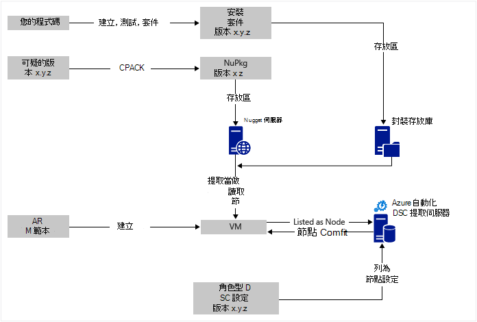

<properties
   pageTitle="Azure 自動化 DSC 連續部署 Chocolatey |Microsoft Azure"
   description="使用 Azure 自動化 DSC 和 Chocolatey 封裝管理員 DevOps 連續部署。  完整 JSON ARM 範本與 PowerShell 來源的範例。"
   services="automation"
   documentationCenter=""
   authors="sebastus"
   manager="stevenka"
   editor=""/>

<tags
   ms.service="automation"
   ms.devlang="na"
   ms.topic="article"
   ms.tgt_pltfrm="vm-windows"
   ms.workload="na"
   ms.date="08/08/2016"
   ms.author="golive"/>

# 連續部署使用自動化 DSC 和 Chocolatey 的虛擬機器中的使用狀況範例︰

在 DevOps 全球有許多的工具，來協助連續整合管道不同點。  Azure 自動化 Desired 狀態設定 (DSC) 是新歡迎 DevOps 小組可以採用的選項。  本文將示範在 Windows 電腦設定連續部署 (CD) 設定。  您可以輕鬆地擴充包含視任意數目的 Windows 電腦中的角色 （網站，例如），並從該處至其他的角色技巧。

## 在高的層級

有很多事，但所幸，可以分成兩個主要的程序︰ 

  - 撰寫程式碼的測試，然後建立並發佈系統的主要與次要版本的安裝套件。 
  - 建立及管理 Vm，將會安裝套件中執行的程式碼。  

這些核心處理程序其中放置之後，則自動更新為新的版本會建立並部署，任何特定 VM 上執行的套件簡短的步驟。

## 元件概觀

例如[引起取得](https://en.wikipedia.org/wiki/Advanced_Packaging_Tool)的套件管理員是很知名在 Linux 世界中，但不是太多在 Windows 全世界的哪個。  [Chocolatey](https://chocolatey.org/)這類項目，而史 Hanselman[部落格](http://www.hanselman.com/blog/IsTheWindowsUserReadyForAptget.aspx)主題會很棒的簡介。  簡而言之，Chocolatey 可讓您從中央存放庫套件的安裝套件，將 Windows 系統使用命令列。  您可以建立並管理您自己存放庫，然後 Chocolatey 可以從您指定的存放庫的任何數字安裝套件。

想要的狀態設定 (DSC) （[概觀](https://technet.microsoft.com/library/dn249912.aspx)） 是一 PowerShell 工具，可讓您將您要用一台電腦設定。  例如，您可以說 「 我想要安裝的 Chocolatey 想安裝 IIS，我想要開啟連接埠 80、 我想要版本 1.0.0 的我的網站安裝。 」  DSC 本機組態管理員 (LCM) 實作該設定。 DSC 提取伺服器保留存放庫的 [設定您的電腦。 在每一部電腦上的 LCM 回定期以查看其設定是否符合儲存的設定。 它可以報告的狀態，或嘗試再次匯入儲存設定的對齊方式的電腦。 您可以編輯已儲存的伺服器上的設定擷取電腦或機器来進入 [對齊方式，使用變更設定的設定。

Azure 自動化是受管理的服務可讓您可以自動化使用 runbooks、 節點、 認證、 資源及排程等全域變數資產的各種工作的 Microsoft Azure 中。 Azure 自動化 DSC 延伸至包含 PowerShell DSC 工具此自動化功能。  以下是[概觀](automation-dsc-overview.md)。

DSC 資源是具有特定的功能，例如管理網路、 Active Directory 或 SQL Server 的程式碼的模組。  Chocolatey DSC 資源知道如何存取 NuGet 伺服器 （還有其他），下載套件、 安裝套件，依此類推。  [PowerShell 圖庫](http://www.powershellgallery.com/packages?q=dsc+resources&prerelease=&sortOrder=package-title)中有許多其他 DSC 資源。  將您 Azure 自動化 DSC 提取伺服器安裝這些模組 （由您），可以使用您的設定。

ARM 範本提供用宣告產生基礎結構的項目，例如網路的子網路、 網路安全性的方式，與路由]，負載平衡器、 Nic、 Vm 等等。  以下是[文件](../resource-manager-deployment-model.md)比較 ARM 部署模型 （宣告式） Azure 服務管理 （ASM 或傳統） 的部署模型 （必要）。  與其他[文件](../virtual-machines/virtual-machines-windows-compare-deployment-models.md)，瞭解核心資源提供者，計算、 儲存與網路。

ARM 範本的關鍵功能是安裝 VM 延伸到 VM 加以佈建的能力。  副檔名為 VM 有特定的功能，例如執行自訂指令碼、 安裝的防毒軟體，或執行 DSC 設定指令碼。  有許多其他類型的 VM 副檔名。

## 快速出差的圖表

從頂端開始，您撰寫程式碼，建立並測試，然後建立安裝套件。  Chocolatey 可以處理各種類型的安裝套件，例如 MSI MSU，ZIP。  而且您具有 PowerShell Chocolatey 的原生功能不想最實際的安裝作業的完整功能。  將 te102827792 連線到 – 套件存放庫放置套件。  此的使用狀況範例使用 Azure blob 儲存體帳戶，請在公用資料夾，但它可以的任何位置。  Chocolatey 處理原生 NuGet 伺服器一些其他人的套件中繼資料的管理。  [本文](https://github.com/chocolatey/choco/wiki/How-To-Host-Feed)將說明選項。  此的使用狀況範例使用 NuGet。  Nuspec 是套件的中繼資料。  「 編譯 」 將 NuPkg 的 Nuspec 和儲存在 NuGet 伺服器中。  當您設定要求套件名稱，並參考 NuGet 伺服器時，則 Chocolatey DSC 資源 （現在 VM) 上抓取套件，並將它安裝您。  您也可以要求特定包裝的版本。

在左下方的圖片，沒有 Azure 資源管理員 (ARM) 範本。  使用方式，在本例 VM 副檔名註冊 Azure 自動化 DSC 提取伺服器 (亦即提取 server) VM 節點。  設定會儲存於提取伺服器。  實際上，會將其儲存按兩次︰ 一次以純文字和一旦編譯為 MOF 檔案 （適用於那些知道這類動作之相關資訊。） 在入口網站，MOF 是 「 節點的設定 」 （而不只是 「 設定）]。  這是與相關聯的節點，節點就會知道其設定的成品。  以下詳細資訊會顯示如何指派節點節點設定。

可能您已進行頂端，或大部分的位元。  建立 nuspec、 編譯並將其儲存至 NuGet 伺服器是小型的項目。  與您已管理 Vm。  連續部署記下一步需要設定擷取伺服器 （一次）、 註冊您的節點與其 （一次），建立及儲存那里的設定 （一開始）。  升級套件，以及部署至存放庫，然後重新整理設定] 和 [節點設定提取伺服器 （視需要重複）。

如果您不使用 ARM 範本開始，這也是 [確定]。  有能協助您註冊您的 Vm 提取伺服器和其他所有的 PowerShell 指令程式。 如需詳細資訊，請參閱這篇文章︰[管理 Azure 自動化 DSC 來登入電腦](automation-dsc-onboarding.md)

## 步驟 1︰ 擷取伺服器和自動化帳戶設定

在已驗證的 (新增 AzureRmAccount) PowerShell 命令列: （可能需要幾分鐘的時間時擷取伺服器設定）

    New-AzureRmResourceGroup –Name MY-AUTOMATION-RG –Location MY-RG-LOCATION-IN-QUOTES
    New-AzureRmAutomationAccount –ResourceGroupName MY-AUTOMATION-RG –Location MY-RG-LOCATION-IN-QUOTES –Name MY-AUTOMATION-ACCOUNT 

您可以將您的自動化帳戶放入下列區域內 （又稱位置） 的任何︰ 東亞美國 2、 南部美國中部、 美國 Gov 維吉尼亞州、 西歐、 東南亞、 日本東亞、 中央印度和澳大利亞 Southeast。

## 步驟 2: VM 副檔名更多內容 ARM 範本

VM 註冊 （使用 PowerShell DSC VM 副檔名） 此[Azure 快速入門範本](https://github.com/Azure/azure-quickstart-templates/tree/master/dsc-extension-azure-automation-pullserver)中提供的詳細資料。  此步驟中註冊您的新 VM 與 DSC 節點的清單中擷取伺服器。  此登錄的一部分指定要套用至節點節點設定。  此節點設定沒有已存在於您尚未中擷取伺服器，因此的步驟 4，這是第一次 [確定]。  但以下步驟 2 中您需要有決定節點的名稱，並設定的名稱。  使用方式，在本例節點 'isvbox 」，而設定為 「 ISVBoxConfig 」。  （若要在 DeploymentTemplate.json 中指定） 的節點設定名稱為 「 ISVBoxConfig.isvbox 」。  

## 步驟 3︰ 將所需的 DSC 資源新增至提取伺服器

PowerShell 庫被控制將 DSC 資源安裝在您 Azure 自動化的帳戶。  瀏覽至您想要然後按一下 [部署至 Azure 自動化] 按鈕的資源。

最近新增 Azure 入口網站的其他方法可讓您擷取新的模組中或更新現有的模組。 按一下 [透過自動化帳戶資源、 [資產] 方塊中，及最後模組] 磚。  [瀏覽] 圖庫] 圖示可讓您看到 [模組] 庫中的清單、 向下切入詳細資料及最後匯入至您的自動化帳戶。 這是將您的模組保持在最不時的好方法。 然後匯入功能檢查以確保不同步處理其他模組的相依性]。

或者，您也可以有手動的方法。  適用於 Windows 電腦 PowerShell 整合模組的資料夾結構是從 Azure 自動化所需的資料夾結構稍有不同。  需要在您的組件的那調整。  但並不難，並完成一次每個資源 （除非您想要升級，供日後。） 如需有關如何撰寫 PowerShell 整合模組的詳細資訊，請參閱這篇文章︰[撰寫 Azure 自動化的整合模組](https://azure.microsoft.com/blog/authoring-integration-modules-for-azure-automation/)

-   安裝模組所需工作站，，如下所示︰
    -   安裝[Windows Management Framework、 v5](http://aka.ms/wmf5latest) （不需要適用於 Windows 10）
    -   `Install-Module –Name MODULE-NAME`< — 抓取 PowerShell 庫模組 
-   複製 [模組] 資料夾，從`c:\Program Files\WindowsPowerShell\Modules\MODULE-NAME`temp 資料夾 
-   從主資料夾刪除範例與文件 
-   Zip 主資料夾中，命名 ZIP 檔案與資料夾完全相同 
-   ZIP 檔案放在連線到 HTTP 位置，例如在 Azure 儲存體帳戶中的 blob 儲存體。
-   執行這個 PowerShell:

        New-AzureRmAutomationModule `
            -ResourceGroupName MY-AUTOMATION-RG -AutomationAccountName MY-AUTOMATION-ACCOUNT `
            -Name MODULE-NAME –ContentLink "https://STORAGE-URI/CONTAINERNAME/MODULE-NAME.zip"
        

下列範例 cChoco 和 xNetworking 執行這些步驟。 請參閱為特殊處理 cChoco 的[備忘稿](#notes)。

## 步驟 4︰ 新增提取伺服器節點設定

沒有任何特殊有關您匯入您的設定所擷取的伺服器和編譯的第一次。  所有後續匯入/編譯相同的設定尋找完全相同。  每次您更新您的套件，並向外推生產需要您執行此步驟中，確保正確的設定檔之後，包括您的套件的新版本。  以下是設定檔及 PowerShell:

ISVBoxConfig.ps1:

    Configuration ISVBoxConfig 
    { 
        Import-DscResource -ModuleName cChoco 
        Import-DscResource -ModuleName xNetworking
    
        Node "isvbox" {   
    
            cChocoInstaller installChoco 
            { 
                InstallDir = "C:\choco" 
            }
    
            WindowsFeature installIIS 
            { 
                Ensure="Present" 
                Name="Web-Server" 
            }
    
            xFirewall WebFirewallRule 
            { 
                Direction = "Inbound" 
                Name = "Web-Server-TCP-In" 
                DisplayName = "Web Server (TCP-In)" 
                Description = "IIS allow incoming web site traffic." 
                DisplayGroup = "IIS Incoming Traffic" 
                State = "Enabled" 
                Access = "Allow" 
                Protocol = "TCP" 
                LocalPort = "80" 
                Ensure = "Present" 
            }
    
            cChocoPackageInstaller trivialWeb 
            {            
                Name = "trivialweb" 
                Version = "1.0.0" 
                Source = “MY-NUGET-V2-SERVER-ADDRESS” 
                DependsOn = "[cChocoInstaller]installChoco", 
                "[WindowsFeature]installIIS" 
            } 
        }    
    }

新增-ConfigurationScript.ps1:

    Import-AzureRmAutomationDscConfiguration ` 
        -ResourceGroupName MY-AUTOMATION-RG –AutomationAccountName MY-AUTOMATION-ACCOUNT ` 
        -SourcePath C:\temp\AzureAutomationDsc\ISVBoxConfig.ps1 ` 
        -Published –Force
    
    $jobData = Start-AzureRmAutomationDscCompilationJob ` 
        -ResourceGroupName MY-AUTOMATION-RG –AutomationAccountName MY-AUTOMATION-ACCOUNT ` 
        -ConfigurationName ISVBoxConfig 
    
    $compilationJobId = $jobData.Id
    
    Get-AzureRmAutomationDscCompilationJob ` 
        -ResourceGroupName MY-AUTOMATION-RG –AutomationAccountName MY-AUTOMATION-ACCOUNT ` 
        -Id $compilationJobId

在新的節點設定這些步驟結果名為 「 ISVBoxConfig.isvbox 」 放在提取伺服器上。  內建的節點設定名稱為 「 configurationName.nodeName 」。

## 步驟 5︰ 建立和維護套件中繼資料

您將放入套件存放庫每個套件，您需要敘述 nuspec。  該 nuspec 必須編譯並儲存在您的 NuGet 伺服器。 此程序[以下](http://docs.nuget.org/create/creating-and-publishing-a-package)。  您可以使用 MyGet.org NuGet 伺服器。  他們銷售這項服務，但有入門是免費的 SKU。  在 NuGet.org 您會發現指示安裝您私人的套件 NuGet 伺服器。

## 步驟 6︰ 整合一切

以供部署，每次版本傳遞問與答及核准套件會建立 nuspec 和 nupkg 更新，且部署到 NuGet 伺服器。  此外，設定 (上述步驟 4) 必須更新為新的版本號碼同意。  它必須傳送到提取伺服器並編譯。  從之後，會而定，傳送更新，並將其安裝該設定 Vm。  每個更新很簡單-只要一條線或兩個 PowerShell。  若是 Visual Studio 小組服務] 中，將其中一些封裝鏈結中建立在一起的建立工作。  這[篇文章](https://www.visualstudio.com/en-us/docs/alm-devops-feature-index#continuous-delivery)提供更多詳細資料。  此[GitHub repo](https://github.com/Microsoft/vso-agent-tasks)詳細資料的各種使用建立工作。

## 備忘稿

此的使用狀況範例第一句是從 Azure 圖庫中的一般 Windows Server 2012 R2 圖像 VM。  您可以從任何已儲存的圖像開始，然後從該處 DSC 設定與調整。  不過，將會培食物的設定變更為圖像是難比動態更新使用 DSC 設定。

您沒有使用 ARM 範本和 VM 副檔名與您的 Vm 使用此技巧。  與您的 Vm 沒有在 Azure CD 管理] 下，必須開啟。  所有必要的安裝 Chocolatey，而 LCM 設定 VM 上，這樣就會知道在哪裡提取伺服器。  

當然，當您更新上正式 VM 套件時，您需要採取該 VM 旋轉登出時已安裝更新。  如何此差異很大。  例如，使用前 Azure 負載平衡器 VM，您可以新增自訂探查。  更新 VM，時有傳回 400 探查結束點。  調整必要導致這項變更可能在您的設定，，因為可以變更其切換回傳回 200，一旦完成更新。

完整來源此的使用狀況範例是在 GitHub[此 Visual Studio 專案](https://github.com/sebastus/ARM/tree/master/CDIaaSVM)中。

##相關的文章##

- [Azure 自動化 DSC 概觀](自動化-dsc-overview.md)
- [Azure 自動化 DSC cmdlet](https://msdn.microsoft.com/library/mt244122.aspx)
- [登入電腦，Azure 自動化 DSC 管理](自動化-dsc-onboarding.md)
