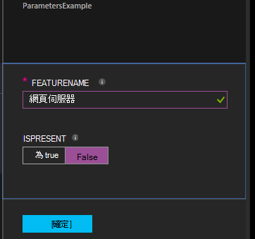

<properties 
   pageTitle="正在編譯設定中 Azure 自動化 DSC |Microsoft Azure" 
   description="概觀編譯所需的狀態設定 (DSC) 設定的兩種方法︰ 在 Azure 入口網站，並使用 Windows PowerShell。 " 
   services="automation" 
   documentationCenter="na" 
   authors="coreyp-at-msft" 
   manager="stevenka" 
   editor="tysonn"/>

<tags
   ms.service="automation"
   ms.devlang="na"
   ms.topic="article"
   ms.tgt_pltfrm="powershell"
   ms.workload="na" 
   ms.date="01/25/2016"
   ms.author="coreyp"/>
   
#正在編譯 Azure 自動化 DSC 中的設定#

您可以編譯所需的狀態設定 (DSC) 設定 Azure 自動化的兩種方法︰ 在 Azure 入口網站，並使用 Windows PowerShell。 下表將協助您決定何時要使用的每個特性哪一種方法︰ 

###Azure 預覽入口網站###
- 互動式的使用者介面簡單的方法
- 若要提供簡單的參數值的表單
- 輕鬆地追蹤工作狀態
- Azure 登入以驗證的存取權

###Windows PowerShell###
- 使用 Windows PowerShell cmdlet 的命令列的來電
- 可包含多個步驟自動化解決方案
- 提供簡單及複雜的參數值
- 追蹤工作狀態
- 支援 PowerShell 指令程式所需的用戶端
- 傳遞 ConfigurationData
- 編譯使用認證的設定

一旦您決定編譯方法，您可以遵循下列開始編譯個別的程序。

##正在編譯 DSC 設定 Azure 入口網站##

1.  從您的自動化帳戶，按一下 [**設定**]。
2.  按一下以開啟刀設定]。
3.  按一下 [**編譯**]。
4.  如果設定沒有參數，將會提示您確認是否要進行編譯。 如果設定參數，以便您提供的參數值，隨即會開啟**編譯設定**刀。 在參數，請參閱下方<a href="#basic-parameters">**基本參數**</a>區段，如需詳細資訊。
5.  **編譯工作**刀隨即會開啟，讓您可以編譯作業的狀態，並將其放在 Azure 自動化 DSC 提取伺服器上所造成的節點設定 （MOF 設定文件） 追蹤。

##正在編譯使用 Windows PowerShell DSC 設定##

您可以使用[`Start-AzureRmAutomationDscCompilationJob`](https://msdn.microsoft.com/library/mt244118.aspx)開始使用 Windows PowerShell 編譯。 下列程式碼會啟動編譯稱為**SampleConfig**DSC 設定。

    Start-AzureRmAutomationDscCompilationJob -ResourceGroupName "MyResourceGroup" -AutomationAccountName "MyAutomationAccount" -ConfigurationName "SampleConfig" 
 
`Start-AzureRmAutomationDscCompilationJob`傳回編譯工作物件，您可用來追蹤其狀態。 然後，您可以使用這個編譯工作物件[`Get-AzureRmAutomationDscCompilationJob`](https://msdn.microsoft.com/library/mt244120.aspx)判斷編譯工作狀態和[`Get-AzureRmAutomationDscCompilationJobOutput`](https://msdn.microsoft.com/library/mt244103.aspx)若要檢視其資料流 （輸出）。 下列程式碼啟動編譯**SampleConfig**設定，等待，完成後，並顯示其資料流。
    
    $CompilationJob = Start-AzureRmAutomationDscCompilationJob -ResourceGroupName "MyResourceGroup" -AutomationAccountName "MyAutomationAccount" -ConfigurationName "SampleConfig"
    
    while($CompilationJob.EndTime –eq $null -and $CompilationJob.Exception –eq $null)           
    {
        $CompilationJob = $CompilationJob | Get-AzureRmAutomationDscCompilationJob
        Start-Sleep -Seconds 3
    }
    
    $CompilationJob | Get-AzureRmAutomationDscCompilationJobOutput –Stream Any 

##基本的參數##

DSC 設定，包括參數類型與內容] 中的參數宣告運作方式與 Azure 自動化 runbooks 相同。 請參閱[啟動 Azure 自動化中的 runbook](automation-starting-a-runbook.md)若要進一步瞭解 runbook 參數。

下列範例會使用兩個**FeatureName**及參數**IsPresent**，來判斷中產生編譯期間**ParametersExample.sample**節點設定屬性的值。

    Configuration ParametersExample
    {
        param(
            [Parameter(Mandatory=$true)]
    
            [string] $FeatureName,
    
            [Parameter(Mandatory=$true)]
            [boolean] $IsPresent
        )
    
        $EnsureString = "Present"
        if($IsPresent -eq $false)
        {
            $EnsureString = "Absent"
        }
    
        Node "sample"
        {
            WindowsFeature ($FeatureName + "Feature")
            {
                Ensure = $EnsureString
                Name = $FeatureName
            }
        }
    }

您可以編譯使用基本的參數，在 Azure 自動化 DSC 入口網站，或使用 PowerShell 的 Azure 的 DSC 設定︰

###入口網站###

在入口網站，您可以按一下**編譯**之後輸入參數值。

###PowerShell###

PowerShell 需要[hashtable](http://technet.microsoft.com/library/hh847780.aspx)鍵符合參數名稱，及值等於參數值位置中的參數。

    $Parameters = @{
            "FeatureName" = "Web-Server"
            "IsPresent" = $False
    }
    
    
    Start-AzureRmAutomationDscCompilationJob -ResourceGroupName "MyResourceGroup" -AutomationAccountName "MyAutomationAccount" -ConfigurationName "ParametersExample" -Parameters $Parameters 
    

做為參數傳遞 PSCredentials 的相關資訊，請參閱<a href="#credential-assets">**認證資產**</a>下方。

##ConfigurationData##

**ConfigurationData**可讓您分隔結構的設定，從任何使用 PowerShell DSC 時的環境特定設定。 請參閱[「 什麼 」 開來中 PowerShell DSC 」 的 「](http://blogs.msdn.com/b/powershell/archive/2014/01/09/continuous-deployment-using-dsc-with-minimal-change.aspx)若要進一步瞭解**ConfigurationData**。

>[AZURE.NOTE] 編譯中使用 Azure PowerShell 的 Azure 自動化 DSC，而不是在 Azure 入口網站時，您可以使用**ConfigurationData** 。

下列範例 DSC 設定使用**ConfigurationData**透過**$ConfigurationData**和**$AllNodes**關鍵字。 您也必須[**xWebAdministration**模組](https://www.powershellgallery.com/packages/xWebAdministration/)這個範例中︰

     Configuration ConfigurationDataSample
     {
        Import-DscResource -ModuleName xWebAdministration -Name MSFT_xWebsite
    
        Write-Verbose $ConfigurationData.NonNodeData.SomeMessage 
    
        Node $AllNodes.Where{$_.Role -eq "WebServer"}.NodeName
        {
            xWebsite Site
            {
                Name = $Node.SiteName
                PhysicalPath = $Node.SiteContents
                Ensure   = "Present"
            }
        }
    }

您可以編譯使用 PowerShell 上方 DSC 設定。 下方 PowerShell 將兩個節點設定新增到 Azure 自動化 DSC 提取伺服器︰ **ConfigurationDataSample.MyVM1**和**ConfigurationDataSample.MyVM3**:

    $ConfigData = @{
        AllNodes = @(
            @{
                NodeName = "MyVM1"
                Role = "WebServer"
            },
            @{
                NodeName = "MyVM2"
                Role = "SQLServer"
            },
            @{
                NodeName = "MyVM3"
                Role = "WebServer"
    
            }
    
        )
    
        NonNodeData = @{
            SomeMessage = "I love Azure Automation DSC!"
    
        }
    
    } 
    
    Start-AzureRmAutomationDscCompilationJob -ResourceGroupName "MyResourceGroup" -AutomationAccountName "MyAutomationAccount" -ConfigurationName "ConfigurationDataSample" -ConfigurationData $ConfigData

##資產##

資產參照是 Azure 自動化 DSC 設定和 runbooks 中的值相同。 請參閱下列內容以取得詳細資訊︰

- [憑證](automation-certificates.md)
- [連線](automation-connections.md)
- [認證](automation-credentials.md)
- [變數](automation-variables.md)

###認證資產###
同時在 Azure 自動化 DSC 設定可以參考使用**取得 AzureRmAutomationCredential**認證資產，認證資產可以也傳入透過參數，視需要。 如果設定採用**PSCredential**類型的參數，您需要為該參數的值，而不是 PSCredential 物件傳遞 Azure 自動化認證資產的字串名稱。 在幕後會擷取及傳遞給設定 Azure 自動化認證資產的名稱。

保留認證安全節點設定 （MOF 設定文件） 中需要加密的節點設定 MOF 檔案中的認證。 Azure 自動化進一步採用此一個步驟，並會加密整個 MOF 檔案。 不過，目前您必須告訴 PowerShell DSC，沒有關係的認證以會以純文字 outputted 節點設定 MOF 在產生期間，因為 PowerShell DSC 不知道的 Azure 自動化會被加密整個 MOF 檔案透過編譯工作及其產生之後。

您可以告訴 PowerShell DSC 是認證以 outputted 以純文字的產生的節點設定 Mof 使用<a href="#configurationdata">**ConfigurationData**</a>沒問題。 您應該傳遞`PSDscAllowPlainTextPassword = $true`透過**ConfigurationData**每個節點區塊的名稱會出現在 DSC 設定和使用認證。

下列範例會顯示使用自動化認證資產的 DSC 設定。

    Configuration CredentialSample
    {
       $Cred = Get-AzureRmAutomationCredential -Name "SomeCredentialAsset"
    
        Node $AllNodes.NodeName
        { 
            File ExampleFile
            { 
                SourcePath = "\\Server\share\path\file.ext" 
                DestinationPath = "C:\destinationPath" 
                Credential = $Cred 
            }
        }
    }

您可以編譯使用 PowerShell 上方 DSC 設定。 下方 PowerShell 將兩個節點設定新增到 Azure 自動化 DSC 提取伺服器︰ **CredentialSample.MyVM1**和**CredentialSample.MyVM2**。

    $ConfigData = @{
        AllNodes = @(
            @{
                NodeName = "*"
                PSDscAllowPlainTextPassword = $True
            },
            @{
                NodeName = "MyVM1"
            },
            @{
                NodeName = "MyVM2"
            }
        )
    }
    
    Start-AzureRmAutomationDscCompilationJob -ResourceGroupName "MyResourceGroup" -AutomationAccountName "MyAutomationAccount" -ConfigurationName "CredentialSample" -ConfigurationData $ConfigData
