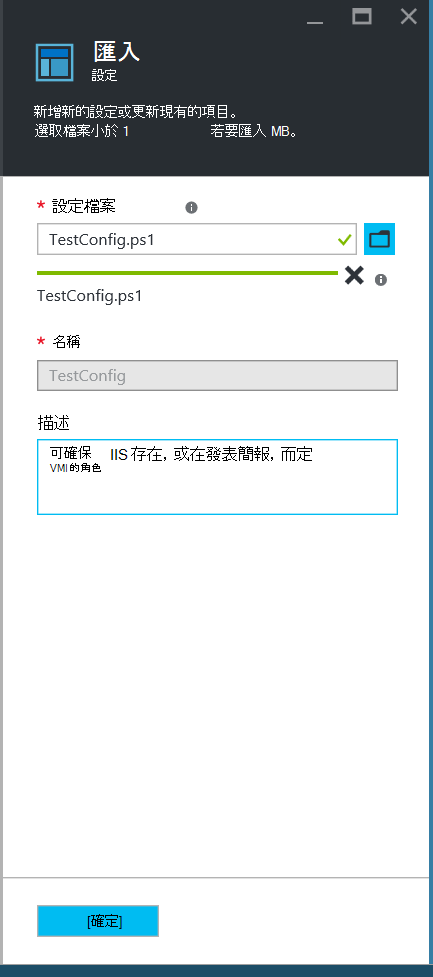
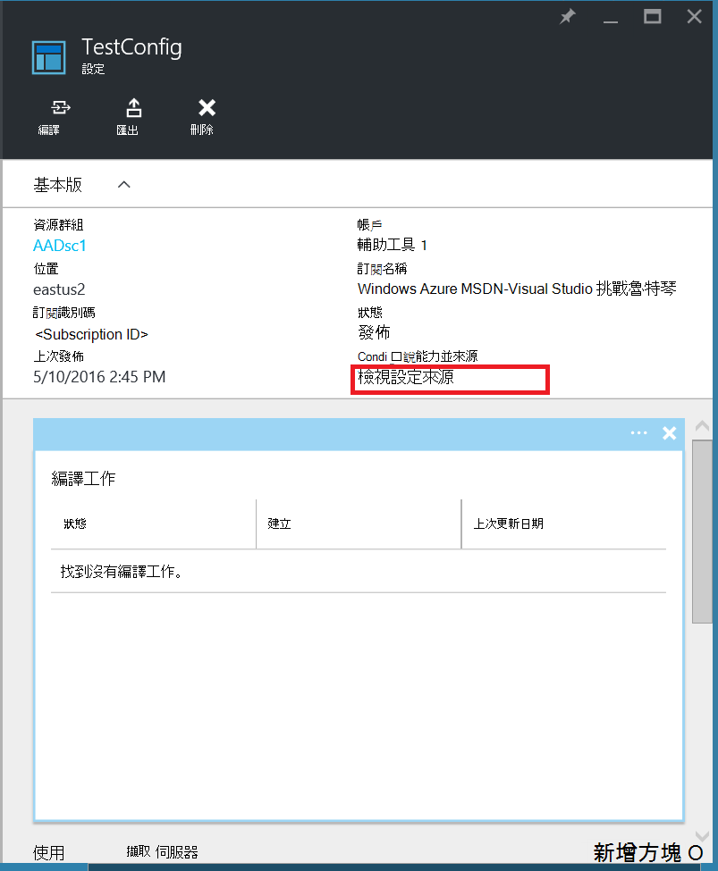
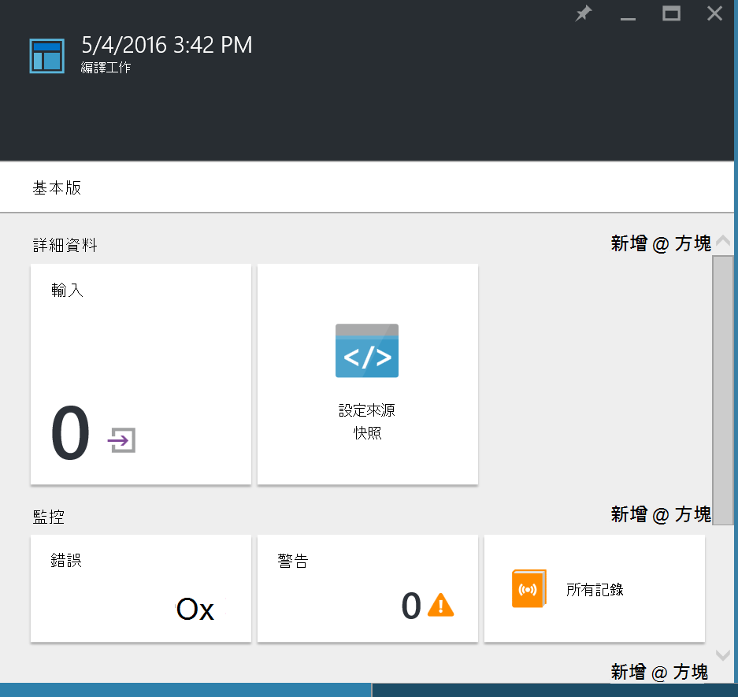
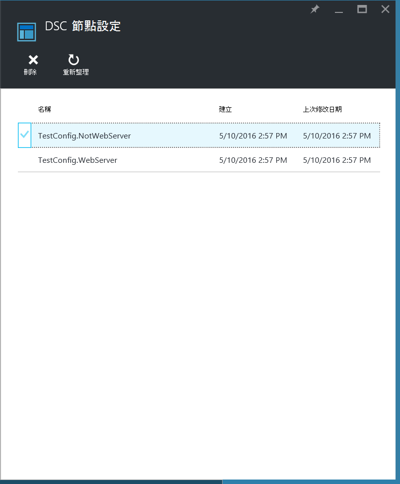
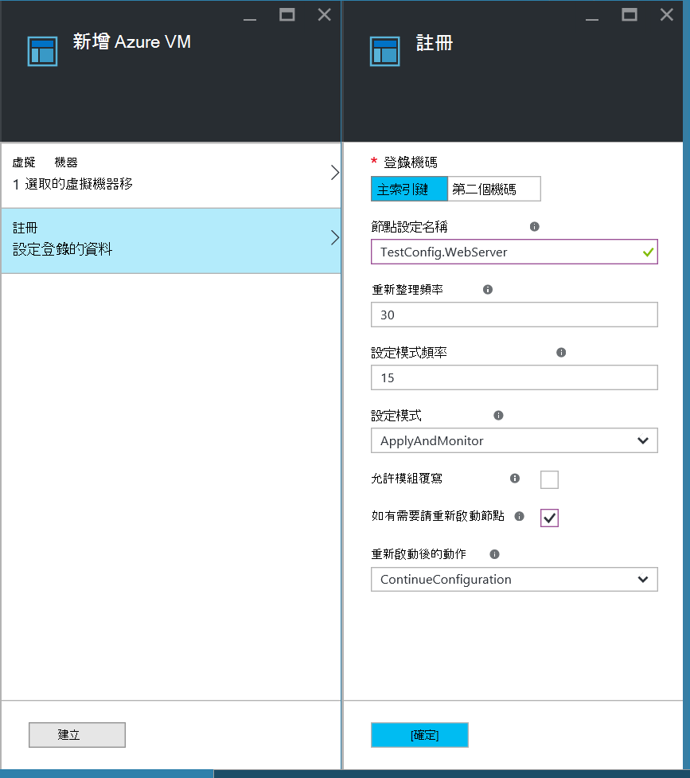
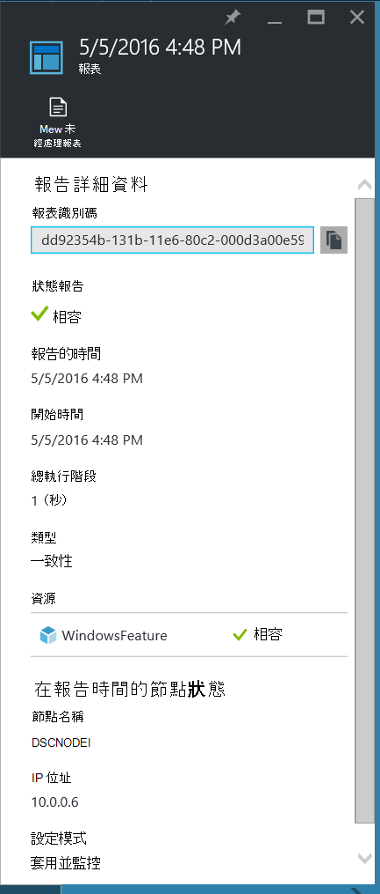
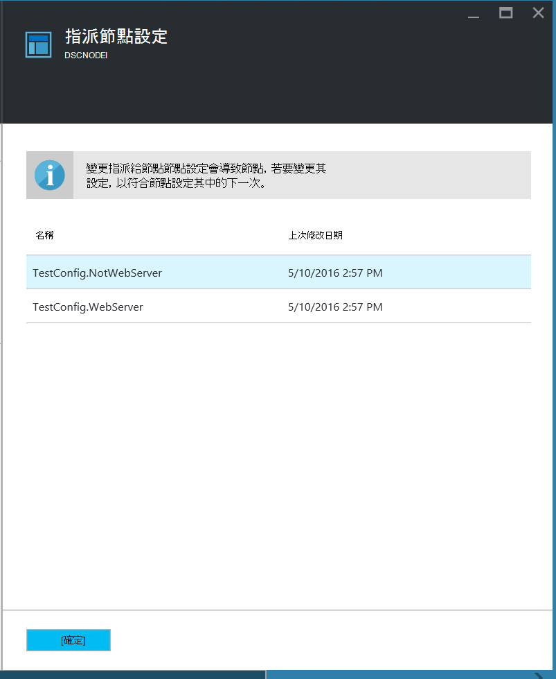

<properties
   pageTitle="Azure 自動化 DSC 快速入門"
   description="說明和最常見的工作中 Azure 自動化所需的狀態設定 (DSC) 的範例"
   services="automation" 
   documentationCenter="na" 
   authors="eslesar" 
   manager="dongill" 
   editor="tysonn"/>

<tags
   ms.service="automation"
   ms.devlang="na"
   ms.topic="article"
   ms.tgt_pltfrm="powershell"
   ms.workload="na" 
   ms.date="06/06/2016"
   ms.author="magoedte;eslesar"/>
   

# <a name="getting-started-with-azure-automation-dsc"></a>Azure 自動化 DSC 快速入門

本主題說明如何最常見的工作與 Azure 自動化所需的狀態設定 (DSC)，例如建立、 匯入]，及編譯設定，若要管理，登入電腦和檢視報表。 如需 Azure 自動化 DSC 功能的概觀，請參閱[Azure 自動化 DSC 概觀](automation-dsc-overview.md)。 DSC 文件，請參閱[Windows PowerShell 所需的狀態設定概觀 ](https://msdn.microsoft.com/PowerShell/dsc/overview)。

本主題提供的逐步指示，使用 Azure 自動化 DSC。 如果您希望的範例環境已設定不在本主題中所述的步驟進行，您可以使用[下列 ARM 範本](https://github.com/azureautomation/automation-packs/tree/master/102-sample-automation-setup)。 此範本設定已完成的 Azure 自動化 DSC 環境，包括 Azure VM 由 Azure 自動化 DSC 管理。
 
## <a name="prerequisites"></a>必要條件

若要完成本主題中的範例，以下是需要︰

- Azure 自動化帳戶。 建立 Azure 自動化執行為帳戶的指示，請參閱[Azure 執行為帳戶](automation-sec-configure-azure-runas-account.md)。
- Azure 資源管理員 VM （不傳統） 執行 Windows Server 2008 R2 或更新版本。 如需建立 VM 的指示，請參閱[建立第一個的 Windows 虛擬機器中 Azure 入口網站](../virtual-machines/virtual-machines-windows-hero-tutorial.md)

## <a name="creating-a-dsc-configuration"></a>建立 DSC 設定

我們會建立簡單的[DSC 設定](https://msdn.microsoft.com/powershell/dsc/configurations)，以確保的目前狀態 」 或 「 不存在的**網頁伺服器**Windows 功能 (IIS)，根據您指定節點的方式。

1. 啟動 Windows PowerShell ise [以系統 （或任何文字編輯器）。

2. 輸入下列文字︰

    ```powershell
    configuration TestConfig
    {
        Node WebServer
        {
            WindowsFeature IIS
            {
                Ensure               = 'Present'
                Name                 = 'Web-Server'
                IncludeAllSubFeature = $true

            }
        }

        Node NotWebServer
        {
            WindowsFeature IIS
            {
                Ensure               = 'Absent'
                Name                 = 'Web-Server'

            }
        }
        }
    ```
3. 將檔案儲存為`TestConfig.ps1`。

此設定每節點區塊， [WindowsFeature 資源](https://msdn.microsoft.com/powershell/dsc/windowsfeatureresource)，以確保的目前狀態 」 或 「 不存在的**網頁伺服器**功能通話某個資源。

## <a name="importing-a-configuration-into-azure-automation"></a>設定匯入 Azure 自動化

接下來，我們會將自動化帳戶匯入設定。

1. [Azure 入口網站](https://portal.azure.com)登入。

2. 在中樞] 功能表中，按一下**所有資源**，然後自動化帳戶的名稱。

3. 在**自動化帳戶**刀中，按一下 [ **DSC 設定**]。

4. 在**DSC 設定**刀中，按一下 [**新增設定**。

5. 在 [**匯入設定**刀中，瀏覽至`TestConfig.ps1`您電腦上的檔案。
    
    
    

6. 按一下**[確定]**。

## <a name="viewing-a-configuration-in-azure-automation"></a>Azure 自動化中檢視設定

在匯入設定之後，您可以在入口網站中 Azure 來進行檢視。

1. [Azure 入口網站](https://portal.azure.com)登入。

2. 在中樞] 功能表中，按一下**所有資源**，然後自動化帳戶的名稱。

3. 在**自動化帳戶**刀中，按一下 [ **DSC 設定**

4. 在**DSC 設定**刀中，按一下 [ **TestConfig** （這是您在上述程序匯入的設定的名稱）]。

5. 在**TestConfig 設定**刀中，按一下 [**檢視設定來源**]。

    
    
    **TestConfig 設定來源**刀隨即開啟，顯示設定的 PowerShell 程式碼。
    
## <a name="compiling-a-configuration-in-azure-automation"></a>正在編譯 Azure 自動化中的設定

您可以將所需的狀態套用至節點之前，必須編譯到一或多個節點設定 （MOF 文件），並放置在自動化 DSC 提取伺服器上定義狀態 DSC 設定。 編譯 Azure 自動化 DSC 中的設定的詳細說明，請參閱[編譯 Azure 自動化 DSC 中的設定](automation-dsc-compile.md)。 如需有關編譯設定的詳細資訊，請參閱[DSC 設定](https://msdn.microsoft.com/PowerShell/DSC/configurations)。

1. [Azure 入口網站](https://portal.azure.com)登入。

2. 在中樞] 功能表中，按一下**所有資源**，然後自動化帳戶的名稱。

3. 在**自動化帳戶**刀中，按一下 [ **DSC 設定**

4. 在**DSC 設定**刀中，按一下 [ **TestConfig** （先前匯入設定的名稱）]。

5. 在**TestConfig 設定**刀中，按一下**編譯**，，然後按一下**[是]**。 此舉會啟動編譯工作。
    
    ![TestConfig 設定刀，醒目提示編譯] 按鈕的螢幕擷取畫面](./media/automation-dsc-getting-started/CompileConfig.png)
    
> [AZURE.NOTE] 當您編譯設定，以在 Azure 自動化時，它會自動部署任何建立的節點設定 Mof 提取伺服器。

## <a name="viewing-a-compilation-job"></a>檢視編譯工作

開始編譯之後，您可以在**設定**刀**編譯工作**磚中檢視它。 **編譯工作**磚顯示正在執行，完成，以及失敗的工作。 當您開啟編譯工作刀時，它會顯示任何錯誤或發生警告包括該工作的相關資訊，輸入的參數中設定及編譯記錄。

1. [Azure 入口網站](https://portal.azure.com)登入。

2. 在中樞] 功能表中，按一下**所有資源**，然後自動化帳戶的名稱。

3. 在**自動化帳戶**刀中，按一下 [ **DSC 設定**]。

4. 在**DSC 設定**刀中，按一下 [ **TestConfig** （先前匯入設定的名稱）]。

5. 在 [ **TestConfig 設定**刀的**編譯工作**] 方塊中，按一下其中一項工作所列。 **編譯工作**刀開啟時，它會標示為 [編譯作業開始的日期。

    
  
6. 按一下任一個磚中**編譯工作**刀，進一步查看工作詳細資料。

## <a name="viewing-node-configurations"></a>檢視節點設定

編譯作業成功完成建立一或多個新的節點設定。 節點設定是已部署至提取伺服器並準備好提取並套用一或多個節點 MOF 文件。 您可以檢視節點設定您的自動化帳戶中**DSC 節點設定**刀。 節點設定有表單*ConfigurationName*的名稱。*節點名稱不*。

1. [Azure 入口網站](https://portal.azure.com)登入。

2. 在中樞] 功能表中，按一下**所有資源**，然後自動化帳戶的名稱。

3. 在**自動化帳戶**刀中，按一下 [ **DSC 節點設定**]。

    
    
## <a name="onboarding-an-azure-vm-for-management-with-azure-automation-dsc"></a>登入管理 Azure VM 與 Azure 自動化 DSC

您可以使用 Azure 自動化 DSC 管理 Azure Vm （傳統和資源管理員）、 內部部署 Vm、 Linux 電腦、 AWS Vm 和內部部署的實體機器。 本主題中，我們將討論如何內建只 Azure 資源管理員 Vm。 如需登入的資訊其他類型的電腦，請參閱[登入電腦，供 Azure 自動化 DSC 來管理](automation-dsc-onboarding.md)。

### <a name="to-onboard-an-azure-resource-manager-vm-for-management-by-azure-automation-dsc"></a>內建至 Azure 自動化 DSC 來管理 Azure 資源管理員 VM

1. [Azure 入口網站](https://portal.azure.com)登入。

2. 在中樞] 功能表中，按一下**所有資源**，然後自動化帳戶的名稱。

3. 在**自動化帳戶**刀中，按一下 [ **DSC 節點**]。

4. 在**DSC 節點**刀中，按一下 [**新增 Azure VM**]。

    ![DSC 節點刀醒目提示 [新增 Azure VM] 按鈕的螢幕擷取畫面](./media/automation-dsc-getting-started/OnboardVM.png)

5. 在**新增 Azure Vm**刀中，按一下 [**選取要內建的虛擬機器**。

6. 在**選取 Vm**刀中，選取您想要內建，的 VM，按一下**[確定]**。

    >[AZURE.IMPORTANT] 這必須是執行 Windows Server 2008 R2 Azure 資源管理員 VM 或更新版本。
    
7. 在**新增 Azure Vm**刀中，按一下 [**設定登錄資料**。

8. 在**註冊**刀中，輸入您想要套用的 vm**節點設定名稱**] 方塊中的節點設定的名稱。 這必須確實符合節點中設定的自動化帳戶的名稱。 此時提供的名稱，為選用步驟。 您可以變更指派的節點設定後登入節點。
核取**重新啟動節點，如有需要**然後再按一下**[確定]**。
    
    
    
    您所指定的節點設定將會套用至 VM**設定模式頻率**，所指定的間隔，VM 會檢查有更新節點設定在**重新整理頻率**所指定的時間間隔。 如需有關如何使用這些值的詳細資訊，請參閱[設定 [本機組態管理員]](https://msdn.microsoft.com/PowerShell/DSC/metaConfig)。
    
9. 在**新增 Azure Vm**刀中，按一下 [**建立**。

Azure 就會開始登入 VM 程的序。 完成後，VM 會顯示在**DSC 節點**刀自動化帳戶。

## <a name="viewing-the-list-of-dsc-nodes"></a>檢視 DSC 節點的清單

您可以檢視已 onboarded 管理您的自動化帳戶**DSC 節點**刀中的所有電腦的清單。

1. [Azure 入口網站](https://portal.azure.com)登入。

2. 在中樞] 功能表中，按一下**所有資源**，然後自動化帳戶的名稱。

3. 在**自動化帳戶**刀中，按一下 [ **DSC 節點**]。

## <a name="viewing-reports-for-dsc-nodes"></a>DSC 節點檢視報表

Azure 自動化 DSC 執行一致性檢查受管理的節點，每次節點傳送狀態報表回到提取伺服器。 您可以在該節點刀上檢視這些報表。

1. [Azure 入口網站](https://portal.azure.com)登入。

2. 在中樞] 功能表中，按一下**所有資源**，然後自動化帳戶的名稱。

3. 在**自動化帳戶**刀中，按一下 [ **DSC 節點**]。

4. 在 [**報表**] 方塊中，按一下任一清單中的報表。

    

在個別的報表刀，您可以看到下列狀態資訊的相對應的一致性檢查︰

- 狀態報告，是否節點 」 符合標準 「 設定 」 失敗 」] 或節點，就 「 不相容 」 （節點**applyandmonitor**模式中，而想要的狀態不是電腦）。
- 核取 [一致性的開始時間。
- 一致性檢查總執行階段。
- 一致性檢查類型。
- 任何錯誤，包括錯誤碼和錯誤訊息。 
- DSC 資源設定，以及每個資源 （節點是否為資源所要的狀態） 狀態中使用，您可以按一下以取得詳細的資訊，該資源的每個資源。
- 名稱、 IP 位址和設定模式的節點。

您也可以按一下 [**檢視原始報告**查看節點傳送至伺服器的實際資料。 如需有關如何使用該資料的詳細資訊，請參閱[使用 DSC 報表伺服器](https://msdn.microsoft.com/powershell/dsc/reportserver)。

可能需要一些時間後第一份報表之前節點 onboarded。 您可能必須等候 30 分鐘的第一份報表後內建節點。

## <a name="reassigning-a-node-to-a-different-node-configuration"></a>重新指派到不同的節點設定的節點

您可以指定要使用比您最初指派不同的節點設定的節點。

1. [Azure 入口網站](https://portal.azure.com)登入。

2. 在中樞] 功能表中，按一下**所有資源**，然後自動化帳戶的名稱。

3. 在**自動化帳戶**刀中，按一下 [ **DSC 節點**]。

4. **DSC 節點**刀中，按一下您要重新指派的節點的名稱。

5. 在該節點刀，按一下 [**指派節點**。

    ![節點刀醒目提示 [指派節點] 按鈕的螢幕擷取畫面](./media/automation-dsc-getting-started/AssignNode.png)

6. 在**指派節點設定**刀中，選取您要指派節點，節點設定，然後按一下**[確定]**。

    
    
## <a name="unregistering-a-node"></a>取消註冊節點

如果您不想再為受 Azure 自動化 DSC 節點，您可以移除註冊。

1. [Azure 入口網站](https://portal.azure.com)登入。

2. 在中樞] 功能表中，按一下**所有資源**，然後自動化帳戶的名稱。

3. 在**自動化帳戶**刀中，按一下 [ **DSC 節點**]。

4. **DSC 節點**刀中，按一下您想要移除註冊節點的名稱。

5. 在該節點刀，按一下 [**取消註冊**]。

    ![節點刀醒目提示 [取消註冊] 按鈕的螢幕擷取畫面](./media/automation-dsc-getting-started/UnregisterNode.png)

## <a name="related-articles"></a>相關的文章
* [Azure 自動化 DSC 概觀](automation-dsc-overview.md)
* [登入電腦，以 Azure 自動化 DSC 管理](automation-dsc-onboarding.md)
* [Windows PowerShell 所需的狀態設定概觀](https://msdn.microsoft.com/powershell/dsc/overview)
* [Azure 自動化 DSC cmdlet](https://msdn.microsoft.com/library/mt244122.aspx)
* [Azure 自動化 DSC 價格](https://azure.microsoft.com/pricing/details/automation/)

