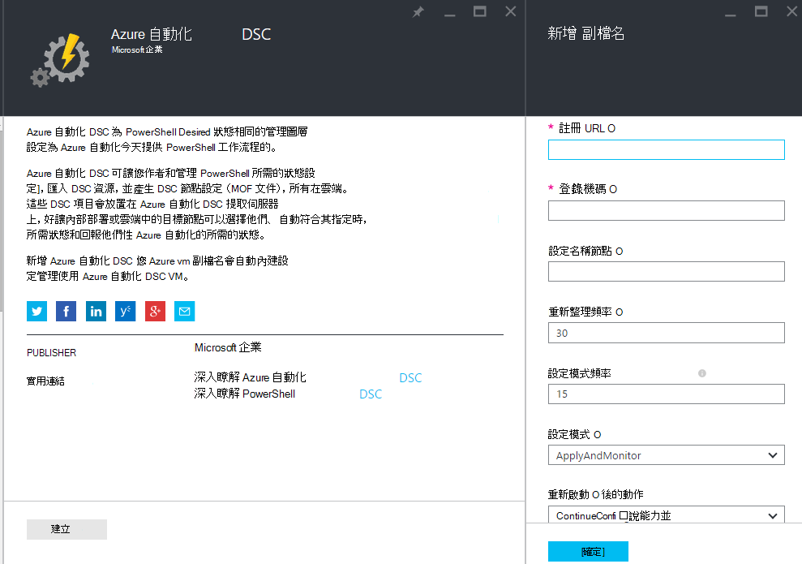
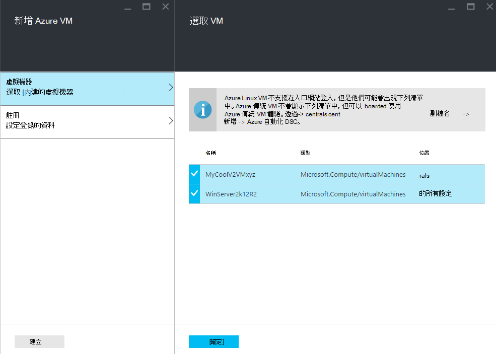
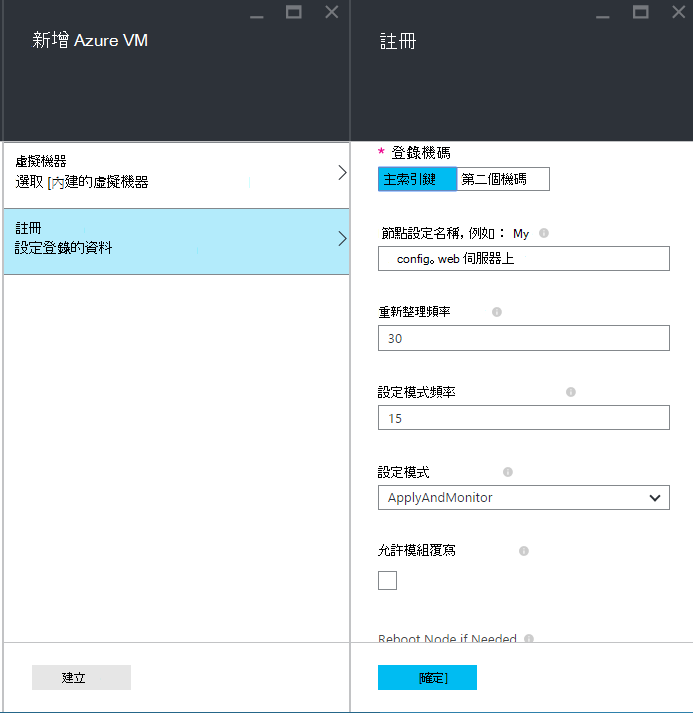
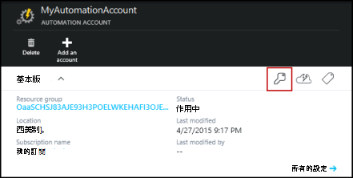
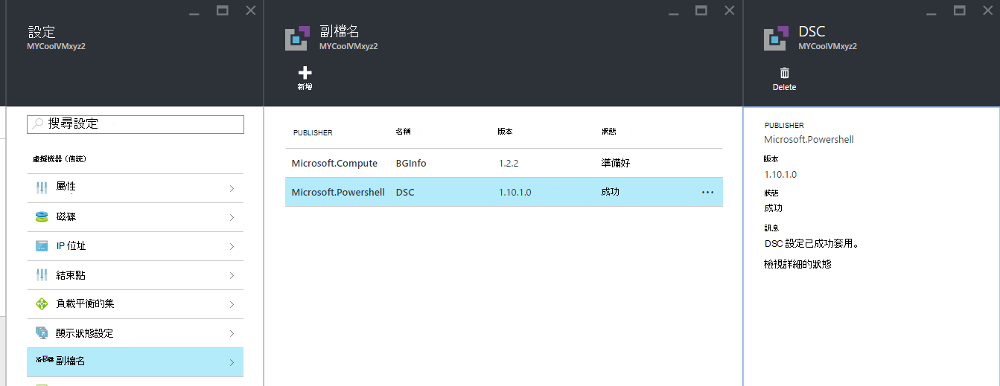

<properties 
   pageTitle="登入以 Azure 自動化 DSC 管理實體和虛擬機器 |Microsoft Azure" 
   description="如何設定電腦與 Azure 自動化 DSC 管理" 
   services="automation" 
   documentationCenter="dev-center-name" 
   authors="coreyp-at-msft" 
   manager="stevenka" 
   editor="tysonn"/>

<tags
   ms.service="automation"
   ms.devlang="NA"
   ms.topic="article"
   ms.tgt_pltfrm="powershell"
   ms.workload="TBD" 
   ms.date="04/22/2016"
   ms.author="coreyp"/>

# 登入電腦，以 Azure 自動化 DSC 管理

## 為什麼管理 Azure 自動化 DSC 部電腦？

[PowerShell 所需的狀態設定](https://technet.microsoft.com/library/dn249912.aspx)，例如 Azure 自動化所需的狀態設定會位於任何雲端或內部部署資料中心的簡單而強大，設定管理服務 DSC 節點 （實體與虛擬機器）。 延展性數以千計的電腦上輕鬆快速地從啟用中央安全的位置。 您可以輕鬆地內建的電腦，這些宣告式設定，並檢視報表顯示每個電腦的指派的規範您指定所要的狀態。 Azure 自動化 DSC 管理圖層是 DSC Azure 自動化管理圖層會 PowerShell 指令碼。 換句話說，以相同的方式，Azure 自動化可協助您管理 PowerShell 指令碼，它也可協助您管理 DSC 設定。 若要進一步瞭解使用 Azure 自動化 DSC 的優點，請參閱[Azure 自動化 DSC 概觀](automation-dsc-overview.md)。 

Azure 自動化 DSC 可用於管理各種不同的電腦︰

*    Azure 虛擬機器 （傳統）
*    Azure 虛擬機器
*    Amazon Web 服務 (AWS) 虛擬機器
*    實際/虛擬的 Windows 電腦上於內部部署，或非 Azure/AWS 雲端
*    實際/虛擬 Linux 電腦上於內部部署，或非 Azure 雲端 Azure 中

此外，如果您不是準備好雲端管理電腦設定，Azure 自動化 DSC 也可以使用報表專用的端點。 這個選項可讓您設定 （推入） DSC 內部部署到所需的設定，並檢視上節點法規遵循的所需的狀態，在 Azure 自動化豐富的報表詳細資料。

下列各節概述如何內建每一種 Azure 自動化 DSC 的電腦。

## Azure 虛擬機器 （傳統）

Azure 自動化 DSC，您可以輕鬆地內建的 Azure 虛擬機器 （傳統） 使用 Azure 入口網站或 PowerShell 設定管理。 顯示進階設定，並不需要將 VM 遠端系統管理員，Azure VM 所需的狀態設定副檔名註冊 Azure 自動化 DSC VM。 由於 Azure VM 所需的狀態設定副檔名為非同步，執行來追蹤進度，或疑難排解步驟，會提供以下[**疑難排解 Azure 虛擬機器登入**](#troubleshooting-azure-virtual-machine-onboarding)一節。

### Azure 入口網站

[Azure 入口網站](http://portal.azure.com/)中，按一下 [**瀏覽** -> **（傳統） 的虛擬機器**。 選取您想要內建的 Windows VM。 按一下 [虛擬機器中的儀表板刀，**所有設定** -> **副檔名** -> **新增** -> **Azure 自動化 DSC** -> **建立**。 輸入您的使用案例、 自動化帳戶的登錄機碼並註冊 URL 及選擇性地節點設定需要指派給 VM 的[PowerShell DSC 本機組態管理員] 的值](https://msdn.microsoft.com/powershell/dsc/metaconfig4)。

若要尋找註冊 URL] 與 [按鍵自動化帳號至內建電腦，請參閱[**安全註冊**](#secure-registration)下方的一節。

### PowerShell

    # log in to both Azure Service Management and Azure Resource Manager
    Add-AzureAccount
    Add-AzureRmAccount
    
    # fill in correct values for your VM/Automation account here
    $VMName = ""
    $ServiceName = ""
    $AutomationAccountName = ""
    $AutomationAccountResourceGroup = ""

    # fill in the name of a Node Configuration in Azure Automation DSC, for this VM to conform to
    $NodeConfigName = ""

    # get Azure Automation DSC registration info
    $Account = Get-AzureRmAutomationAccount -ResourceGroupName $AutomationAccountResourceGroup -Name $AutomationAccountName
    $RegistrationInfo = $Account | Get-AzureRmAutomationRegistrationInfo

    # use the DSC extension to onboard the VM for management with Azure Automation DSC
    $VM = Get-AzureVM -Name $VMName -ServiceName $ServiceName
    
    $PublicConfiguration = ConvertTo-Json -Depth 8 @{
      SasToken = ""
      ModulesUrl = "https://eus2oaasibizamarketprod1.blob.core.windows.net/automationdscpreview/RegistrationMetaConfigV2.zip"
      ConfigurationFunction = "RegistrationMetaConfigV2.ps1\RegistrationMetaConfigV2"

    # update these PowerShell DSC Local Configuration Manager defaults if they do not match your use case.
    # See https://technet.microsoft.com/library/dn249922.aspx?f=255&MSPPError=-2147217396 for more details
     Properties = @{
        RegistrationKey = @{
          UserName = 'notused'
          Password = 'PrivateSettingsRef:RegistrationKey'
        }
        RegistrationUrl = $RegistrationInfo.Endpoint
        NodeConfigurationName = $NodeConfigName
        ConfigurationMode = "ApplyAndMonitor"
        ConfigurationModeFrequencyMins = 15
        RefreshFrequencyMins = 30
        RebootNodeIfNeeded = $False
        ActionAfterReboot = "ContinueConfiguration"
        AllowModuleOverwrite = $False
      }
    }

    $PrivateConfiguration = ConvertTo-Json -Depth 8 @{
      Items = @{
         RegistrationKey = $RegistrationInfo.PrimaryKey
      }
    }
    
    $VM = Set-AzureVMExtension `
     -VM $vm `
     -Publisher Microsoft.Powershell `
     -ExtensionName DSC `
     -Version 2.19 `
     -PublicConfiguration $PublicConfiguration `
     -PrivateConfiguration $PrivateConfiguration `
     -ForceUpdate

    $VM | Update-AzureVM

## Azure 虛擬機器

Azure 自動化 DSC 可讓您輕鬆地內建 Azure 虛擬機器組態管理、 使用 Azure 入口網站、 Azure 資源管理員範本或 PowerShell。 顯示進階設定，並不需要將 VM 遠端系統管理員，Azure VM 所需的狀態設定副檔名註冊 Azure 自動化 DSC VM。 由於 Azure VM 所需的狀態設定副檔名為非同步，執行步驟來追蹤進度，或疑難排解它所提供以下[**疑難排解 Azure 虛擬機器登入**](#troubleshooting-azure-virtual-machine-onboarding)一節。

### Azure 入口網站

在[Azure 入口網站](https://portal.azure.com/)，瀏覽至要內建的虛擬機器 Azure 自動化帳戶。 在 [自動化帳戶儀表板上按一下 [ **DSC 節點** -> **新增 Azure VM**。

**選取 [內建的虛擬機器**] 底下選取一或多個 Azure 虛擬機器內建]。

**設定註冊資料**] 下輸入要指派給 VM 需要您使用的大小寫，也可以節點設定的[PowerShell DSC 本機組態管理員] 的值](https://msdn.microsoft.com/powershell/dsc/metaconfig4)。

 
### Azure 資源管理員範本

您可以部署 azure 虛擬機器和 onboarded 至 Azure 自動化 DSC 透過 Azure 資源管理員範本。 請參閱[設定透過 DSC 副檔名與 Azure 自動化 DSC VM](https://azure.microsoft.com/documentation/templates/dsc-extension-azure-automation-pullserver/)範例範本的該 onboards Azure 自動化 DSC 至現有 VM。 若要尋找登錄機碼並註冊 URL 採取做為輸入此範本，請參閱[**安全註冊**](#secure-registration)下方的一節。

### PowerShell

[Register AzureRmAutomationDscNode](https://msdn.microsoft.com/library/mt603833.aspx)指令程式可用來內建的虛擬機器中透過 PowerShell 的 Azure 入口網站。

## Amazon Web 服務 (AWS) 虛擬機器

您可以輕鬆地內建 Amazon Web 服務虛擬機器 Azure 自動化 DSC 使用 AWS DSC 工具來設定管理。 您可以進一步瞭解此工具組[以下](https://blogs.msdn.microsoft.com/powershell/2016/04/20/aws-dsc-toolkit/)。

## 實際/虛擬 Windows 的電腦上於內部部署，或非 Azure/AWS 雲端

內部部署的 Windows 電腦和非 Azure 雲朵 （例如 Amazon Web 服務） 中的 Windows 電腦也可 onboarded 至 Azure 自動化 DSC，只要有輸出網際網路存取權，透過幾個簡單步驟︰

1. 請確定您想要以 Azure 自動化 DSC 內建的電腦上安裝最新版的[WMF 5](http://aka.ms/wmf5latest) 。
2. 依照[**產生 DSC metaconfigurations**](#generating-dsc-metaconfigurations)下列產生包含所需的 DSC metaconfigurations 的資料夾] 區段中的指示。
3. 遠端 PowerShell DSC metaconfiguration 套用您想要內建的電腦。 **從執行此命令時的電腦必須能夠[WMF 5](http://aka.ms/wmf5latest)安裝最新版本**︰

    `Set-DscLocalConfigurationManager -Path C:\Users\joe\Desktop\DscMetaConfigs -ComputerName MyServer1, MyServer2`

4. 如果您無法從遠端套用 PowerShell DSC metaconfigurations，複製 [metaconfigurations] 資料夾拖曳至每一部電腦的步驟 2 到內建。 然後本機內建每台機器上呼叫**設定 DscLocalConfigurationManager** 。
5. 使用 Azure 入口網站或其他電腦上的以內建現在顯示為 DSC 節點註冊 Azure 自動化帳戶中的核取的 cmdlet。

## 實際/虛擬 Linux 電腦上於內部部署，或非 Azure 雲端 Azure 中

內部部署 Linux 電腦、 Azure Linux 電腦和非 Azure 雲朵 Linux 電腦也可 onboarded 至 Azure 自動化 DSC，只要有輸出網際網路存取權，透過幾個簡單步驟︰

1. 請確定您想要以 Azure 自動化 DSC 內建的電腦上已安裝的[DSC Linux 代理程式](http://www.microsoft.com/download/details.aspx?id=49150)的最新版本。

2. 如果[PowerShell DSC 本機組態管理員預設值](https://msdn.microsoft.com/powershell/dsc/metaconfig4)符合您的使用案例，而您想要內建的電腦上例如，他們**同時**從提取和 Azure 自動化 DSC 報告︰

    *    每個 Linux 電腦內建至 Azure 自動化 DSC，使用 Register.py 內建使用 PowerShell DSC 本機組態管理員的預設值︰

        `/opt/microsoft/dsc/Scripts/Register.py <Automation account registration key> <Automation account registration URL>`

    *    若要尋找您的自動化帳戶登錄機碼並註冊 URL，請參閱[**安全註冊**](#secure-registration)下方的一節。

    如果 PowerShell DSC 本機組態管理員中，預設值******的符合您使用的大小寫，或您想要內建的電腦，例如只 Azure 自動化 DSC 至報告**，但無法擷取設定] 或 [PowerShell 模組它，請依照下列步驟 3 到 6。 否則，請直接跳到步驟 6。

3.  請遵循以下產生包含所需的 DSC metaconfigurations 的資料夾[**產生 DSC metaconfigurations**](#generating-dsc-metaconfigurations)一節的指示。
4.  遠端 PowerShell DSC metaconfiguration 用於您想要內建的電腦︰
        
        $SecurePass = ConvertTo-SecureString -String "<root password>" -AsPlainText -Force
        $Cred = New-Object System.Management.Automation.PSCredential "root", $SecurePass
        $Opt = New-CimSessionOption -UseSsl -SkipCACheck -SkipCNCheck -SkipRevocationCheck

        # need a CimSession for each Linux machine to onboard
        
        $Session = New-CimSession -Credential $Cred -ComputerName <your Linux machine> -Port 5986 -Authentication basic -SessionOption $Opt
        
        Set-DscLocalConfigurationManager -CimSession $Session –Path C:\Users\joe\Desktop\DscMetaConfigs
    
從執行此命令時的電腦必須[WMF 5](http://aka.ms/wmf5latest)安裝最新版本。

5.  如果您無法將 PowerShell DSC metaconfigurations 套用的內建，每個 Linux 電腦的遠端電腦上，複製 [metaconfiguration 對應至該電腦從步驟 5 到 Linux 電腦中的資料夾]。 然後呼叫`SetDscLocalConfigurationManager.py`本機每個 Linux 電腦上您想要內建至 Azure 自動化 DSC:

    `/opt/microsoft/dsc/Scripts/SetDscLocalConfigurationManager.py –configurationmof <path to metaconfiguration file>`

6.  使用 Azure 入口網站或其他電腦上的以內建現在顯示為 DSC 節點註冊 Azure 自動化帳戶中的核取的 cmdlet。

##產生 DSC metaconfigurations
若要代內建 Azure 自動化 DSC，任何電腦 DSC metaconfiguration 可以是產生，套用時，電腦從提取及/或報表至 Azure 自動化 DSC 告訴 DSC 代理程式。 使用 PowerShell DSC 設定或 Azure 自動化 PowerShell cmdlet 產生的 Azure 自動化 DSC DSC metaconfigurations。

**附註︰**DSC metaconfigurations 包含機密資料需要內建自動化電腦帳戶的管理。 請務必妥善保護您建立的任何 DSC metaconfigurations 或使用後將它們刪除。

###使用 DSC 設定
1.  開啟 PowerShell ise [以系統管理員為您的本機環境中的電腦中。 電腦必須安裝[WMF 5](http://aka.ms/wmf5latest)的最新版本。

2.  複製下列的指令碼至本機。 這個指令碼包含 PowerShell DSC 組態建立 metaconfigurations，並以開始 metaconfiguration 建立命令。
    
        # The DSC configuration that will generate metaconfigurations
        [DscLocalConfigurationManager()]
        Configuration DscMetaConfigs 
        { 
            param 
            ( 
                [Parameter(Mandatory=$True)] 
                [String]$RegistrationUrl,
         
                [Parameter(Mandatory=$True)] 
                [String]$RegistrationKey,

                [Parameter(Mandatory=$True)] 
                [String[]]$ComputerName,

                [Int]$RefreshFrequencyMins = 30, 
            
                [Int]$ConfigurationModeFrequencyMins = 15, 
            
                [String]$ConfigurationMode = "ApplyAndMonitor", 
            
                [String]$NodeConfigurationName,

                [Boolean]$RebootNodeIfNeeded= $False,

                [String]$ActionAfterReboot = "ContinueConfiguration",

                [Boolean]$AllowModuleOverwrite = $False,

                [Boolean]$ReportOnly
            )

    
            if(!$NodeConfigurationName -or $NodeConfigurationName -eq "") 
            { 
                $ConfigurationNames = $null 
            } 
            else 
            { 
                $ConfigurationNames = @($NodeConfigurationName) 
            }

            if($ReportOnly)
            {
               $RefreshMode = "PUSH"
            }
            else
            {
               $RefreshMode = "PULL"
            }

            Node $ComputerName
            {

                Settings 
                { 
                    RefreshFrequencyMins = $RefreshFrequencyMins 
                    RefreshMode = $RefreshMode 
                    ConfigurationMode = $ConfigurationMode 
                    AllowModuleOverwrite = $AllowModuleOverwrite 
                    RebootNodeIfNeeded = $RebootNodeIfNeeded 
                    ActionAfterReboot = $ActionAfterReboot 
                    ConfigurationModeFrequencyMins = $ConfigurationModeFrequencyMins 
                }

                if(!$ReportOnly)
                {
                   ConfigurationRepositoryWeb AzureAutomationDSC 
                    { 
                        ServerUrl = $RegistrationUrl 
                        RegistrationKey = $RegistrationKey 
                        ConfigurationNames = $ConfigurationNames 
                    }

                    ResourceRepositoryWeb AzureAutomationDSC 
                    { 
                       ServerUrl = $RegistrationUrl 
                       RegistrationKey = $RegistrationKey 
                    }
                }

                ReportServerWeb AzureAutomationDSC 
                { 
                    ServerUrl = $RegistrationUrl 
                    RegistrationKey = $RegistrationKey 
                }
            } 
        }
        
        # Create the metaconfigurations
        # TODO: edit the below as needed for your use case
        $Params = @{
             RegistrationUrl = '<fill me in>';
             RegistrationKey = '<fill me in>';
             ComputerName = @('<some VM to onboard>', '<some other VM to onboard>');
             NodeConfigurationName = 'SimpleConfig.webserver';
             RefreshFrequencyMins = 30;
             ConfigurationModeFrequencyMins = 15;
             RebootNodeIfNeeded = $False;
             AllowModuleOverwrite = $False;
             ConfigurationMode = 'ApplyAndMonitor';
             ActionAfterReboot = 'ContinueConfiguration';
             ReportOnly = $False;  # Set to $True to have machines only report to AA DSC but not pull from it
        }
        
        # Use PowerShell splatting to pass parameters to the DSC configuration being invoked
        # For more info about splatting, run: Get-Help -Name about_Splatting
        DscMetaConfigs @Params

3.  填入登錄機碼和 URL，您自動化的帳戶，以及其他電腦上以內建的名稱。 所有其他參數是選擇性的。 若要尋找您的自動化帳戶登錄機碼並註冊 URL，請參閱[**安全註冊**](#secure-registration)下方的一節。

4.  如果您希望報告 Azure 自動化 DSC，DSC 狀態資訊，但無法擷取 [設定] 或 [PowerShell 模組的電腦， **ReportOnly**將參數設定為 true。

5.  執行指令碼。 您現在應該已稱為**DscMetaConfigs**您的工作目錄中的資料夾包含的其他電腦上以內建 PowerShell DSC metaconfigurations。

###使用 Azure 自動化 cmdlet
如果 PowerShell DSC 本機組態管理員預設值符合您使用的大小寫，且您想要內建的電腦，例如他們同時從提取和 Azure 自動化 DSC 回報，Azure 自動化 cmdlet 提供產生需要 DSC metaconfigurations 的簡單的方法︰

1.  在您的本機環境中的電腦中開啟的 PowerShell 主控台或 PowerShell 以系統管理員身分 ise [以系統。

2.  連線到 Azure 資源管理員使用**新增 AzureRmAccount**

3.  下載至內建的 PowerShell DSC metaconfigurations，針對您想要的電腦，從您要內建的節點的自動化帳戶︰

        # Define the parameters for Get-AzureRmAutomationDscOnboardingMetaconfig using PowerShell Splatting
        $Params = @{
            ResourceGroupName = 'ContosoResources'; # The name of the ARM Resource Group that contains your Azure Automation Account
            AutomationAccountName = 'ContosoAutomation'; # The name of the Azure Automation Account where you want a node on-boarded to
            ComputerName = @('web01', 'web02', 'sql01'); # The names of the computers that the meta configuration will be generated for
            OutputFolder = "$env:UserProfile\Desktop\";
        }
        
        # Use PowerShell splatting to pass parameters to the Azure Automation cmdlet being invoked
        # For more info about splatting, run: Get-Help -Name about_Splatting
        Get-AzureRmAutomationDscOnboardingMetaconfig @Params

現在，您應該會有一個稱為***DscMetaConfigs***，其中包含其他電腦上以內建的 PowerShell DSC metaconfigurations 資料夾。

##安全註冊

電腦內建安全地可以透過 WMF 5 DSC 註冊通訊協定，可讓 DSC 節點 （包括 Azure 自動化 DSC） 的 PowerShell DSC V2 提取或報表伺服器驗證 Azure 自動化帳戶。 節點註冊到**註冊 URL**驗證使用**登錄機碼**的伺服器。 在註冊期間，DSC 節點並 DSC 提取/報表伺服器交涉唯一的憑證用於驗證伺服器後註冊此節點。 此程序可防止模擬一個另一個，例如節點如果受到與行為惡意 onboarded 節點。 註冊後，登錄機碼不會用於驗證一次，並刪除節點。

您可以取得 DSC 註冊通訊協定從 Azure 預覽入口網站中**管理鍵**刀所需的資訊。 自動化帳戶的 [**基本資訊**] 面板上的 [主要] 圖示，即可開啟此刀。

*    註冊的 URL 是管理鍵刀中的 [URL] 欄位。
*    登錄機碼會位於管理鍵刀 Access 的主索引鍵或次要便捷鍵。 可供 [索引鍵。

增加安全性，自動化帳戶的主要和次要便捷鍵可重新產生隨時 （在**管理鍵**刀） 以防止未來節點註冊使用前一個按鍵。

##Azure 虛擬機器登入的疑難排解

Azure 自動化 DSC 可讓您輕鬆地內建 Azure Windows Vm 設定管理。 顯示進階設定，Azure VM 所需的狀態設定副檔名用來註冊 Azure 自動化 DSC VM。 Azure VM 所需的狀態設定副檔名為非同步執行，因為追蹤進度，及疑難排解執行可能相當重要。 

>[AZURE.NOTE] 登入至 Azure VM 所需的狀態設定副檔名的 Azure 自動化 DSC Azure Windows VM 的任何方法無法在一小時，以顯示最多註冊 Azure 自動化中的節點。 這是因為您在安裝 Windows 管理架構 5.0 Azure VM DSC 分機]，才能使用內建的 VM 上至 Azure 自動化 DSC VM。

若要疑難排解或檢視副檔名為 Azure VM 所需的狀態設定的狀態，在 Azure 入口網站瀏覽至 VM 正在 onboarded，然後按一下]-> [**所有設定** -> **副檔名** -> **DSC**。 如需詳細資訊，可以按一下 [**檢視詳細的狀態**。

## 憑證到期日及更新間隔

在註冊 Azure 自動化 DSC 的 DSC 節點的電腦之後, 有的原因，您可能需要在未來登錄節點的數字︰

* 在註冊之後，每個節點自動交涉唯一的憑證進行驗證，在一年後到期。 目前時它們即將過期，因此您必須重新節點登錄一年的時間後, 的 PowerShell DSC 註冊通訊協定無法自動更新的憑證。 在要確定每個節點正在執行 Windows 管理架構 5.0 RTM。 如果節點的驗證憑證到期時，便不會重新登錄節點，節點會在無法與 Azure 自動化，標示為 「 Unresponsive 」。 更新間隔執行 90 天或小於憑證的到期時間，或在任何時候憑證的到期時間之後, 會在新的憑證所產生和使用。

* 若要變更任何設定的節點，例如 configurationmode 設初始註冊期間的[PowerShell DSC 本機組態管理員] 的值](https://msdn.microsoft.com/powershell/dsc/metaconfig4)。 目前，這些 DSC 代理程式值僅可透過更新間隔變更。 唯一的例外是指派給節點的節點設定--可以變更的 Azure 自動化 DSC，直接。

更新間隔，才能執行註冊，讓您節點開始時，使用任何登入方法這份文件中所述的相同方式。 您不需要之前，如果要註冊 Azure 自動化 DSC 節點。

## 相關的文章
* [Azure 自動化 DSC 概觀](automation-dsc-overview.md)
* [Azure 自動化 DSC cmdlet](https://msdn.microsoft.com/library/mt244122.aspx)
* [Azure 自動化 DSC 價格](https://azure.microsoft.com/pricing/details/automation/)

