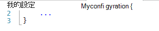
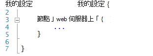
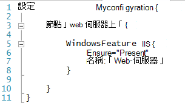
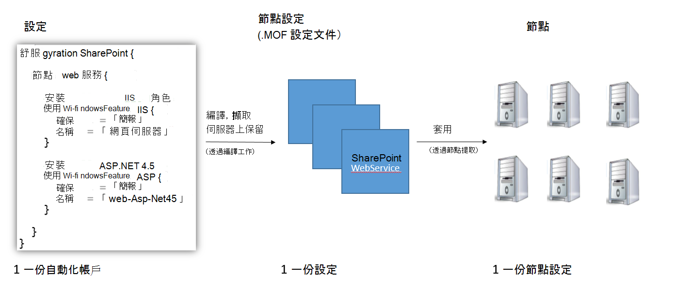
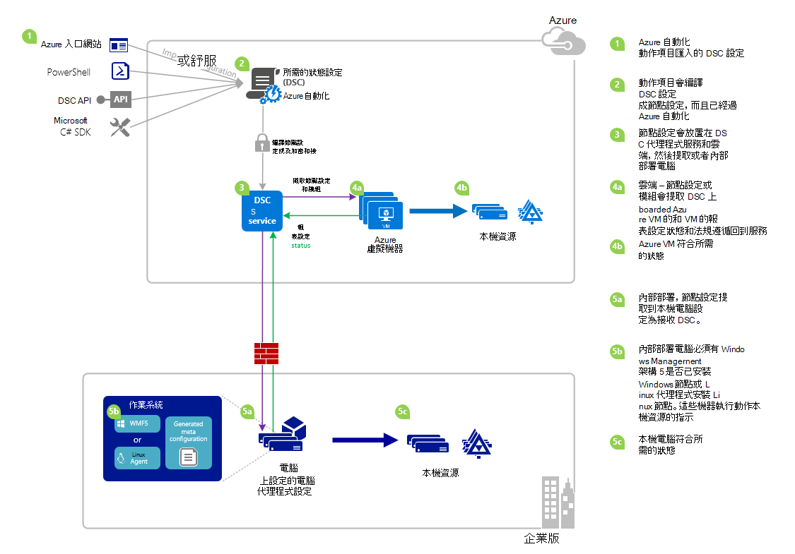

<properties 
   pageTitle="Azure 自動化 DSC 概觀 |Microsoft Azure" 
   description="概觀的 Azure 自動化所需的狀態設定 (DSC)、 條款和已知的問題" 
   services="automation" 
   documentationCenter="dev-center-name" 
   authors="coreyp-at-msft" 
   manager="stevenka" 
   editor="tysonn"
   keywords="powershell dsc、 powershell dsc azure 想要的狀態設定"/>

<tags
   ms.service="automation"
   ms.devlang="NA"
   ms.topic="article"
   ms.tgt_pltfrm="powershell"
   ms.workload="TBD" 
   ms.date="05/10/2016"
   ms.author="magoedte;coreyp"/>

# Azure 自動化 DSC 概觀 #

##什麼是 Azure 自動化 DSC？##
部署及維護的伺服器和應用程式資源所需的狀態可冗長與容易發生錯誤。 使用 Azure 自動化所需的狀態設定 (DSC)，您可以一致部署、 可靠監視與自動更新所有的 IT 資源，在雲端的所需的狀態。 內建在 PowerShell DSC，自動化 DSC 可以對齊特定狀態的實體以及虛擬機器 (Vm)，使用 Windows 或 Linux，與內部部署或雲端中的電腦設定。 您可以啟用連續 IT 服務傳送使用一致的控制項，並管理您異質性混合式部署的 IT 環境輕鬆快速變更。

Azure 自動化 DSC 建置上方中提供更簡單的設定管理體驗的 PowerShell DSC 推出的基本概念。 Azure 自動化 DSC 為相同的管理圖層[PowerShell 所需的狀態設定](https://msdn.microsoft.com/powershell/dsc/overview)為 Azure 自動化提供的 PowerShell 指令碼處理今天。

Azure 自動化 DSC[作者及管理 PowerShell 所需的狀態設定](https://technet.microsoft.com/library/dn249918.aspx)，可讓您匯入[DSC 資源](https://technet.microsoft.com/library/dn282125.aspx)，並產生 DSC 節點設定 （MOF 文件），所有在雲端。 這些 DSC 項目會置於[DSC 提取 server](https://technet.microsoft.com/library/dn249913.aspx) Azure 自動化，好讓內部部署或雲端中的目標節點 （例如實體與虛擬機器） 可以選擇他們、 自動符合其指定時，所需狀態和回報他們性 Azure 自動化的所需的狀態。

比較偏好觀看讀取嗎？ 看看從 Azure 自動化 DSC 先宣告的 2015年的視訊] 底下。 **附註︰**正確的概念與這段影片中所討論的生命週期時，Azure 自動化 DSC 地進行許多由於錄製這段影片。 現在已通常可使用、 具有更廣泛的使用者介面中 Azure 入口網站，以及支援許多其他功能。

> [AZURE.VIDEO microsoft-ignite-2015-heterogeneous-configuration-management-using-microsoft-azure-automation]

## Azure 自動化 DSC 字詞 ##
### 設定 ###
PowerShell DSC 引進了稱為設定一個新的概念。 設定可讓您透過 PowerShell 語法，定義您的環境的所需的狀態。 若要設定您的環境中使用 DSC，第一次定義 Windows PowerShell 指令碼區塊使用設定關鍵字，然後後面加識別項，然後使用大括弧 （{}） 來分隔封鎖。

在設定區塊中，您可以定義節點設定區塊，指定所需的設定，您應該的環境中的節點 （電腦） 的一組完全相同的設定。 如此一來，節點設定代表要採用的一或多個節點的 「 角色 」。 節點設定區塊開頭的節點關鍵字。 請遵循此關鍵字的角色，可變數或運算式的名稱。 角色名稱之後，使用大括弧 {} 分隔節點設定區塊。

 
在節點設定區塊中，您可以定義設定特定 DSC 資源的資源區塊。 資源區塊開頭的資源，後面接著您想要指定針對該區塊，然後括號來分隔封鎖 {識別碼的名稱。

如需詳細設定關鍵字的相關資訊，請參閱︰[了解設定關鍵字的所需的狀態設定](http://blogs.msdn.com/b/powershell/archive/2013/11/05/understanding-configuration-keyword-in-desired-state-configuration.aspx "了解設定關鍵字的所需的狀態設定")

執行 （編譯） DSC 設定，就會產生一或多個 DSC 節點設定 （MOF 文件），也就是 DSC 節點套用以符合所要的狀態。

Azure 自動化 DSC 可讓您匯入的作者，並在 Azure 自動化，類似於如何可以匯入 runbooks，編譯 DSC 設定製作，Azure 自動化入門。

>[AZURE.IMPORTANT] 設定，包含具有相同名稱 Azure 自動化 DSC 中的設定，只有一個設定區塊。 

###節點設定###

當編譯 DSC 設定時，根據設定中的節點區塊產生一或多個節點設定。 節點設定為 「 MOF 」 或 「 設定文件 」 （如果您熟悉這些 PS DSC 字詞），並代表 「 角色 」，例如 web 伺服器上或背景工作，有一或多個節點應該假設或法規遵循針對核取的狀態。 節點組態中 Azure 自動化 DSC 名稱的形式的 「 設定 Name.NodeConfigurationBlockName 」。

PS DSC 節點就會知道他們應該制訂透過 DSC 推入或擷取方法節點設定。 Azure 自動化 DSC 依賴 DSC 提取方法，他們應該套用 Azure 自動化 DSC 節點要求節點設定提取伺服器的位置。 因為節點進行 Azure 自動化 DSC 要求，請節點能防火牆，之後，將所有輸入連接埠關閉等。只需要輸出網際網路存取權 （直接或透過 proxy）。

###節點###

DSC 節點是由 DSC 管理其設定的任何機器。 這可能是在 Windows 或 Linux Azure VM，內部部署 VM / 實體主機或在另一個公用雲端中的電腦。 節點制訂成為與維護規範的所需的狀態，其定義，節點設定，也可以設定的狀態和法規遵循所需的狀態與回報表的伺服器報表。

Azure 自動化 DSC 輕鬆管理來 Azure 自動化 DSC 節點的登入，，並允許變更指派給每個節點伺服器端，因此下次節點檢查伺服器，它會在不同的角色，以及變更的設定方式和 complaince 狀態的相關指示，應該報告，以符合的節點設定。

###資源###
DSC 資源可定義 Windows PowerShell 所需的狀態設定 (DSC) 設定，您可以使用的建置組塊。 DSC 隨附一組內建的資源，例如相關檔案和資料夾，伺服器功能和角色、 登錄設定、 環境變數和服務和程序。 若要瞭解完整的內建 DSC 資源，以及如何使用這些清單，請參閱[內建 Windows PowerShell 所需的狀態設定資源](https://technet.microsoft.com/library/dn249921.aspx)。

DSC 資源也匯入擴充的內建 DSC 資源設定 PowerShell 模組的一部分。 DSC 節點從 DSC 提取伺服器時，會非預設資源提取向下，如果節點用來達成節點設定，包含這些資源的參考。 若要瞭解如何建立自訂的資源，請參閱[建立自訂 Windows PowerShell 所需的狀態設定資源](https://technet.microsoft.com/library/dn249927.aspx)。

Azure 自動化 DSC 隨附完全相同的內建 DSC 資源 PS DSC 一樣。 其他資源可新增至 Azure 自動化 DSC，匯入到 Azure 自動化包含資源的 PowerShell 模組。

###編譯工作###
Azure 自動化 DSC 一編譯的工作是編譯設定，若要建立一或多個節點設定的執行個體。 他們的年齡 Azure 自動化 runbook 工作，類似，但它們不實際執行任何工作，除了若要建立節點設定。 編譯工作所建立的任何節點設定會自動放在 Azure 自動化 DSC 提取伺服器上，並覆寫現有的舊版節點設定此設定的存在。 節點設定所產生的編譯工作的名稱的形式的 「 ConfigurationName.NodeConfigurationBlockName 」。 例如，編譯設定下方會產生單一節點設定，稱為 「 MyConfiguration.webserver 」

>[AZURE.NOTE] 就像 runbooks，可以發佈設定。 這是與不相關放入 Azure 自動化 DSC 提取伺服器的 DSC 項目。 編譯工作會導致 DSC 放置 Azure 自動化 DSC 提取伺服器上的項目。 如需有關在 Azure 自動化的 「 發佈 」 的詳細資訊，請參閱[發佈 Runbook](https://msdn.microsoft.com/library/dn903765.aspx)。

##Azure 自動化 DSC 生命週期##
從空白自動化帳戶到受管理的一段正確設定的節點的移涉及的定義開啟節點設定和登入節點 Azure 自動化 DSC 並這些節點設定這些設定的設定程序一組。 下圖說明 Azure 自動化 DSC 生命週期︰

下圖顯示 DSC 生命週期中的詳細逐步程序。 其包含不同的方式，是匯入設定，並將其套用至所需的內部部署電腦，以支援 DSC 和不同元件間的互動元件中 Azure 自動化節點。 

     

##陷阱 / 已知問題︰##

- 升級時要 WMF 5 RTM，如果電腦已經註冊 Azure 自動化 DSC 中的節點，請取消登錄，從 Azure 自動化 DSC 並 WMF 5 RTM 升級後重新註冊。

- Azure 自動化 DSC 這次不支援部分或複合索引 DSC 設定。 不過，DSC 複合資源可以匯入，且只想用在 Azure 自動化 DSC 組態設定重複使用的本機 PowerShell 中。

- 能夠與 Azure 自動化通訊的 Windows PowerShell DSC 代理人必須安裝最新版的 WMF 5。 必須安裝能夠進行通訊的 Azure 自動化 Linux Linux 的 PowerShell DSC 代理程式的最新版本。

- 傳統的 PowerShell DSC 提取伺服器預期模組會自動放置在格式中擷取伺服器上移**ModuleName_Version.zip 」**。 Azure 自動化預期 PowerShell 模組匯入的**ModuleName.zip**表單中的名稱。 所需的模組匯入 Azure 自動化整合模組格式，請參閱[此部落格文章](https://azure.microsoft.com/blog/2014/12/15/authoring-integration-modules-for-azure-automation/)以取得更多資訊。 

- PowerShell 模組匯入至 Azure 自動化不能包含.doc 或.docx 檔案。 含有 DSC 資源一些 PowerShell 模組包含這些檔案，用於說明。 從先前匯入 Azure 自動化模組應該移除這些檔案。

- 當節點第一次註冊 Azure 自動化帳戶，或節點會對應到不同的節點設定伺服器端變更時，它的狀態會 '符合標準 」] 即使節點的狀態不是真正符合現在已對應至節點設定。 節點執行其第一次提取，並將其第一份報表，傳送註冊或節點設定對應變更後之後，可以信任節點狀態。

- 時登入所使用的任何我們直接登入方法 Azure 自動化 DSC 管理 Azure Windows VM，就無法在要顯示為 Azure 自動化 DSC 節點 vm 小時。 這是因為您在安裝 Windows 管理架構 5.0 Azure VM DSC 分機]，才能使用內建的 VM 上至 Azure 自動化 DSC VM。

- 在註冊之後，每個節點自動交涉唯一的憑證進行驗證，在一年後到期。 此時，PowerShell DSC 註冊通訊協定無法時自動更新憑證他們即將過期，因此您必須在一年的時間之後，請重新登錄節點。 在要確定每個節點正在執行 Windows 管理架構 5.0 RTM。 如果節點的驗證憑證到期時，便不會重新登錄節點，節點會在無法與 Azure 自動化，標示為 「 Unresponsive 」。 更新間隔是您最初註冊節點的相同方式執行。 更新間隔執行 90 天或小於憑證的到期時間，或在任何時候憑證的到期時間之後, 會在新的憑證所產生和使用。

- 升級時要 WMF 5 RTM，如果電腦已經註冊 Azure 自動化 DSC 中的節點，請取消登錄，從 Azure 自動化 DSC 並 WMF 5 RTM 升級後重新註冊。 之前，如果要刪除 $env:windir\system32\configuration\DSCEngineCache.mof 檔案。

- 如果 WMF 5 RTM 安裝 WMF 5 生產預覽的上方，DSC PowerShell cmdlet 可能無法運作。 若要修正此問題，請在 （以系統管理員身分執行） 提高權限 PowerShell 工作階段中執行下列命令︰`mofcomp $env:windir\system32\wbem\DscCoreConfProv.mof`
 

##相關的文章##

- [登入電腦，Azure 自動化 DSC 管理](../automation/automation-dsc-onboarding.md)
- [編譯 Azure 自動化 DSC 中的設定](../automation/automation-dsc-compile.md)
- [Azure 自動化 DSC cmdlet](https://msdn.microsoft.com/library/mt244122.aspx)
- [Azure 自動化 DSC 價格](https://azure.microsoft.com/pricing/details/automation/)
- [連續的部署使用 Azure 自動化 DSC IaaS Vm 和 Chocolatey](自動化-dsc-cd-chocolatey.md)
