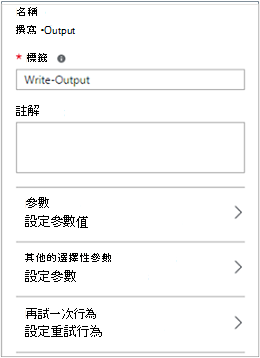
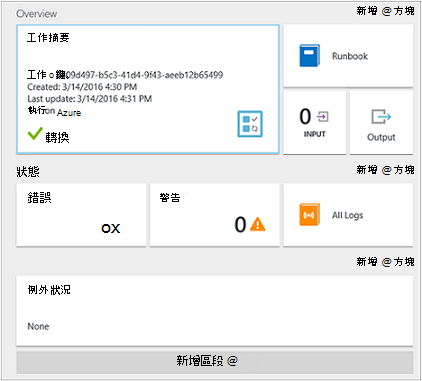

<properties
    pageTitle="我在 Azure 自動化的第一個圖形 runbook |Microsoft Azure"
    description="會引導您完成建立、 測試和發佈的簡單的圖形化 runbook 的教學課程。"
    services="automation"
    documentationCenter=""
    authors="mgoedtel"
    manager="jwhit"
    editor=""
    keywords="runbook、 runbook 範本、 runbook 自動化 azure runbook"/>
<tags
    ms.service="automation"
    ms.workload="tbd"
    ms.tgt_pltfrm="na"
    ms.devlang="na"
    ms.topic="get-started-article"
    ms.date="07/06/2016"
    ms.author="magoedte;bwren"/>

# <a name="my-first-graphical-runbook"></a>我的第一個圖形 runbook

> [AZURE.SELECTOR] - [圖形化](automation-first-runbook-graphical.md) - [PowerShell](automation-first-runbook-textual-PowerShell.md) - [PowerShell 工作流程](automation-first-runbook-textual.md)

本教學課程中會引導您在 Azure 自動化的[圖形化 runbook](automation-runbook-types.md#graphical-runbooks)的建立。  我們開始簡單的 runbook，我們將會測試，發佈時我們會說明如何追蹤 runbook 工作的狀態。  我們會修改實際管理 Azure 資源 runbook 在此情況下啟動 Azure 虛擬機器。  我們會再進行 runbook 更強大藉由新增 runbook 參數和條件的連結。

## <a name="prerequisites"></a>必要條件

若要完成此教學課程中，您需要下列項目。

-   Azure 訂閱。  如果您沒有其中一個，您可以在[啟動您的 MSDN 訂閱權益](https://azure.microsoft.com/pricing/member-offers/msdn-benefits-details/)或<a href="/pricing/free-account/" target="_blank">[註冊免費的帳戶](https://azure.microsoft.com/free/)。
-   [為帳戶 azure 執行](automation-sec-configure-azure-runas-account.md)runbook 按住 Azure 資源進行驗證。  此帳戶必須啟動和停止虛擬機器的權限。
-   Azure 虛擬機器。  我們會停止和開始這台電腦，所以不應該是實際執行。


## <a name="step-1---create-new-runbook"></a>步驟 1-建立新的 runbook

我們先建立簡單的 runbook 輸出*什麼*的文字。

1.  在 [Azure 入口網站中，開啟您自動化的帳戶。  
    自動化帳戶頁面可讓您快速檢視資源在此帳戶。  您應該已經有一些資產。  大部分的是新的自動化帳戶中會自動包含模組。  您也應該已認證資產所述[的先決條件](#prerequisites)。
2.  按一下 [ **Runbooks** ] 方塊，以開啟 runbooks 清單。<br> 
3.  按一下 [**新增 runbook** ] 按鈕，然後**建立新的 runbook**上建立新的 runbook。
4.  讓 runbook *MyFirstRunbook 圖形*的名稱。
5.  在此案例中，我們要建立[圖形 runbook](automation-graphical-authoring-intro.md) ，因此**Runbook**類型選取**圖形**。<br> <br>
6.  按一下 [**建立**]，建立 runbook 並開啟編輯器] 圖形。

## <a name="step-2---add-activities-to-the-runbook"></a>步驟 2-新增 runbook 活動

在左側的編輯器] 中的文件庫控制項可讓您選取要新增至您 runbook 的活動。  我們會將文字從 runbook 輸出**寫入輸出**指令程式。

1.  在文件庫控制項中，按一下在 [搜尋] 文字方塊中，輸入**寫入輸出**。  搜尋結果會顯示下方。 <br> 
2.  捲動到清單的底部。  您可以 [**寫入輸出**上按一下滑鼠右鍵並選取 [**新增至畫布**或旁 cmdlet 橢圓上按一下，然後選取 [**新增至畫布**。
3.  按一下畫布上**書寫輸出**活動。  這會開啟設定控制項刀可讓您設定的活動。
4.  **標籤**預設名稱的 cmdlet，但我們可以將其變更為更好記。 變更*撰寫什麼輸出*。
5.  按一下 [**參數**提供的 cmdlet 的參數值]。  
    某些 cmdlet 有多個參數組，必須先選取哪一個會使用。 在此情況下，**寫入輸出**都有只有一個參數集，因此您不需要選取其中一個。 <br> 
6.  選取 [ **InputObject**參數]。  這是參數，我們會指定要輸出資料流傳送的文字。
7.  在 [**資料來源**] 下拉式清單中，選取 [ **PowerShell 運算式**]。  [**資料來源**] 下拉式清單提供不同的來源，您用來填入參數值。  
    您可以從這類來源，例如另一個活動、 自動化資產或 PowerShell 運算式中使用輸出。  在此案例中，我們只是要輸出的文字*什麼*。 我們可以使用 PowerShell 運算式，並指定的字串。
8.  在 [**運算式**] 方塊中輸入*「 Hello World 」* ，然後按一下兩次，回到畫布上的**[確定]** 。<br> 
9.  按一下 [**儲存**儲存 runbook。<br> 

## <a name="step-3---test-the-runbook"></a>步驟 3-測試 runbook

我們發佈，使其提供生產 runbook 之前，我們想要測試，以確定其運作正常。  當您測試 runbook 時，您執行其**草稿**版本，並檢視輸出互動的方式。

1.  按一下以開啟測試刀**測試窗格**]。<br> 
2.  按一下 [**開始**] 以開始測試。  應該是唯一啟用的選項。
3.  建立[runbook 工作](automation-runbook-execution.md)，其狀態窗格中顯示。  
    工作狀態就會開始為*佇列*指出等待在雲端 runbook 工作者，才可供使用。  當工作者宣告工作，然後*執行*runbook 實際開始執行時，它然後會移到*開始*。  
4.  Runbook 工作完成時，會顯示其輸出。 在此例中，我們應該會看到*什麼*。<br> 
5.  關閉測試刀，若要返回畫布。

## <a name="step-4---publish-and-start-the-runbook"></a>步驟 4-發佈並開始 runbook

我們剛剛建立的 runbook 仍為草稿模式。 我們需要將它發佈之前我們可以生產環境中執行。  當您發佈 runbook 時，您以覆寫現有的發行版本的草稿版本。  在此例中，我們已發佈版本還沒有因為我們剛剛建立的 runbook。

1.  按一下 [**發佈**] 發佈 runbook 再****出現提示時。<br> 
2.  如果您向左捲動以檢視**Runbooks**刀 runbook 時，隨即會顯示的**已發佈****撰寫狀態**。
3.  捲動到右側，檢視刀**MyFirstRunbook**的。  
    上方的選項可讓我們來啟動 runbook、 排定開始時間，或建立[webhook](automation-webhooks.md) ，讓它可以啟動透過 HTTP 呼叫。
4.  我們只想要開始 runbook，按一下 [**開始**]，然後****出現提示時。<br> 
5.  工作刀隨即會開啟為您剛剛建立的 runbook 工作。  我們可以關閉此刀，但在此情況下我們將保留它開啟，我們可以觀看工作進度。
6.  工作狀態會顯示在**工作摘要**，並比對時我們測試 runbook 我們看到狀態。<br> 
7.  一旦 runbook 狀態] 顯示*已完成*，請按一下 [**輸出**]。 **輸出**刀會開啟，而且我們可以看到*什麼*窗格中。<br>   
8.  關閉輸出刀。
9.  按一下 [開啟資料流刀 runbook 工作的**所有記錄**。  我們只應該會看到*什麼*中輸出資料流，但這可以顯示 runbook 工作詳細資訊和錯誤等其他資料流時，如果 runbook 寫入它們。<br> 
10. 關閉所有記錄刀與工作返回 MyFirstRunbook 刀。
11. 按一下 [開啟此 runbook 的工作刀的**工作**]。  這會列出所有此 runbook 所建立的作業。 我們只應該會看到一項工作，列出因為我們只執行作業一次。<br> 
12. 您可以在這個工作，以開啟我們檢視我們啟動 runbook 時的同一個工作窗格中按一下。  這個選項可讓您以返回時間並檢視針對特定的 runbook 建立的任何工作的詳細資料。

## <a name="step-5---create-variable-assets"></a>步驟 5-建立變數資產

我們已測試並發佈我們 runbook，但到目前為止，不會有幫助。 我們想要讓它管理 Azure 資源。  我們設定驗證 runbook 之前，我們會建立按住訂閱識別碼，並參考它，我們設定在步驟 6 中驗證活動之後的變數。  包括訂閱內容的參照，可讓您輕鬆地處理之間的多個訂閱。  進行之前，從 [功能窗格的 [訂閱] 選項，複製您訂閱的識別碼。  

1. 在 [自動化帳戶刀中，按一下 [**資產**] 磚上並開啟**資產**刀。
2. 在資產刀中，按一下**變數**圖磚上。
3. 在變數刀中，按一下 [**新增一個變數**。<br>
4. 在新的變數刀，在 [**名稱**] 方塊中輸入**AzureSubscriptionId** ，然後在 [**值**] 方塊中輸入您的訂閱識別碼。  讓**加密***字串***類型**及預設值。  
5. 按一下 [**建立**]，建立變數]。  


## <a name="step-6---add-authentication-to-manage-azure-resources"></a>步驟 6-新增管理 Azure 資源驗證

現在，我們已儲存我們訂閱識別碼變數，我們可以設定我們 runbook 的執行方式認證[的先決條件](#prerequisites)中參照的驗證方法。  我們來新增 Azure 執行方式連線**資產**」 與 「**新增 AzureRMAccount** cmdlet 畫布上進行此動作。  

1.  開啟編輯器] 圖形，請按一下 [MyFirstRunbook 刀中的 [**編輯**。<br> 
2.  我們不再需要**撰寫什麼輸出**，因此，以滑鼠右鍵按一下，然後選取 [**刪除**。
3.  在文件庫控制項中，展開 [**連線**及新增**AzureRunAsConnection**畫布上選取 [**新增至畫布**。
4.  在畫布上，選取**AzureRunAsConnection**並在 [設定控制] 窗格中，輸入**取得執行為連線****標籤**] 文字方塊中。  這是連線 
5.  在文件庫控制項中，請在 [搜尋] 文字方塊中輸入**新增 AzureRmAccount** 。
6.  新增**新增 AzureRmAccount**畫布上。<br> 
7.  將游標停留**取得執行為連線**直到圓形會出現在圖案的底部。 按一下 [圓形，然後拖曳箭號，**新增 AzureRmAccount**。  您剛剛建立的箭號是*連結*。  Runbook 會開始**取得執行為連線**，然後再執行**新增 AzureRmAccount**。<br> 
8.  在畫布上，選取 [**新增 AzureRmAccount**和設定控制在 [**標籤**] 文字方塊中的窗格類型**登入 Azure** 。
9.  按一下 [**參數**和刀出現活動參數組態]。 
10.  **新增 AzureRmAccount**都有多個參數組，因此我們之前必須先選取一個我們可以提供參數值。  按一下 [**參數設**，然後選取 [ **ServicePrincipalCertificate**參數設定。 
11.  一旦您選取的參數設定時，會顯示活動參數設定刀參數。  按一下 [ **APPLICATIONID**]。<br> 
12.  在參數值刀中，選取**活動輸出****資料來源**的及選取 [從清單中，在**功能變數路徑**文字方塊類型**ApplicationId**，**取得執行為連線**，然後按一下**[確定]**。  因為活動輸出具有多個屬性的物件，我們會指定欄位路徑的屬性名稱。
13.  按一下**CERTIFICATETHUMBPRINT**，並在參數值刀中，選取**活動輸出****資料來源**。  選取 [從清單中，在**功能變數路徑**文字方塊類型**CertificateThumbprint**，**取得執行為連線**，然後按一下**[確定]**。 
14.  按一下**SERVICEPRINCIPAL**，並在參數值刀中，選取 [ **ConstantValue** **資料來源**的選項**，則為 True**，，然後按一下然後按一下**[確定]**。
15.  按一下**TENANTID**，並在參數值刀中，選取**活動輸出****資料來源**。  選取 [從清單中，在**功能變數路徑**文字方塊類型**TenantId**，**取得執行為連線**，然後按兩次**[確定]** 。  
16.  在文件庫控制項中，請在 [搜尋] 文字方塊中輸入**設定 AzureRmContext** 。
17.  新增**組 AzureRmContext**畫布上。
18.  在畫布上，選取 [**設定 AzureRmContext**和中設定控制在 [**標籤**] 文字方塊中的窗格類型**指定訂閱識別碼**。
19.  按一下 [**參數**和刀出現活動參數組態]。 
20. **設定 AzureRmContext**都有多個參數組，因此我們之前必須先選取一個我們可以提供參數值。  按一下 [**參數設**，然後選取 [ **SubscriptionId**參數設定。  
21.  一旦您選取的參數設定時，會顯示活動參數設定刀參數。  按一下 [ **SubscriptionID**
22.  在參數值刀中，選取**資料來源****變數資產**從清單中選取**AzureSubscriptionId**並再按兩次**[確定]** 。   
23.  將游標停留**登入 Azure**直到圓形會出現在圖案的底部。 按一下 [圓形，然後拖曳箭號，**指定訂閱識別碼**。


您 runbook 看起來應該像下面這個時候︰ <br>

## <a name="step-7---add-activity-to-start-a-virtual-machine"></a>步驟 7-新增活動，以啟動虛擬機器

現在，我們將會新增至啟動虛擬機器**開始 AzureRmVM**活動。  您可以選擇任何虛擬機器中 Azure 訂閱，然後現在我們可以將 cmdlet 名稱的硬式編碼。

1. 在文件庫控制項中，請在 [搜尋] 文字方塊中輸入**開始 AzureRm** 。
2. 在畫布上新增**開始 AzureRmVM** ，然後按一下，將它拖曳下方**指定訂閱識別碼**。
3. 將游標停留**指定訂閱識別碼**直到圓形會出現在圖案的底部。  按一下 [圓形，然後拖曳箭號，**開始 AzureRmVM**。 
4.  選取**開始 AzureRmVM**。  按一下 [**參數**]，然後**設定參數**以**開始 AzureRmVM**檢視設定]。  選取 [ **ResourceGroupNameParameterSetName**參數設定。 請注意， **ResourceGroupName**和**名稱**必須驚嘆號下一步它們。  這表示它們是必要的參數。  另請注意兩者預期字串值。
5.  選取**名稱**。  選取**資料來源**並鍵入名稱放在雙引號我們會開始此 runbook 中間的虛擬機器中的**PowerShell 運算式**。  按一下**[確定]**。<br>
6.  選取 [ **ResourceGroupName**]。 使用**PowerShell 運算式**的**資料來源**與類型，請在 [資源群組以雙引號括住名稱。  按一下**[確定]**。<br> 
8.  讓我們可以測試 runbook，請按一下 [測試窗格]。
9.  按一下 [**開始**] 以開始測試。  一旦完成，核取所啟動的虛擬機器。

您 runbook 看起來應該像下面這個時候︰ <br>

## <a name="step-8---add-additional-input-parameters-to-the-runbook"></a>步驟 8-runbook 新增額外的輸入的參數

我們 runbook 目前啟動虛擬機器中**開始 AzureRmVM** cmdlet，我們所指定的 [資源] 群組中，但我們 runbook 就會越有用處如果我們無法啟動 runbook 時指定兩者。  現在我們會將輸入的參數新增 runbook 提供的功能。

1. 開啟編輯器] 圖形，請按一下 [ **MyFirstRunbook** ] 窗格中的 [**編輯**。
2. 按一下 [**輸入與輸出**]，然後**新增輸入**以開啟 [Runbook 輸入參數窗格]。<br> 
3. 指定*VMName* **名稱**。  保留*字串***類型**，但變更**為** *[是]*。  按一下**[確定]**。
4. 建立稱為*ResourceGroupName*第二個強制輸入的參數，然後按一下 [**確定**] 關閉 [**輸入與輸出**] 窗格。<br> 
5. 選取 [**開始 AzureRmVM**活動，然後按一下 [**參數**]。
6. **資料來源**的**名稱**變更**Runbook 輸入**，然後選取 [ **VMName**。<br>
7. 變更**ResourceGroupName** **Runbook**輸入的**資料來源**，然後選取 [ **ResourceGroupName**。<br> 
8. 儲存 runbook，並開啟 [測試] 窗格。  請注意，您可以立即提供值將用於測試的兩個輸入變數。
9. 關閉 [測試] 窗格。
10. 按一下 [**發佈**至發佈新版本的 runbook。
11. 停止您開始在先前的步驟虛擬機器。
12. 按一下 [**開始**] 以開始 runbook。  針對您要開始虛擬機器輸入**VMName**與**ResourceGroupName** 。<br> 
13. Runbook 完成後，請核取所啟動的虛擬機器。

## <a name="step-9---create-a-conditional-link"></a>步驟 9-建立條件的連結

現在，我們將修改 runbook，讓它只會嘗試啟動虛擬機器，如果尚未啟動。  我們將會取得的執行個體層級的虛擬機器 runbook 新增**取得 AzureRmVM**指令程式來執行這項操作。 然後，我們將會新增 PowerShell 工作流程的程式碼模組使用 PowerShell 來判斷是否正在執行或停止虛擬機器狀態的程式碼的程式碼片段呼叫**取得狀態**。  如果已停止目前的執行狀態，**取得狀態**模組條件的連結才會執行**開始 AzureRmVM** 。  最後，我們會輸出的訊息通知您如果 VM 順利啟動，或不使用 PowerShell 寫入輸出指令程式。

1. 在 [圖形] 編輯器中開啟**MyFirstRunbook** 。
2. 按一下它，然後按*Delete*鍵移除**指定訂閱識別碼****開始 AzureRmVM**之間的連結。
3. 在文件庫控制項中，請在 [搜尋] 文字方塊中輸入**取得 AzureRm** 。
4. 新增**取得 AzureRmVM**畫布上。
5. 選取 [**取得 AzureRmVM** ]，然後**設定參數**以**取得 AzureRmVM**檢視設定]。  選取 [ **GetVirtualMachineInResourceGroupNameParamSet**參數設定。  請注意， **ResourceGroupName**和**名稱**必須驚嘆號下一步它們。  這表示它們是必要的參數。  另請注意兩者預期字串值。
6. 在**資料來源****名稱**] 底下選取**Runbook 輸入**，然後選取**VMName**。  按一下**[確定]**。
7. 在**資料來源**的**ResourceGroupName**] 底下選取**Runbook 輸入**，然後選取**ResourceGroupName**。  按一下**[確定]**。
8. **資料來源**的**狀態**] 下選取 [**固定的值**，然後按一下**，則為 True**。  按一下**[確定]**。  
9. 從**指定訂閱識別碼**建立的連結，以**取得 AzureRmVM**。
10. 在文件庫控制項中，展開**Runbook 控制項**，將**程式碼**新增至畫布。  
11. **程式碼**，從**取得 AzureRmVM**建立的連結。  
12. 按一下 [**程式碼**，然後在 [設定] 窗格中，**取得狀態**變更標籤。
13. 選取的**程式碼**參數與**程式碼編輯器**隨即出現。  
14. 在程式碼編輯器] 中，貼上下列的程式碼片段︰

     ```
     $StatusesJson = $ActivityOutput['Get-AzureRmVM'].StatusesText 
     $Statuses = ConvertFrom-Json $StatusesJson 
     $StatusOut ="" 
     foreach ($Status in $Statuses){ 
     if($Status.Code -eq "Powerstate/running"){$StatusOut = "running"} 
     elseif ($Status.Code -eq "Powerstate/deallocated") {$StatusOut = "stopped"} 
     } 
     $StatusOut 
     ```

15. 若要**開始 AzureRmVM**，**取得狀態**從建立的連結。<br>   
16. 選取連結，然後在 [設定] 窗格中，變更**套用條件**為 [**是]**。   請注意連結即會變成虛線表示當條件會解析成，才會執行目標活動，則為 true。  
17. **條件運算式**中，輸入*[' 取得狀態 '] $ActivityOutput eq 「 已停止 」*。  如果已停止虛擬機器**開始 AzureRmVM**現在會只執行。
18. 在文件庫控制項中，展開**Cmdlet** ]，然後按一下 [ **Microsoft.PowerShell.Utility**。
19. 新增**寫入輸出**畫布上兩次。<br> 
20. 第一個**寫入輸出**控制項中，按一下 [**參數**] 並**標籤**值變更為*通知 VM 開始*。
21. 針對**InputObject**，變更**資料來源**至**PowerShell 運算式**，然後輸入*「 $VMName 順利啟動 」*的運算式。
22. 第二個**寫入輸出**和控制項上，按一下 [**參數**]**標籤**值變更為*通知 VM 開始失敗*
23. 針對**InputObject**，變更**資料來源**至**PowerShell 運算式**，然後輸入*「 $VMName 無法啟動。 」*的運算式。
24. 從建立的連結**開始 AzureRmVM** **通知 VM 啟動**，並**通知 VM 開始失敗**。
25. 選取連結至**通知 VM 開始**並將變更**套用條件** **，則為 True**。
26. **條件運算式**中，輸入*$ActivityOutput [「 開始-AzureRmVM 」]。IsSuccessStatusCode eq $true*。  這個寫入輸出控制項現在才會執行虛擬機器順利啟動。
27. 選取連結至**通知 VM 開始失敗，**並將變更**套用條件** **，則為 True**。
28. **條件運算式**中，輸入*$ActivityOutput [「 開始-AzureRmVM 」]。IsSuccessStatusCode ne $true*。  這個寫入輸出控制項現在才會執行虛擬機器無法順利啟動。
29. 儲存 runbook，並開啟 [測試] 窗格。
30. 啟動 runbook 虛擬機器停止，並開始。

## <a name="next-steps"></a>後續步驟

-   若要深入瞭解設定撰寫的圖形，請參閱[圖形撰寫中 Azure 自動化](automation-graphical-authoring-intro.md)
-   若要開始使用 PowerShell runbooks，請參閱[我的第一個 PowerShell runbook](automation-first-runbook-textual-powershell.md)
-   若要開始使用 PowerShell 工作流程 runbooks，請參閱[我的第一個 PowerShell 工作流程 runbook](automation-first-runbook-textual.md)
