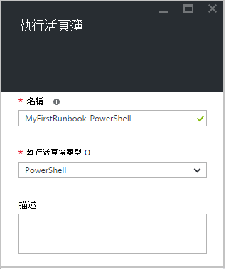
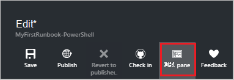
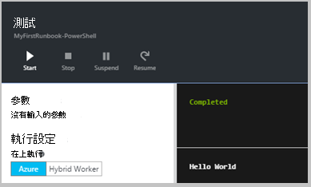
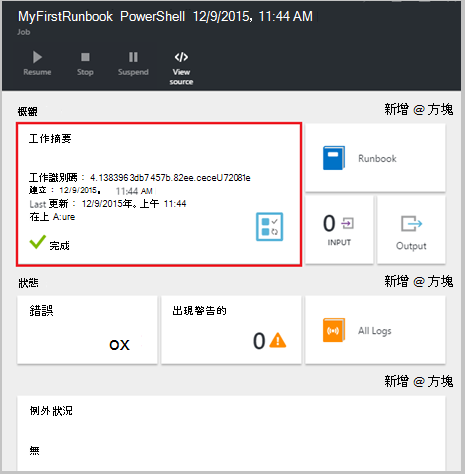
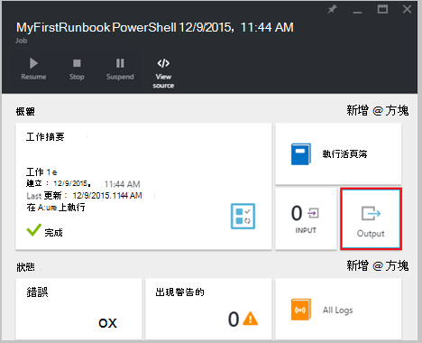
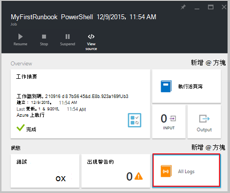
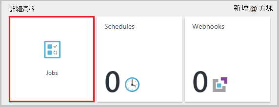
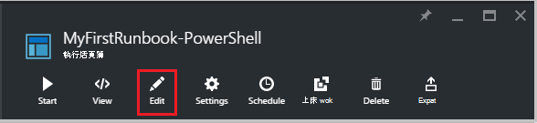
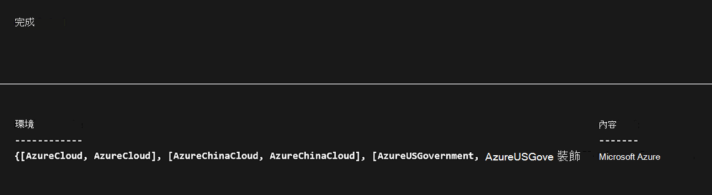
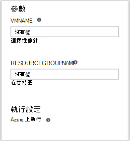

<properties
    pageTitle="我在 Azure 自動化的第一個 PowerShell runbook |Microsoft Azure"
    description="會引導您完成建立、 測試和發佈的簡單的 PowerShell runbook 的教學課程。"
    services="automation"
    documentationCenter=""
    authors="mgoedtel"
    manager="jwhit"
    editor=""
    keywords="azure powershell、 powershell 自動化 powershell 指令碼教學課程"/>
<tags
    ms.service="automation"
    ms.workload="tbd"
    ms.tgt_pltfrm="na"
    ms.devlang="na"
    ms.topic="get-started-article"
    ms.date="07/19/2016"
    ms.author="magoedte;sngun"/>

# <a name="my-first-powershell-runbook"></a>我的第一個 PowerShell runbook

> [AZURE.SELECTOR] - [圖形化](automation-first-runbook-graphical.md) - [PowerShell](automation-first-runbook-textual-PowerShell.md) - [PowerShell 工作流程](automation-first-runbook-textual.md)  

本教學課程中會引導您在 Azure 自動化[PowerShell runbook](automation-runbook-types.md#powershell-runbooks)的建立。 我們開始簡單的 runbook，我們將會測試，發佈時我們會說明如何追蹤 runbook 工作的狀態。 我們會修改實際管理 Azure 資源 runbook 在此情況下啟動 Azure 虛擬機器。 我們會再讓 runbook 更強大新增 runbook 參數。

## <a name="prerequisites"></a>必要條件

若要完成此教學課程中，您需要下列項目。

-   Azure 訂閱。 如果您沒有其中一個，您可以在[啟動您的 MSDN 訂閱權益](https://azure.microsoft.com/pricing/member-offers/msdn-benefits-details/)或<a href="/pricing/free-account/" target="_blank">[註冊免費的帳戶](https://azure.microsoft.com/free/)。
-   按住 runbook 和 Azure 資源驗證[自動化帳戶](automation-security-overview.md)。  此帳戶必須啟動和停止虛擬機器的權限。
-   Azure 虛擬機器。 我們會停止和開始這台電腦，所以不應該是實際執行。

## <a name="step-1---create-new-runbook"></a>步驟 1-建立新的 runbook

我們先建立簡單的 runbook 輸出*什麼*的文字。

1.  在 [Azure 入口網站中，開啟您自動化的帳戶。  
    自動化帳戶頁面可讓您快速檢視資源在此帳戶。 您應該已經有一些資產。 大部分的是新的自動化帳戶中會自動包含模組。 您也應該已認證資產所述[的先決條件](#prerequisites)。
2.  按一下 [ **Runbooks** ] 方塊，以開啟 runbooks 清單。  
      
3.  按一下 [**新增 runbook** ] 按鈕，然後**建立新的 runbook**上建立新的 runbook。
4.  命名 runbook *MyFirstRunbook PowerShell*。
5.  在此案例中，我們要建立[PowerShell runbook](automation-runbook-types.md#powershell-runbooks) ，因此**Runbook**類型選取**Powershell** 。  
      
6.  按一下 [**建立**]，建立 runbook 並開啟文字編輯器]。

## <a name="step-2---add-code-to-the-runbook"></a>步驟 2-將程式碼新增至 runbook

您可以直接將 runbook 的任一型別程式碼或您可以 cmdlet、 runbooks，從選取和資產的文件庫的控制項，並將它們加到任何相關的參數的 runbook。 在此逐步解說，我們會直接輸入 runbook。

1.  我們 runbook 目前是空的類型*寫入輸出"Hello World。 「*。  
      
2.  按一下 [**儲存**儲存 runbook。  
    ![[儲存] 按鈕](media/automation-first-runbook-textual-powershell/automation-save-button.png)  

## <a name="step-3---test-the-runbook"></a>步驟 3-測試 runbook

我們發佈，使其提供生產 runbook 之前，我們想要測試，以確定其運作正常。 當您測試 runbook 時，您執行其**草稿**版本，並檢視輸出互動的方式。

1.  按一下 [**測試] 窗格**中，開啟 [測試] 窗格。  
      
2.  按一下 [**開始**] 以開始測試。 應該是唯一啟用的選項。
3.  建立[runbook 工作](automation-runbook-execution.md)，且其狀態顯示。  
    工作狀態就會開始為*佇列*指出等待 runbook 背景工作在雲端建立可用。 當工作者宣告工作，然後*執行*runbook 實際開始執行時，它然後會移到*開始*。  
4.  Runbook 工作完成時，會顯示其輸出。 在此例中，我們應該會看到*什麼*  
      
5.  關閉 [測試] 窗格，若要返回畫布。

## <a name="step-4---publish-and-start-the-runbook"></a>步驟 4-發佈並開始 runbook

我們剛剛建立的 runbook 仍為草稿模式。 我們需要將它發佈之前我們可以生產環境中執行。 當您發佈 runbook 時，您以覆寫現有的發行版本的草稿版本。 在此例中，我們已發佈版本還沒有因為我們剛剛建立的 runbook。

1.  按一下 [**發佈**] 發佈 runbook 再****出現提示時。  
    ![發佈] 按鈕](media/automation-first-runbook-textual-powershell/automation-publish-button.png)  
2.  如果您向左捲動，現在檢視 runbook **Runbooks**窗格中，則會顯示的**已發佈****撰寫狀態**。
3.  捲動到右側，針對**MyFirstRunbook PowerShell**檢視] 窗格。  
    上方的選項可讓我們開始 runbook、 檢視 runbook 排定開始時間，或建立[webhook](automation-webhooks.md) ，讓它可以啟動透過 HTTP 呼叫。
4.  我們只想要開始 runbook，按一下 [**開始**，然後按一下 [**確定]**開始 Runbook 刀開啟時。  
    ![[開始] 按鈕](media/automation-first-runbook-textual-powershell/automation-start-button.png)  
5.  工作窗格會開啟為您剛剛建立的 runbook 工作。 我們可以關閉此窗格中，但在此情況下我們將保留它開啟，我們可以觀看工作進度。
6.  工作狀態會顯示在**工作摘要**，並比對時我們測試 runbook 我們看到狀態。  
      
7.  一旦 runbook 狀態] 顯示*已完成*，請按一下 [**輸出**]。 [輸出] 窗格會開啟，而且我們可以看到*什麼*。  
    
8.  關閉 [輸出] 窗格。
9.  按一下 [開啟資料流窗格 runbook 工作的**所有記錄**。 我們只應該會看到*什麼*中輸出資料流，但這可以顯示 runbook 工作詳細資訊和錯誤等其他資料流時，如果 runbook 寫入它們。  
      
10. 關閉資料流窗格和 [工作] 窗格，以返回 MyFirstRunbook PowerShell 窗格。
11. 按一下 [開啟此 runbook 的工作窗格的**工作**]。 這會列出所有此 runbook 所建立的作業。 我們只應該會看到一項工作，列出因為我們只執行作業一次。  
      
12. 您可以在這個工作，以開啟我們檢視我們啟動 runbook 時的同一個工作窗格中按一下。 這個選項可讓您以返回時間並檢視針對特定的 runbook 建立的任何工作的詳細資料。

## <a name="step-5---add-authentication-to-manage-azure-resources"></a>步驟 5-新增管理 Azure 資源驗證

我們已測試並發佈我們 runbook，但到目前為止，不會有幫助。 我們想要讓它管理 Azure 資源。 將無法執行這項作業，雖然除非我們已驗證使用[的先決條件](#prerequisites)中參照的認證。 這是與**新增 AzureRmAccount**指令程式。

1.  開啟文字編輯器，請按一下 [MyFirstRunbook PowerShell 窗格中的 [**編輯**。  
      
2.  我們不再需要**寫入輸出**線條、，因此請繼續，並將其刪除。
3.  輸入或複製並貼上下列的程式碼將處理您的自動化執行為帳戶驗證︰

    ```
     $Conn = Get-AutomationConnection -Name AzureRunAsConnection 
     Add-AzureRMAccount -ServicePrincipal -Tenant $Conn.TenantID `
     -ApplicationId $Conn.ApplicationID -CertificateThumbprint $Conn.CertificateThumbprint
    ``` 
<br>
4.  讓我們可以測試 runbook，請按一下 [**測試] 窗格**]。
5.  按一下 [**開始**] 以開始測試。 一旦完成作業之後，您應該會收到輸出類似下列、 顯示基本資訊從您的帳戶。 向您確認認證無效。 <br> 

## <a name="step-6---add-code-to-start-a-virtual-machine"></a>步驟 6-新增碼來啟動虛擬機器

現在，我們 runbook 驗證我們 Azure 訂閱，我們可以管理資源。 我們將會新增至啟動虛擬機器命令。 您可以選擇任何虛擬機器中 Azure 訂閱，然後現在我們可以將 cmdlet 名稱的硬式編碼。

1.  *新增 AzureRmAccount*，輸入*開始 AzureRmVM-名稱 「 VMName' ResourceGroupName 'NameofResourceGroup'*提供的名稱和啟動的虛擬機器資源群組名稱。  
    
    ```
     $Conn = Get-AutomationConnection -Name AzureRunAsConnection 
     Add-AzureRMAccount -ServicePrincipal -Tenant $Conn.TenantID `
     -ApplicationID $Conn.ApplicationID -CertificateThumbprint $Conn.CertificateThumbprint 
     Start-AzureRmVM -Name 'VMName' -ResourceGroupName 'ResourceGroupName'
     ```
<br>
2.  儲存 runbook，然後按一下 [**測試] 窗格**，讓我們可以進行測試。
3.  按一下 [**開始**] 以開始測試。 一旦完成，核取所啟動的虛擬機器。

## <a name="step-7---add-an-input-parameter-to-the-runbook"></a>步驟 7-新增 runbook 輸入的參數

我們 runbook 目前啟動虛擬機器我們硬式編碼中 runbook，，但如果 runbook 啟動時，我們可以指定虛擬機器就會越有用處。 現在我們會將輸入的參數新增 runbook 提供的功能。

1.  *VMName*和*ResourceGroupName*中加入參數，runbook，並使用這些變數與**開始 AzureRmVM** cmdlet，如下列範例所示。  
    
    ```
    Param(
       [string]$VMName,
       [string]$ResourceGroupName
    )
     $Conn = Get-AutomationConnection -Name AzureRunAsConnection 
     Add-AzureRMAccount -ServicePrincipal -Tenant $Conn.TenantID `
     -ApplicationID $Conn.ApplicationID -CertificateThumbprint $Conn.CertificateThumbprint 
     Start-AzureRmVM -Name $VMName -ResourceGroupName $ResourceGroupName
     ```
<br> 
2.  儲存 runbook，並開啟 [測試] 窗格。 請注意，您可以立即提供值將用於測試的兩個輸入變數。
3.  關閉 [測試] 窗格。
4.  按一下 [**發佈**至發佈新版本的 runbook。
5.  停止您開始在先前的步驟虛擬機器。
6.  按一下 [**開始**] 以開始 runbook。 針對您要開始虛擬機器輸入**VMName**與**ResourceGroupName** 。  
      
7.  Runbook 完成後，請核取所啟動的虛擬機器。

## <a name="differences-from-powershell-workflow"></a>從 PowerShell 工作流程的差異

PowerShell runbooks 有相同的生命週期、 功能和管理 PowerShell 工作流程 runbooks，但還有一些差異和限制︰

1.  PowerShell runbooks 快速執行比較 PowerShell 工作流程 runbooks 時沒有編譯步驟。
2.  PowerShell 工作流程 runbooks 支援檢查點，使用檢查點、 PowerShell 工作流程 runbooks 可以恢復 runbook 中的任何點，而 PowerShell runbooks 只可以繼續開始。
3.  PowerShell 工作流程 runbooks 支援平行和序列執行，而 PowerShell runbooks 只能循序執行命令。
4.  在 PowerShell 工作流程 runbook，活動、 命令或指令碼區塊可以有自己的 runspace 而指令碼中的所有項目中的單一 runspace PowerShell runbook，在執行。 還有一些原生的 PowerShell runbook 與 PowerShell 工作流程 runbook 之間的[語法的差異](https://technet.microsoft.com/magazine/dn151046.aspx)。

## <a name="next-steps"></a>後續步驟

-   若要開始使用圖形 runbooks，請參閱[我的第一個圖形 runbook](automation-first-runbook-graphical.md)
-   若要開始使用 PowerShell 工作流程 runbooks，請參閱[我的第一個 PowerShell 工作流程 runbook](automation-first-runbook-textual.md)
-   若要知道 runbook 類型、 優點和限制的詳細資訊，請參閱[Azure 自動化 runbook 類型](automation-runbook-types.md)
-   如需有關 PowerShell 指令碼支援功能，請參閱[Azure 自動化中支援的原生的 PowerShell 指令碼](https://azure.microsoft.com/blog/announcing-powershell-script-support-azure-automation-2/)
