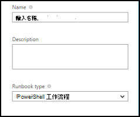
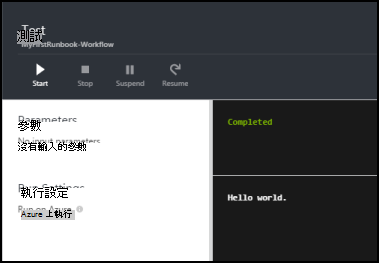
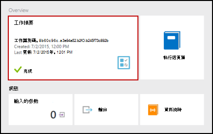
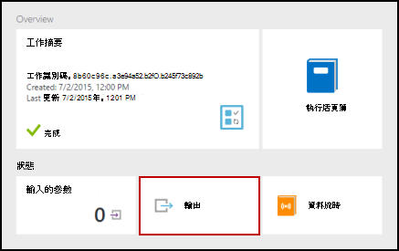
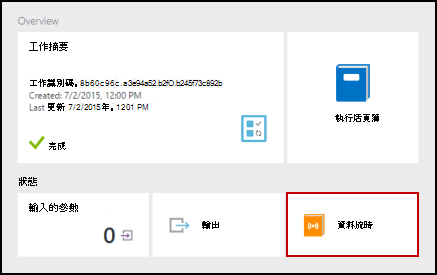
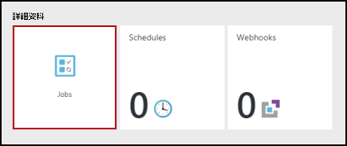
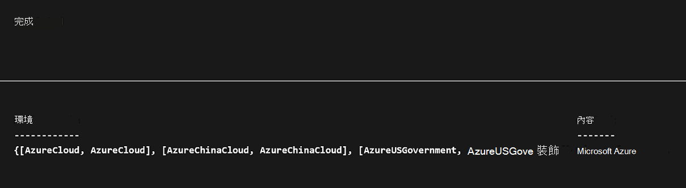
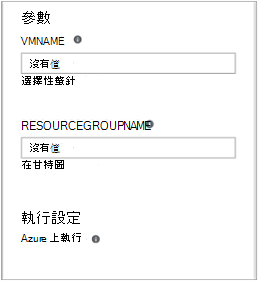

<properties
    pageTitle="我在 Azure 自動化的第一個 PowerShell 工作流程 runbook |Microsoft Azure"
    description="會引導您完成建立、 測試和發佈的使用 PowerShell 工作流程簡易文字 runbook 的教學課程。"
    services="automation"
    documentationCenter=""
    authors="mgoedtel"
    manager="jwhit"
    editor=""
    keywords="powershell 工作流程，powershell 工作流程範例，工作流程 powershell"/>
<tags
    ms.service="automation"
    ms.workload="tbd"
    ms.tgt_pltfrm="na"
    ms.devlang="na"
    ms.topic="get-started-article"
    ms.date="07/19/2016"
    ms.author="magoedte;bwren"/>

# <a name="my-first-powershell-workflow-runbook"></a>我的第一個 PowerShell 工作流程 runbook

> [AZURE.SELECTOR] - [圖形化](automation-first-runbook-graphical.md) - [PowerShell](automation-first-runbook-textual-PowerShell.md) - [PowerShell 工作流程](automation-first-runbook-textual.md)

本教學課程中會引導您在 Azure 自動化[PowerShell 工作流程 runbook](automation-runbook-types.md#powerShell-workflow-runbooks)的建立。 我們開始簡單的 runbook，我們將會測試，發佈時我們會說明如何追蹤 runbook 工作的狀態。 我們會修改實際管理 Azure 資源 runbook 在此情況下啟動 Azure 虛擬機器。 我們會然後讓 runbook 更強大新增 runbook 參數。

## <a name="prerequisites"></a>必要條件

若要完成此教學課程中，您需要下列項目。

-   Azure 訂閱。 如果您沒有其中一個，您可以在[啟動您的 MSDN 訂閱權益](https://azure.microsoft.com/pricing/member-offers/msdn-benefits-details/)或<a href="/pricing/free-account/" target="_blank">[註冊免費的帳戶](https://azure.microsoft.com/free/)。
-   按住 runbook 和 Azure 資源驗證[自動化帳戶](automation-security-overview.md)。  此帳戶必須啟動和停止虛擬機器的權限。
-   Azure 虛擬機器。 我們會停止和開始這台電腦，所以不應該是實際執行。

## <a name="step-1---create-new-runbook"></a>步驟 1-建立新的 runbook

我們先建立簡單的 runbook 輸出*什麼*的文字。

1.  在 [Azure 入口網站中，開啟您自動化的帳戶。  
    自動化帳戶頁面可讓您快速檢視資源在此帳戶。 您應該已經有一些資產。 大部分的是新的自動化帳戶中會自動包含模組。 您也應該已認證資產所述[的先決條件](#prerequisites)。
2.  按一下 [ **Runbooks** ] 方塊，以開啟 runbooks 清單。<br> 
3.  按一下 [**新增 runbook** ] 按鈕，然後**建立新的 runbook**上建立新的 runbook。
4.  讓 runbook *MyFirstRunbook 工作流程*的名稱。
5.  在此案例中，我們要建立[PowerShell 工作流程 runbook](automation-runbook-types.md#powerShell-workflow-runbooks) ，因此**Runbook**類型選取**Powershell 工作流程**。<br> 
6.  按一下 [**建立**]，建立 runbook 並開啟文字編輯器]。

## <a name="step-2---add-code-to-the-runbook"></a>步驟 2-將程式碼新增至 runbook

您可以直接將 runbook 的任一型別程式碼或您可以 cmdlet、 runbooks，從選取和資產的文件庫的控制項，並將它們加到任何相關的參數的 runbook。 在此逐步解說，我們會直接輸入 runbook。

1.  我們 runbook 目前是空的必要的*工作流程*關鍵字，我們 runbook 及括號，以包封整個工作流程的名稱。 

    ```
    Workflow MyFirstRunbook-Workflow
    {
    }
    ```

2.  輸入*寫入輸出"Hello 全球。 」* 括號。 
   
    ```
    Workflow MyFirstRunbook-Workflow
    {
      Write-Output "Hello World"
    }
    ```

3.  按一下 [**儲存**儲存 runbook。<br> 

## <a name="step-3---test-the-runbook"></a>步驟 3-測試 runbook

我們發佈，使其提供生產 runbook 之前，我們想要測試，以確定其運作正常。 當您測試 runbook 時，您執行其**草稿**版本，並檢視輸出互動的方式。

1.  按一下 [**測試] 窗格**中，開啟 [測試] 窗格。<br> 
2.  按一下 [**開始**] 以開始測試。 應該是唯一啟用的選項。
3.  建立[runbook 工作](automation-runbook-execution.md)，且其狀態顯示。  
    工作狀態就會開始為*佇列*指出等待 runbook 背景工作在雲端建立可用。 當工作者宣告工作，然後*執行*runbook 實際開始執行時，它然後會移到*開始*。  
4.  Runbook 工作完成時，會顯示其輸出。 在此例中，我們應該會看到*什麼*。<br> 
5.  關閉 [測試] 窗格，若要返回畫布。

## <a name="step-4---publish-and-start-the-runbook"></a>步驟 4-發佈並開始 runbook

我們剛剛建立的 runbook 仍為草稿模式。 我們需要將它發佈之前我們可以生產環境中執行。 當您發佈 runbook 時，您以覆寫現有的發行版本的草稿版本。 在此例中，我們已發佈版本還沒有因為我們剛剛建立的 runbook。

1.  按一下 [**發佈**] 發佈 runbook 再****出現提示時。<br> 
2.  如果您向左捲動，現在檢視 runbook **Runbooks**窗格中，則會顯示的**已發佈****撰寫狀態**。
3.  捲動到右側， **MyFirstRunbook 工作流程**的檢視] 窗格。  
    上方的選項可讓我們來啟動 runbook、 排定開始時間，或建立[webhook](automation-webhooks.md) ，讓它可以啟動透過 HTTP 呼叫。
4.  我們只想要開始 runbook，按一下 [**開始**]，然後****出現提示時。<br> 
5.  工作窗格會開啟為您剛剛建立的 runbook 工作。 我們可以關閉此窗格中，但在此情況下我們將保留它開啟，我們可以觀看工作進度。
6.  工作狀態會顯示在**工作摘要**，並比對時我們測試 runbook 我們看到狀態。<br> 
7.  一旦 runbook 狀態] 顯示*已完成*，請按一下 [**輸出**]。 [輸出] 窗格會開啟，而且我們可以看到*什麼*。<br>   
8.  關閉 [輸出] 窗格。
9.  按一下 [**資料流時**，開啟 runbook 工作的資料流窗格]。 我們只應該會看到*什麼*中輸出資料流，但這可以顯示 runbook 工作詳細資訊和錯誤等其他資料流時，如果 runbook 寫入它們。<br> 
10. 關閉資料流窗格並返回 [MyFirstRunbook] 窗格的 [工作] 窗格。
11. 按一下 [開啟此 runbook 的工作窗格的**工作**]。 這會列出所有此 runbook 所建立的作業。 我們只應該會看到一項工作，列出因為我們只執行作業一次。<br> 
12. 您可以在這個工作，以開啟我們檢視我們啟動 runbook 時的同一個工作窗格中按一下。 這個選項可讓您以返回時間並檢視針對特定的 runbook 建立的任何工作的詳細資料。

## <a name="step-5---add-authentication-to-manage-azure-resources"></a>步驟 5-新增管理 Azure 資源驗證

我們已測試並發佈我們 runbook，但到目前為止，不會有幫助。 我們想要讓它管理 Azure 資源。 將無法執行這項作業，雖然除非我們已驗證使用[的先決條件](#prerequisites)中參照的認證。 這是與**新增 AzureRMAccount**指令程式。

1.  開啟文字編輯器，請按一下 [MyFirstRunbook 工作流程] 窗格中的 [**編輯**。<br> 
2.  我們不再需要**寫入輸出**線條、，因此請繼續，並將其刪除。
3.  將游標放在括號之間的空白列。
4.  輸入或複製並貼上下列的程式碼將處理您的自動化執行為帳戶驗證︰

    ```
    $Conn = Get-AutomationConnection -Name AzureRunAsConnection 
    Add-AzureRMAccount -ServicePrincipal -Tenant $Conn.TenantID `
    -ApplicationId $Conn.ApplicationID -CertificateThumbprint $Conn.CertificateThumbprint
    ```

5.  讓我們可以測試 runbook，請按一下 [**測試] 窗格**]。
6.  按一下 [**開始**] 以開始測試。 一旦完成作業之後，您應該會收到輸出類似下列、 顯示基本資訊從您的帳戶。 向您確認認證無效。<br> 

## <a name="step-6---add-code-to-start-a-virtual-machine"></a>步驟 6-新增碼來啟動虛擬機器

現在，我們 runbook 驗證我們 Azure 訂閱，我們可以管理資源。 我們將會新增至啟動虛擬機器命令。 您可以選擇任何虛擬機器中 Azure 訂閱，然後現在我們可以將 cmdlet 名稱的硬式編碼。

1.  *新增 AzureRmAccount*，輸入*開始 AzureRmVM-名稱 「 VMName' ResourceGroupName 'NameofResourceGroup'*提供的名稱和啟動的虛擬機器資源群組名稱。  

    ```
    workflow MyFirstRunbook-Workflow
    {
      $Conn = Get-AutomationConnection -Name AzureRunAsConnection
      Add-AzureRMAccount -ServicePrincipal -Tenant $Conn.TenantID -ApplicationId $Conn.ApplicationID -CertificateThumbprint $Conn.CertificateThumbprint
      Start-AzureRmVM -Name 'VMName' -ResourceGroupName 'ResourceGroupName'
    }
    ``` 

2.  儲存 runbook，然後按一下 [**測試] 窗格**，讓我們可以進行測試。
3.  按一下 [**開始**] 以開始測試。 一旦完成，核取所啟動的虛擬機器。

## <a name="step-7---add-an-input-parameter-to-the-runbook"></a>步驟 7-新增 runbook 輸入的參數

我們 runbook 目前啟動虛擬機器我們硬式編碼中 runbook，，但如果 runbook 啟動時，我們可以指定虛擬機器就會越有用處。 現在我們會將輸入的參數新增 runbook 提供的功能。

1.  *VMName*和*ResourceGroupName*中加入參數，runbook，並使用這些變數與**開始 AzureRmVM** cmdlet，如下列範例所示。 

    ```
    workflow MyFirstRunbook-Workflow
    {
       Param(
        [string]$VMName,
        [string]$ResourceGroupName
       )  
     $Conn = Get-AutomationConnection -Name AzureRunAsConnection 
     Add-AzureRMAccount -ServicePrincipal -Tenant $Conn.TenantID -ApplicationId $Conn.ApplicationID -CertificateThumbprint $Conn.CertificateThumbprint
     Start-AzureRmVM -Name $VMName -ResourceGroupName $ResourceGroupName
    }
    ```

2.  儲存 runbook，並開啟 [測試] 窗格。 請注意，您可以立即提供值將用於測試的兩個輸入變數。
3.  關閉 [測試] 窗格。
4.  按一下 [**發佈**至發佈新版本的 runbook。
5.  停止您開始在先前的步驟虛擬機器。
6.  按一下 [**開始**] 以開始 runbook。 針對您要開始虛擬機器輸入**VMName**與**ResourceGroupName** 。<br> 

7.  Runbook 完成後，請核取所啟動的虛擬機器。

## <a name="next-steps"></a>後續步驟

-  若要開始使用圖形 runbooks，請參閱[我的第一個圖形 runbook](automation-first-runbook-graphical.md)
-  若要開始使用 PowerShell runbooks，請參閱[我的第一個 PowerShell runbook](automation-first-runbook-textual-powershell.md)
-  若要瞭解 runbook 類型、 優點和限制的詳細資訊，請參閱[Azure 自動化 runbook 類型](automation-runbook-types.md)
-  如需有關 PowerShell 指令碼支援功能，請參閱[Azure 自動化中支援的原生的 PowerShell 指令碼](https://azure.microsoft.com/blog/announcing-powershell-script-support-azure-automation-2/)