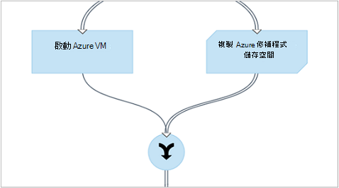

<properties 
    pageTitle="圖形化撰寫中 Azure 自動化 |Microsoft Azure"
    description="圖形化撰寫可讓您建立 runbooks Azure 自動化，而不使用的程式碼。 本文提供簡介圖形撰寫及啟動 [建立圖形的 runbook 所需的詳細資料。"
    services="automation"   
    documentationCenter=""
    authors="mgoedtel"
    manager="jwhit"
    editor="tysonn" />
<tags 
    ms.service="automation"
    ms.devlang="na"
    ms.topic="article"
    ms.tgt_pltfrm="na"
    ms.workload="infrastructure-services"
    ms.date="06/03/2016"
    ms.author="magoedte;bwren" />

# 圖形化撰寫中 Azure 自動化

## 簡介

圖形化撰寫可讓您建立 Azure 自動化 runbooks 不基礎的 Windows PowerShell 或 PowerShell 工作流程程式碼的複雜性。 您從 cmdlet 和 runbooks 的文件庫中加入畫布活動、 連結在一起，並設定成工作流程。  如果您曾使用過系統管理中心 Orchestrator 或服務管理自動化 (SMA)，然後看起來應該熟悉給您。   

本文提供簡介圖形撰寫及您要開始建立圖形的 runbook 的概念。

## 圖形化 runbooks

Azure 自動化中的所有 runbooks 都是 Windows PowerShell 的工作流程。  圖形化和圖形 PowerShell 工作流程 runbooks 產生 PowerShell 由自動化工作人員所執行的程式碼，但您無法檢視，或直接加以修改。  圖形的 runbook 可以轉換成圖形 PowerShell 工作流程 runbook，反之亦然，但它們無法轉換成文字的 runbook。 現有的文字 runbook 無法匯入圖形編輯器。  

## 圖形化編輯器的概觀

您可以開啟 Azure 入口網站中的圖形化編輯器建立或編輯圖形的 runbook。

下列各節說明圖形編輯器中的控制項。

### 畫布
畫布是設計您 runbook 的位置。  您將文件庫控制項中節點的活動新增到 runbook，並將其連接的連結，以定義的 runbook 邏輯。

您可以使用畫布底部的控制項，若要放大及縮小。

### 文件庫控制項

文件庫控制項是您選取 [若要新增至您 runbook 的[活動](#activities)。  您可以將它們加入畫布上，將它們連接到其他活動。  包含下表所述的四個區段。

| 區段 | 描述 |
|:---|:---|
| Cmdlet | 在您 runbook 中包含所有可用的指令程式。  Cmdlet 組織的模組。  所有您已安裝在您的自動化帳戶的模組將可供。  |
| Runbooks |  包含 runbooks 自動化帳戶中。 這些 runbooks 可以新增至要做為子 runbooks 畫布。 顯示只 runbooks 的相同正在編輯 runbook 核心類型;圖形會顯示 runbooks 只 PowerShell 型 runbooks 時的圖形化 PowerShell 工作流程 runbooks 只 PowerShell-工作流程架構 runbooks 會顯示。
| 資產 | 包含您可在您 runbook 的自動化帳戶[自動化資產](http://msdn.microsoft.com/library/dn939988.aspx)。  加入 runbook 資產，它會將工作流程活動，取得所選的資產。  若是變數資產，您可以選取是否要新增的活動，以取得變數或設定變數。
| Runbook 控制項 | 包含您目前的 runbook 可用的 runbook 控制作業。 *連接點*接受多個輸入，並等待所有已完成的工作流程在繼續之前。 *程式碼*活動執行一或多個線條的 PowerShell 或 PowerShell 工作流程的程式碼，視圖形 runbook 類型而定。  自訂程式碼或其他活動不容易的功能，您可以使用此活動。|

### 設定控制項

設定控制項為您提供詳細資料的畫布上選取的物件。 使用這個控制項中的屬性選取的物件類型而定。  當您設定控制項中選取一個選項時，隨即會開啟其他刀才能提供的其他資訊。

### 測試控制項

圖形化編輯器第一次啟動時，不會顯示 [測試] 控制項。 它時，會開啟您互動的方式[測試圖形的 runbook](#graphical-runbook-procedures)。  

## 圖形化 runbook 程序 

### 匯出及匯入圖形的 runbook

您只能匯出圖形的 runbook 的發佈的版本。  如果 runbook 尚未發行，將會停用**匯出發佈**] 按鈕。  當您按一下 [**匯出發佈**] 按鈕時，runbook 會下載至您的本機電腦。  檔案的名稱比對*graphrunbook*副檔名為 runbook 的名稱。

您可以新增 runbook 時，請選取 [**匯入**] 選項，以匯入圖形或圖形的 PowerShell 工作流程 runbook 檔案。   當您選取要匯入的檔案時，您可以保留相同的**名稱**，或提供新。  [Runbook 類型] 欄位會顯示 runbook 的類型後，會評估所選取的檔案並如果您嘗試要選取不同的類型不正確，就會看到有可能發生的衝突與轉換期間，可能是語法錯誤會顯示一則訊息。  

### 測試圖形的 runbook

原封不動地保留 runbook 的發佈的版本，或已發行之前，您可以測試新的 runbook 時，您可以在入口網站中 Azure 測試 runbook 的草稿版本。 這個選項可讓您確認 runbook 取代已發佈的版本前正確運作。 當您測試 runbook 時，執行 「 草稿 」 runbook，完成執行任何動作。 建立沒有工作歷程記錄時，但輸出會顯示在 [測試輸出] 窗格。 

開啟 runbook 測試控制開啟進行編輯 runbook，然後按一下 [**測試] 窗格**] 按鈕上。

![測試窗格] 按鈕](media/automation-graphical-authoring-intro/runbook-edit-test-pane.png)

測試控制項會提示您輸入任何輸入參數，而且您可以開始 runbook，按一下 [**開始**] 按鈕。

### 發佈圖形的 runbook

Azure 自動化中的每個 runbook 有草稿與發佈版本。 只有發佈版本可執行，並可編輯的草稿版本。 發佈版本不會受草稿版本的任何變更。 準備好要使用的草稿版本時，然後您發佈的草稿版本使用覆寫的發佈版本。

您可以開啟進行編輯，然後按一下 [**發佈**] 按鈕，也 runbook 發佈圖形的 runbook。

![發佈] 按鈕](media/automation-graphical-authoring-intro/runbook-edit-publish.png)

Runbook 尚未發行，其狀態是 [**新增]**。  發佈其狀態是 [**已發佈**。  如果已發佈，並有不同的草稿及發佈版本後，您可以編輯 runbook，runbook 具有**編輯**狀態。

 

您也可以還原為 runbook 的發佈版本的選項。  棄置 runbook 上次發佈與取代已發佈版本的草稿版本 runbook 後所做的任何變更。

![回到 [發佈] 按鈕](media/automation-graphical-authoring-intro/runbook-edit-revert-published.png)

## 活動

活動有 runbook 的建置組塊。  活動可以 PowerShell cmdlet]、 [子 runbook 或 [工作流程活動。  您新增至 runbook 的活動，以滑鼠右鍵按一下文件庫控制項中，選取 [**新增至畫布**。  然後，您可以按一下，然後拖曳到將您喜歡在畫布上的任何位置的活動。  位置的畫布上活動不會影響以任何方式 runbook 的作業。  您可以版面配置您 runbook 不過您找到最適合以視覺化方式呈現作業。 

選取 [設定參數及其屬性設定刀畫布上的活動]。  您可以變更**標籤**的活動，為您說明。  正在執行原始指令程式，您只要變更它將會用於圖形編輯器] 中的顯示名稱。  標籤中必須是唯一的 runbook。 

### 參數集

參數設定定義強制和選擇性參數，就會接受特定的 cmdlet 的值。  所有的 cmdlet 有設定，請至少有一個參數，有些有多個。  如果 cmdlet 有多個參數集，然後您必須先選取哪一個您可以設定參數之前，您會使用。  您可以設定的參數會取決於您選擇的參數集。  您可以變更使用活動所選取**參數設定**，並選取 [其他設定的參數組。  在此案例中，任何您設定的參數值都會遺失。

在下列範例中，取得 AzureRmVM 指令程式會有三個參數集。  您無法在直到選取一種參數設定參數值。  ListVirtualMachineInResourceGroupParamSet 參數設定會傳回所有虛擬機器資源群組中，而且有單一的選擇性參數。  GetVirtualMachineInResourceGroupParamSet 適用於指定虛擬機器您想要傳回，有兩個強制和一個選擇性參數。

#### 參數值

當您指定參數的值時，您可以選取資料來源，以決定如何將指定的值。  資料來源所使用的特定的參數會取決於該參數的有效的值。  例如，Null 不會不允許 null 值的參數的可用選項。

| 資料來源 | 描述 |
|:---|:---|
|固定的值|輸入參數值。  這只適用於下列資料類型︰ Int32 Int64、 字串、 布林值、 DateTime、 切換。 |
|活動輸出|從活動之前目前活動中的工作流程的成果。  會列出所有有效的活動。  選取要用於參數值輸出活動。  如果活動輸出具有多個屬性的物件，然後您可以輸入在 [名稱] 屬性選取活動之後。|
|Runbook 輸入 |選取 runbook 輸入的參數為輸入活動參數。|  
|變數資產|選取 [自動化變數輸入。|  
|認證資產|選取輸入自動化認證。|  
|憑證資產|選取做為輸入的自動化的憑證。|  
|連線資產|選取的自動化連線做為輸入。| 
|PowerShell 運算式|指定簡單[PowerShell 運算式](#powershell-expressions)。  之前的活動和使用參數值的結果，將會評估運算式。  若要參照之活動或 runbook 輸入的參數的成果，您可以使用的變數。|
|未設定|清除任何先前設定的值。|

#### 其他的選擇性參數

所有的 cmdlet 必須提供額外的參數的選項。  這些是 PowerShell 常見的參數或其他自訂的參數。  您會看到您可以在此提供使用 PowerShell 語法的參數的文字方塊。  例如，若要使用的**詳細資訊**常見的參數，您可以指定**」 的詳細資訊︰ $True 」**。

### 再試一次活動

**再試一次行為**允許特定條件符合時，才能夠執行多次活動就像是 [循環播放。  您可以使用此功能，應該都可以執行多個時間、 容易發生錯誤的活動，可能需要多個嘗試成功，或 [測試有效的資料的活動的輸出資訊。    

當您啟用重試活動時，您可以設定延遲和條件。  延遲是時間 （秒鐘或幾分鐘為單位），runbook 會等待再次執行的活動。  如果有不指定任何延遲，然後活動會再次執行完成後，立即。 

重試條件是 PowerShell 運算式評估之後每次執行時的活動。  如果運算式解析為 True，然後活動執行一次。  如果運算式解析為 False 然後活動不會執行一次，然後 runbook 會移至下一個活動。 

重試條件可以使用變數，稱為 「 $RetryData 所提供的活動重試的相關資訊的存取權。  此變數會具有下表中的屬性。

| 屬性 | 描述 |
|:--|:--|
| NumberOfAttempts | 數字的已執行的活動的次數。              |
| 輸出           | 輸出上次執行的活動。                    |
| TotalDuration    | 逾時活動第一次啟動後所經過。 |
| StartedAt        | 初次啟動活動 UTC 格式的時間。           |

以下是活動的範例再試一次條件。

    # Run the activity exactly 10 times.
    $RetryData.NumberOfAttempts -ge 10 

    # Run the activity repeatedly until it produces any output.
    $RetryData.Output.Count -ge 1 

    # Run the activity repeatedly until 2 minutes has elapsed. 
    $RetryData.TotalDuration.TotalMinutes -ge 2

設定活動重試條件後，活動包含兩個視覺提示，提醒您。  在活動中顯示的其中一個其他時，則您檢閱活動的設定。

### 工作流程指令碼控制項

程式碼控制項是特殊的活動接受 PowerShell 或 PowerShell 工作流程的指令碼，根據撰寫才能提供的功能，否則不提供的圖形化 runbook 的類型。  無法接受參數，但它可以使用變數活動輸出] 和 [runbook 輸入參數。  除非有連結沒有撥出在這種情況下會新增到 runbook 的輸出 databus 會新增任何輸出的活動。

例如下列程式碼會執行使用稱為 $NumberOfDays runbook 輸入的變數的日期計算。  接著將作為輸出以供後續活動 runbook 傳送計算的日期時間。

    $DateTimeNow = (Get-Date).ToUniversalTime()
    $DateTimeStart = ($DateTimeNow).AddDays(-$NumberOfDays)}
    $DateTimeStart

## 連結和工作流程

圖形的 runbook 中的**連結**會連接兩個活動。  它會顯示在畫布上為從來源活動指向目的地活動的箭號。  目的地活動開始來源活動完成後，在箭頭的方向執行的活動。  

### 建立連結

建立兩個活動選取來源活動，按一下 [圖形底部的圓形之間的連結。  拖曳箭號，目的地活動和發行。

選取 [設定刀設定其屬性的連結。  下表中，這會包含說明的連結類型。

| 連結類型 | 描述 |
|:---|:---|
| 管線 | 目的地活動執行一次為每個物件輸出從來源活動。  如果來源活動結果沒有輸出中不會執行目的地活動。  從來源活動輸出的已作為物件。  |
| 順序 | 目的地活動執行一次。  從來源活動接收物件的陣列。  從來源活動輸出的已作為陣列的物件。 |

### 開始活動

圖形的 runbook 就會開始的內送的連結沒有任何活動。  這通常是只有一個要做為 runbook 的開始活動的活動。  如果多個活動沒有內送的連結，然後 runbook 會先同時執行。  它會遵循執行其他的活動，為每個完成連結。

### 條件

如果此條件會解析成，當您指定條件的連結時，只執行目的地活動，則為 true。  您通常會使用條件的 $ActivityOutput 變數輸出擷取來源活動。  

如管線連結，您所指定條件的單一物件，及條件評估為每個物件輸出來源活動。  目的地活動再執行的每個符合條件的物件。  例如，含取得 AzureRmVm 來源活動，下列語法可用於條件的管線連結來擷取名為*群組 1*的 [資源] 群組中的唯一虛擬機器。  

    $ActivityOutput['Get Azure VMs'].Name -match "Group1"

順序連結，條件只會評估一次一個陣列會傳回包含從來源活動的所有物件輸出由於。  因此，順序連結無法用於篩選類似的管線連結，但只會決定要執行的下一個活動。 我們開始 VM runbook 中記錄，例如下列活動的集合。   
有三個不同的順序連結會驗證值為所提供兩個 runbook 輸入參數代表 VM 名稱，以及資源群組名稱，以決定所要採取的適當的動作的開始單一 VM，啟動 [資源] 群組中的所有 Vm 或訂閱中的所有 Vm。  連線至 Azure 取得單一 VM 之間的順序連結，如下的條件邏輯︰

    <# 
    Both VMName and ResourceGroupName runbook input parameters have values 
    #>
    (
    (($VMName -ne $null) -and ($VMName.Length -gt 0))
    ) -and (
    (($ResourceGroupName -ne $null) -and ($ResourceGroupName.Length -gt 0))
    )

當您使用的條件的連結時，才能從來源活動其他分支的活動的資料會篩選條件。  多個連結的來源活動時，才能在每個分支的活動的資料取決於連線到該分支連結中的條件。

例如，runbook 下方的**開始 AzureRmVm**活動啟動所有虛擬機器。  有兩個條件的連結。  第一個條件的連結使用運算式*$ActivityOutput [「 開始-AzureRmVM 」]。IsSuccessStatusCode eq $true*篩選如果開始 AzureRmVm 活動已順利完成。  第二個使用運算式*$ActivityOutput [「 開始-AzureRmVM 」]。IsSuccessStatusCode ne $true*如果開始 AzureRmVm 活動無法啟動虛擬機器篩選。  

任何活動的後面的第一個連結，取得 AzureVM 的活動輸出，才會出現啟動時，取得 AzureVM 執行虛擬機器的用途。  第二個連結的任何活動，才會出現虛擬機器已停止執行取得 AzureVM 次。  第三個連結的任何活動會收到所有虛擬機器，不論他們的執行狀態。

### 連接點

連接點是會等到完成所有內送的分支的特殊活動。  這個選項可讓您同時執行多個活動，並確保所有擁有已完成後，再繼續。

連接點可以有無限的內送的連結，而不以上的連結可管線。  不受限制的內送的順序連結的數目。  您可建立具有多個內送的管線連結的連接點與儲存 runbook，但在執行時，它將會失敗。

下列範例是同時下載修補程式，可套用至這些機器時開始一組的虛擬機器 runbook 的一部分。  連接點用來確保 runbook 持續之前，完成這兩個程序。

### 循環

循環圖時，目的地活動連結至其來源活動或另一個連結回其來源的長度不受限制的活動。  循環目前不允許圖形撰寫。  如果您 runbook 有循環圖，它會正確地儲存，但會在執行時收到錯誤訊息。

### 共用資料之間的活動

*Databus*的 runbook 寫入輸出的外寄的連結與活動的任何資料。  在 runbook 中的任何活動可以使用上 databus 資料，若要填入的參數值，或是包含指令碼。  活動可以存取任何工作流程中的上一個活動的輸出。     

資料如何寫入 databus，則連結活動的類型而定。  **管線**，資料會為多重圖表物件輸出。  資料**順序**連結]，以陣列方式是輸出。  如果有一個值，就會輸出以單一項目陣列。

您可以存取使用兩種方法之一 databus 上的資料。  若要填入其他活動的參數，使用第一次**活動輸出**資料來源。  如果輸出物件，您可以指定單一屬性。

您也可以擷取之活動**PowerShell 運算式**的資料來源中或 ActivityOutput 變數的**工作流程指令碼**活動的成果。  如果輸出物件，您可以指定單一屬性。  ActivityOutput 變數會使用下列語法。

    $ActivityOutput['Activity Label']
    $ActivityOutput['Activity Label'].PropertyName 

### 檢查點

您可以設定[檢查點](automation-powershell-workflow.md#checkpoints)圖形 PowerShell 工作流程 runbook 中，選取 [任何活動上的 [*檢查點 runbook* 。  這會使檢查點，以設定後執行的活動。

檢查點才會在圖形的 PowerShell 工作流程 runbooks 中，無法用於圖形 runbooks。  如果 runbook 使用 Azure cmdlet，以避免 runbook 暫停，並重新啟動，您應該遵循新增 AzureRMAccount 任何檢查活動從不同的背景工作上這項檢查點。 

## 驗證 Azure 資源

在 Azure 自動化管理 Azure 資源的 Runbooks 需要 Azure 驗證。  新的[執行方式帳戶](automation-sec-configure-azure-runas-account.md)功能 （也稱為主體的服務） 是預設的方法存取您的訂閱，與自動化 runbooks 中的 Azure 資源管理員資源。  您可以新增**AzureRunAsConnection**連線資產，使用 PowerShell[取得 AutomationConnection](https://technet.microsoft.com/library/dn919922%28v=sc.16%29.aspx) cmdlet 和畫布上的[新增 AzureRmAccount](https://msdn.microsoft.com/library/mt619267.aspx) cmdlet，將這項功能新增至圖形的 runbook。 下列範例所示。  
取得執行為連線活動 (例如取得-AutomationConnection)，名為 AzureRunAsConnection 的常數值資料來源設定。  
下一個活動，也就是新增 AzureRmAccount，在 runbook 新增已驗證執行為帳戶使用。 
 
參數**APPLICATIONID**與**TENANTID** **CERTIFICATETHUMBPRINT**，您必須指定欄位路徑的屬性的名稱，因為活動輸出具有多個屬性的物件。  否則當您執行 runbook 時，它將會失敗嘗試驗證。  這是您需要在最小值，以驗證您 runbook 執行為帳戶。

若要針對版訂閱者建立自動化帳戶使用[Azure AD 使用者帳戶](automation-sec-configure-aduser-account.md)管理 Azure 服務管理 (ASM) 或 Azure 資源管理員資源維持回溯相容性，驗證方法是使用代表 Active Directory 使用者有權存取 Azure 帳戶[認證資產](http://msdn.microsoft.com/library/dn940015.aspx)新增 AzureAccount 指令程式。

您可以新增至圖形的 runbook 這項功能，藉由新增認證資產後面新增 AzureAccount 活動畫布上。  新增 AzureAccount 使用其輸入認證活動。  下列範例所示。

您必須在 runbook 以及每個檢查點之後開始進行驗證。  這表示任何檢查點工作流程活動後新增加法新增 AzureAccount 活動。 因為您可以使用相同不需要新增認證活動 

## 輸入與輸出 Runbook

### Runbook 輸入

如果目前作為子系，runbook 可能會要求輸入使用者開始透過 Azure 入口網站 runbook 時從或另一個 runbook。
例如，如果您有建立虛擬機器 runbook，您可能需要提供的資訊，例如名稱虛擬機器以及其他屬性每次啟動 runbook。  

您接受輸入 runbook 定義一個或多個輸入參數。  您提供的值為這些參數開始 runbook 每次。  當您啟動 runbook Azure 入口網站時，就會提示您提供的每個 runbook 輸入參數值。

您可以按一下 runbook 工具列上的 [**輸入與輸出**] 按鈕，以存取 runbook 輸入的參數。  

 

這會開啟您可以在其中編輯現有的輸入的參數或按一下 [**新增輸入**來建立新的**輸入與輸出**控制項。 

每個輸入的參數所定義之下表中的屬性。

|屬性|描述|
|:---|:---|
| 名稱 | 參數的唯一名稱。  這只能包含數字字元，並不能包含空格。 |
| 描述 | 輸入參數選擇性的描述。  |
| 類型 | 預期的參數值的資料類型。  Azure 入口網站會提供適當的控制項的每個參數的資料類型時提示輸入。 |
| 強制性 | 指定是否必須提供參數的值。  如果您不提供每個必要的參數沒有定義預設值的值，則無法啟動 runbook。 |
| 預設值 | 指定哪些值用於參數，如果不提供一個。  可以是空值或特定值。 |

### Runbook 輸出

外寄的連結沒有任何活動所建立的資料便會新增至[runbook 輸出](http://msdn.microsoft.com/library/azure/dn879148.aspx)。  輸出儲存與 runbook 工作時，則使用上層 runbook runbook 會用來作為子標題。  

## PowerShell 運算式

圖形化撰寫的優點之一提供您建立的 PowerShell 的基本知識與 runbook 的能力。  目前，您需要知道的 PowerShell 雖然填入某些[參數值](#activities)和設定[連結條件](#links-and-workflow)。  本節提供使用者若不甚熟悉它 PowerShell 運算式的快速簡介。  PowerShell 的完整詳細資料，可在[使用 Windows PowerShell 撰寫指令碼](http://technet.microsoft.com/library/bb978526.aspx)。 

### PowerShell 運算式的資料來源

您可以使用 PowerShell 運算式作為資料來源，來填入部分 PowerShell 程式碼的結果[活動參數](#activities)的值。  這可能是單行執行一些簡單的函數或執行某些複雜的邏輯的多個線條的程式碼。  未指派給變數命令任何輸出是輸出參數值。 

例如，下列命令會輸出目前的日期。 

    Get-Date

下列命令會建立目前的日期的字串，並將其指派給變數。  輸出然後傳送該變數的內容 

    $string = "The current date is " + (Get-Date)
    $string

下列命令會評估目前的日期，並傳回指出目前天週末或星期名稱的字串。 

    $date = Get-Date
    if (($date.DayOfWeek = "Saturday") -or ($date.DayOfWeek = "Sunday")) { "Weekend" }
    else { "Weekday" }
    
 
### 活動輸出

若要使用的輸出至前一個活動 runbook 中，請使用下列語法中 $ActivityOutput 變數。

    $ActivityOutput['Activity Label'].PropertyName

例如，您可能必須活動屬性時所需的虛擬機器名稱在此情況下，您可以使用下列運算式。

    $ActivityOutput['Get-AzureVm'].Name

如果所需的虛擬機器屬性的物件，而不是只屬性，您就會傳回整個使用下列語法的物件。

    $ActivityOutput['Get-AzureVm']

您也可以使用活動的輸出中更複雜的運算式，例如串連文字的虛擬機器名稱為動作。

    "The computer name is " + $ActivityOutput['Get-AzureVm'].Name

### 條件

使用[比較運算子](https://technet.microsoft.com/library/hh847759.aspx)來比較的值或決定值，是否符合指定的模式。  比較傳回 $true 或 $false 的值。

例如，下列條件判斷是否從名為*取得 AzureVM*活動虛擬機器目前*停止*。 

    $ActivityOutput["Get-AzureVM"].PowerState –eq "Stopped"

下列條件會檢查是否相同的虛擬機器中*停止*以外的任何狀態。

    $ActivityOutput["Get-AzureVM"].PowerState –ne "Stopped"

您可以加入多個條件，例如使用[邏輯運算子](https://technet.microsoft.com/library/hh847789.aspx) **-和**或**-或**。  例如，下列條件會檢查在先前範例相同的虛擬機器是否*已停止*或*停止*的狀態。

    ($ActivityOutput["Get-AzureVM"].PowerState –eq "Stopped") -or ($ActivityOutput["Get-AzureVM"].PowerState –eq "Stopping") 

### 雜湊表

[雜湊表](http://technet.microsoft.com/library/hh847780.aspx)是很有用傳回的一組值的名稱/值組。  某些活動的屬性可能會發生的事 hashtable，而非簡單的值。  您可能也會看到為 hashtable 稱為字典。 

您可以建立 hashtable 使用下列語法。  Hashtable 最多可以包含任何數目的項目，但每個所定義之名稱和值。

    @{ <name> = <value>; [<name> = <value> ] ...}

例如，下列運算式會建立 hashtable 用於預期在網際網路上搜尋值雜湊表活動參數的資料來源。

    $query = "Azure Automation"
    $count = 10
    $h = @{'q'=$query; 'lr'='lang_ja';  'count'=$Count}
    $h

下列範例會使用來填入 hashtable 輸出稱為*取得 Twitter 連線*的活動。

    @{'ApiKey'=$ActivityOutput['Get Twitter Connection'].ConsumerAPIKey;
      'ApiSecret'=$ActivityOutput['Get Twitter Connection'].ConsumerAPISecret;
      'AccessToken'=$ActivityOutput['Get Twitter Connection'].AccessToken;
      'AccessTokenSecret'=$ActivityOutput['Get Twitter Connection'].AccessTokenSecret}

## 後續步驟

- 若要開始使用 PowerShell 工作流程 runbooks，請參閱[我的第一個 PowerShell 工作流程 runbook](automation-first-runbook-textual.md) 
- 若要開始使用圖形 runbooks，請參閱[我的第一個圖形 runbook](automation-first-runbook-graphical.md)
- 若要知道 runbook 類型、 優點和限制的詳細資訊，請參閱[Azure 自動化 runbook 類型](automation-runbook-types.md)
- 若要瞭解如何使用自動化執行為帳戶進行驗證，請參閱[設定 Azure 執行為帳戶](automation-sec-configure-azure-runas-account.md)。
 
