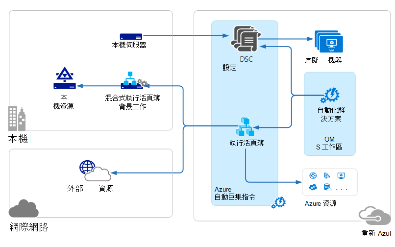
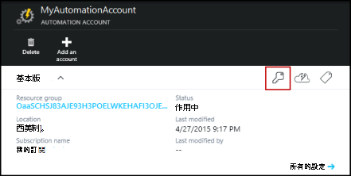
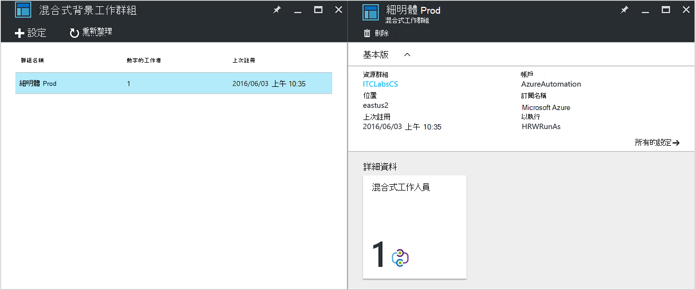

<properties
   pageTitle="Azure 自動化混合式 Runbook 工作者 |Microsoft Azure"
   description="本文提供安裝和使用混合式 Runbook 工作者是的可讓您在本機資料中心的電腦上執行 runbooks Azure 自動化功能的相關資訊。"
   services="automation"
   documentationCenter=""
   authors="mgoedtel"
   manager="jwhit"
   editor="tysonn" />
<tags
   ms.service="automation"
   ms.devlang="na"
   ms.topic="article"
   ms.tgt_pltfrm="na"
   ms.workload="infrastructure-services"
   ms.date="10/14/2016"
   ms.author="bwren" />

# Azure 自動化混合式 Runbook 同事

在 Azure 自動化 Runbooks 無法存取您的區域資料中心的資源，因為 Azure 雲端中執行。  Azure 自動化的混合式 Runbook 工作者功能可讓您在位於您的資料中心，才能管理本機資源的電腦上執行 runbooks。 儲存和 Azure 自動化中管理，然後傳送給一或多個內部部署電腦 runbooks。  

下圖說明這項功能。   

您可以指定一個或多部電腦来做為混合式 Runbook 背景工作，並從 Azure 自動化執行 runbooks 資料中心。  每個需要 Microsoft 管理代理程式連線到 Microsoft 作業管理套件和 Azure 自動化 runbook 環境。  若要安裝並維持管理代理程式，並監控背景工作的功能，只會用作業管理套件。  傳遞的 runbooks 和執行這些指示是由 Azure 自動化執行。

有支援混合式 Runbook 工作者不輸入的防火牆需求。 在本機電腦的代理程式初始與 Azure 自動化雲端中的所有通訊。 Runbook 啟動時，Azure 自動化建立擷取代理程式的指示。 代理程式然後向下 runbook 以及任何參數擷取，執行之前。  也將會擷取任何從 Azure 自動化 runbook 所使用的[資產](http://msdn.microsoft.com/library/dn939988.aspx)。

>[AZURE.NOTE] 混合式 Runbook 工作者目前不支援[DSC 設定](automation-dsc-overview.md)。

## 混合式 Runbook 背景工作群組

每個混合式 Runbook 工作者是您指定當您安裝代理程式的混合式 Runbook 背景工作群組成員。  群組可以包含單一代理程式，但您可以安裝多個代理程式的可用性] 群組中。

當您啟動 runbook 混合式 Runbook 工作者上時，您可以指定的群組，它會在上執行。  將會決定群組的成員，讓工作會服務要求。  您無法指定特定的工作。

## 混合式 Runbook 工作者需求

您必須指定至少有一個內部部署電腦執行混合式 runbook 工作。  這台電腦必須具備下列動作︰

- Windows Server 2012 或更新版本
- Windows PowerShell 4.0 或更新版本
- 最小值的兩個核心和 4 GB 的 RAM

請考慮下列混合式工作人員建議︰ 

- 指定每個可用性] 群組中的多個混合式同事。  
- 混合式同事可以同時存在服務管理自動化或系統管理中心 Orchestrator runbook 伺服器。
- 請考慮使用實際位於 [或附近自動化帳戶的區域，因為工作完成時，將會傳送至 Azure 自動化的工作資料的電腦。

>[AZURE.NOTE] 混合式 Runbook 工作者版本 7.2.11136.0 目前支援透過只使用 PowerShell 指令碼的 proxy 伺服器進行通訊。  支援的工作流程 PowerShell 指令碼將可在未來版本。  

### 設定 proxy 和防火牆設定

登錄的 Microsoft 作業管理套件 (OMS) 服務的連線到內部部署混合式 Runbook 工作者，它必須連接埠號碼和 Url，如下所述的存取權。  這是除了的[連接埠和 Url 所需的 Microsoft 監控代理程式](../log-analytics/log-analytics-proxy-firewall.md#configure-proxy-and-firewall-settings-with-the-microsoft-monitoring-agent)連線至 OMS。 如果您使用 proxy 伺服器的代理程式和 OMS 服務之間的通訊時，必須，以確保適當的資源都可以存取。 如果您使用防火牆來限制存取至網際網路時，必須先設定您的防火牆存取。 

下列清單連接埠和 Url 所需的混合式 Runbook 工作者通訊與自動化資訊。

- 僅限 TCP 443 則需要存取連接埠︰
- 全域的 URL: *.azure automation.net

如果您有定義的特定區域自動化帳戶，您想要限制的區域資料中心與通訊下表提供每個區域的 DNS 記錄。

|**區域**|**DNS 記錄**|
|--------------|--------------|
|美國中部南美洲|scus-jobruntimedata-產品-su1.azure-automation.net|
|設定適用於美國 2|eus2-jobruntimedata-產品-su1.azure-automation.net|
|西歐|我們-jobruntimedata-產品-su1.azure-automation.net|
|北美歐洲|ne-jobruntimedata-產品-su1.azure-automation.net|
|加拿大中部|副本-jobruntimedata-產品-su1.azure-automation.net|
|東南亞|海-jobruntimedata-產品-su1.azure-automation.net|
|中央印度|德-jobruntimedata-產品-su1.azure-automation.net|
|日本東亞|jpe-jobruntimedata-產品-su1.azure-automation.net|
|澳大利亞南部東部|ase-jobruntimedata-產品-su1.azure-automation.net|

## 安裝混合式 Runbook 工作者

下列程序說明如何安裝及設定混合式 Runbook 背景工作。  自動化環境的一次執行前兩個步驟，然後重複其餘的步驟，為每個工作者的電腦。

### 1.建立作業管理套件工作區

如果您還沒有作業管理套件工作區，然後建立一個使用指示[設定您的工作區](https://technet.microsoft.com/library/mt484119.aspx)。 如果您已經有，您可以使用現有的工作區。

### 2.自動化解決方案新增至作業管理套件工作區

解決方案會將功能新增至作業管理套件。  自動化方案包括支援混合式 Runbook 工作者 Azure 自動化的新增功能。  當您新增至工作區的方案時，它會自動推入工作者元件代理程式電腦，您將會安裝在下一個步驟。

依照指示[新增使用方案庫的解決方案](../log-analytics/log-analytics-add-solutions.md)，將**自動化**解決方案新增至您的作業管理套件工作區。

### 3.安裝 Microsoft 監控代理程式

Microsoft 監控代理程式作業管理套件連線的電腦。  當您在內部部署電腦上安裝代理程式，並將其連線至您的工作區時，它會自動下載混合式 Runbook 背景工作所需的元件。

請遵循在[連線的 Windows 電腦記錄分析](../log-analytics/log-analytics-windows-agents.md)內部部署電腦上安裝代理程式的指示進行。  您可以重複此程序，將多個工作人員新增至您的環境的多部電腦。

代理程式已成功連線至時作業管理套件，它會列出 [作業管理套件**設定**] 窗格中的 [**連線來源**] 索引標籤。  您可以驗證代理程式已正確下載自動化解決方案時有 C:\Program Files\Microsoft 監控 Agent\Agent 中名為**AzureAutomationFiles**的資料夾。  若要確認的混合式 Runbook 工作者版本，您可以瀏覽至 C:\Program Files\Microsoft 監控 Agent\Agent\AzureAutomation\ 及筆記\\*版本*子資料夾。   

### 4.安裝 runbook 環境並連線到 Azure 自動化

當您新增代理程式作業管理套件時，自動化解決方案推入下**HybridRegistration** PowerShell 模組包含**新增 HybridRunbookWorker**指令程式。  您可以使用這個 cmdlet 的電腦上安裝 runbook 環境並註冊 Azure 自動化。

在 [系統管理員模式中開啟的 PowerShell 工作階段，並執行下列命令以匯入模組。

    cd "C:\Program Files\Microsoft Monitoring Agent\Agent\AzureAutomation\<version>\HybridRegistration"
    Import-Module HybridRegistration.psd1

再執行使用下列語法**新增 HybridRunbookWorker** cmdlet:

    Add-HybridRunbookWorker –Name <String> -EndPoint <Url> -Token <String>

您可以取得從 Azure 入口網站中**管理鍵**刀這個指令程式所需的資訊。  自動化帳戶的 [項目] 面板上的 [主要] 圖示，即可開啟此刀。

- **名稱**是混合式 Runbook 背景工作群組的名稱。 如果此群組已存在於自動化帳戶，以便新增目前的電腦。  如果已經存在，然後將其加上。
- **端點**是**管理鍵**刀中的 [ **URL** ] 欄位。
- **權杖**是**管理鍵**刀**Access 的主索引鍵**。  

使用**-詳細**參數與**新增 HybridRunbookWorker**收到安裝的詳細的資訊。

### 5。 安裝 PowerShell 模組

Runbooks 可以使用任何的活動和 Azure 自動化環境中安裝模組中定義的 cmdlet。  這些模組不會自動部署至內部部署的電腦，讓您必須手動安裝。  例外是 Azure 模組 Azure 自動化提供所有 Azure 服務和活動的存取權的指令程式的預設會安裝。

由於混合式 Runbook 工作者功能的主要目的是管理本機資源時，很可能是您需要安裝支援這些資源的模組。  您可以參考[安裝模組](http://msdn.microsoft.com/library/dd878350.aspx)的安裝 Windows PowerShell 模組的詳細資訊。

## 移除混合式 Runbook 工作者

您可以從群組移除一或多個混合式 Runbook 工作者或您可以移除群組中，根據您的需求。  若要移除的內部部署電腦中的混合式 Runbook 工作者，以系統管理員模式開啟的 PowerShell 工作階段，然後執行下列命令-**移除 HybridRunbookWorker**指令程式。  使用**-詳細**切換移除程序的詳細資訊記錄。 

這不會移除 Microsoft 監控代理程式的電腦，只的功能和設定混合式 Runbook 工作者角色。  

若要移除群組，您必須先使用之前，顯示命令] 群組的成員的每一部電腦中移除混合式 Runbook 背景工作，然後您執行下列步驟，以移除群組。  

1. Azure 入口網站中開啟自動化帳戶。
2. 選取 [**混合式背景工作群組**] 方塊，然後在**混合式工作者群組**刀中，選取您想要刪除的群組。  選取特定的群組之後, 會顯示**混合式工作群組**屬性刀。     
3. 按一下 [選取群組的屬性刀的 [**刪除**]。  訊息會出現要求您確認此動作，並選取**[是]** ，如果您確定要繼續進行。  ![刪除群組] 確認] 對話方塊](media/automation-hybrid-runbook-worker/automation-hybrid-runbook-worker-confirm-delete.png)  此程序可能需要幾秒鐘完成，您可以從功能表來追蹤進度下**通知**。  

## 在混合式 Runbook 工作者開始 runbooks

[開始在 Azure 自動化 Runbook](automation-starting-a-runbook.md)說明啟動 runbook 的不同方法。  混合式 Runbook 工作者新增**RunOn**選項，您可以在其中指定的混合式 Runbook 工作群組名稱。  如果未指定的群組，runbook 擷取，且該群組的員工的執行。  如果不指定此選項，然後執行中 Azure 自動化為標準。

當您啟動 runbook Azure 入口網站中時，您就會顯示**在上執行**的選項您可以在其中選取**Azure**或**混合式背景工作**。  如果您選取**混合式工作**時，您可以從下拉式清單選取該群組。

使用您可以使用下列命令來啟動名為混合式 Runbook 背景工作群組名稱為 MyHybridGroup 使用 Windows PowerShell 的測試 Runbook runbook **RunOn**參數。

    Start-AzureRmAutomationRunbook –AutomationAccountName "MyAutomationAccount" –Name "Test-Runbook" -RunOn "MyHybridGroup"

>[AZURE.NOTE] **RunOn**參數已新增至 Microsoft Azure PowerShell 版本 0.9.1**開始 AzureAutomationRunbook**指令程式。  您應該[下載最新的版本](https://azure.microsoft.com/downloads/)如果您有較早的其中一個安裝。  您只需要在工作站位置您將會啟動 runbook 從 Windows PowerShell 安裝此版本。  您不需要將其安裝在工作電腦，除非您想要從電腦開始 runbooks。  您目前無法啟動在混合式 Runbook 背景工作從另一個 runbook runbook，因為這會需要安裝在您的自動化帳戶 Powershell 的 Azure 的最新版本。  將自動更新 Azure 自動化中最新版本，並將其自動推工作者推出。

## Runbook 權限

Runbooks 執行混合式 Runbook 工作者不能使用相同[方法，通常用於 runbooks 驗證 Azure 資源](automation-configuring.md#configuring-authentication-to-azure-resources)的因為它們會存取 Azure 以外的資源。  Runbook 可以提供自己的驗證本機資源，或您可以指定內容，提供使用者所有 runbooks RunAs 帳戶。

### Runbook 驗證

根據預設，runbooks 會執行本機系統帳戶的內容中的內部部署電腦上，讓他們必須提供的資源，其會存取自己驗證。  

您可以使用 cmdlet，可讓您指定的認證，您可以驗證不同的資源，讓您 runbook 中使用[憑證](http://msdn.microsoft.com/library/dn940015.aspx)和[憑證](http://msdn.microsoft.com/library/dn940013.aspx)的資產。  下列範例會重新啟動電腦 runbook 的一部分。  認證認證資產與變數的資產從電腦的名稱，並且然後重新啟動電腦指令程式會使用這些值。

    $Cred = Get-AzureRmAutomationCredential -ResourceGroupName "ResourceGroup01" -Name "MyCredential"
    $Computer = Get-AzureRmAutomationVariable -ResourceGroupName "ResourceGroup01" -Name  "ComputerName"

    Restart-Computer -ComputerName $Computer -Credential $Cred

您也可以利用[InlineScript](automation-powershell-workflow.md#inline-script)可讓您在另一部電腦上執行的程式碼區塊，使用[PSCredential 常見的參數](http://technet.microsoft.com/library/jj129719.aspx)所指定的認證。

### RunAs 帳戶

而不是由 runbooks 提供其本機資源驗證，您可以指定混合式工作群組**RunAs**帳戶。  指定有權存取本機資源，[認證資產](automation-credentials.md)時執行混合式 Runbook 背景工作] 群組中,，將會執行 [這些認證] 底下的所有 runbooks。  

認證的使用者名稱必須下列格式的其中一種︰

- 網域 \ 使用者名稱 
- username@domain
- 使用者名稱 （適用於內部部署電腦的本機帳戶）

使用下列程序來指定 RunAs 帳戶的混合式工作群組︰

1. 建立本機資源存取[認證資產](automation-credentials.md)。
2. Azure 入口網站中開啟自動化帳戶。
2. 選取 [**混合式背景工作群組**] 方塊，然後選取 [群組。
3. 選取 [**所有設定**]，然後按一下 [**混合式背景工作群組設定**]。
4. 變更**為執行**的**預設****自訂**。
5. 選取的認證，然後按一下 [**儲存**]。

## 建立混合式 Runbook 工作者 runbooks

有結構中的 Azure 自動化和執行混合式 Runbook 工作者上執行的 runbooks 沒有差別。 您使用每個 Runbooks 會很可能會不同大幅透過之後的混合式 Runbook 工作者 runbooks 通常管理資料中心的本機資源時在 Azure 自動化 runbooks 通常管理 Azure 雲端中的資源。 

您可以編輯在 Azure 自動化的混合式 Runbook 工作者 runbook，但如果您嘗試測試 runbook 編輯器中，您可能會有困難。  PowerShell 模組的存取本機資源可能不會安裝 Azure 自動化環境中這種情況下，測試就會失敗。  如果您執行安裝所需的模組，然後 runbook 就會執行，但不是會存取本機資源的完整的測試。

## 在混合式 Runbook 工作者疑難排解 runbooks

[Runbook 輸出] 和 [郵件](automation-runbook-output-and-messages.md)會傳送到 Azure 自動化混合式從雲端中執行的工作人員就像 runbook 工作。  您也可以啟用詳細資訊和進度資料流時的其他 runbooks 相同的方式。  

記錄儲存在本機上 C:\ProgramData\Microsoft\System Center\Orchestrator\7.2\SMA\Sandboxes 在每個混合式部署工作。

如果您 runbooks 不是 completeing 成功摘要工作會顯示**已擱置**狀態，請檢閱疑難排解文章[混合式 Runbook 工作者︰ runbook 工作結束其狀態是 [已擱置 」 下方](automation-troubleshooting-hrw-runbook-terminates-suspended.md)。   

## 服務管理自動化的關聯性

[服務管理自動化 (SMA)](https://technet.microsoft.com/library/dn469260.aspx)可讓您執行相同的 runbooks 所支援的區域資料中心的 Azure 自動化。 Windows Azure 套件包含 SMA 管理的圖形化介面 SMA 通常部署與 Windows Azure 套件。 不同於 Azure 自動化 SMA 需要本機安裝包含網頁伺服器裝載 API 的資料庫，包含 runbooks 和 SMA 設定和 Runbook 工作者執行 runbook 工作。 Azure 自動化提供這些服務在雲端，而只需要您維護您的本機環境中的混合式 Runbook 同事。

如果您是現有 SMA 使用者時，您可以使用混合式 Runbook 工作者有任何變更，假設執行資源，為自己驗證所述[建立的混合式 Runbook 工作者 runbooks](#creating-runbooks-for-hybrid-runbook-worker)Azure 自動化來移動您 runbooks。  Runbooks SMA 中執行服務帳戶的內容中可能會提供給該驗證 runbooks 工作者伺服器上。

您可以使用下列準則來判斷混合式 Runbook 工作者或服務管理自動化 Azure 自動化是否比較適合您的需求。

- SMA 需要本機的基本元件如果是必要的圖形化管理介面連線到 Windows Azure 套件的安裝。 更多的本機資源將會需要使用較高的維護成本超過 Azure 自動化，只需要在本機 runbook 工作者代理程式。 代理程式受作業管理套件，進一步縮小您維護成本。
- Azure 自動化將其 runbooks 儲存在雲端，並將之傳送至內部部署混合式 Runbook 同事。 如果您的安全性原則不允許此問題，您就應該使用 SMA。
- SMA 會包含在系統管理中心。因此，需要系統管理中心 2012 R2 授權。 Azure 自動化根據分層的訂閱模型。
- Azure 自動化具有進階 SMA 中並沒有提供的圖形化 runbooks 等功能。

## 後續步驟

- 若要進一步瞭解可用來開始 runbook 的不同方法，請參閱[啟動 Azure 自動化中的 Runbook](automation-starting-a-runbook.md)
- 若要了解使用 PowerShell 和 PowerShell 工作流程 runbooks Azure 自動化使用文字編輯器中的不同的程序，請參閱[編輯 Runbook 中 Azure 自動化](automation-edit-textual-runbook.md)

 
