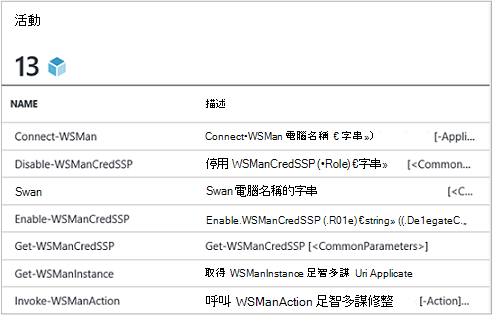
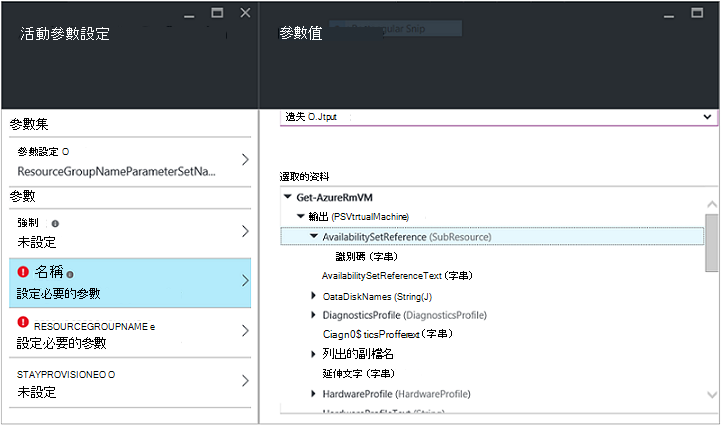
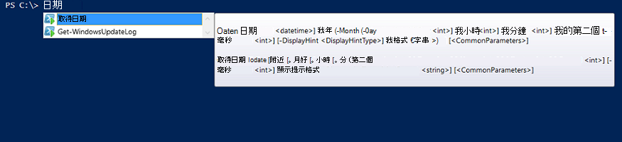

<properties
   pageTitle="建立一個 Azure 自動化整合模組 |Microsoft Azure"
   description="教學課程，逐步引導您進行整合模組 Azure 自動化中建立、 測試和範例使用。"
   services="automation"
   documentationCenter=""
   authors="mgoedtel"
   manager="jwhit"
   editor="" />

<tags
   ms.service="automation"
   ms.workload="tbd"
   ms.tgt_pltfrm="na"
   ms.devlang="na"
   ms.topic="get-started-article"
   ms.date="09/12/2016"
   ms.author="magoedte" />

# <a name="azure-automation-integration-modules"></a>Azure 自動化整合模組

PowerShell 是 Azure 自動化的基礎技術。 Azure 自動化內建在 PowerShell，因為 PowerShell 模組是 Azure 自動化的擴充的金鑰。 本文中，我們會引導您完成 Azure 自動化使用 PowerShell 模組，稱為 「 整合模組 」，並建立您自己的 PowerShell 模組的最佳作法，請確定其運作為整合模組中 Azure 自動化的細節。 

## <a name="what-is-a-powershell-module"></a>什麼是 PowerShell 模組？

PowerShell 模組是一組的**開始日期**或**複製項目**，可以使用 PowerShell 主控台、 指令碼、 工作流程、 runbooks，與 PowerShell DSC 資源，例如 WindowsFeature 或檔案，可以使用從 PowerShell DSC 設定之類的 PowerShell 指令程式。 所有功能的 PowerShell cmdlet 和 DSC 資源，透過公開和每個 cmdlet/DSC 資源由 PowerShell 模組，請支援許多其隨附 PowerShell 本身。 例如**取得日期**cmdlet 屬於 Microsoft.PowerShell.Utility PowerShell 模組和**複製項目**cmdlet Microsoft.PowerShell.Management PowerShell 模組的一部分，而套件 DSC 資源會 PSDesiredStateConfiguration PowerShell 模組的組件。 兩個這些模組隨附 PowerShell。 但是許多 PowerShell 模組不要使用尚未發行屬於 PowerShell，並改用隨等系統管理中心 2012年組態管理員] 或 [位置]，例如 PowerShell 庫大量的 PowerShell 社群的第一個或協力廠商產品。  模組很有用，因為他們進行複雜的工作更容易透過封裝功能。  您可以瞭解關於[MSDN 上的 PowerShell 模組](https://msdn.microsoft.com/library/dd878324%28v=vs.85%29.aspx)的詳細資訊。 

## <a name="what-is-an-azure-automation-integration-module"></a>什麼是 Azure 自動化整合模組？

整合模組無法不同 PowerShell 模組。 其只要 PowerShell 模組，您也可以包含一個其他檔案指定用於 runbooks 中的模組 cmdlet Azure 自動化連線類型的中繼資料檔案。 可省略檔案，下列 PowerShell 模組可匯入 Azure 自動化，讓他們 cmdlet 適用於 runbooks 和其 DSC 資源可供使用 DSC 設定內。 在幕後 Azure 自動化會儲存這些模組，並將 runbook 工作和 DSC compiliation 工作的執行時間載入這些 Azure 自動化沙箱執行 runbooks 及編譯 DSC 設定的位置。  DSC 資源模組中的也會自動置於自動化 DSC 提取伺服器上，讓他們可以用電腦嘗試套用 DSC 設定提取。  我們不在 [] 方塊中，以使用，您可以自動化 Azure 管理立刻開始使用，但您可以輕鬆地匯入 PowerShell 模組任意系統、 服務或您想要與整合的工具，讓 Azure 自動化隨附 Azure PowerShell 模組的數字。 

>[AZURE.NOTE] 某些模組運送為自動化服務中的 「 全域模組 」。 這些全域模組是預設工作時建立自動化帳戶，因此我們有時更新使其自動自動化帳戶將其提供給您。 如果您不想要自動更新，您可以隨時匯入相同的模組自己，並的會優先於該模組，可我們隨附的服務中的全域模組版本。 

您匯入的整合模組套件的格式是使用相同的名稱為模組和.zip 副檔名壓縮的檔案。 包含的 Windows PowerShell 模組和任何支援的檔案，如果模組有一個包括資訊清單的檔案 (.psd1)。

如果模組應該包含 Azure 自動化連線類型，它也必須包含檔案名稱*<ModuleName>*-Automation.json 指定連接類型屬性。 這是 json 檔案放在您壓縮的.zip 的檔案的 [模組] 資料夾中，包含 「 連接 」 的欄位所需連線至系統或模組表示的服務。 這會結束設定 Azure 自動化中建立連線類型。 您可以設定欄位名稱，此檔案類型，而且是否欄位應該加密和/或選擇性的在模組的連線類型。 以下是 json 檔案格式的範本︰

```
{ 
   "ConnectionFields": [
   {
      "IsEncrypted":  false,
      "IsOptional":  false,
      "Name":  "ComputerName",
      "TypeName":  "System.String"
   },
   {
      "IsEncrypted":  false,
      "IsOptional":  true,
      "Name":  "Username",
      "TypeName":  "System.String"
   },
   {
      "IsEncrypted":  true,
      "IsOptional":  false,
      "Name":  "Password",
   "TypeName":  "System.String"
   }],
   "ConnectionTypeName":  "DataProtectionManager",
   "IntegrationModuleName":  "DataProtectionManager"
}
```

如果您已經部署服務管理自動化，建立您的自動化 runbooks 整合模組套件，看起來應該不陌生給您。 


## <a name="authoring-best-practices"></a>撰寫的最佳作法

整合模組都是基本上 PowerShell 模組的這不表示我們不有一組的做法撰寫它們。 仍有一些我們建議您時，請考慮撰寫 PowerShell 模組，使最 Azure 自動化中可用的動作。 這些因素包括 Azure 自動化特定]，將其中一些實用為了讓您在 PowerShell 工作流程，無論您使用自動化工作的模組。 

1. 包含概要，描述，然後在模組中每個指令程式的說明 URI。 在 PowerShell，您可以定義特定的說明資訊 cmdlet，以允許使用者接收的**取得說明**cmdlet 使用它們的說明。 例如，以下是如何定義概要，並說明 URI 撰寫.psm1 檔案中的 PowerShell 模組。<br>  

    ```
    <#
        .SYNOPSIS
         Gets all outgoing phone numbers for this Twilio account 
    #>
    function Get-TwilioPhoneNumbers {
    [CmdletBinding(DefaultParameterSetName='SpecifyConnectionFields', `
    HelpUri='http://www.twilio.com/docs/api/rest/outgoing-caller-ids')]
    param(
       [Parameter(ParameterSetName='SpecifyConnectionFields', Mandatory=$true)]
       [ValidateNotNullOrEmpty()]
       [string]
       $AccountSid,

       [Parameter(ParameterSetName='SpecifyConnectionFields', Mandatory=$true)]
       [ValidateNotNullOrEmpty()]
       [string]
       $AuthToken,

       [Parameter(ParameterSetName='UseConnectionObject', Mandatory=$true)]
       [ValidateNotNullOrEmpty()]
       [Hashtable]
       $Connection
    )

    $cred = CreateTwilioCredential -Connection $Connection -AccountSid $AccountSid -AuthToken $AuthToken

    $uri = "$TWILIO_BASE_URL/Accounts/" + $cred.UserName + "/IncomingPhoneNumbers"
    
    $response = Invoke-RestMethod -Method Get -Uri $uri -Credential $cred

    $response.TwilioResponse.IncomingPhoneNumbers.IncomingPhoneNumber
    }
    ```
<br> 
提供這項資訊不只會顯示此使用 PowerShell 主控台中的 [**取得說明**指令程式的說明，它會也公開此說明功能 Azure 自動化內插入活動期間 runbook 撰寫時的範例。 按一下 「 檢視的詳細的說明 」，會在另一個索引標籤的 [您用來存取 Azure 自動化的網頁瀏覽器中開啟說明 URI。<br>
2. 如果模組執行遠端系統，針對。 包含定義連線到遠端系統，這表示連線類型所需的資訊的整合模組中繼資料檔案。 b。 在模組中的每個 cmdlet 應該能夠在連線物件 （該連線類型執行個體） 做為參數。  
    在模組的 Cmdlet 變得更容易使用中 Azure 自動化，如果您允許將連接類型的欄位將物件做為參數傳遞 cmdlet。 此方式使用者不必對應指令程式的相對應的參數他們通話 cmdlet 每次連線資產的參數。 它會根據 runbook 上述範例中，使用稱為 CorpTwilio Twilio 連線資產存取 Twilio，並傳回帳戶中的所有電話號碼。  請注意，將連線的欄位對應至 cmdlet 的參數的如何？<br>

    ```
    workflow Get-CorpTwilioPhones
    {
      $CorpTwilio = Get-AutomationConnection -Name 'CorpTwilio'
    
      Get-TwilioPhoneNumbers 
        -AccountSid $CorpTwilio.AccountSid  
        -AuthToken $CorptTwilio.AuthToken
    }
    ```
<br>
處理這種情形的更容易且更好的方法直接將連接物件傳遞 cmdlet-

    ```
    workflow Get-CorpTwilioPhones
    {
      $CorpTwilio = Get-AutomationConnection -Name 'CorpTwilio'

      Get-TwilioPhoneNumbers -Connection $CorpTwilio
    }
    ```
<br>
您可以讓您 cmdlet 像這樣的行為，好讓他們接受連接物件直接做為參數，而不是只連線參數的欄位。 通常您會想參數設定為每項目，讓使用者不使用 Azure 自動化不建構作為連接物件 hashtable 撥打您 cmdlet。 參數組**SpecifyConnectionFields**下列用來傳遞連接欄位屬性一個接一個]。 **UseConnectionObject**可讓您將連線到直線。 如您所見，可讓[Twilio PowerShell 模組](https://gallery.technet.microsoft.com/scriptcenter/Twilio-PowerShell-Module-8a8bfef8)中的傳送 TwilioSMS cmdlet 傳遞兩種︰ 

    ```
    function Send-TwilioSMS {
      [CmdletBinding(DefaultParameterSetName='SpecifyConnectionFields', `
      HelpUri='http://www.twilio.com/docs/api/rest/sending-sms')]
      param(
         [Parameter(ParameterSetName='SpecifyConnectionFields', Mandatory=$true)]
         [ValidateNotNullOrEmpty()]
         [string]
         $AccountSid,

         [Parameter(ParameterSetName='SpecifyConnectionFields', Mandatory=$true)]
         [ValidateNotNullOrEmpty()]
         [string]
         $AuthToken,

         [Parameter(ParameterSetName='UseConnectionObject', Mandatory=$true)]
         [ValidateNotNullOrEmpty()]
         [Hashtable]
         $Connection

       )
    }
    ```
<br>
3. 在模組中定義所有 cmdlet 輸出的類型。 定義的 cmdlet 輸出類型，可讓設計階段 IntelliSense 協助您判斷 cmdlet，以使用期間撰寫的輸出屬性。 將會看到期間自動化 runbook 圖形撰寫，設計時間知識庫金鑰在哪裡模組使用簡單的使用者體驗。<br> <br> 這是類似的 cmdlet 輸出 PowerShell ise [以系統中的 [繼續輸入] 功能而不需要執行。<br> <br>
4. 在模組的 Cmdlet 不應該採取參數的複雜的物件的類型。 PowerShell 工作流程是不同的 PowerShell 中還原序列化表單中儲存複雜的類型。 基本類型會保留為 [基本項目，但是在複雜的類型轉換為其還原序列化版本，也就是基本上屬性袋。 例如，如果您使用**取得程序**cmdlet 中 runbook （或該項目的 PowerShell 工作流程） 時，它會傳回類型 [Deserialized.System.Diagnostic.Process]，不預期 [System.Diagnostic.Process] 類型的物件。 此類型都相同的做為非還原序列化類型，但方法都無法的屬性。 然後，如果您嘗試傳遞此值做為參數的 cmdlet 預期此參數的 [System.Diagnostic.Process] 值的位置，您會收到下列錯誤︰*無法處理參數 '程序 」 上的引數轉換。錯誤: 「 無法轉換 」 System.Diagnostics.Process (CcmExec) 」 的值類型 」 Deserialized.System.Diagnostics.Process 」，輸入 「 System.Diagnostics.Process 」。*   這是因為預期的 [System.Diagnostic.Process] 類型與指定的 [Deserialized.System.Diagnostic.Process] 類型之間的類型不相符。 解決此問題的方法是以確保您模組的 cmdlet 不會執行複雜的參數的類型。 以下是錯誤的方法。

    ```
    function Get-ProcessDescription {
      param (
            [System.Diagnostic.Process] $process
      )
      $process.Description
    }
    ``` 
<br>
這裡有正確的方式，可在內部讓 cmdlet 來擷取複雜的物件，並使用基本做。 由於 cmdlet 執行 PowerShell 的內容中，不 PowerShell 工作流程，cmdlet $process 內就會變成正確的 [System.Diagnostic.Process] 類型。  

    ```
    function Get-ProcessDescription {
      param (
            [String] $processName
      )
      $process = Get-Process -Name $processName

      $process.Description
    }
    ```
<br>
連線資產 runbooks 雜湊表，也就是複雜的類型，而這些雜湊表似乎無法傳遞到的 cmdlet 尚未其 – 連線參數，與沒有轉換例外狀況。 技術上而言，某些 PowerShell 類型能夠正確從其序列表單轉換為其還原序列化的表單，且因此可傳遞到 cmdlet 接受非還原序列化的類型的參數。 Hashtable 是一種。 模組作者的已定義之類型的方式，他們可以正確還原序列化，實作可能，但有一些必須做的取捨進行。 需要有一個預設，所有的公開，其內容，且可 PSTypeConverter 類型。 不過，針對已定義的類型不屬於模組作者，沒有方法以 「 修正 」，因此建議，以避免參數一起複雜的類型。 Runbook 撰寫的秘訣︰ 如果的一些原因您 cmdlet 需要複雜型別參數，或您使用的其他人的模組，可需要複雜型別參數，因應措施在 PowerShell 工作流程 runbooks 和本機 PowerShell PowerShel 工作流程是自動換行產生複雜的類型] 及 [使用中相同的 InlineScript 活動的複雜類型 cmdlet cmdlet。 由於 InlineScript 為 PowerShell，而不是 PowerShell 工作流程執行其內容，產生的複雜型別指令程式會產生正確類型，不會還原序列化的複雜型別。
5. 在模組中的所有 cmdlet 都進行無狀態。 PowerShell 工作流程執行所在的不同的工作階段中名為 [工作流程中每個指令程式。 這表示 runbooks PowerShell 工作流程中無法搭配使用任何 cmdlet 的工作階段狀態建立 / 由其他 cmdlet 相同的模組修改而定。  以下是如何不的範例。

    ```
    $globalNum = 0
    function Set-GlobalNum {
       param(
           [int] $num
       )
      
       $globalNum = $num
    }
    function Get-GlobalNumTimesTwo {
       $output = $globalNum * 2
     
       $output
    }
    ```
<br>
6. Xcopy 能夠套件中都應該包含完整的模組。 Azure 自動化模組分配給自動化沙箱 runbooks 需要執行時，因為其需要使用亦主機執行。 這表示是，您必須能夠 Zip 設定模組套件，將其移至任何其他主機相同或較新的 PowerShell 版本，並讓其運作正常匯入該主機 PowerShell 環境時。 會發生的順序，（匯入 Azure 自動化時取得壓縮的資料夾，） 上的 [模組] 資料夾以外的任何檔案或任何主機，例如相關產品的安裝來設定的唯一登錄設定，不應該依存模組。 如果不會追蹤此最佳作法，將無法使用在 Azure 自動化模組。  

## <a name="next-steps"></a>後續步驟

- 若要開始使用 PowerShell 工作流程 runbooks，請參閱[我的第一個 PowerShell 工作流程 runbook](automation-first-runbook-textual.md)
- 若要瞭解建立 PowerShell 模組的詳細資訊，請參閱[撰寫 Windows PowerShell 模組](https://msdn.microsoft.com/library/dd878310%28v=vs.85%29.aspx)