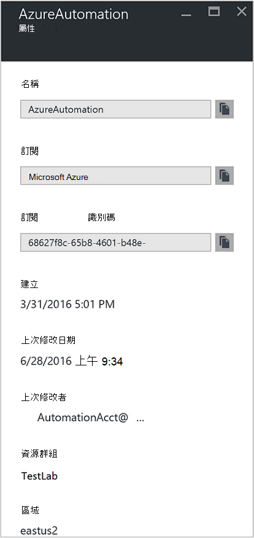
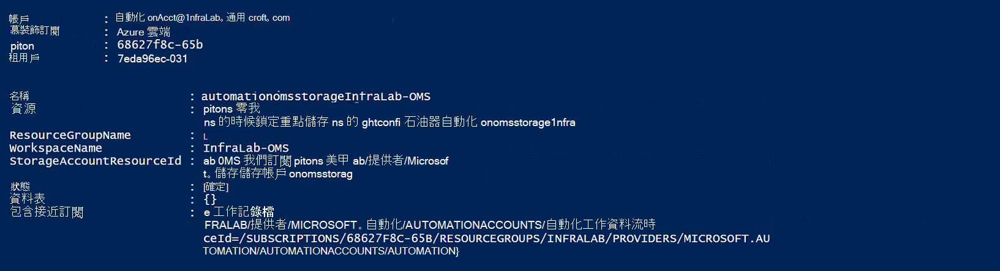
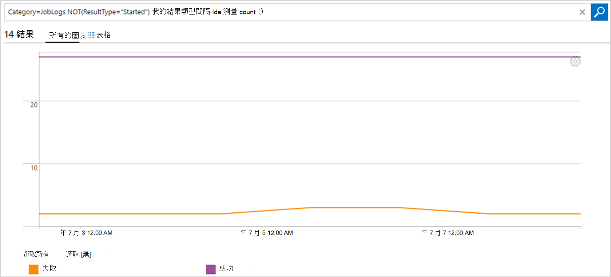

<properties
    pageTitle="工作狀態和工作資料流時從轉寄自動化記錄分析 (OMS) |Microsoft Azure"
    description="本文將示範如何傳送工作狀態和 runbook 工作串流到 Microsoft 作業管理套件記錄分析進行見解及管理。"
    services="automation"
    documentationCenter=""
    authors="MGoedtel"
    manager="jwhit"
    editor="tysonn" />
<tags
    ms.service="automation"
    ms.devlang="na"
    ms.topic="article"
    ms.tgt_pltfrm="na"
    ms.workload="infrastructure-services"
    ms.date="09/22/2016"
    ms.author="magoedte" />

# 工作狀態和工作資料流時從轉寄自動化記錄分析 (OMS)

自動化可以傳送 runbook 工作狀態與工作串流到您的 Microsoft 作業管理套件 (OMS) 記錄分析工作區。  雖然您可以檢視此資訊 Azure 入口網站中，或使用 PowerShell 個別工作狀態或特定自動化帳戶的所有工作，進階支援操作需求的任何項目會要求您建立自訂的 PowerShell 指令碼。  現在使用記錄 Anaytics，您可以︰

- 在 [您的自動化工作上取得充分 
- 電子郵件或提醒根據您 runbook 工作狀態 （例如失敗或暫停） 的觸發程序 
- 在您的工作串流撰寫進階的查詢 
- 建立作業自動化帳戶之間的關聯 
- 以視覺化方式呈現一段時間的工作歷程記錄     

## 先決條件及部署考量

若要開始傳送記錄檔分析自動化記錄，您必須具備下列項目︰

1. OMS 訂閱。 如需詳細資訊，請參閱[開始使用記錄分析](../log-analytics/log-analytics-get-started.md)。  

    >[AZURE.NOTE]OMS 工作區和自動化帳戶必須位於相同的 Azure 訂閱，此設定正確運作的順序。 
  
2. [Azure 儲存體帳戶](../storage/storage-create-storage-account.md)。  
   
    >[AZURE.NOTE]儲存帳戶，*必須*使用相同的區域為自動化帳戶。 
 
3. 使用版本 1.0.8 azure PowerShell 或較新的操作的深入見解 cmdlet。 此版本，以及如何將其安裝的相關資訊，請參閱[如何安裝和設定 PowerShell 的 Azure](../powershell-install-configure.md)。
4. Azure 診斷和記錄分析 PowerShell。  有關此版本，以及如何將其安裝的其他相關資訊，請參閱[Azure 診斷和記錄分析](https://www.powershellgallery.com/packages/AzureDiagnosticsAndLogAnalytics/0.1)。  
5. 從[PowerShell 庫](https://www.powershellgallery.com/packages/Enable-AzureDiagnostics/1.0/DisplayScript)下載的 PowerShell 指令碼**啟用 AzureDiagnostics.ps1** 。 這個指令碼會設定下列項目︰
 - 如要保留您指定的自動化帳戶 runbook 工作狀態和資料流資料儲存區帳戶。
 - 啟用此資料從您的自動化帳戶，將其儲存在 Azure Blob 儲存體帳戶 JSON 格式的集合。
 - 設定從 Blob 儲存體帳戶收集 OMS 記錄分析資料。
 - 啟用自動化記錄分析解決方案 OMS 工作區。   

**啟用 AzureDiagnostics.ps1**指令碼在執行時，需要下列參數︰

- *AutomationAccountName*自動化帳戶的名稱
- *LogAnalyticsWorkspaceName* OMS 工作區的名稱

若要尋找*AutomationAccountName*值，Azure 入口網站中從**自動化帳戶**刀選取您的自動化帳戶，然後選取 [**所有設定**。  從**所有設定**刀中，選取 [在 [**帳戶設定**的 [**屬性**]。  在**屬性**刀中，您可以記下這些值。  。

## 設定記錄分析整合

1. 在電腦上，請從**[開始**] 畫面中啟動**Windows PowerShell** 。  
2. 從 PowerShell 命令列命令介面，瀏覽至含有您下載並執行變更的參數值的指令碼的資料夾*-AutomationAccountName*和*-LogAnalyticsWorkspaceName*。

    >[AZURE.NOTE] 系統會提示後執行指令碼 Azure 驗證方法。  您**必須**登入帳戶所訂閱的管理員角色的成員和訂閱的共同管理員。   
    
        .\Enable-AzureDiagnostics -AutomationAccountName <NameofAutomationAccount> `
        -LogAnalyticsWorkspaceName <NameofOMSWorkspace> `

3. 執行這個指令碼之後您應該會看到記錄分析中的記錄資訊 30 分鐘後新診斷資料寫入儲存空間。  如果這次，請參閱疑難排解章節中[blob 儲存體 JSON 檔案](../log-analytics/log-analytics-azure-storage-json.md#troubleshooting-configuration-for-azure-diagnostics-written-to-blob-in-json)之後，沒有可用的記錄。

### 驗證設定

若要確認指令碼可設定您的自動化帳戶和 OMS wokspace 成功，您可以在 PowerShell 中執行下列步驟。  您這麼做，若要尋找的值 OMS 工作區名稱和資源群組名稱，請從 Azure] 入口網站中，瀏覽記錄分析 (OMS) 和記錄分析 (OMS) 刀之前, 記下的值，以**名稱**] 和 [**資源群組**。  ![OMS 記錄分析工作區] 清單](media/automation-manage-send-joblogs-log-analytics/oms-la-workspaces-list-blade.png)時我們混合式部署設定使用 PowerShell 指令程式[取得 AzureRmOperationalInsightsStorageInsight](https://msdn.microsoft.com/library/mt603567.aspx)OMS 工作區中的，我們會使用這兩個值。

1.  從 Azure] 入口網站中，瀏覽至儲存帳戶，然後搜尋下列的儲存空間帳戶使用的命名慣例- *AutomationAccountNameomsstorage*。  Runbook 工作完成後，引進了之後，您應該會看到兩個 Blob 容器建立-**獲得深入見解-記錄-joblogs**和**深入資訊-記錄-jobstreams**。  

2.  從 PowerShell 執行下列 PowerShell 程式碼，變更**ResourceGroupName**和**WorkspaceName**複製或先前所述的參數的值。  

    登入 AzureRmAccount 取得-AzureRmSubscription SubscriptionName 'SubscriptionName' |設定 AzureRmContext 取得-AzureRmOperationalInsightsStorageInsight ResourceGroupName 「 OMSResourceGroupName 」 '-「 OMSWorkspaceName 」 的工作區 

    這會傳回指定 OMS 工作區的儲存空間充分。  我們要確認自動化帳戶我們先前所指定的儲存空間充分存在**狀態**物件會顯示**[確定]**的值。  。

## 記錄狀況分析

自動化 OMS 存放庫中建立兩種類型的記錄。

### 工作記錄檔

屬性 | 描述|
----------|----------|
時間 | 日期及時間 runbook 工作時執行。|
預設 | Azure 中指定的資源類型。  自動化，該值 runbook 相關聯的自動化帳戶。|
operationName | 指定 Azure 中執行的作業的類型。  自動化、 值會工作。|
resultType | Runbook 工作的狀態。  可能的值為︰ 啟動 停止 -擱置 失敗 -成功|
resultDescription | 說明 runbook 工作結果狀態。  可能的值為︰ 開始工作 -工作失敗 -已完成的工作|
相互關聯識別碼 | 是 runbook 工作的相互關聯識別碼的 GUID。|
類別 | 分類的資料類型。  自動化，該值 JobLogs。|
RunbookName | Runbook 名稱。|
JobId | GUID 的 runbook 作業的識別碼。|
來電者 |  使用者發起的租用戶作業。  可能的值會在電子郵件地址 」 或 「 系統已排程的工作。|

### 工作資料流時
屬性 | 描述|
----------|----------|
時間 | 日期及時間 runbook 工作時執行。|
預設 | Azure 中指定的資源類型。  自動化，該值 runbook 相關聯的自動化帳戶。|
operationName | 指定 Azure 中執行的作業的類型。  自動化、 值會工作。|
resultType | Runbook 工作的狀態。  可能的值為︰ -InProgress|
resultDescription | 包含 runbook 的輸出資料流。|
相互關聯識別碼 | 是 runbook 工作的相互關聯識別碼的 GUID。|
類別 | 分類的資料類型。  自動化，該值 JobStreams。|
RunbookName | Runbook 名稱。|
JobId | GUID 的 runbook 作業的識別碼。|
來電者 | 使用者發起的租用戶作業。  可能的值會在電子郵件地址 」 或 「 系統已排程的工作。| 
StreamType | 工作串流類型。 可能的值為︰ 進行 輸出 -警告 錯誤 偵錯 詳細資訊|

## 檢視自動化登入記錄檔狀況分析 

現在您已經開始傳送記錄檔分析您的自動化工作記錄，請讓我們來看您可以使用這些記錄內 OMS 做什麼。   

### Runbook 工作失敗，或暫停時，傳送電子郵件 

其中一個上方客戶詢問適用於傳送電子郵件或文字，錯誤與 runbook 工作的功能。   

若要建立提醒的規則，您開始建立記錄檔中搜尋應該叫用提醒的 runbook 工作記錄。  [**提醒**] 按鈕，會出現，讓您可以建立並設定提醒的規則。

1.  從 [OMS 概觀] 頁面上，按一下 [**記錄搜尋**]。
2.  在 [查詢] 欄位中的下列中鍵入建立記錄搜尋查詢警示︰ `Category=JobLogs (ResultType=Failed || ResultType=Suspended)`。  您也可以群組 RunbookName 來使用︰ `Category=JobLogs (ResultType=Failed || ResultType=Suspended) | measure Count() by RunbookName_s`。   
  
    如果您已設定記錄從一個以上的自動化帳戶或訂閱至工作區，您也可能會感興趣的群組您的訂閱或自動化帳戶的通知。  自動化帳戶名稱可以從 [資源] 欄位，在搜尋] 的 JobLogs。  

3.  按一下 [**提醒**] 頁面的頂端以開啟 [**新增提醒的規則**] 畫面。  如需設定通知選項的詳細資訊，請參閱[記錄分析的警示](../log-analytics/log-analytics-alerts.md#creating-an-alert-rule)。

### 尋找所有內含錯誤已完成的工作 

除了警示依據失敗，您可能會想要知道當 runbook 工作已經有的非終止錯誤 （PowerShell 會產生錯誤資料流，而非終止錯誤不會導致您的工作暫停或失敗）。    

1. 在 [OMS 入口網站中，按一下 [**記錄搜尋**。
2. 在 [查詢] 欄位中，輸入`Category=JobStreams StreamType_s=Error | measure count() by JobId_g`，然後按一下 [**搜尋]**。

### 檢視工作的工作資料流時  

當您偵錯工作時，您也可以查看工作資料流。  下列查詢會顯示與 GUID 2ebd22ea-e05e-4eb9-9 d 76 d73cbd4356e0 單一工作的所有資料流時︰   

`Category=JobStreams JobId_g="2ebd22ea-e05e-4eb9-9d76-d73cbd4356e0" | sort TimeGenerated | select ResultDescription` 

### 檢視歷程工作狀態 

最後，您可能要以視覺化方式呈現一段時間的工作歷程記錄。  您可以使用這個查詢一段時間搜尋您的工作的狀態。 

`Category=JobLogs NOT(ResultType="started") | measure Count() by ResultType interval 1day`  
   

## 摘要

傳送記錄檔分析自動化工作狀態和資料流資料，您可以取得更進一步了解設定時通知您有問題，並自訂的儀表板使用進階的查詢以視覺化方式呈現 runbook 結果時通知您自動化工作的狀態、 runbook 工作狀態、 和其他相關的金鑰標記或指標。  這將可協助提供更大的操作可見度和更快速地址事件。  

## 後續步驟

- 若要進一步瞭解如何建立不同的搜尋查詢，並檢閱與記錄分析自動化工作記錄，請參閱[記錄分析中的記錄檔搜尋](../log-analytics/log-analytics-log-searches.md)
- 若要瞭解如何建立和從 runbooks 擷取輸出和錯誤訊息，請參閱[Runbook 輸出與訊息](automation-runbook-output-and-messages.md) 
- 若要瞭解更多有關 runbook 執行如何監控 runbook 工作，及其他技術的詳細資訊，請參閱[追蹤 runbook 工作](automation-runbook-execution.md)
- 若要進一步瞭解 OMS 記錄分析及資料集合來源，請參閱[收集 Azure 儲存體中的資料記錄分析概觀](../log-analytics/log-analytics-azure-storage.md)